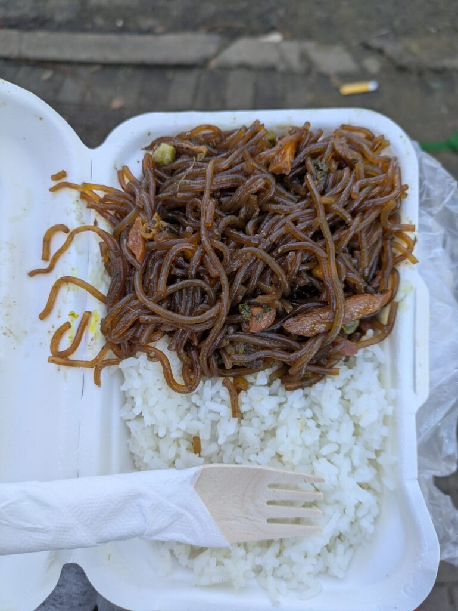
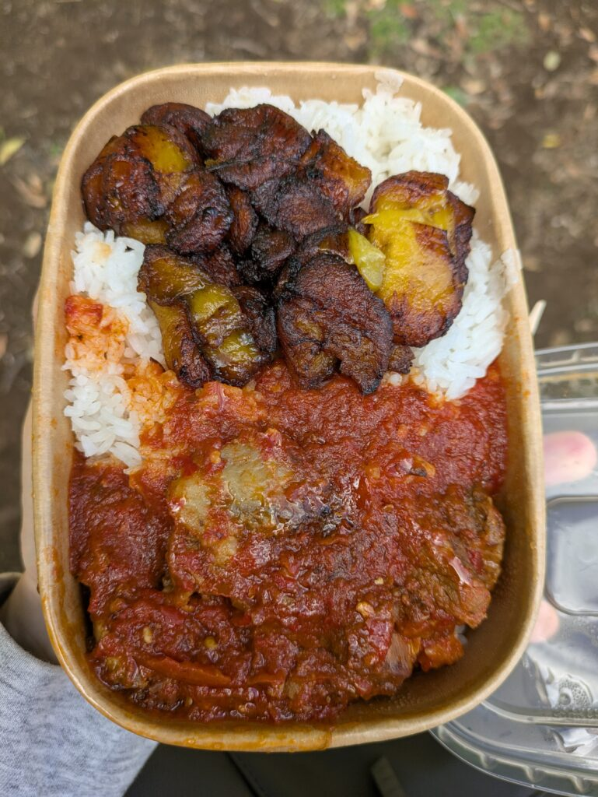
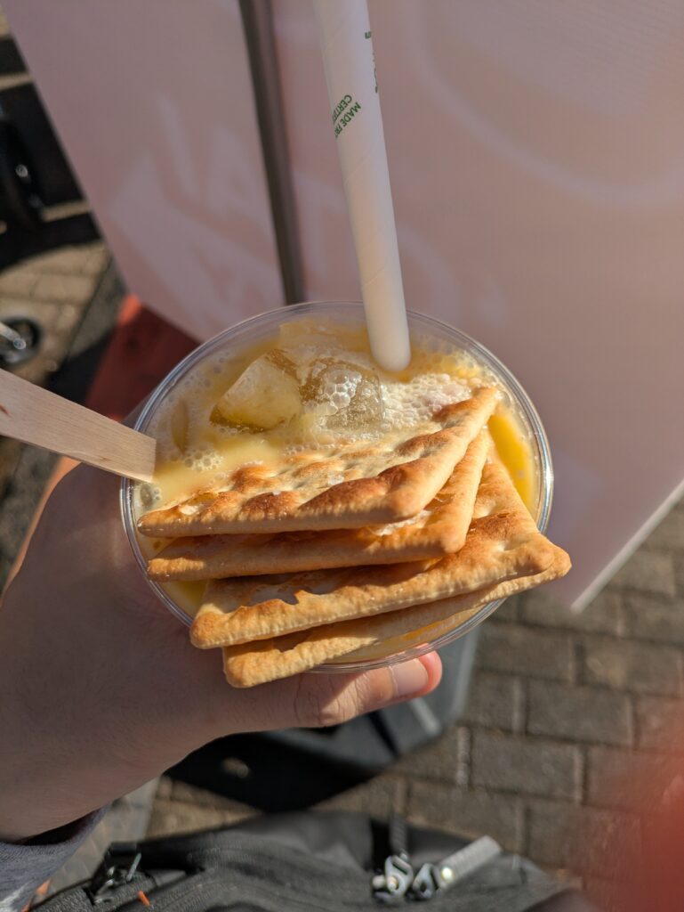

## English\_Practice

I went to Manukau Sports Bowl to watch dancing in NZ because of festival. I think it's same with dancing which I saw before.

I looked around shops while watching other countries dancing and singing. The shops sold food, clothes and drawing body paint. This event wasn't free.

### Polyfest dancing

First, I watched Samoan dancing. Samoan people enjoyed playing instruments and dancing. The music is great rhythm.

Second, I watched Niue dancing. This is similer to Samoan dancing. However, Niue people had a spear and posed like intimidated to rival.

Eventually, I'm not sure where country is. Nevertheless, I impressed dancers hot hands and foots to ground. It was loud sound because microphones were on the ceilling and it reflected.

### Polyfest foods

Finally, I introduced eating foods. I ordered three foods.

- Chopsiey rice

- Red stew

- Otai

Chopsuey rice was like Yakisoba but noodles is vermicelli. To be honest, I prefer to just vermicelli. I'm glad to know that there are like foods.

Red stew was stewed tomato soup. It was spicy and delicious because of softed meet. There was a plantain on the rice. The grelled it, which is like banana, was sweet and good. I'm not sure it and stew are good combinece.

Othai was a mango juice which has mango purees and crackers. It was good as usual mango juice.

I'm not sure if same events is hold but I would like to go interesting events. See you.

## 日本語版

ニュージーランドだとちょくちょく祭りがあるので[今回](https://www.asbpolyfest.co.nz/)も見に行ってきました。とは言え[前回](/posts/2025/03/pasifika-festival-visit/)見たときとそこまで大きく変わらないと思います。

内容としては各国のダンスや歌を見ながら出展されているお店を見て回る。お店自体は食べ物や服飾、ボディペイントなどがありました。ちなみに今回は有料でした。

### Polyfest\_ダンス

初めに見たのはサモアですかね？楽器を鳴らしながら楽しそうにダンスをしてました。音楽自体も盛り上がるリズムで良かったです。

次はニウエですね。こちらも大体同様の物になります。ただ、最後のほうで銛のようなものをもって相手を威嚇するようなポーズですね。

最後に見たのはどこの国かわからないです。ただ、手や足を地面に叩いてるのが印象的でした。上にマイクがあるので音が反射してかなり大きい音になってますね。

### Polyfest\_食べ物

最後に食べたものを紹介しようと思います。3つほど注文をしました。

- Chopsiey rice

- Red stew

- Otai

Chopsuey riceは焼きそばご飯のイメージですね。ただ、麺は春雨になります。ぶっちゃけ春雨だけのほうが好みですね。こんな食べ物があるということが分かったので良かったです。

Red stewはトマトスープを煮込んだものですね。辛みがありますが、肉はホロホロで美味しいです。ご飯の上にあるのはplantainですね。バナナのようなフルーツらしいです。それを焼いたものですが、甘みがあって美味しいです。stewに合うかは微妙なところですが。

Othaiはマンゴージュースですね。マンゴージュースにマンゴーピューレとクラッカーが入ってました。普通にジュースとして美味しいので飲んでみると良いです。

次同じようなイベントがあった時に行くかはわかりませんが、面白そうなイベントがあれば行ってみたいと思います。ではでは。

## AI採点

採点は **45点** やね。  
細かいフィードバックを博多弁でかいつまんで説明すると：

### 文法と語彙のミスの指摘

1. **冒頭**
    - 英文：「o Manukau Sports Bowl to watch dancing in NZ because of festival.」
    
    - 問題：主語なし。"o"は謎の誤字。
    
    - 修正例：「I went to Manukau Sports Bowl to watch dancing performances at a festival in New Zealand.」

3. **「前回と同じ」の表現**
    - 英文：「I think it's same with dancing which I saw before.」
    
    - 問題：「same with」は誤り。「the same as」を使う。
    
    - 修正例：「I think it was pretty much the same as what I saw last time.」

5. **お店の描写**
    - 英文：「The shops sold food, clothes and drawing body paint.」
    
    - 問題：「drawing」は不適切。「body painting」が適切。
    
    - 修正例：「The shops sold food, clothes, and offered body painting.」

7. **サモアのダンスの表現**
    - 英文：「The music is great rhythm.」
    
    - 問題：「music has a great rhythm」など「has」を使う必要がある。
    
    - 修正例：「The music had a great rhythm.」

9. **ニウエのダンスの表現**
    - 英文：「posed like intimidated to rival.」
    
    - 問題：「posed as if intimidating a rival」が正しい。
    
    - 修正例：「They posed as if they were intimidating a rival.」

11. **最後に見た国の表現**
     - 英文：「I'm not sure where country is.」
     
     - 問題：「I'm not sure which country it was from.」が適切。
     
     - 修正例：「I'm not sure which country it was from.」

13. **音の描写**
     - 英文：「Nevertheless, I impressed dancers hot hands and foots to ground.」
     
     - 問題：「I impressed」は誤り。「I was impressed」、「hands and feet」、「hitting」を使う。
     
     - 修正例：「Nevertheless, I was impressed by dancers hitting their hands and feet on the ground.」
     
     - 英文：「microphones were on the ceilling」
     
     - 問題：「ceiling」スペルミス。
     
     - 修正例：「Microphones were on the ceiling, reflecting sound loudly.」

15. **食べ物の紹介の表現**
     - 英文：「Finally, I introduced eating foods.」
     
     - 問題：「I will introduce the foods I ate」が自然。
     
     - 修正例：「Finally, I'll introduce the foods I ate.」

17. **Chopsuey Riceの説明**
     - 英文：「noodles is vermicelli」
     
     - 問題：「noodles are vermicelli」が正しい。
     
     - 修正例：「Chopsuey rice was like Yakisoba, but the noodles were vermicelli.」
     
     - 英文：「I prefer to just vermicelli.」
     
     - 問題：「I prefer just vermicelli alone.」
     
     - 修正例：「To be honest, I prefer just plain vermicelli.」

19. **Red stewの表現**
     - 英文：「It was spicy and delicious because of softed meet.」
     
     - 問題：「softed meet」は誤り。「tender meat」が適切。
     
     - 修正例：「It was spicy, and the meat was tender and delicious.」
     
     - 英文：「The grelled it, which is like banana, was sweet and good.」
     
     - 問題：「grelled it」は誤字。「grilled plantain」が適切。
     
     - 修正例：「The grilled plantain, which is like a banana, was sweet and good.」
     
     - 英文：「I'm not sure it and stew are good combinece.」
     
     - 問題：「combinece」は間違い。「combination」が正しい。
     
     - 修正例：「I'm not sure if it's a good combination with stew.」

21. **Otaiの表現**
     - 英文：「It was good as usual mango juice.」
     
     - 問題：「as usual」は不要。「typical」または「regular mango juice」の方が自然。
     
     - 修正例：「It tasted good, like regular mango juice.」

23. **締めくくり**
     - 英文：「I'm not sure if same events is hold but I would like to go interesting events.」
     
     - 問題：「hold」は「held」に、「same events」は「the same event」または「similar events」。
     
     - 修正例：「I'm not sure if similar events will be held, but I'd like to go to interesting ones.」

25. **全体の語彙や文法の問題点**
     - 時制の混乱：過去形が必要な部分で現在形が使われていることが多い。
     
     - 冠詞（a, the）の抜けや誤用が多い。
     
     - 単数複数の一致ミス多数（foods→food、foots→feetなど）。
     
     - 前置詞の誤用（with→as、to→atなど）。

### IELTS 8に向けたアドバイス

- 時制と冠詞に注意し、文法の基本を確実に。

- 単語選択の正確さを意識して語彙を増やすと良かよ。

- 自然な英語表現を覚えるために、ネイティブの表現をもっと取り入れて練習しんしゃい。
