## English\_Practice

Japanese people aren't familiar to Easter but it's the public holiday in NZ. Moreover, I enjoyed a event in showground. It consists of traveling amusement park, petting farm animals, muscle shows and dinosaur exhibitions.

### Easter\_amusement park

Firstly, It's a amusement park. I enjoyed it for long no time. However, I haven't heard about fasten amusement parks. I wonder whether they commit raws?

It's traveling amusement park but I was hesitating because it's strong. There are like a shooting gallery and a merry-go-round. There is a ferris wheel but it's a little fast.

This is like a hand-on attraction. Children looked fun.

This is a ticket market. I think it need to increase coupons for dangerous attractions. Some attractions are needed seven coupons. If you come with your friends, the pack is cheaper.

This is a skate rink. I have never seen it.

### Easter\_petting farm animals

Secondly, it is petting farm animals. There were goats, a pony, a donkey and alpacas. Moreover, there was a show which sheepdogs leaded sheep. They are entered in the cage and ridden on the table and stuff.

I want to work as a farmer but it's hard to work because it doesn't have free time and holidays and gets up early so I'm not good at it.

### Easter\_dinosaur exhibitions

Finally, it's dinosaur exhibitions. It's not as big as Japan's so you can look around easily. It always cost $10 but I could enter there for $5 because of promotion time. There are approximatery ten exhibitions so you can wander for one hour.

I enjoyed it alone. Actually, I met with my friends but I explored alone. I didn't write about meal but I enjoyed it. See you later.

## 日本語版

日本では全く馴染みがないですが、こちらではEasterは休日となっています。というわけでshowgroundで[イベント](https://www.eastershow.co.nz/attend)があったので行ってきました。内容としては移動型遊園地、ファーム動物とのふれあい、マッスルショー、恐竜展示品がありました。

### Easter\_遊園地

まずは遊園地ですね。久しぶりに遊園地を楽しんだ気がします。そういえばこっちで固定の遊園地を聞いた記憶がないですね。もしかしたら法に引っかかったりするのでしょうか？

移動型遊園地ではありますが、勢いがあるものが多く乗るのに躊躇しますね。もちろん射的のようなものやメリーゴーランドもありました。観覧車もありましたが、速度は速めでした（笑）

これは体験型アトラクションのようなものですね。子供たちが楽しそうでした。

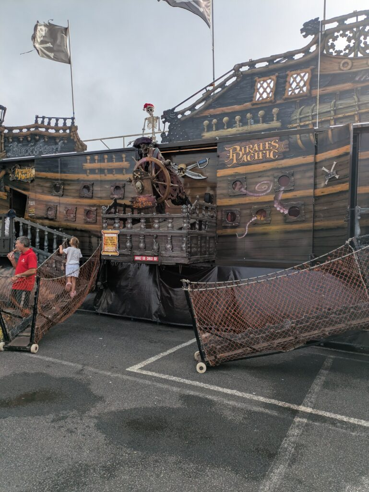

こちらはチケット売り場です。危険なアトラクションほどクーポンの必要数が増えてる気がします。高いもので7枚必要になります。複数人できたならパックを買うとお得だと思います。

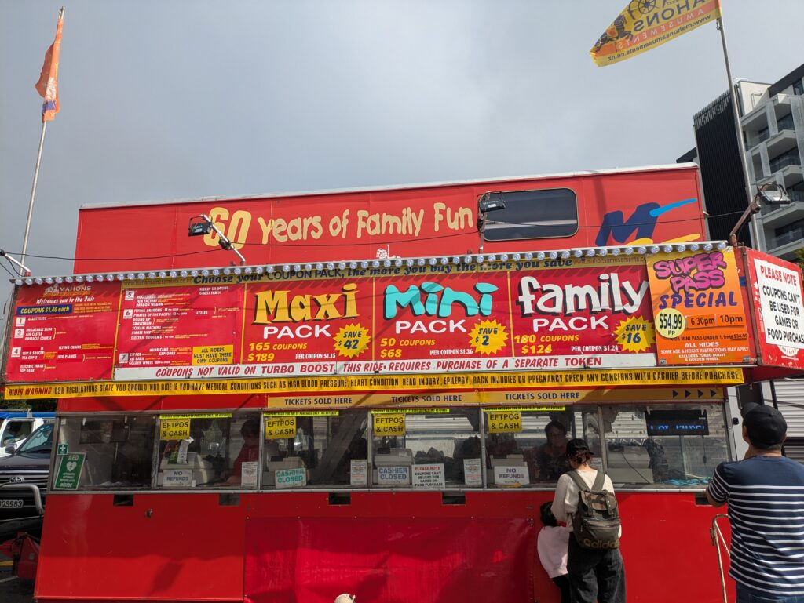

これはスケートリンクですね。初めて移動型を見ました。

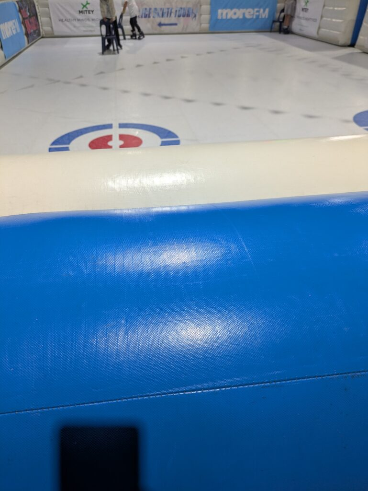

### Easter\_ファームふれあい

次はファームのふれあいですね。ヤギやポニー、ロバ、アルパカがいました。後は牧羊犬による羊の誘導ショーを行っていました。檻に入るようにしたり、台に載せたりと色々やってました。

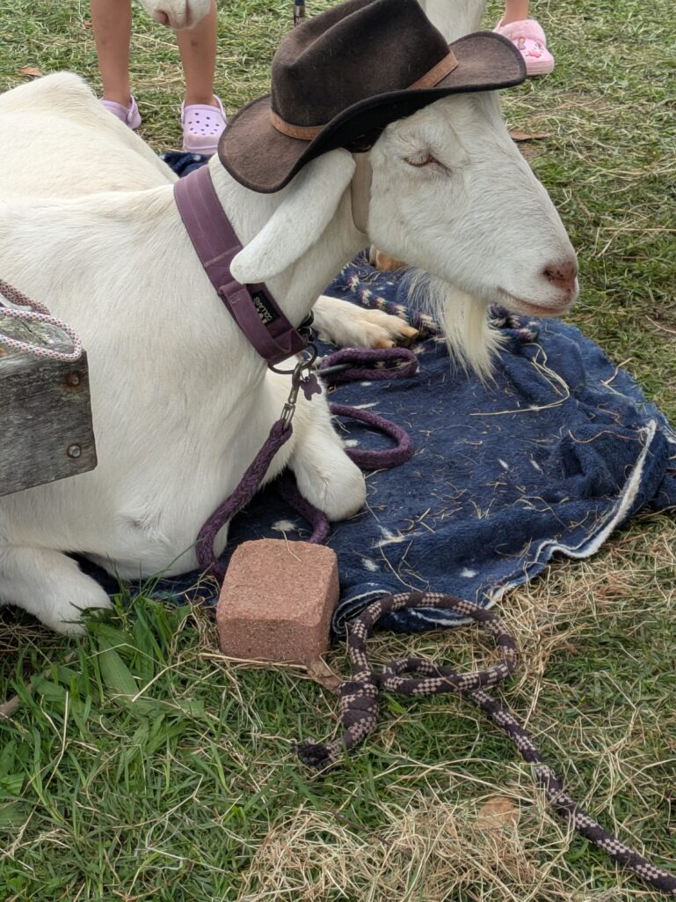

仕事として牧畜などをやってみたいと思う反面、自由な時間や長期休暇が取れないし朝早いので向いてないだろうなと思います。

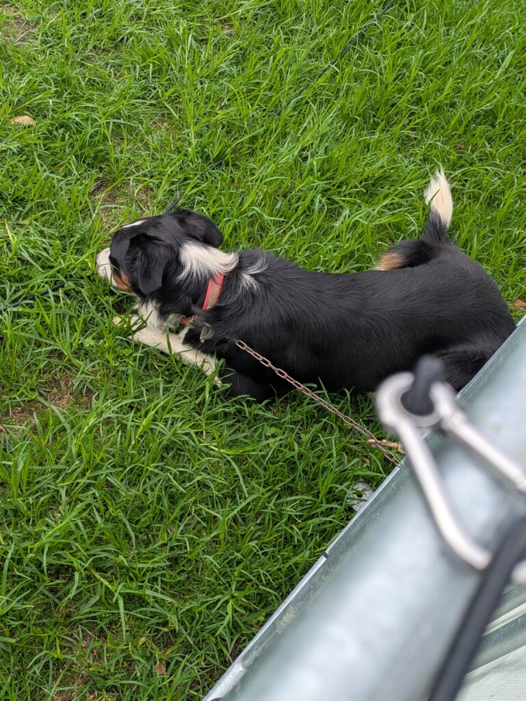

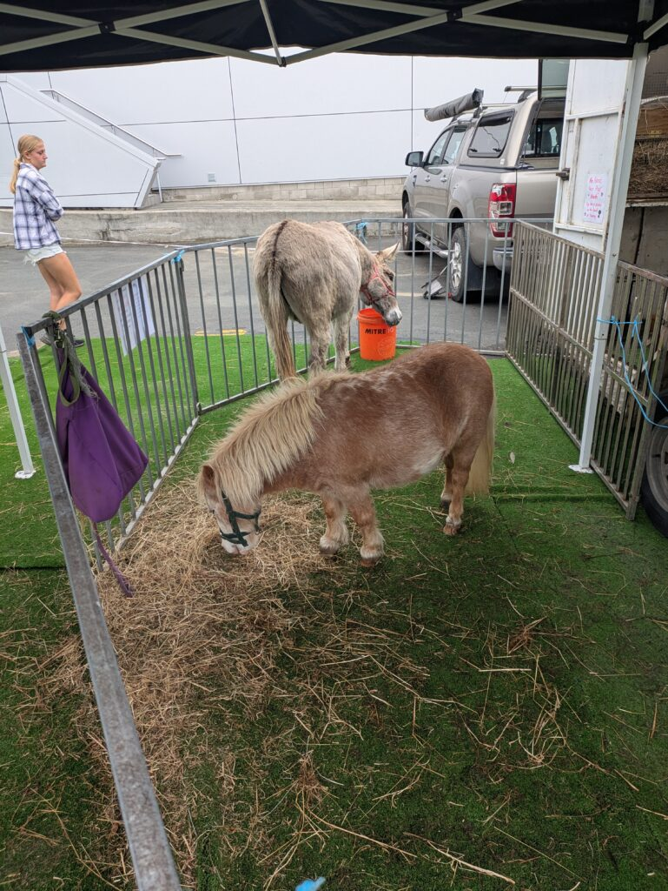

### Easter\_恐竜展

最後に恐竜展ですね。日本ほど大きくはないのでサクッと見回れます。入場券は$10ですが、プロモーションタイムだったおかげで$5で入場することができました！展示品も約10点ほどなので1時間もないくらいで見ることができます。

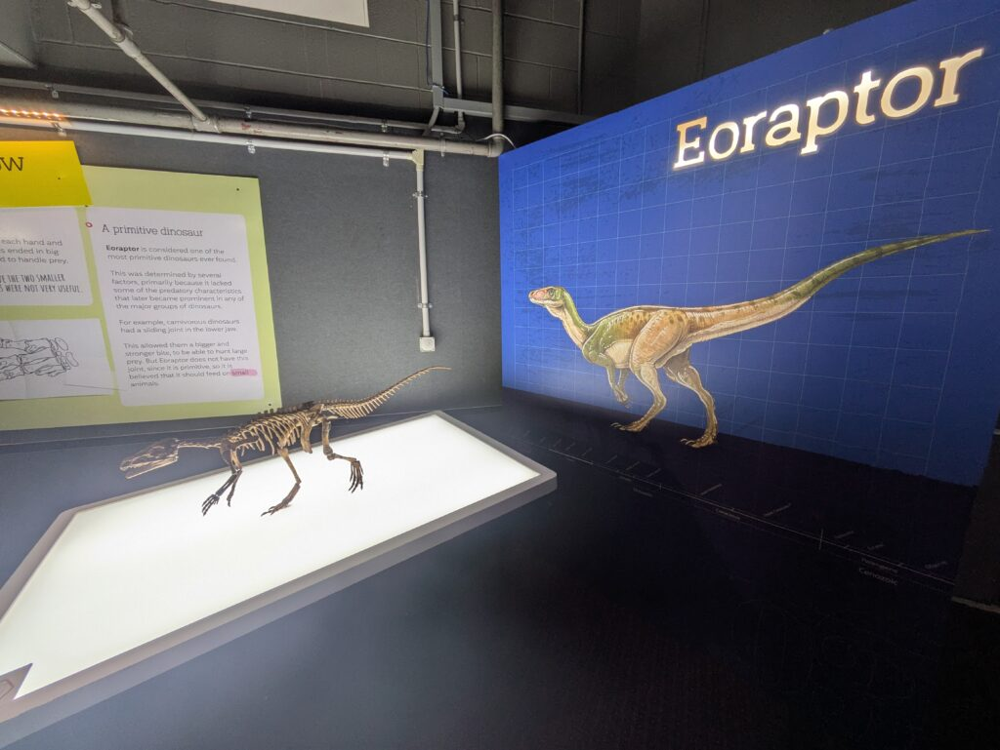

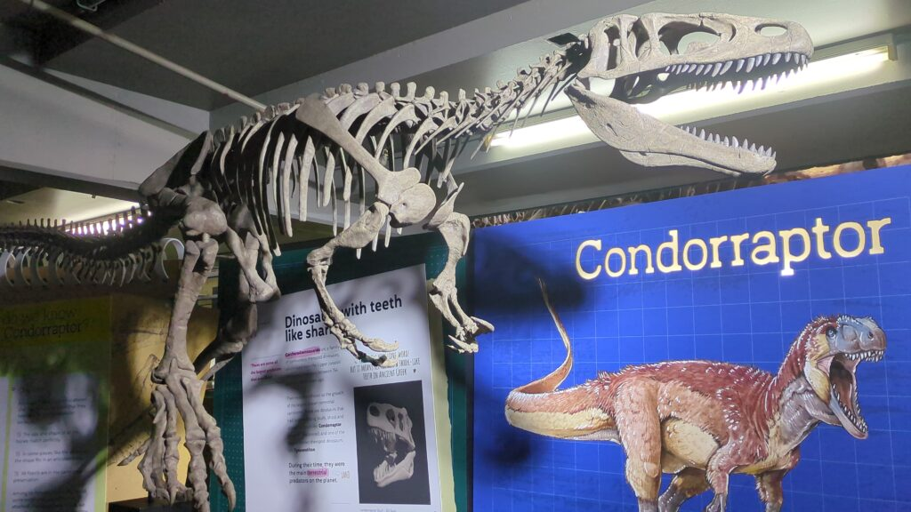

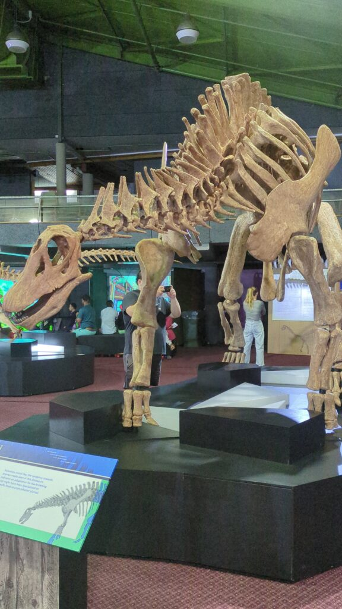

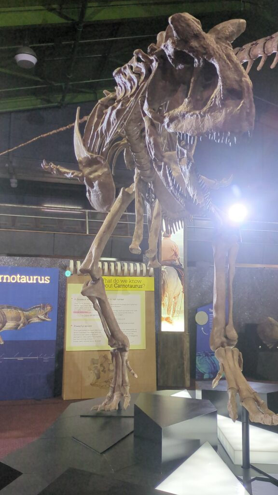

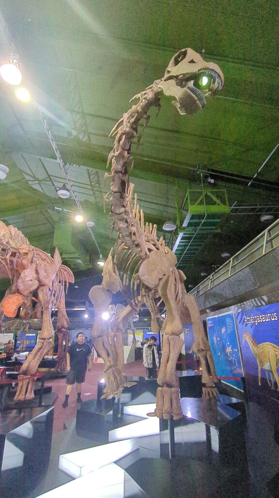

という感じで一人で楽しんできました。もちろん途中で友達と会ったりしましたが、ほぼ一人で回ってました。今回は食事を省きましたが、そちらも楽しみました。ではでは。

## AI採点

英訳文のスコアは **55点/100点** です。

以下に細かくフィードバックと改善点を挙げます。

* * *

## フィードバック

### 全体的な印象:

英語の基本構造や語彙に問題があり、自然さと正確さが不足しています。文法ミスが非常に多く、特に冠詞の使い方、前置詞の選択、主語と動詞の一致などが頻繁に間違っています。IELTSで8.0を目指す場合、文法的正確さと自然な語彙選択をかなり向上させる必要があります。

* * *

## 詳細なフィードバックと訂正:

### 冒頭文:

❌ **Japanese people aren't familiar to Easter but it's the public holiday in NZ.**  
✅ **Easter isn't familiar to Japanese people, but it's a public holiday here in New Zealand.**  
【理由】

- 「familiar with/to」の混同。「familiar to 人」か「人 be familiar with モノ」が正しい。

- 「public holiday」は冠詞「a」が必要。

❌ **Moreover, I enjoyed a event in showground.**  
✅ **So, I went to an event at the showground.**  
【理由】

- 「enjoyed an event」は「イベントを楽しんだ」というよりも「イベントに行った」というニュアンスを自然にしたほうがよい。

- 「showground」は特定の場所を指すので「the showground」が自然。

❌ **It consists of traveling amusement park, petting farm animals, muscle shows and dinosaur exhibitions.**  
✅ **The event included a traveling amusement park, a petting zoo, muscle shows, and a dinosaur exhibition.**  
【理由】

- 単数/複数形の冠詞を適切に挿入。

- 「petting zoo」がより自然。

* * *

### Easter\_amusement park:

❌ **Firstly, It's a amusement park.**  
✅ **Firstly, there was the amusement park.**  
【理由】

- 「a amusement」は「an amusement」とするか、前述の遊園地を受けて「the amusement park」にする。

❌ **I enjoyed it for long no time.**  
✅ **It had been a while since I last enjoyed an amusement park.**  
【理由】

- 元の英文は意味不明。期間を示す自然な表現に修正。

❌ **However, I haven't heard about fasten amusement parks.**  
✅ **Come to think of it, I haven't heard about any permanent amusement parks here.**  
【理由】

- 「fasten」は意味不明（"fasten"＝固定する、締める）。「permanent」が適切。

❌ **I wonder whether they commit raws?**  
✅ **I wonder if it has something to do with local regulations.**  
【理由】

- 「commit raws」は意味不明。"raws"→"laws"だとしても「commit laws」は誤り。「regulations（規制）」が適切。

❌ **It's traveling amusement park but I was hesitating because it's strong.**  
✅ **Although it's a traveling amusement park, many rides looked intense, so I hesitated to ride them.**  
【理由】

- 「強い」は英語で「intense」が自然。

❌ **There are like a shooting gallery and a merry-go-round.**  
✅ **There were attractions like a shooting gallery and a merry-go-round.**  
【理由】

- 「there were」で過去形に統一。

❌ **There is a ferris wheel but it's a little fast.**  
✅ **There was also a Ferris wheel, but it was surprisingly fast.**  
【理由】

- 固有名詞の「Ferris wheel」は大文字。

- 「little fast」→「surprisingly fast」のほうが自然。

❌ **Children looked fun.**  
✅ **The children seemed to be having fun.**  
【理由】

- 「looked fun」は「楽しく見える（対象物が楽しい）」。「楽しそう」は「seemed to be having fun」。

* * *

### Easter\_petting farm animals:

❌ **Secondly, it is petting farm animals.**  
✅ **Secondly, there was a petting zoo area.**  
【理由】

- 「it is」より「there was」のほうが自然で具体的。

❌ **Moreover, there was a show which sheepdogs leaded sheep.**  
✅ **There was also a sheepdog show where dogs guided sheep.**  
【理由】

- 過去形は「led」、"leaded"は誤り。

❌ **They are entered in the cage and ridden on the table and stuff.**  
✅ **The dogs guided sheep into cages and onto platforms.**  
【理由】

- 主語や受動態の間違い。「entered」「ridden」は使い方が誤り。「onto」が適切。

❌ **I want to work as a farmer but it's hard to work because it doesn't have free time and holidays and gets up early so I'm not good at it.**  
✅ **Part of me would like to try farming, but it seems difficult because farmers have limited free time, few holidays, and have to wake up early, so I probably wouldn't be suited for it.**  
【理由】

- より自然で明確な理由付けを含んだ文章に修正。

* * *

### Easter\_dinosaur exhibitions:

❌ **Finally, it's dinosaur exhibitions.**  
✅ **Finally, there was the dinosaur exhibition.**  
【理由】

- 一般名詞は単数「exhibition」でよい。

❌ **It always cost $10 but I could enter there for $5 because of promotion time.**  
✅ **Normally, entry costs $10, but I got in for $5 thanks to a promotional discount.**  
【理由】

- 「always」は不自然。「normally」が自然。

- 「promotion time」より「promotional discount」が自然。

❌ **There are approximatery ten exhibitions so you can wander for one hour.**  
✅ **There were about ten exhibits, so you could finish looking around in less than an hour.**  
【理由】

- 「exhibitions」はイベント全体を指す語で、「展示品」は「exhibits」。

* * *

### 結びの文:

❌ **I didn't write about meal but I enjoyed it. See you later.**  
✅ **I didn't mention the food this time, but I enjoyed that as well. See you later!**  
【理由】

- 「write about」→「mention」

- 「meal」は特定の食事を指すことが多いので、「food」のほうが自然。

* * *

## 改善された全体の文章（例）:

Easter isn't familiar to Japanese people, but it's a public holiday here in New Zealand. So, I went to an event at the showground. It featured a traveling amusement park, a petting zoo, muscle shows, and a dinosaur exhibition.

**Easter Amusement Park**  
Firstly, there was the amusement park. It had been a while since I last enjoyed an amusement park. Come to think of it, I haven't heard about any permanent amusement parks here—I wonder if it has something to do with local regulations?

Although it was a traveling amusement park, many rides looked intense, so I hesitated to ride them. There were attractions like a shooting gallery, a merry-go-round, and even a Ferris wheel, which was surprisingly fast.

This was a hands-on attraction. The children seemed to be having fun. This was the ticket booth. It seemed more coupons were needed for more dangerous rides—up to seven coupons. Buying packs would be cheaper if you come with friends.

This was a skating rink. I'd never seen a traveling one before.

**Petting Zoo**  
Secondly, there was a petting zoo area with goats, ponies, donkeys, and alpacas. There was also a sheepdog show where dogs guided sheep into cages and onto platforms.

Part of me would like to try farming, but it seems difficult because farmers have limited free time, few holidays, and must wake up early, so I probably wouldn't be suited for it.

**Dinosaur Exhibition**  
Finally, there was the dinosaur exhibition. It wasn't large, so it was easy to look around. Normally, entry costs $10, but I got in for $5 thanks to a promotional discount. There were about ten exhibits, so you could finish looking around in less than an hour.

I mostly enjoyed the event alone, although I briefly met with friends. I didn't mention the food this time, but I enjoyed that as well. See you later!
