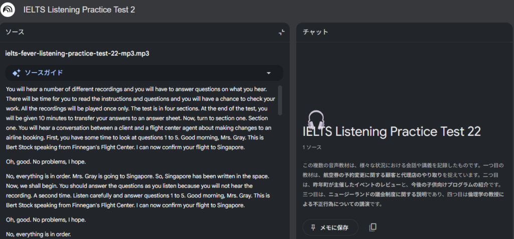

## English\_Practice

I took the mock Listening 22 of IELTS last week but my score was bad. This test included forty questions and results was eight points. A teacher said IELTS score is 3.5.

### Overview IELTS Listening

You can take it this website. I took No.22 of the mock test. I didn't feel complexed contents of it.

However, we must understand contents and vocabulary. If we don't understand, we can't answer it. Moreover, it has more writing questions than select questions. It isn't many words about one to four. Therefore, I review.

I don't remember because of retrieving the test paper. In addition, we can see test papers and answers and listen voices but we can't see contents of tests so let's use AI. I often use NotebookLM.

### Q1-Q5

Q1-5 are questions about flight tickets. When we look at overview, it's written about changing reservation.

- Q1's answer is three hours forty minutes. This is normally.

- Q2's answer is 4:05a.m. .Speakers talk for a long time but This answer is normal finally.

- Q3's answer is work. A Speaker said I can change to weekday but can't change to weekend. Therefore a customer said "work commitments".

- Q4's answer is August 7th. Speakers talk about making sure return flight date after Q3.

- Q5's answer is unpacking. A Speaker said I have time to unpack before dinner with friends after hearing to arrive 1p.m..

### Q6-Q10

I reviewed about Q1-5 but these answers are normal. I make sure Q6-10 next. Contents are interaction about flight tickets.

- Q6's answer is "post". A speaker said an email is fast but the internet connection has a problem so please post to me.

- Q7's answer is "hand luggage" or "carry on luggage". A speaker said carry on luggage of first confirmation before 10kg or less hand luggage.

- Q8's answer is "suitcase". A customer said she needs suitcase and a speaker said you can upgrade if you pay for extra fees.

- Q9's answer is "B4GBWF". A speaker said booked number so we write as she said. We shouldn't be confused because of making sure.

- Q10's answer is "aisle". I understood it's not window but I didn't recall street name. I have heard once.

It doesn't appear paraphrasing and it appears answers which I heard. See you.

## 日本語版

先週IELTSの[模擬Listening22](https://ieltsfever.org/wp-content/uploads/2016/03/ielts-fever-listening-practice-test-22-pdf.pdf)を受けましたが、ボロボロでした。テストの質問数が40問ありましたが、8点でした。スコアで言うと3.5くらいらしいです。

### IELTSについて

その模擬試験ですが[こちら](https://ieltsfever.org/ielts-listening-test-sample-papers/amp/)から受けることはできます。ちなみに私が受けたのはNo.22ですね。テストの内容自体そこまで複雑には感じませんでした。

ただ、知らない単語や内容を把握しないといけないイメージです。しっかり理解してないと回答できません。また、選択問題よりは書く問題が多いですね。単語数は1~4と多くないです。ということで復習も兼ねて書いてみたいと思います。

テスト用紙は回収されたのでおぼろげになりますが。それからテスト用紙と回答と音声は聞くことができますが、内容を英語で見ることができませんのでここはAIを活用していきましょう。私はよくお世話になってるNotebookLMを活用していきます。

### Q1-Q5

Q1-5までは航空券に関する問題でした。概要を見るとどうやら予約変更について話しているみたいです。

- Q1は3時間40分です。これは聞いた通りそのままです。

- Q2のチェックイン時間は4:05a.m.です。長々と話してますが、最終的には聞いた通りの解答になってました。

- Q3の時間を変更できない理由は仕事です。平日は変更できるが週末はできないと聞いた後、お客がwork commitmentsと言ってました。

- Q4は8月7日です。Q3直後に帰ってくるときのフライトを日付を確認するという話をしています。

- Q5は荷物の開梱です。午後1時に着くと聞いた後、友人とのディナー前に荷物整理の時間があると話しています。

### Q6-Q10

Q1-5まで見直しましたが意外と回答内容はそのままでした。次にQ6-10までを見ていきます。内容は引き続き航空券に関するやり取りです。

- Q6は郵送です。メールが早いがインターネット接続に問題があるので郵送してくださいと話しています。

- Q7はハンドバッグまたはキャリーバッグです。最初の確認で機内持ち込み荷物と言った後、10kgまでの手荷物と話しています。

- Q8はスーツケースです。行事に参加するためスーツケースが必要と話したところ追加料金でアップグレードができると話しています。

- Q9はB4GBWFです。予約番号を言われるのでそのまま書けば大丈夫です。今回は確認が入るので惑わされないことが大事ですね。

- Q10は通路です。私は窓側ではないとわかったのですが通路の名称が出てきませんでした。聞いたことはあったんですが…

こう見ると言いかえ表現は出てないですね。聞いた答えがそのまま出てますし。長くなりそうなので今回はここまでにします。次以降も復讐のため早めに出していこうと思います。ではでは。

## AI採点

英訳文の採点は **63点/100点** です。

以下、詳細なフィードバックです。

* * *

### 全体的な評価：

元の日本語の内容を部分的には表現できていますが、文法ミス、語彙選択、文構造がかなり不自然です。IELTS 8.0を目指すには、このレベルから大幅な改善が必要です。

* * *

### 詳細なフィードバック：

## 冒頭部分：

> I took the mock Listening 22 of IELTS last week but my score was bad.

✅ 改善案： **I took an IELTS Listening mock test (No. 22) last week, but my results were terrible.**

- 冠詞 "the" の使い方が間違っています。

- "score was bad" より自然なのは "my results were poor/terrible"。

* * *

> This test included forty questions and results was eight points.

✅ 改善案： **The test had 40 questions, and I only scored 8 points.**

- 主語 "results" は複数形なので、動詞は "were" を使用。

- "included" より "had" の方が自然。

* * *

> A teacher said IELTS score is 3.5.

✅ 改善案： **According to the teacher, this corresponds to an IELTS score of about 3.5.**

- 「～らしいです」を示すために "according to" を使います。

* * *

## IELTSについて：

> You can take it this website.

✅ 改善案： **You can take this mock test through this website.**

- "take it this website" は完全に文法的に誤りです。"take it on/from/through this website" が正解。

* * *

> I didn't feel complexed contents of it.

✅ 改善案： **I didn't find the content itself very complicated.**

- "complexed" は間違い。"complicated" または "complex"。

- 表現を自然な形に変更。

* * *

> However, we must understand contents and vocabulary. If we don't understand, we can't answer it.

✅ 改善案： **However, it requires understanding unfamiliar vocabulary and grasping the context clearly; otherwise, it's difficult to answer correctly.**

- "contents" は文脈では "content"（単数形）で使います。

- 単語や内容を把握する重要性を自然な表現に修正。

* * *

> Moreover, it has more writing questions than select questions.

✅ 改善案： **Moreover, there are more questions requiring written answers than multiple-choice questions.**

- "select questions" は不自然。"multiple-choice questions" が正しい。

* * *

> It isn't many words about one to four. Therefore, I review.

✅ 改善案： **The answers require only about one to four words each. Thus, I'd like to review them as practice.**

- 意味が不明瞭なため明確化。

* * *

## テスト用紙の説明部分：

> I don't remember because of retrieving the test paper.

✅ 改善案： **My memory is unclear because the test papers were collected after the exam.**

- "retrieving" は「取り戻す」という意味で、この文脈では不適切。

* * *

> In addition, we can see test papers and answers and listen voices but we can't see contents of tests so let's use AI.

✅ 改善案： **We have access to the test papers, answers, and audio, but the transcript isn't provided, so let's use AI.**

- 「音声を聞く」は "listen to audio" が正解。

- 「内容を英語で見る」は "transcript"（文字起こし）で表現。

* * *

## 各設問（Q1-5, Q6-10）について：

### 例：

> Q1's answer is three hours forty minutes. This is normally.

✅ 改善案： **The answer for Q1 is three hours and forty minutes. This was straightforward.**

- "normally" は誤り。"straightforward" や "clear" が適切。

* * *

> Q3's answer is work. A Speaker said I can change to weekday but can't change to weekend. Therefore a customer said "work commitments".

✅ 改善案： **The answer to Q3 was "work". The speaker mentioned that weekday changes were possible, but weekend changes weren't due to "work commitments."**

- 細かな語彙と文構造をより明確に修正。

* * *

> Q5's answer is unpacking. A Speaker said I have time to unpack before dinner with friends after hearing to arrive 1p.m..

✅ 改善案： **The answer to Q5 was "unpacking." The speaker noted there would be time to unpack before dinner with friends, as the arrival time was 1 p.m.**

- "hearing to arrive 1 p.m." は誤り。"the arrival time was 1 p.m." とします。

* * *

## その他の表現：

> I reviewed about Q1-5 but these answers are normal.

✅ 改善案： **After reviewing Q1-5, I found the answers straightforward.**

- "normal" はここでは不適切。"straightforward" や "correct" が適切。

* * *

> Contents are interaction about flight tickets.

✅ 改善案： **The following section continues the conversation regarding flight tickets.**

- "Contents are interaction" は不自然。"continues the conversation" で修正。

* * *

> Q7's answer is "hand luggage" or "carry on luggage". A speaker said carry on luggage of first confirmation before 10kg or less hand luggage.

✅ 改善案： **The answer to Q7 was "hand luggage" or "carry-on luggage." Initially, the speaker confirmed carry-on baggage, specifying it must weigh 10 kg or less.**

- 文の構造が非常に不明瞭なため明確に修正。

* * *

## 締めの部分：

> It doesn't appear paraphrasing and it appears answers which I heard. See you.

✅ 改善案： **Overall, there weren't many paraphrased expressions, and the answers were mostly direct quotes from the audio. I'll stop here for now. See you!**

- 「言い換え表現」を "paraphrased expressions" と表現する必要があります。

* * *

### 主な修正ポイント：

- 冠詞（a/the）の誤りが多い

- 語彙の選択が不自然（"complexed", "normally", "select questions"など）

- 時制の一致、文構造の単純化と明確化が必要

- 名詞の単数形と複数形の混同
