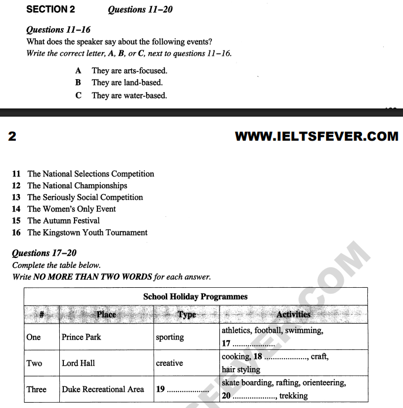

## English\_Practice

I talked about taking the mock test which isn't good score last time so I'm reviewing more this time. The questions is appear through voices so you can expect easier than you expected.This is the mock test.

### Q11-16

These question has choices which is correct. A is "arts", B is "land" and C is "water". We choose a answer and guess kind of competitions.

- Q11's answer is C. You can answer if you can hear a question, "kayak" and "paddle".

- Q'12s answer is B. You can answer if you can hear a question, "Bowling" which is land.

- Q13's answer is C. You can answer if you can hear a question, "rafting" and "river".

- Q14's answer is B. You can answer if you can hear a question, "the first 2.5k run".

- Q15's answer is A. You can answer if you can hear a question, "craft", "ancient weaving" and "sculpture".

- Q16's answer is B. You can answer if you can hear a question, "on the fields of Prince Park".

That's all. Maybe we can hear a part of answers for moments. However, we can understand answers which there are words of questions.

### Q17-20

Next, we put the words to spaces. These answer are normally so you can hear and answer same time.

- Q17's answer is Tennis. The sort of chart is different from the voice but you can answer.

- Q18's answer is Dance. This is same Q17 so you can answer.

- Q19's answer is Adventurous. This is same Q17 and Q18 so you can answer.

- Q20's answer is Mountain Biking. The sort of chart is same to the voice so you can answer.

This section is easier than other sections so we can review easier. Moreover, I won't want to fail this part.

That's all and I will keep reviewing next time. See you.

## 日本語版

[前回](/posts/2025/04/ielts-listening-test-22-review/)模擬試験を受けてボロボロだったという話をしました。今回はもう少し復習をしていこうと思います。ILTESのリスニングは音声が流れてきたとおりに問題が出題されるので、案外少しの単語で予測できるかもしれません。テストは[こちら](https://ieltsfever.org/ielts-listening-test-sample-papers/amp/)。

### Q11-16

この問題はA,B,Cという選択肢が与えられ、問題に対して何が当てはまるかを聞いて当てる問題になります。Aはアート、Bは陸上、Cは水上でコンテストの種類をあてるというものです。

- Q11のThe National Selections Competition はCです。問題文とkayakやpaddleが聞こえれば答えられます。

- Q12のThe National ChampionshipsはBです。Bowlingは陸上なので問題文も含めて聞こえていれば答えられます。

- Q13のThe Seriously Social CompetitionはCです。問題文とraftingやriverが聞こえれば答えられると思います。

- Q14のThe Women's Only EventはBです。問題文とthe first 2.5k runが聞こえれば答えられます。

- Q15のThe Autumn FestivalはAです。問題文とcraftやancient weaving,sculptureが聞こえれば答えられます。

- Q16はThe Kingdown Youth TournamentはBです。問題文とon the fields of Prince Parkが聞こえたら答えられます。

Q11-16は以上です。解答の一部は一瞬しか聞こえないので少し大変かもしれませんが、問題文の単語は出ますのでどこの問題かは追えると思います。

### Q17-20

次は表に当てはまる単語を入れる問題です。これに関してはそのまま出るので、聞きながら答えることもできると思います。

- Q17はTennisです。表の並び順は音声と違いますが、答えられると思います。

- Q18はDanceです。こちらもQ17同様ですが、答えられると思います。

- Q19はAdventurousです。Q17とQ18と同じように音声が流れますので聞いていれば答えられると思います。

- Q20はMountain Bikingです。こちらは表のとおりに音声が流れますので答えられると思います。

ここは比較的簡単だと思いますので、リスニングの復習もしやすいと思います。ここのパートは簡単だったので本番でも落としたくないですね。

ということで復習はここまでにしてまた次回続きをしたいと思います。ではでは。

## AI採点

採点：**53点/100点**

以下、細かいフィードバックです。

* * *

## 文法と語彙のミス

### 全体的な指摘：

- 文法的なミスが多く、特に主語と動詞の一致、冠詞、前置詞、複数形の間違いが目立ちます。

- 表現が不自然で、英語として理解はできますが、IELTS対策としては明確さや正確性が不足しています。

- 語彙はややシンプルすぎます。もう少し洗練された語彙を使うべきです。

* * *

## 添削詳細：

> I talked about taking the mock test which isn't good score last time so I'm reviewing more this time.

- 「which isn't good score」は文法的に誤り。  
    正しい例:  
    **I mentioned last time that I took a mock test and my score was poor, so this time I'll do a bit more review.**

* * *

> The questions is appear through voices so you can expect easier than you expected.

- 「The questions is appear through voices」は不自然で文法も間違い。  
    正しい例:  
    **The listening questions appear in the same order as the recording, so it might be easier to anticipate answers from just a few keywords.**

* * *

> These question has choices which is correct.

- 「These question」は複数形なので、**These questions**

- 「has choices」は複数形には使えないので、**have choices**

- 「which is correct」は意味が不明瞭で不自然。  
    正しい例:  
    **These questions are multiple-choice, where you select the correct answer.**

* * *

> We choose a answer and guess kind of competitions.

- 「a answer」は冠詞のミスで、**an answer**

- 「guess kind of competitions」意味が曖昧。  
    正しい例:  
    **You select the correct answer based on the type of competition.**

* * *

> You can answer if you can hear a question, "kayak" and "paddle".

- 「hear a question」は不自然。ここは問題文ではなく「聞こえる単語」を指しているので、  
    正しい例:  
    **You can answer if you hear the words "kayak" and "paddle."**

* * *

> Q'12s answer is B.

- 表記が間違い。**Q12’s answer is B.** となります。

* * *

> Maybe we can hear a part of answers for moments.

- 意味が不明瞭で文法的に不自然。  
    正しい例:  
    **Some answers might only be audible for a brief moment.**

* * *

> However, we can understand answers which there are words of questions.

- 意味が通じない。明確に言い直す必要がある。  
    正しい例:  
    **However, you can identify the answers because key words from the questions will be mentioned in the recording.**

* * *

> Next, we put the words to spaces.

- 「put words to spaces」は不自然。  
    正しい例:  
    **Next, you fill in the blanks in the table.**

* * *

> These answer are normally so you can hear and answer same time.

- 「These answer」は複数形なので **These answers**

- 「normally」はここで意味が通じない。「exactly as they appear」のような表現がよい。  
    正しい例:  
    **These answers are given exactly as they appear, so you can listen and answer simultaneously.**

* * *

> The sort of chart is different from the voice but you can answer.

- 「sort of chart」は不自然。「order」とすべき。  
    正しい例:  
    **The order of items in the table is different from the recording, but you should still be able to answer correctly.**

* * *

> Moreover, I won't want to fail this part.

- 「won't want」は文法的に不自然。  
    正しい例:  
    **I definitely don't want to make mistakes in this section during the actual test.**

* * *

> That's all and I will keep reviewing next time.

- 「keep reviewing next time」はやや不自然。  
    正しい例:  
    **That's all for now; I'll continue reviewing next time.**

* * *

## 改善例（模範的な修正版）：

I mentioned last time that I took a mock test and my results weren't good, so I'll review a bit more this time. In the IELTS Listening section, questions appear in the same order as the recording, so you might be able to anticipate answers from just a few words. Here is the mock test:

### Q11-16

These questions are multiple-choice. You choose the correct answer (A, B, or C) based on the type of competition:

- A = Arts, B = Land, C = Water.

- **Q11 (The National Selections Competition)**: Answer is C. Listen for words like "kayak" and "paddle."

- **Q12 (The National Championships)**: Answer is B. Listen for "bowling," indicating it's on land.

- **Q13 (The Seriously Social Competition)**: Answer is C. Listen for "rafting" and "river."

- **Q14 (The Women's Only Event)**: Answer is B. Listen for "the first 2.5k run."

- **Q15 (The Autumn Festival)**: Answer is A. Listen for words like "craft," "ancient weaving," and "sculpture."

- **Q16 (The Kingdom Youth Tournament)**: Answer is B. Listen for the phrase "on the fields of Prince Park."

Some answers appear only briefly, but key words from the questions will help you follow along.

### Q17-20

Next, fill in the blanks in the table. These answers appear exactly as they are spoken, making them easier to catch.

- **Q17**: Tennis. (Table order differs slightly from audio.)

- **Q18**: Dance. (Similar to Q17.)

- **Q19**: Adventurous. (Same pattern as Q17 and Q18.)

- **Q20**: Mountain Biking. (Audio order matches the table.)

This part is relatively easier, so it's good for review. I definitely don't want to miss any points here in the real test.

That's all for now. I'll continue with more review next time. See you!
