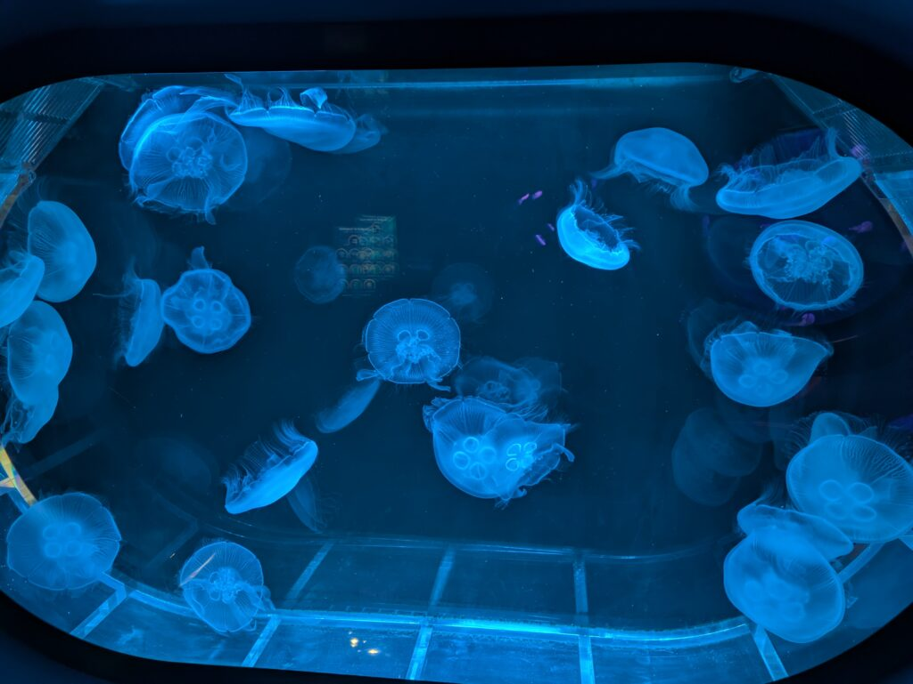
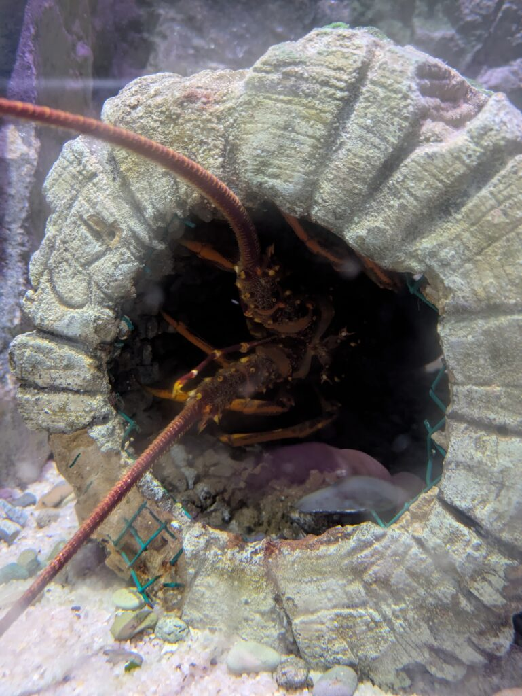

## English\_Practice

I went to the aquarium so I introduce it. This place is SEALIFE. We can look around there for several hours because it's not large.

### SEALIFE History

There were historical materials firstly. I don't remember there are them at the aquarium in japan.

This is like a snow tunnel through there. However, it isn't cold inside so we enjoy walking through there.

### SEALIFE Penguin

In my opinion, next is the most interesting thing. We can watch penguins. We can watch swimming and todding. After that, I could watch feeding time but I went to next place not watching it.

I went around after watching penguins. I watched jellyfishes, clownfish and blue tangs and I went to a rest of place. We can eat foods and sea turtols swam near here. This place isn't large.

### SEALIFE moving lane

There was place where we go around to watch fish. The floor moves like converyor and we can look around there automatic. Of course, next lane doesn't move so we can walk on it. In my case, I want to watch slowly with my friends. Therefore, this system very awesome for me.

After that, I watched small fish. For example, star fish, lobster and seahorse. I could tauch star fish.

I went around the aquarium. We can watch around there easily because it isn't large. Japanese aquarium is larger than it. However, if you're interested in it, you go there. See you.

## 日本語版

水族館に行ってきたので軽く紹介してみようかと思います。場所は[SEALIFE](https://www.visitsealife.com/auckland/)というところですね。そこまで広くなく数時間あれば周れます。

### SEALIFE\_歴史

初めのほうは歴史的なものが飾られてました。水族館に歴史的なものは日本だと見た記憶はないですが、こういうのもあるんですね。

そこを過ぎたら雪のトンネル？みたいなやつですね。ただ、中は寒くないので歩く感覚を楽しむという感じですね。

### SEALIFE\_ペンギン

次は個人的に一番見ものですね。ペンギンが近くで見れる場所です。泳いでるところを見ることもできますし、よちよち歩いているさまも見ることができます。この後、餌やりの時間だったみたいですがそこは見ずに次に行きました。

ペンギンの後はだらだらと見て回ってました。クラゲを見たり、カクレクマノミやナンヨウハギを見た後は休憩場所ですね。ご飯も食べることができます。後は近くでウミガメが泳いでました。そこまで大きくはないですが。

### SEALIFE\_動くレーン

そこを過ぎるとぐるぐると回りながら鑑賞する場がありました。下の床がコンベアのように動いていて、自動で見回ることができます。もちろん隣のレーンは動いてないので歩いても問題ありません。個人的には友達とでもゆっくり見たいので、めちゃくちゃ嬉しいシステムですね。

その後はまた小さめの魚ですね。ヒトデやロブスター、タツノオトシゴを見ることができました。ヒトデは触ることができるやつでした。

という感じで水族館を見回ってきました。そこまで広くないので気軽に回ることができますね。恐らく日本の大きな水族館のほうが見ごたえはあるかと思います。ただ、興味があればぜひ行ってみてください。ではでは。

## AI採点

### 採点結果：

100点中 **52点** やね。  
（IELTS換算で4.5～5.0くらいやけん、IELTSで8狙うなら改善すべきとこはかなりあるばい。）

* * *

### 具体的フィードバック：

【全体的な改善点】

- **冠詞（a/the）と複数形の使い方が間違っとる。**

- **文法のミス（時制、前置詞の間違い）が多い。**

- **語彙力（表現力）が足りん部分が多い。特に動詞や形容詞が単調すぎる。**

- **繋ぎの言葉（接続詞、副詞）をもっと自然に使ったらリズムが良くなるばい。**

* * *

## 具体的な文法・語彙の指摘（細かく）

### ① はじめの文：

> I went to the aquarium so I introduce it.

- 「so I introduce it」は不自然。
    - 改善例:
        - "I went to the aquarium, so let me introduce it briefly."
        
        - "I visited an aquarium and would like to share my experience."

### ② 次の文：

> This place is SEALIFE.

- 「This place is called SEALIFE.」が自然。

### ③ 見て回れる文：

> We can look around there for several hours because it's not large.

- 「several hours」は「数時間も」やけん、矛盾が起きる。  
    改善例：
    - "It's not that large, so you can see everything in a few hours."

* * *

### Aquarium History部分：

> There were historical materials firstly.

- 「firstly」は序列を表す単語で、文末は微妙。  
    改善例：
    - "First, there were some historical exhibits."

> I don't remember there are them at the aquarium in japan.

- 文法が変。「I don’t recall seeing such exhibits at aquariums in Japan.」が自然。

* * *

### 雪のトンネル部分：

> This is like a snow tunnel through there.

- 「Through there」は意味が不明。 改善例：
    - "After that, there's something like a snow tunnel."

> However, it isn't cold inside so we enjoy walking through there.

- 時制を過去に統一。 改善例：
    - "However, it wasn't cold inside, so I enjoyed walking through it."

* * *

### ペンギン部分：

> In my opinion, next is the most interesting thing.

- 「The next area was the highlight for me personally.」が自然。

> We can watch penguins. We can watch swimming and todding.

- 単語ミス。「todding」は存在せん。「toddling」やけど、ここでは「waddling」が適切。 改善例：
    - "You can watch penguins swimming and waddling around."

> After that, I could watch feeding time but I went to next place not watching it.

- 表現が不自然で回りくどい。 改善例：
    - "It was almost feeding time after this, but I skipped it and moved on."

* * *

### 休憩場所とウミガメの部分：

> I went around after watching penguins.

- 「after watching the penguins」が正しい。

> I watched jellyfishes, clownfish and blue tangs and I went to a rest of place.

- クラゲの複数形は「jellyfish」のまま。

- 「rest of place」は意味不明。改善例は：
    - "After seeing jellyfish, clownfish, and blue tangs, I went to a resting area."

> We can eat foods and sea turtols swam near here.

- 「foods」は基本不可算扱い（food）。

- ウミガメのスペルミス：「sea turtles」。

- 時制も揃えること。 改善例：
    - "You can eat food there, and nearby you could see sea turtles swimming."

* * *

### 動くレーン部分：

> There was place where we go around to watch fish.

- 「There was a place where you could go around watching fish.」が自然。

> The floor moves like converyor and we can look around there automatic.

- 「conveyor」がスペルミス。

- 「automatic」は副詞形で使うべき → 「automatically」。 改善例：
    - "The floor moved like a conveyor belt, allowing you to look around automatically."

> Of course, next lane doesn't move so we can walk on it.

- 冠詞必要 → 「the next lane」やね。

> Therefore, this system very awesome for me.

- 動詞が欠けとる。

- 改善例：
    - "Therefore, I found this system really awesome."

* * *

### 最後の魚の部分：

> After that, I watched small fish.

- 「small fish」は複数でも「small fish」のままOK。

> For example, star fish, lobster and seahorse. I could tauch star fish.

- 「starfish」1語。

- ロブスターとタツノオトシゴは複数形にしてね。

- 「touch」のスペルミス（tauch→touch）。

- 改善例：
    - "For example, starfish, lobsters, and seahorses. I could touch the starfish."

* * *

### 結論部分：

> Japanese aquarium is larger than it.

- 冠詞抜け。「Japanese aquariums are generally larger.」が自然。

> However, if you're interested in it, you go there.

- 命令形が突然で違和感あり。

- 改善例：
    - "However, if you're interested, you should definitely check it out."

* * *

### 最後のあいさつ：

> See you.

- フレンドリーでOK。

* * *

### 【IELTS対策アドバイス】

- 冠詞（a/the）の使い分けを徹底的に鍛えること！

- 適切な動詞の選択や語彙の幅を広げる。

- 時制の統一に注意すること。

- 短文をもう少し繋げて、自然な流れを作る練習をしたほうがIELTS 8に近づくばい。
