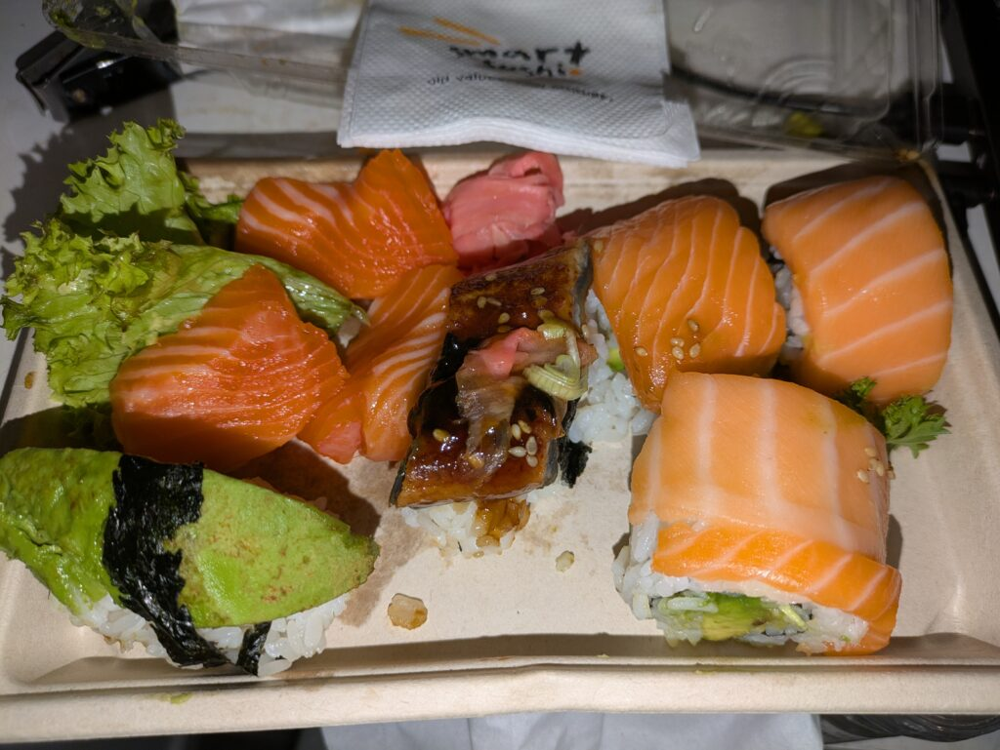

## English\_Practice

I haven't eaten SUSHI since I came here so I ate it. However, I ate SUSHI of package.

Salmon and avocado roll is right side, unagi is middle, raw salmon and avocado sushi is left side.

### sushi salmon and avocados

The Salmon tastes very normally. Probably, It's similar to it and super's salmon. I felt containing avocado is oily.

Unagi is chewy. I prefer Yanagawa's unagi to it.

In my opinion, I don't like avocado sushi. The avocado is used to abroad but I'm not sure. You try to eat it.

There was a lemon but it wasn't taken the picture. I don't know why there is a lemon. I put it but it didn't taste good.

### The end

Finally, I felt rice doesn't taste good. I guess it's different to use water.

Main sushi is salmon and avocados in NZ. I think other raw fish are very rarely. I'm not sure if I have a chance to eat it next time. However, if you do that, you try to do that once. See you.

## 日本語版

こちらに来てSUSHIを食べてなかったので食べてみました。とは言えパックのSUSHIになりますが。

右がサーモンとアボカド巻き、真ん中が鰻、左がサーモンの刺身とアボカド握りです。

### sushi\_サーモンとアボカド

サーモン自体は普通でした。特に変わった物ではないですね。もしかしたらスーパーのサーモンも似たようなものかもしれません。アボカド入りだと油の触感があり、少しべたっとした感じがしますね。

鰻は固めで弾力があります。柳川の鰻と比べるまでもないですが、やっぱり地元の鰻が美味しいですね。

アボカドの握りは個人的には合わないですね。よく海外では使われますが、何がいいのかいまいちわかりませんでした。一度は食べてみるといいかもしれません。

一応写真に写ってないですがレモンもありました。なんでレモンがあるのかわからないですね。かけてはみましたが、やっぱり微妙でした。

### 最後に

最後にご飯のほうですが、これも微妙に感じました。もしかしたら使っている水の違いもあるかもしれませんね。

ここではサーモンとアボカドがメインになります。他のネタはまれだと思いますね。次機会があった時に食べるか微妙ですが、もし食べる機会があれば一度試してみると良いと思います。

## AI採点

採点：**55点/100点**

かなり直すとこ多かばい！一個ずつ細かく見てくけんね。

* * *

## 詳細フィードバック（文法・語彙）:

### 全体の印象:

- 文法ミスが多いけん、IELTS 8.0目指すなら文章構造ばもっと洗練させんと厳しかよ。

- 表現が直訳的で不自然やけん、英語の自然な表現ば学ぶ必要がある。

* * *

### 個別指摘:

### 原文:

> I haven't eaten SUSHI since I came here so I ate it.

### 修正例:

- I hadn't eaten sushi since I came here, so I decided to try some.

- 理由と結果のつながりを明確にして、動詞に自然な表現を使う。

* * *

### 原文:

> However, I ate SUSHI of package.

### 修正例:

- However, it was packaged sushi.

- "SUSHI of package" は間違い。"packaged sushi" が自然な英語表現ばい。

* * *

### 原文:

> Salmon and avocado roll is right side, unagi is middle, raw salmon and avocado sushi is left side.

### 修正例:

- The salmon and avocado roll is on the right, unagi is in the middle, and salmon sashimi and avocado nigiri are on the left.

- 場所の前置詞を正しく使う。"On the right"、"in the middle"、"on the left" という表現を覚えんしゃい。

* * *

### 原文:

> sushi salmon and avocados

### 修正例:

- Salmon and Avocado Sushi

- 見出しとして書くならこうシンプルにせんと。

* * *

### 原文:

> The Salmon tastes very normally.

### 修正例:

- The salmon tasted ordinary.

- 「普通」を言うときは「ordinary」や「average」がよか。"normally" は頻度の意味やけんここでは不自然。

* * *

### 原文:

> Probably, It's similar to it and super's salmon.

### 修正例:

- It's probably similar to supermarket salmon.

- 「スーパーのサーモン」は "supermarket salmon"。「似ている」は "similar to" を使って、シンプルに。

* * *

### 原文:

> I felt containing avocado is oily.

### 修正例:

- With avocado, it felt oily and somewhat greasy.

- 「Containing avocado」 は不自然。"with avocado" と形容詞 "greasy" を加えると触感がはっきり伝わるばい。

* * *

### 原文:

> Unagi is chewy. I prefer Yanagawa's unagi to it.

### 修正例:

- The unagi was chewy and firm. It can't compare to Yanagawa's unagi—I definitely prefer the local one.

- 比較の表現はもっと具体的にしたほうがよか。

* * *

### 原文:

> In my opinion, I don't like avocado sushi. The avocado is used to abroad but I'm not sure. You try to eat it.

### 修正例:

- Personally, avocado sushi doesn't suit my taste. It's commonly used abroad, but I don't really understand the appeal. You might want to try it once, though.

- 「使われる」は受動態（is commonly used abroad）。呼びかけは"You might want to try it" が丁寧で自然。

* * *

### 原文:

> There was a lemon but it wasn't taken the picture.

### 修正例:

- There was also a lemon, although it's not shown in the photo.

- 「写真に写ってない」は"not shown in the photo" が自然。"taken" は撮影する側が使う動詞。

* * *

### 原文:

> I don't know why there is a lemon. I put it but it didn't taste good.

### 修正例:

- I'm not sure why there was a lemon. I tried squeezing some on the sushi, but it didn't taste good.

- 「かけてみた」 は "squeeze"（絞る）が自然ばい。

* * *

### 原文:

> Finally, I felt rice doesn't taste good. I guess it's different to use water.

### 修正例:

- Finally, the rice didn't taste very good. It might be due to differences in the water used.

- 推測の表現は "might be due to" や "perhaps because of" を使って、自然に表現。

* * *

### 原文:

> Main sushi is salmon and avocados in NZ. I think other raw fish are very rarely.

### 修正例:

- In NZ, salmon and avocado sushi are most common. Other types of raw fish are quite rare.

- 「rarely」は副詞やけん、ここでは「rare」（形容詞）がよか。

* * *

### 原文:

> I'm not sure if I have a chance to eat it next time. However, if you do that, you try to do that once. See you.

### 修正例:

- I'm not sure if I'll eat it again, but if you get a chance, you should try it at least once. See you later!

- 「もし機会があったら」の自然な表現は "if you get a chance"。最後の挨拶は「See you later」がより自然。

* * *

## IELTS向け全体的なアドバイス:

- 文法（特に冠詞、前置詞、時制）のミスが多かけん、文法力をもっと高める必要があるばい。

- 語彙は基本的な表現だけに頼らず、状況に応じて適切な語を使うように練習するとよかばい。

- 読み手に対する呼びかけ表現をもっと自然にするとよか。「You should try」「you might want to」などのニュアンスを覚えるのが効果的。
