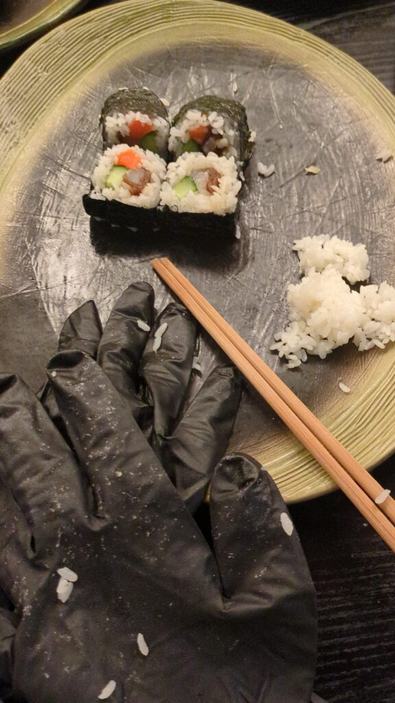

## English\_Practice

Recently, I learned how to make sushi.

### Learning

First, I learned how to cut raw fish. That is finishing three-piece fillet or buying a piece of fish.

I was carefully taught how to use a knife. If you cut fish or buy a piece of fish, I want to do that. I can also use for survival.

I was taught how to make nigiri sushi, temaki sushi and maki sushi after cutting. Therefore, I was taught how to make Californiaroll. Basically, that is same except direction of rolling.

After that, I ate sushi after making it. It's delisious since fish is fresh and I made it by myself. I also received miso soup. I haven't drunk for a long time but it's good because of suiting it.

### Joining reason and thought

I joined this event why is that I understand how to know cutting fish and making sushi. When I work as sushi profession, I can use this skill so I participated in it.

However, I must continue to cut fish and make sushi.

I'm nost sure I will join same event next time but I want to take part in other events. See you.

## 日本語版

最近[寿司の作り方](https://www.madsamurai.co.nz/)を学んだのでその時の話をしようと思います。

### 学んだこと

最初に学んだのは刺身までの切り方ですね。三枚おろしが終わったあるいは店からブロックで買ったという体で進みました。

包丁の入れ方を丁寧に教えてもらいました。もし捌いたり、魚のブロックを買う機会があればやってみたいですね。サバイバルにも使えそうですし（笑）

その後は握り、手巻き、巻きずしという流れで教えてもらいました。それからカリフォルニアロールも教えてもらいました。基本的には巻きずしと同じですが、巻く方向が逆のイメージですね。

その後は作った寿司を食べました。新鮮な魚というのもありますが、自分で作った寿司は美味しいですね。それからみそ汁ももらいました。久しぶりに飲みましたが寿司に合って美味しかったです。

### 寿司イベントに参加した経緯と感想

このイベントに参加した理由としては魚の切り方を知ることができるのと寿司の作り方がわかるというものですね。もし寿司系の仕事に就く場合は使えるかなと思って参加してみました。

とは言え継続して魚を切って寿司を作るという作業をやらないとあまり意味はなさそうですが…

次同じようなイベントに参加するかはわからないですが、他のイベントがあった際は参加してみたいと思います。ではでは。

## AI採点

採点：**55/100点**

かなり改善の余地があるけん、細かく指摘していくばい。

* * *

## 詳細フィードバック

### 全体の評価

文章は通じるっちゃけど、文法、語彙、表現にぎこちなさが多か。特に接続詞、冠詞、時制の誤りが多く、IELTS8を目指すなら徹底して直したほうが良かよ。

* * *

### 修正点（文法・語彙・表現）

> Recently, I learned how to make sushi.

✅ OK。けど「I'll tell you about it.」的な導入があるほうが自然。

修正例：

> Recently, I learned how to make sushi, so I'd like to share that experience with you.

* * *

> Learning

❌ 見出しが不自然。「What I Learned」か「Things I Learned」が自然。

修正例：

> **What I Learned**

* * *

> First, I learned how to cut raw fish. That is finishing three-piece fillet or buying a piece of fish.

❌ 「三枚おろし」はthree-piece filletではなく、\*\*"three-piece filleting"**や**"filleting fish into three pieces"\*\*が自然。  
また、文の意味が明確でない。

修正例：

> First, I learned how to slice fish after it's been filleted, or from a block of fish bought at a store.

* * *

> I was carefully taught how to use a knife.

✅ 文法的にはOK、表現としては受動態でちょっと固い。「丁寧に教えてもらった」というニュアンスが強調されとらん。

修正例：

> They showed me carefully how to handle the knife properly.

* * *

> If you cut fish or buy a piece of fish, I want to do that.

❌ 意味が不明瞭。仮定法が間違っとる。

修正例：

> If I get a chance to fillet or buy fish in the future, I'd like to try it myself.

* * *

> I can also use for survival.

❌ 文法ミス：「use」は他動詞やけん目的語が必要。

修正例：

> It might even come in handy for survival (lol).

* * *

> I was taught how to make nigiri sushi, temaki sushi and maki sushi after cutting.

✅ 受動態でもいいけど、シンプルに能動態のほうが自然。

修正例：

> After that, I learned how to make nigiri, temaki, and maki sushi.

* * *

> Therefore, I was taught how to make Californiaroll.

❌「Therefore」は不適切。「それから」は「Then」。スペースも間違い。

修正例：

> Then, I also learned how to make California rolls.

* * *

> Basically, that is same except direction of rolling.

❌ 文法ミス：冠詞（the same）、前置詞(of)の抜け。表現も不自然。

修正例：

> It's basically the same as maki sushi, just rolled inside out.

* * *

> After that, I ate sushi after making it.

❌ 文法が冗長で不自然。

修正例：

> After finishing, I ate the sushi I made.

* * *

> It's delisious since fish is fresh and I made it by myself.

❌ スペルミス：「delicious」、冠詞、表現も不自然。

修正例：

> It was delicious, partly because the fish was fresh, but also because I made it myself.

* * *

> I also received miso soup.

❌ 「received」は受け身すぎて不自然。「got」や「had」のほうが自然。

修正例：

> I also had miso soup.

* * *

> I haven't drunk for a long time but it's good because of suiting it.

❌ 文法（現在完了の目的語抜け）、表現のミスが多い。

修正例：

> I hadn't had miso soup in a long time, but it went really well with the sushi and tasted great.

* * *

> Joining reason and thought

❌ 表現が不自然。「Reasons for Joining and Thoughts」がよい。

修正例：

> **Reasons for Joining and My Thoughts**

* * *

> I joined this event why is that I understand how to know cutting fish and making sushi.

❌ 「why is that」の構文は間違い。

修正例：

> The reason I joined this event was to learn how to cut fish and make sushi.

* * *

> When I work as sushi profession, I can use this skill so I participated in it.

❌ 「sushi profession」は間違い。「as a sushi chef」のほうが正確。

修正例：

> I thought these skills might be useful if I ever work as a sushi chef.

* * *

> However, I must continue to cut fish and make sushi.

❌ 意味が不完全。文意を補足する必要あり。

修正例：

> However, unless I keep practicing cutting fish and making sushi, it probably won't mean much.

* * *

> I'm nost sure I will join same event next time but I want to take part in other events.

❌ 誤字：「nost」→「not」。冠詞抜け：「the same event」。

修正例：

> I'm not sure if I'll join the same event again, but I'd definitely like to participate in other events.

* * *

> See you.

✅ OKやけど、カジュアル過ぎるかも。状況次第。

* * *

## 改善版の英訳例

Recently, I learned how to make sushi, so I'd like to share that experience.

### What I Learned

First, I learned how to slice fish after it's been filleted, or from a fish block bought at a store. They carefully showed me how to handle the knife. If I get the chance, I'd love to try it myself. It might even come in handy for survival (lol).

Afterwards, I learned how to make nigiri, temaki, and maki sushi. Then, I also learned how to make California rolls, which are basically the same as maki sushi, just rolled inside out.

After finishing, I ate the sushi I made. It was delicious, partly because the fish was fresh, but also because I made it myself. I also had miso soup, which I hadn't had in a long time. It went really well with the sushi and tasted great.

### Reasons for Joining and My Thoughts

I joined this event to learn how to cut fish and make sushi. I thought these skills might be useful if I ever work as a sushi chef.

However, unless I keep practicing, it probably won't mean much. I'm not sure if I'll join the same event again, but I'd definitely like to participate in other events.

See you next time!
