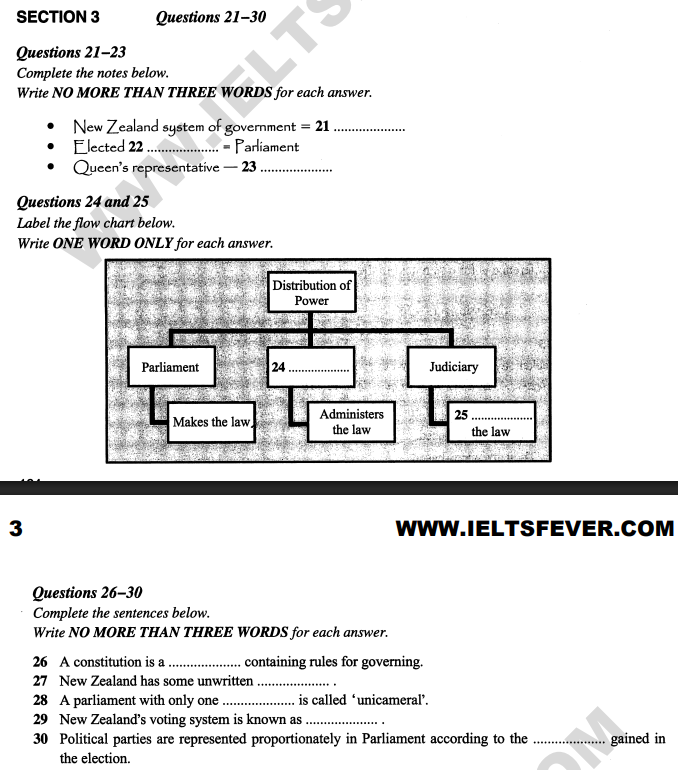
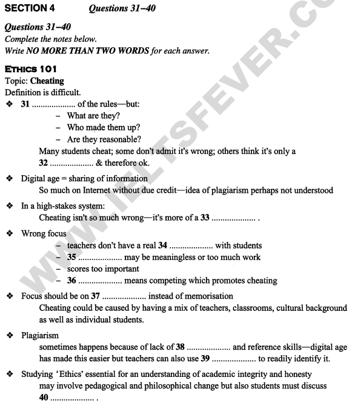

## English\_Practice

I did until Listening22 Q11-Q20 last time. I took other mimic test and I want to review it so I will finish reviewing No.22 this time.

### Listening22\_Q21-25

Q21-30's questions are politics. If you know about politics or parliament of NZ, it's easy for you. I don't know about that.

- Q21's answer is "Constitutional Monarchy". This answer is given exactly as it appear. I couldn't answer because I didn't know about vocabrarys.

- Q22's answer is "House of Representatives". This answer is given exactly as it appear. I didn't know that. "House of Representatives" is house of representatives, "Parliament" is parliament or congress。

- Q23's answer is "Governor-General". This is just once. She is said a representation and governor general from stream. We don't misunderstand "boss"

- Q24's answer is "Executive". This is separating three rights. "Executive" is correct because there are "parliament" and "judiciary". If you know that, you can answer without hearing.

- Q25's answer is "Interprets". This is just once. I think "judges" is also a good answer.

### Listening22\_Q26-30

That's all. Speakers continue to talk about laws.

- Q26's answer is "Document". This is just once. However, "containing" doesn't appear so you don't understand if you chase sentenses

- Q27's answer is "Conventions". This is just once. I think "constitutional conventions" is also a good answer.

- Q28's answer is "Chamber". This answer is given exactly as it appear. It's just once.

- Q29's answer is "Proportional Representation". This answer is given exactly as it appear. However, Speaker doesn't say "NZ" and says that our election has once per three years.

- Q30's answer is "Share of Votes". This is just once. "according to" doesn't appear and "gained" appears insted of "won".

### Listening22\_Q31-40

Q31-40 is lectures about cheating. I understand kind of something but I guess it's not difficult.

- Q31's answer is "Violation". This answer is given exactly as it appear. It's just once. "rules" is written in sentences but "regurations" is said in voices.

- Q32's answer is "Minor Offence". This answer is given exactly as it appear. However, It's difficult to hear and put answer. Therefore, you must understand contents.

- Q33's answer is "Survival Skill". This answer is given exactly as it appear. However, you are careful because paraphrasing appears instead of sentences. "not worng" is "not dishonest", "It's merely" is " It's more of".

- Q34's answer is "Relationship". This answer is given exactly as it appear. "meaningful" appears instaed of "real".

- Q35's answer is "Task". This answer is given exactly as it appear. "pointless" appears instaed of "meaningless" and "work is overwhelming" appears instaed of "too much work".

- Q36's answer is "Achievement". This answer is given exactly as it appear. "encourage" appears instaed of "promote"

- Q37's answer is "Thinking". This answer is given exactly as it appear. Appearance of sentences is a little different but it doesn't vary another word.

- Q38's answer is "Writing". This answer is given exactly as it appear. You understand that you listen to "plagiarizing" and "understand the material" is paraphrasing instead of "reference"

- Q39's answer is "Technology". This answer is given exactly as it appear. "spot" is paraphrasing instead of "identify".

- Q40's answer is "Morals" or "Morality". This answer is given exactly as it appear.

That's all. These answer are given exactly as they appear through all but paraphrasing is instead of words of sentences. It should be fine if verbs change noun but there are many paraphrasing. If you know that, you can solve it.

By the way, I took two mock tests when I wrote this article. I took better scores than this test so I want to review same again. See you.

## 日本語版

[前回](/posts/2025/04/ielts-listening-test-22-questions-11-20/)Listeningの22Q11-20までやりました。最近別の模擬テストを受けてそちらの復習もしたいので、今回でNo.22の復習は終わりにしようと思います。

### Listening22\_Q21-25

Q21-30までは政治の話になります。政治に詳しかったり、ニュージーランドの議会を知っていれば簡単だと思われます。私はさっぱりわかりませんでした。

- Q21's answer is "Constitutional Monarchy".ここの解答は聞いたままの答えが出ました。私は単語を知らなかったので答えられませんでした。

- Q22's answer is "House of Representatives".この解答もそのままでした。これも私が知らなかっただけですね。"House of Representatives"が衆議院、"Parliament"は議会や国会。

- Q23's answer is "Governor-General".これは1回しか出ないですね。流れから彼女は代表で総督と言われています。bossと間違えないようにしないとですね。

- Q24's answer is "Executive".これは三権分立の話ですね。議会、司法があるので残りの行政が正解になります。知っていれば聞かなくても回答できそうです。

- Q25's answer is "Interprets".これも1回しか出ないです。judgesでもよさそうな気はしますが。

### Listening22\_Q26-30

これで一旦終わりになります。このまま続いて法律の話になります。

- Q26's answer is "Document".これも1回出てきますね。ただ、containingは出ないので問題文をそのまま追うとわからなくなると思います。

- Q27's answer is "Conventions".こちらも1回だけですね。恐らく"constitutional conventions"でも問題ないと思います。

- Q28's answer is "Chamber".こちらも聞いた通りですね。1回だけですが。

- Q29's answer is "Proportional Representation".これも聞いた通りでてきます。ただ、NZとは言わず私たちの選挙が3年に1回でそれをこう言うと話しています。

- Q30's answer is "Share of Votes".これも1回出てきます。"according to"という表現は出ないし、gainedの代わりにwonが出てきます。

### Listening22\_Q31-40

Q31-40までは不正行為に関する講演になります。なんとなくわかるぐらいですが、それでも難しく感じました。

- Q31's answer is "Violation".これは聞いた通りです。問題文はrulesと書かれていますが、音声ではregurationsと言われます。

- Q32's answer is "Minor Offence".これも聞いた通りにはでます。ただ、音声を聞いて当てはめるのは難しそうです。しっかり内容を把握しないとわからないですね。

- Q33's answer is "Survival Skill".これも聞いた通りに出ます。ただ、問題文とは違う言いかえ表現が出るので気を付けないとダメですね。"not worng"は"not dishonest"、"It's merely"は" It's more of"と出てきます。

- Q34's answer is "Relationship".これも聞いた通り出ますね。その代わり"real"ではなく"meaningful"という表現が出てきます。

- Q35's answer is "Task".これもそのまま出てきます。その代わり"meaningless"ではなく"pointless"、"too much work"ではなく"work is overwhelming"ですね。

- Q36's answer is "Achievement".これも聞いた通りに出ます。"promote"が"encourage"という表現になっています。

- Q37's answer is "Thinking".これも聞いた通りに出ます。問題文の表現が若干異なりますが、別の単語というほど異なってはないです。

- Q38's answer is "Writing".これも聞いた通りに出ます。"plagiarizing"が聞こえて"understand the material"が"reference"の言いかえと気づけばわかります。

- Q39's answer is "Technology".これも聞いた通りですね。"spot"が"identify"と言い換えられています。

- Q40's answer is "Morals" or "Morality".これも聞いた通りに出ます。

これで以上になります。全体を通して解答自体はそのまま出ているが、問題文の単語は言いかえが出るという感じですね。単純に動詞が名詞になってるだけならよいですが、別の単語に言い換えてるものも多いですね。そこさえわかれば解けると思われます。

さてこの記事を書いた時点で2つほど模擬テストを受けました。このテストよりはましな点数を取れましたが、まだまだなので同じように復習したいと思います。ではでは。

## AI採点

## 採点: 62/100点

英文の内容はある程度伝わりますが、文法・語彙のミスが多く、IELTSで8を目指すには大幅な改善が必要です。

## 具体的フィードバック：

### 全体的な改善点：

- 単数・複数形のミスが非常に多い

- 時制や冠詞の使い方に問題がある

- 語彙選択が不自然または誤っている箇所が多い

- パラフレーズや説明表現が不自然

* * *

### Listening22の個別指摘:

> I did until Q11-Q20 last time.

× **did until** は不自然  
◯ **I completed up to Q20 last time.**

* * *

> I took other mimic test and I want to review it so I will finish reviewing No.22 this time.

× **other mimic test** → **another mock test**  
× 文が冗長で不自然  
◯ **I recently took another mock test and want to review it, so I'll finish reviewing No.22 this time.**

* * *

> Q21-30's questions are politics.

× 文法誤り: **are about politics**  
◯ **Questions Q21-30 are about politics.**

* * *

> If you know about politics or parliament of NZ, it's easy for you.

× **parliament of NZ** → **the parliament of New Zealand**  
× 条件文として表現がやや不自然  
◯ **If you’re familiar with politics or the New Zealand parliament, you'll find it easy.**

* * *

> I don't know about that.

△ 意味は通じるが簡単すぎる  
◯ **I had no idea about these topics.**

* * *

> Q21's answer is "Constitutional Monarchy". This answer is given exactly as it appear.

× **as it appear** → **as it appears**（単数の主語には三人称単数形）  
◯ **This answer appears exactly as stated.**

* * *

> I couldn't answer because I didn't know about vocabrarys.

× **vocabrarys** → **the vocabulary** (不可算)  
◯ **I couldn’t answer because I didn’t know the vocabulary.**

* * *

> "House of Representatives" is house of representatives, "Parliament" is parliament or congress。

× 説明がそのまま繰り返されている  
◯ **"House of Representatives" refers to the lower house, while "Parliament" means a legislative body or congress.**

* * *

> She is said a representation and governor general from stream.

× 意味が不明瞭  
◯ **From context, she is described as the representative, called the Governor-General.**

* * *

> We don't misunderstand "boss".

× 不自然な英語  
◯ **We must not confuse this with "boss."**

* * *

> This is separating three rights.

× **separating three rights** → **separation of powers**（三権分立の適切な英語表現）  
◯ **This refers to the separation of powers.**

* * *

> If you know that, you can answer without hearing.

△ **without hearing** → **without even listening** の方が自然  
◯ **If you know that, you can answer without even listening.**

* * *

> Speakers continue to talk about laws.

△ **continue to talk**よりも **continue talking**が自然  
◯ **The speakers continue talking about laws.**

* * *

> However, "containing" doesn't appear so you don't understand if you chase sentenses

× **sentenses** → **sentences** スペルミス  
× **chase sentences**は不自然  
◯ **However, since "containing" isn't mentioned, you’ll get confused if you try to follow the sentences exactly.**

* * *

> This answer is given exactly as it appear.

（同様の誤りが多発しているので再度指摘）  
× **as it appear** → **as it appears**

* * *

> Speaker doesn't say "NZ" and says that our election has once per three years.

× 不自然な表現  
◯ **The speaker doesn't explicitly mention "New Zealand," but says our elections occur every three years.**

* * *

> Q31-40 is lectures about cheating.

× **is lectures** → **are lectures** (複数の講義)  
◯ **Questions 31-40 cover lectures about cheating.**

* * *

> I understand kind of something but I guess it's not difficult.

× 文法が曖昧で不自然  
◯ **I understood it somewhat, but still found it challenging.**

* * *

> It's just once.

△ **It's just once**は曖昧  
◯ **It’s mentioned only once.**

* * *

> "rules" is written in sentences but "regurations" is said in voices.

× **regurations** → **regulations** スペルミス  
× **in voices** → **in the audio**  
◯ **The written text says "rules," but the audio says "regulations."**

* * *

> However, It's difficult to hear and put answer.

× **It's difficult to hear and put answer** 不自然  
◯ **However, it's difficult to hear clearly and identify the answer.**

* * *

> However, you are careful because paraphrasing appears instead of sentences.

× 文法・意味が不明瞭  
◯ **However, you need to be careful because paraphrasing occurs instead of exact wording.**

* * *

> "meaningful" appears instaed of "real".

× **instaed** → **instead** (スペルミス)

* * *

> "pointless" appears instaed of "meaningless" and "work is overwhelming" appears instaed of "too much work".

（同様にスペルミス再発）  
× **instaed** → **instead**

* * *

> Appearance of sentences is a little different but it doesn't vary another word.

× 非常に不自然  
◯ **The wording is slightly different, but it doesn’t involve completely different vocabulary.**

* * *

> You understand that you listen to "plagiarizing" and "understand the material" is paraphrasing instead of "reference"

× 文が意味不明瞭  
◯ **You’ll notice that "plagiarizing" is mentioned, and "understand the material" is paraphrased from "reference."**

* * *

> "spot" is paraphrasing instead of "identify".

× **instead of** は逆に表現  
◯ **"Identify" is paraphrased as "spot."**

* * *

> These answer are given exactly as they appear through all but paraphrasing is instead of words of sentences.

× 文法的に混乱している  
◯ **All these answers appear exactly as spoken, but the questions include paraphrasing instead of using the original words.**

* * *

> It should be fine if verbs change noun but there are many paraphrasing.

× 不自然な英語  
◯ **Simple changes from verbs to nouns are manageable, but there are many more complex paraphrases.**

* * *

> By the way, I took two mock tests when I wrote this article.

△ **when**よりも**by the time**の方が自然  
◯ **By the time I wrote this article, I had taken two mock tests.**

* * *

> I took better scores than this test so I want to review same again.

× **took better scores** → **got higher scores**  
× **review same again** → **review in the same way**  
◯ **I got higher scores than this one, but I'll review in the same way again.**

* * *

> See you.

△ IELTS用の記事としてはカジュアル過ぎ  
◯（IELTS対策記事としては省略推奨）

* * *

## 総評：

全体的に語彙・文法が不十分であり、IELTSで高得点を取るには表現力と正確性を大きく向上させる必要があります。特に単数・複数形、時制、冠詞の正確な使用、自然な英語表現への改善が急務です。
