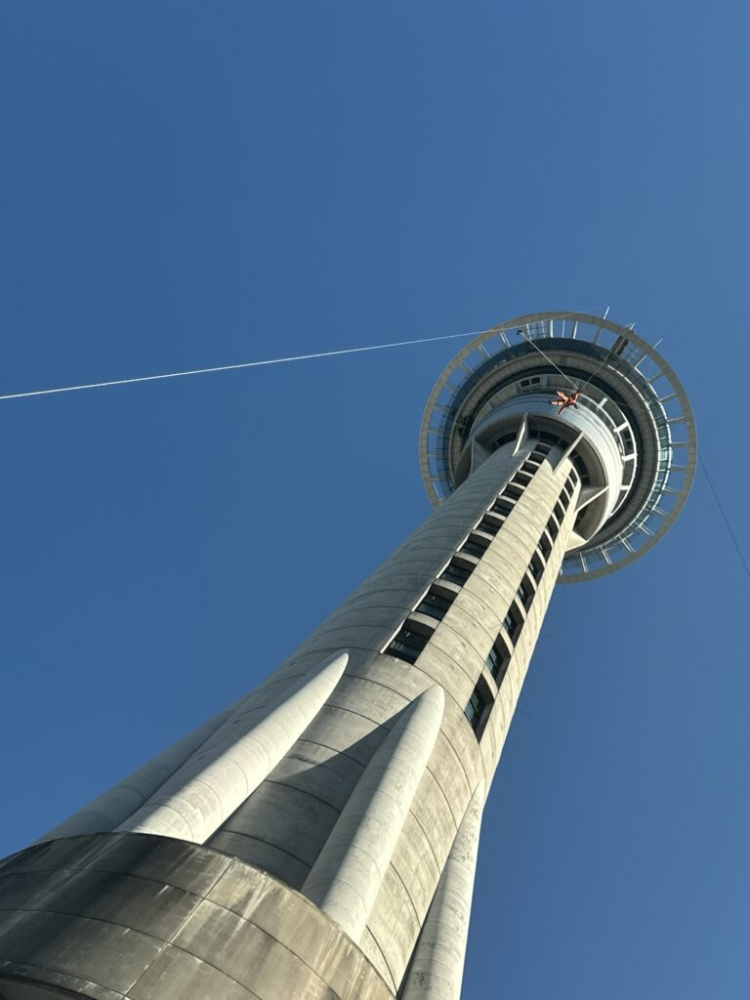
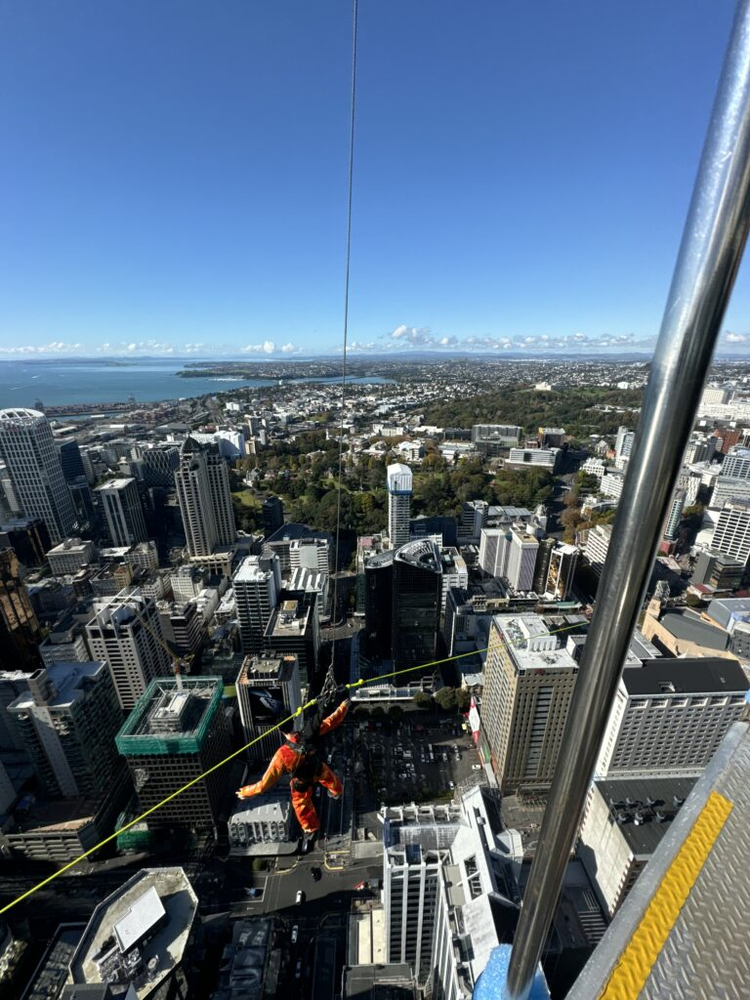
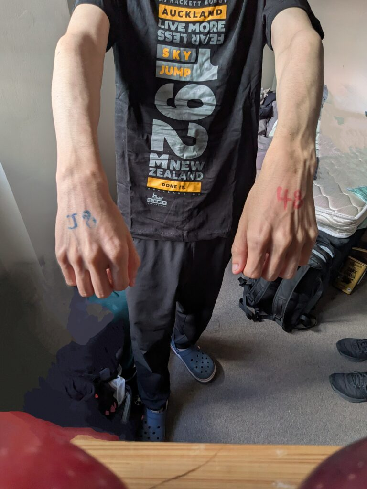

## English\_Practice

I went bungee jumping because I drank with my friend and he invited me last night.

I'm not acrophobia so I should be fine at high place. However, I have never done that so I was fairly nervous.

### bungee jumping\_reservation

We can book online. Nevertheless, we booked at the reception and it cost $165 because I gave a proof of address. I'm a student and I'm glad to be cheaper than I expected.

I went to the besement of hotel after booking at the reception where we can book there. I prepared there after booking. I wore the unique clothes and like a harness.

I lifted up 53 levels at the elevator after preparing and saving my baggage. There are restaurants at the 51 and 52 level. I can't imagine what it costs.

### bungee jumping\_the jumping moment

I would fly and sort at the last floor. I came here with my three friends and flew at last. I took photos and checked it before jumping. The assistant said "3, 2, 1, IKE" why I don't know.

I was extremely nervous at the jumping moment and I thought I might meet my grand father. I was scared 1 or 2 seconds after jumping but comforable after that because it was a bit brake.

### bungee jumping\_bonus

By the way, we can check near the monitor because the cameras recorded to us while we were flying. Moreover, I can watch the video and photos which were recording while I was jumping because the link was sent.

we can obtain a T-shirt and ticket which I can lift up at the SkyTower for free once after jumping. It's cheaper than usual cost. If you are interested in it, you should try it. See you later!

## 日本語版

前日の夜に友達と飲みに行って誘われたのでバンジージャンプをしてきました。

高所恐怖症ではないので高いところでも大丈夫ではありますが、やったことないので流石に緊張しました。

### bungee jumping\_予約

予約は[オンライン](https://www.bungy.co.nz/auckland/sky-tower/skyjump/)からでもできます。ただ、私は受付でやったのですが、住所証明を出したら$165という半額で体験出来ました。学生というのもありそうですが、想定よりも安くなったので嬉しかったです。

受付で予約を済ませた後、ホテルの地下に向かいます。そこでも予約をできますが、それが終わった後は準備をします。専用の服があるのでそれを着て、ハーネスのようなものを装着しました。

荷物を預けて準備を整えたらエレベーターで53階まで上がります。ちなみに51階や52階はレストランになってます。どれくらいかかるのか想像もできませんが…

### bungee jumping\_飛ぶ瞬間

最上階に来たら順番に飛びます。私は3人の友達と来て最後に飛びました。軽く写真を撮って飛ぶ前の確認をしたら飛びます。飛ぶときになぜか「3, 2, 1, 行け！」と言われましたね。

飛ぶ瞬間はめちゃくちゃ緊張しましたし、おじいちゃんに会いに行くかもと思いました。飛んで1,2秒は怖い気持ちが強かったですが、その後は多少ブレーキが利くので割と快適でした。

### bungee jumping\_おまけ

ちなみに飛んでるときはカメラで撮影されているので近くのパネルで確認することができます。更に、飛んでる瞬間を録画しているので登録したメールにリンクが送られて見ることができます。

飛んだ後はTシャツと1回だけ自由にスカイタワーを登れるチケットをもらうことができます。$45ぐらいなので約$100で体験できたと考えればお得ですね。もし興味があればぜひ体験してみてください。ではでは。

## AI採点

以下の英訳文の採点結果は、 **55点／100点** です。

以下、詳細なフィードバックを提供します。

* * *

## 修正箇所と指摘（文法・語彙の間違い）

### 1\. 原文：

> I went bungee jumping because I drank with my friend and he invited me last night.

- 誤りと問題点：
    - 時間表現が不自然。誘われたのが昨晩であることをはっきり表現した方がよい。
    
    - 理由を明確にしたほうが自然。

- 修正案：
    - **I went bungee jumping today because my friend invited me last night when we went out for drinks.**

* * *

### 2\. 原文：

> I'm not acrophobia so I should be fine at high place.

- 誤りと問題点：
    - **"acrophobia"** は「高所恐怖症（名詞）」なので、be動詞を使うべき。
    
    - 「高い場所」は複数形または "heights" が自然。

- 修正案：
    - **I don't have acrophobia, so I'm usually fine with heights.**

* * *

### 3\. 原文：

> However, I have never done that so I was fairly nervous.

- 誤りと問題点：
    - "done that" は曖昧。bungee jumping を明確に示したほうがよい。

- 修正案：
    - **However, I had never tried bungee jumping before, so I was quite nervous.**

* * *

### 4\. 原文：

> We can book online. Nevertheless, we booked at the reception and it cost $165 because I gave a proof of address.

- 誤りと問題点：
    - 主語は "we" よりも "you"（一般論）または "I"（個人的経験）が適切。
    
    - "gave a proof of address" → "showed proof of address" が自然。

- 修正案：
    - **You can book online, but I booked at reception. It cost $165 because I showed proof of address.**

* * *

### 5\. 原文：

> I'm a student and I'm glad to be cheaper than I expected.

- 誤りと問題点：
    - 文法的に不自然。"It was cheaper"を使う。

- 修正案：
    - **I'm a student, and I was glad it was cheaper than expected.**

* * *

### 6\. 原文：

> I went to the besement of hotel after booking at the reception where we can book there.

- 誤りと問題点：
    - スペルミス："besement" → **"basement"**
    
    - "hotel" には冠詞が必要。
    
    - "where we can book there" は不要かつ意味が不明確。

- 修正案：
    - **After booking at reception, I went to the basement of the hotel.**

* * *

### 7\. 原文：

> I wore the unique clothes and like a harness.

- 誤りと問題点：
    - "unique clothes" よりも具体的に "special jumpsuit" などが適切。
    
    - "like a harness" は不明確。"harness"を明確にする。

- 修正案：
    - **I wore a special jumpsuit and put on a harness.**

* * *

### 8\. 原文：

> I lifted up 53 levels at the elevator after preparing and saving my baggage.

- 誤りと問題点：
    - "lifted up" は不適切。"took the elevator"が正しい。
    
    - "saving baggage" は誤り。"storing my baggage"が適切。

- 修正案：
    - **After preparing and storing my baggage, I took the elevator up to the 53rd floor.**

* * *

### 9\. 原文：

> There are restaurants at the 51 and 52 level. I can't imagine what it costs.

- 誤りと問題点：
    - 階を示す場合は序数（51st, 52nd）を使うべき。
    
    - 「いくらかかるか」は文脈的に不要か不自然。

- 修正案：
    - **There are restaurants on the 51st and 52nd floors.**

* * *

### 10\. 原文：

> I would fly and sort at the last floor.

- 誤りと問題点：
    - "fly" は飛行機のようで不自然。"jump" が適切。
    
    - "sort at the last floor" 意味不明瞭。「最上階で順番を待つ」が自然。

- 修正案：
    - **On the top floor, we took turns jumping.**

* * *

### 11\. 原文：

> I came here with my three friends and flew at last.

- 誤りと問題点：
    - "flew" 不自然。"jumped" を使う。
    
    - "at last" は「ついに」より「最後に」と明確化が必要。

- 修正案：
    - **I came with three friends and jumped last.**

* * *

### 12\. 原文：

> The assistant said "3, 2, 1, IKE" why I don't know.

- 誤りと問題点：
    - 発言の意図が不明瞭。"IKE" は日本語（「行け」）なので説明が必要。

- 修正案：
    - **The assistant counted down "3, 2, 1, Go!" in Japanese ("Ike!"), though I don't know why.**

* * *

### 13\. 原文：

> I was extremely nervous at the jumping moment and I thought I might meet my grand father.

- 誤りと問題点：
    - "grand father" → **"grandfather"** スペル修正。
    
    - 英語で「死ぬかも」を暗示的にするなら "I thought I might die" や "see my grandfather in heaven" の方が自然。

- 修正案：
    - **At the moment of the jump, I was extremely nervous and thought I might see my grandfather in heaven.**

* * *

### 14\. 原文：

> because it was a bit brake.

- 誤りと問題点：
    - "it was a bit brake" 文法的に誤り。"there was some braking" などが自然。

- 修正案：
    - **after a couple of seconds, it felt comfortable because the rope slowed me down slightly.**

* * *

### 15\. 原文：

> By the way, we can check near the monitor because the cameras recorded to us while we were flying.

- 誤りと問題点：
    - "recorded to us" は不自然。"recorded us" が正しい。
    
    - "check near the monitor" → "check the footage on a monitor"

- 修正案：
    - **By the way, you can check the footage on a nearby monitor because cameras recorded us during the jump.**

* * *

### 16\. 原文：

> we can obtain a T-shirt and ticket which I can lift up at the SkyTower for free once after jumping.

- 誤りと問題点：
    - 主語の統一性が崩れている。"I" か "you" で統一する。
    
    - "lift up at the SkyTower" は不自然。"use to go up the SkyTower" が適切。

- 修正案：
    - **After jumping, I received a T-shirt and a free ticket to go up the SkyTower once.**
