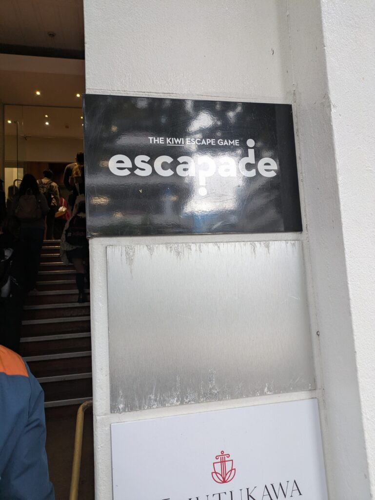
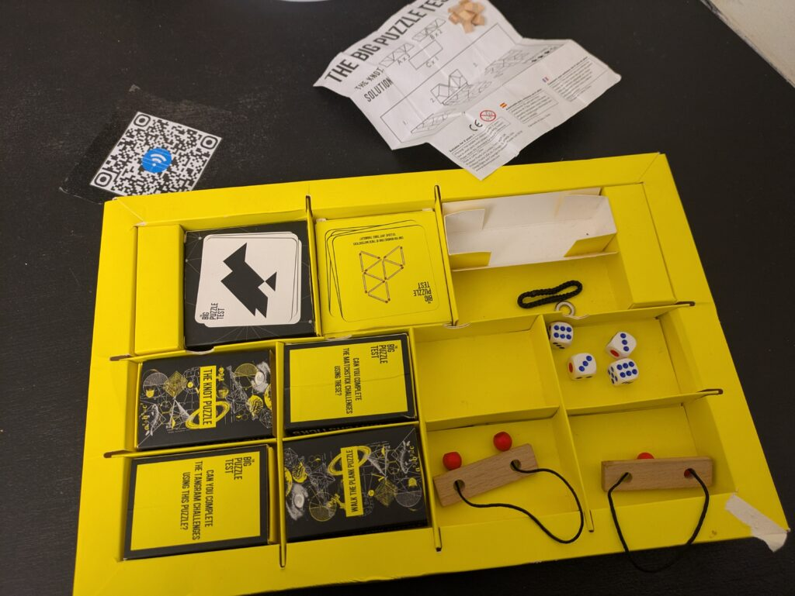
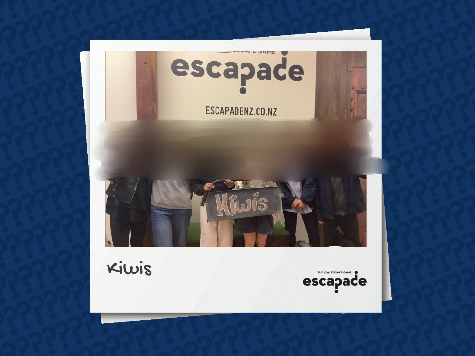

## English\_Practice

### Escapade\_Overall

I did the escape room at first time in New Zealand. I've never done that in Japan. I tried it because we could do it in afternoon activity.

However, I can't upload photos and contents so I'll write my thought. There is the Escapade nearby the Queen Street in CBD.

I think the cost which is $33 is as well as Japan's. However, There is only one room so you might enjoy it in Japan. I'm not sure as I've never done it.

### Escapade\_Details

We applied for a reception and was waiting for a while. We had to wait because previous people did the escape room and assistants needed to prepare. I played puzzles and puzzle rings while waiting. Therefore, I wasn't bored while waiting.

The game's time limit is 60 minutes. Assistants watch through cameras so they understood how progressing. Therefore, if you have no idea, you can receive hints through radio.

I think puzzles are similar to Japan's. We solved them using numbers, letters and colors. However, letters are all English. Pasonally, Japan's puzzles are more complexed than NZ's because Japan has "kanji".

### The End

We were taken a photo because of solving within time. It wasn't enough time to solve and we got hints from a teacher and assistants. We were taken a photo with a brackbord written team name and teammates together.

I enjoyed the escape room like that. In my opinion, I prefer alone but I also enjoy solving puzzles with someone. If I go back Japan, I would like to try it again. See you later.

## 日本語版

### Escapade\_概要

ニュージーランドに来て初めて[脱出ゲーム](https://escapadenz.co.nz/)をやりました。日本でもやったことがありませんでした。午後のアクティビティでやることになったので、挑戦してみました。

とは言え、内容自体や写真はアップできないのでざっくりと感想を書いていく感じになります。場所はCBD内でクイーンストリートから近い場所になります。

値段は$33で日本とそこまで変わらないと思います。ただ、ほぼ一部屋だけなのでもしかしたら日本のほうがもっと楽しめるのかもしれません。やったことないのでわからないですが。

### Escapade\_詳細

中に入って受付を済ませたら少し待ってました。恐らく前の人の終了と準備時間が必要だったのだと思います。待ってる間は知恵の輪やパズルをしてました。待ってる間もあまり退屈はしませんでした。友達とも話してたので。

ゲームの制限時間は60分となってます。店員の人がカメラ越しに見ているので、どこまで進行しているか把握をしています。そのため、もし手詰まりになった場合は無線越しにヒントをもらうことができます。

内容としてはおそらく日本と大きく変わらないとは思います。数字や文字、色を使って解答を出していくという感じですね。ただ、文字に関しては全て英語という感じです。日本だと漢字もあるのでより複雑になりそうですが、こっちのほうがまだシンプルな気がします。

### 終わりに

最後に時間内に解決したので写真を撮ってもらえました。とは言え終了5分までで先生や店員さんのヒントありきでギリギリになりましたが。チーム名が書かれた黒板とともにチームの人と一緒に取ってます。

そんな感じで脱出ゲームを楽しんできました。個人的には1人のほうが楽しめるなと思いましたが、誰かと一緒に謎を解くのも楽しいですね。日本に帰ったら挑戦してみたいと思います。ではでは。

## AI採点

採点： **65/100**

## 全体的なフィードバック:

内容の大まかな意味は通じていますが、文法、語彙、冠詞、単複の誤りが目立ち、IELTSスコア8を目指すにはより細かい注意が必要です。また表現を自然で明確なものに改善する余地があります。

* * *

## 細かなフィードバック（文法・語彙・表現）:

### Escapade\_Overall

- **"I did the escape room at first time in New Zealand."**
    - 誤: at first time → 正: **for the first time**
    
    - 冠詞（the）が抜けています。

- **"I've never done that in Japan."**
    - 正しいですが、より自然な表現: **I've never tried it in Japan either.**

- **"I tried it because we could do it in afternoon activity."**
    - 誤: in afternoon activity → 正: **as part of an afternoon activity**

- **"However, I can't upload photos and contents so I'll write my thought."**
    - 誤: contents → 正: **content**
    
    - 誤: my thought → 正: **my thoughts**（一般的に複数形）

- **"There is the Escapade nearby the Queen Street in CBD."**
    - 誤: the Escapade → 正: **an escape room**（施設名として書くなら冠詞不要：Escapade）
    
    - 誤: nearby the Queen Street → 正: **near Queen Street**
    
    - 誤: in CBD → 正: **in the CBD**（特定の地域なので冠詞必要）

- **"I think the cost which is $33 is as well as Japan's."**
    - 誤: as well as Japan's → 正: **about the same as in Japan**

- **"However, There is only one room so you might enjoy it in Japan."**
    - 誤: There（文頭の大文字不要）→ **there**
    
    - 表現改善: **However, there was only one room, so you might enjoy it more in Japan.**

* * *

### Escapade\_Details

- **"We applied for a reception and was waiting for a while."**
    - 誤: applied for a reception（受付に申し込むのは不自然）→ 正: **checked in at the reception**
    
    - 誤: was waiting → 正: **waited**（単複一致: 主語がweなので）

- **"previous people did the escape room and assistants needed to prepare."**
    - 改善: **the previous group was finishing, and the staff needed time to prepare.**

- **"I played puzzles and puzzle rings while waiting."**
    - 誤: played puzzles → 正: **solved puzzles**（パズルはsolveが自然）
    
    - 誤: puzzle rings → 正: **ring puzzles**または**puzzle rings**（どちらも可だが後者で十分自然）

- **"Therefore, I wasn't bored while waiting."**
    - 改善案: **Thus, I didn't feel bored while waiting.**（より自然）

- **"Assistants watch through cameras so they understood how progressing."**
    - 誤: how progressing → 正: **how we were progressing**
    
    - 改善案: **Staff monitored our progress through cameras.**

- **"Therefore, if you have no idea, you can receive hints through radio."**
    - 誤: through radio → 正: **via radio** または **through a walkie-talkie**
    
    - 改善案: **If you got stuck, you could ask for hints via a walkie-talkie.**

- **"Pasonally, Japan's puzzles are more complexed than NZ's because Japan has "kanji"."**
    - 誤: Pasonally → 正: **Personally**（スペルミス）
    
    - 誤: complexed → 正: **complex**（complexは形容詞としてそのまま使う）
    
    - 改善案: **Personally, I think puzzles in Japan are more complex due to the use of kanji.**

* * *

### The End

- **"We were taken a photo because of solving within time."**
    - 誤: We were taken a photo → 正: **We had our photo taken**
    
    - 改善案: **We had our photo taken because we solved it within the time limit.**

- **"It wasn't enough time to solve and we got hints from a teacher and assistants."**
    - 改善案: **We barely finished in time, thanks to some hints from the staff.**
    
    - "teacher" は不自然。通常 "staff" または "assistant" を使う。

- **"We were taken a photo with a brackbord written team name and teammates together."**
    - 誤: brackbord → 正: **blackboard**（スペルミス）
    
    - 誤: written team name → 正: **with our team name written on it**
    
    - 改善案: **We took a photo together with a blackboard displaying our team name.**

- **"I enjoyed the escape room like that."**
    - 改善案: **Overall, I enjoyed the experience.**

- **"In my opinion, I prefer alone but I also enjoy solving puzzles with someone."**
    - 改善案: **Personally, I might enjoy doing it alone, but solving puzzles with others is also fun.**

- **"If I go back Japan, I would like to try it again."**
    - 誤: go back Japan → 正: **go back to Japan**
    
    - 改善案: **If I return to Japan, I would like to try it again.**

- **"See you later."**
    - 適切ですが、ブログや感想文にはややカジュアルすぎるかもしれません。**That's all for now.** なども検討できます。
