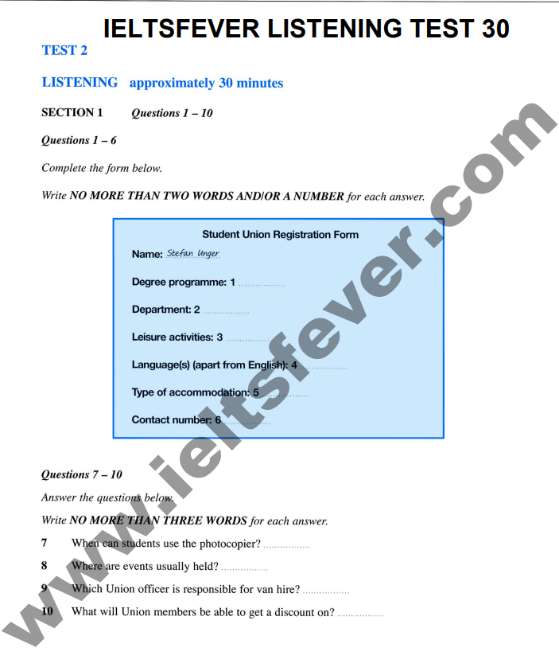
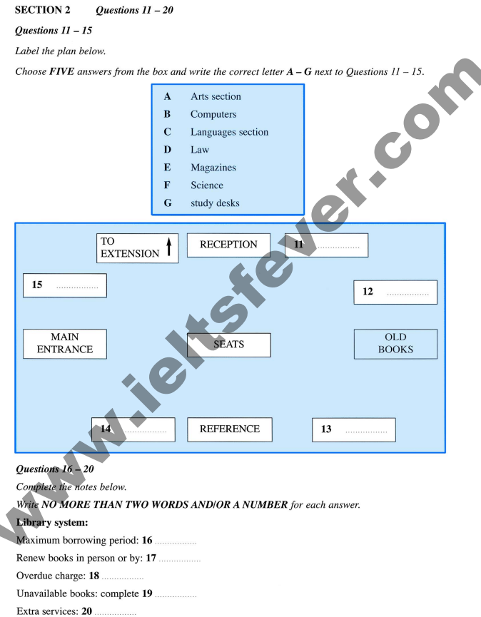
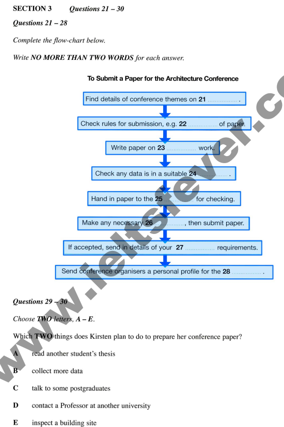
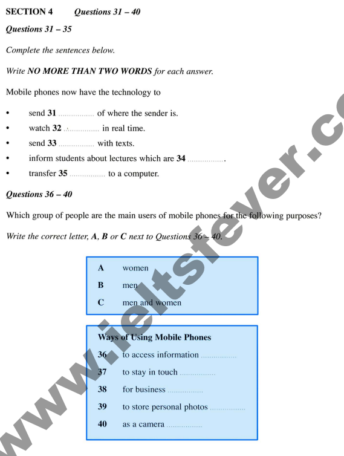

## English\_Practice

I took the mock litening test No.30 so I will review it. This score was fifteen per forty. I used to take the mock test and I felt a bit easily. However, I took bad score so I will review it.

### Listening30\_Q1-6

The speakers talk about addmision procedures whici a new student applys for.

- The answer for Q1 is "POSTGRADUATE". The student said it as it appears.

- The answer for Q2 is "ENGINEERING". The student said the science faculty first but the reception said engineering and he answered "Yes".

- The answer for Q3 is "COMPUTER GAMES". The student said one of interesting things. After that, he talked about soccer but we have to ignore that.

- The answer for Q4 is "GERMAN". The student said it as it appears. The reception said "Italy and French" so it should be fine unless you misunderstand.

- The answer for Q5 is "HALL". The student said "I live in a hall now but I want to live in a flat". After that, the reception said he should write living home now.

- The answer for Q6 is "0295069003". The reception said the student didn't have a phone so she would fill in a organization phone number. You have to be careful because she said "O" instead of zero and "double O" instead of 00.

### Listening30\_Q7-10

- The answer for Q7 is "(IN THE) MORNINGS". The reception said it as it appears. However, she also said they used it after 1P.M. so don't be confused.

- The answer for Q8 is "ROUND THEATRE". The reception said it as it appears. If you listen "round", you can understand it and you should not be confused from "opposite the conference center".

- The answer for Q9 is "TRANSPORT SECRETARY". The reception said "the president" first time, but she told the student who meet a person that is "the transport secretary".

- The answer for Q10 is "NEWSPAPERS". The reception said we consult to discount newspaper after tolding discount for books, clothes and music.

### Listening30\_Q11-15

The speakers talked about guiding the library.

- The answer for Q11 is "E". The guide said you can sit and read magazines by the reception.

- The answer for Q12 is "A". The guide said this area was "Science" before but has been "Art section". You should be careful.

- The answer for Q13 is "G". The guide said you must be quiet next corner by the reference section because this area is "Student desks". If you follow the story, you can understand.

- The answer for Q14 is "D". The guide said language books were put before but they decided to put law books there. You should be careful.

- The answer for Q15 is "B". The guide said that there are language area and study desk at the end after coming the main area and talking about the exist.

### Listening30\_Q16-20

- The answer for Q16 is "SIX WEEKS". The guide said you can borrow books for 6 weeks 2 months later because of changing the system. She didn't say "borrow" and said "take books out".

- The answer for Q17 is "E-MAIL". The guide said they didn't want to do because calling can't recode so you can extend through email. She didn't say "by" and said "via" but it's similer pronounce so you should be fine.

- The answer for Q18 is "£ 1.50". The guide said it costs increasingly £1 each week in some libraries. After that, we require £ 1.50. You shouldn't write soon even though you listen some numbers.

- The answer for Q19 is "YELLOW FORM". The guide said you need a reservation if there aren't books on the bookcase and you should write a "Yellow form" behind blus forms and give the reception it.

- The answer for Q20 is "ORDERING". The guide said we have the ordering service, which we order books from other libraries, because we don't have journal articles.

### Listening30\_Q21-28

The speakers talked about paper presented at the Architectural Institute.

- The answer for Q21 is "(THE) WEBSITE/ INTERNET". The student said she didn't know how to go there and other student told she can find topics on the website.

- The answer for Q22 is "(THE) LENGTH". The student said other student should know how to submit and told her "such as the length". If you know "such as" means "For example", you can understand.

- The answer for Q23 is "CURRENT". The student said she would like to suppose the future job but she talked it has to be based on the current job. "write" is written in the section but the conversation doesn't appear "write".

- The answer for Q24 is "FORMAT". The student said you made sure your data and you should make sure a format of standard theme.

- The answer for Q25 is "EVENTS OFFICER". The student said she took for a long time to organize and she send a form to the events officer before sending the conference organizer. She said "send off" instead of "hand off" and you don't misunderstand the answer to "the conference organizer".

- The answer for Q26 is "CHANGES / REVISIONS". The student said other student should organize changes which you have to do and submit. It seems difficult because "make necessary" appears behind the sentence.

- The answer for Q27 is "TECHNICAL". The student said other student should give "a list of any tecnical things" when she talked with a events officer after accepting.

- The answer for Q28 is "BROCHURE". The student said other student must give a text which the background and herself are written after accepting due to put them in the brochure. I didn't know "BROCHURE" means the brochure.

### Listening30\_Q29-30

- The answer for Q29 is "B". The student said it's the enough data and other student said "possibly" but she needs a few samples to enhance her data.

- The answer for Q30 is "E". The student said "Did you talk with postgraduates" and other student answerd she was confused and she said it's useful to go out and see the constructions. Aftr that, she said she kept in touch with a proffesor at the university so you must listen carefully not to be confused.

### Listening30\_Q31-35

The speaker talked the lecture about the smartphone using nowadays and future.

- The answer for Q31 is "(A) MAP". The speaker said the technology is improving and we can send a map to help our friends lost the way.

- The answer for Q32 is "(TELEVISION/ TV) NEWS". The speaker said if we are bored or traveling, we can watch TV news. You can guess the answer if you listen a few words.

- The answer for Q33 is "MUSIC". The speaker said that elderly people send a text and young people send pictures and we can send music with them. Don't miss listening early.

- The answer for Q34 is "CANCELLED". The speaker said it's more essential in the business and education and we can send text which has cancelled lecture. "let them know" is instead of "inform".

- The answer for Q35 is "DATA". The speaker said we can use the smartphone in the education as well as the business and we can send the data to a computer if we are field tripes before coming home to access it

### Listening30\_Q36-40

- The answer for Q36 is "B". I guess men and women because I have preconceptions and The speaker talked men and women about accessing information. However, she said "overwhelmingly" about men so the answer is B. It's defficult to answer unless you can listen the word.

- The answer for Q37 is "C". The speaker said she expected women use this function mainly but as the same men.

- The answer for Q38 is "C". The speaker said she expected men use the smartphone to business mailny and women use it as well as men to catch up in the evening.

- The answer for Q39 is "A".

- The answer for Q40 is "B". The speaker said women tend to store pictures in their smartphone but men use it to take photos more than women. You should be careful due to stream the story.

That's all. I felt I can take more score because I can understand parts of questions after reviewing. I would like to pace faster. See you later.

## 日本語版

[IELTS模擬テスト](https://ieltsfever.org/ielts-listening-test-sample-papers/amp/)のListening30を受けたので復習していこうと思います。今回のスコアは40点中15でした。2回目なので多少慣れたというのもありますが、少しだけ簡単に感じました。それでもこの点数なのでしっかりと復習していきます。

### Listening30\_Q1-6

ここでは新しい学生の入学手続きについての会話になります。

- Q1はPOSTGRADUATEです。これは生徒がそのまま話しています。

- Q2はENGINEERINGです。初めに理学部と話してますが受付の人がエンジニアリングと聞いてYesと答えています。

- Q3はCOMPUTER GAMESです。これは生徒が興味があるものを1つ挙げていました。その後サッカーについて話してますが、無視ですね。

- Q4はGERMANです。これも生徒がそのまま話しています。受付の人がイタリア語やフランス語と言ってるので間違えなければ大丈夫です。

- Q5はHALLです。今はhallに住んでflatに住みたいと言った後、受付の人が今の場所を書いてと話しています。

- Q6は0295069003です。携帯持ってないので組合の番号を入れると話しています。0をOと言ったり、00をダブルOと伝えることに注意ですね。

### Listening30\_Q7-10

- Q7は(IN THE) MORNINGSです。これはそのまま伝えています。ただ、1時以降は組合が使うとも話しているので混同しないように。

- Q8はROUND THEATREです。これもそのまま話しています。ラウンドと聞いてroundがわかることと"会議センターの向かい"という言葉に惑わされなければ大丈夫です。

- Q9はTRANSPORT SECRETARYです。初めに"the president"と言ってますが、後に生徒が会う人は"the transport secretary"と伝えています。

- Q10はNEWSPAPERSです。初めに本、服、音楽と言った後、新聞も割引ができるよう交渉していると話しています。

### Listening30\_Q11-15

ここでは図書館の案内についての会話になります。

- Q11はEです。受付の横にmagazinesがあって座って読めると話しています。

- Q12はAです。以前はScienceだったがArt sectionになったと話しています。間違えないよう注意が必要ですね。

- Q13はGです。reference sectionの次の角では静かにしないといけない。Student desksだからと話しています。話を追えていればわかるかと思います。

- Q14はDです。以前はlanguageを置いていたが、law booksを置くことを決めたと話しています。ここも注意が必要です。

- Q15はBです。メインに戻ってきて出口の話をした後、奥側にlanguageとstudy deskがあると言われます。その後にcomputerを置くことを決めたと話しますので惑わされないようにしましょう。

### Listening30\_Q16-20

- Q16はSIX WEEKSです。2か月後にシステムが変わって6週間借りれると話しています。ここではborrowとは言わずtake books outと話しています。

- Q17はE-MAILです。電話は記録に残らないのでやりたくないと言った後、emailを通して延長できると話しています。byではなくviaを使ってますが似てるので大丈夫だと思います。

- Q18は£ 1.50です。いくつかの図書館は1週間に£1で週ごとに上がっていくと話した後、私たちは£1.5を要求すると話しています。数字を聞いてすぐに書かないようにしましょう。

- Q19はYELLOW FORMです。本棚にないものは予約が必要で青い用紙の後ろにあるYellow formに記入して受付に渡してと話しています。ここは復習してもわかりにくいです。

- Q20はORDERINGです。ジャーナル記事はないので他の図書館から取り寄せするordering serviceがあると話しています。

### Listening30\_Q21-28

ここでは建築学会で論文発表についての会話になります。

- Q21は(THE) WEBSITE/ INTERNETです。行き方がわからないと話した後、トピックについてはwebsiteで見つけることができると話しています。

- Q22は(THE) LENGTHです。提出方法について知ったほうがよいと話した後、such as the lengthと話しています。For exampleとsuch asは同様の意味であると知っていればわかるかと思われます。

- Q23はCURRENTです。今後の仕事について提案したいと話した後、今の仕事をベースにしないといけないと話しています。問題文にwriteと書いてますが、音声では書くことを前提として話が進んでるのでwriteは出てきません。

- Q24はFORMATです。あなたのデータを確認してと言った後、テーマの基準フォーマットか確認してくださいと話しています。

- Q25はEVENTS OFFICERです。整理に時間がかかると話した後、会議主催者に渡す前にevents officerに渡すと話しています。hand offではなくsend offと話しており、後は会議主催者と間違えなければ大丈夫です。

- Q26はCHANGES / REVISIONSです。しなければならないことに必要な変更があるか整理して提出することと話しています。make necessaryの部分が文の後ろに来るのでわかりにくい気がします。

- Q27はTECHNICALです。承認された後、話すときにa list of any tecnical thingsを渡すとよいと話しています。sendやdetailsではなく、it's worth givingやa listに置き換えられればわかるかと思います。

- Q28はBROCHUREです。承認された後は自身のことや生い立ちをテキストで渡さないといけない、パンフレットに載せるためと話しています。パンフレットのことをBROCHUREというのは知りませんでした。

### Listening30\_Q29-30

- Q29はBです。データは十分か？と話した後possiblyとは言ってますが、データを補強するにはもう少しサンプルが必要だと話しています。

- Q30はEです。卒業生と話した？と聞かれた後混乱すると回答し、外に出て建築物を見たほうがより有益だと話しています。その後、大学の教授と連絡を取ったと話すので混乱しないようによく聞かないといけないですね。

### Listening30\_Q31-35

ここでは携帯電話の現状と今後の利用に関する講義になります。

- Q31は(A) MAPです。ここは技術は進歩し続けてると話した後に道に迷った友人を助けるため、MAPを送ることができると話しています。

- Q32は(TELEVISION/ TV) NEWSです。退屈または旅行中にTV newsを見ることができると話しています。ここは多少推測して聞こえた単語で当てることもできそうです。

- Q33はMUSICです。年寄りはテキスト、若い人は写真を送ると話した後、musicも一緒に送ることができると話しています。早とちりして聞き逃しをしなければ大丈夫だと思います。

- Q34はCANCELLEDです。ビジネスや教育ではより重要になっていると話した後、テキストを送って講義のcancelledを知らせることができると話しています。let them knowがinformの代わりになってますね。

- Q35はDATAです。ビジネスも教育と同じように使えると話した後、フィールドトリップでそこからDataを送って帰ってPCにアクセスできると話しています。transferがお金のイメージだったので私は気づけませんでした。

### Listening30\_Q36-40

- Q36はBです。先入観で両方と思われますし、アクセスの話に男性女性ともに出てきます。ただ、男性に関してはoverwhelminglyと話していたので、Bになります。この単語が聞き取れて理解していないと無理ですね。

- Q37はCです。話者が予測だと女性が多いと話してますが、実際は同じくらいこの機能(連絡手段)を使っていると話しています。

- Q38はCです。話者が男性に関係していると話した後、女性は家または夜に後れを取り戻すときに使用し、男性と同じくらい使っていると話しています。

- Q39はAです。

- Q40はBです。Q39と40はまとめて話してますが、女性は携帯に写真を残す傾向にあるが、男性は女性よりも写真を撮るために携帯を使うように見えると話しています。ここは一気に話が流れるので注意が必要ですね。

という感じでした。復習してみると意外にわかる部分も多くもう少し点は取れるなと感じました。もう少し復習のペースを上げたいと思います。ではでは。

## AI採点

英訳文の採点： **60点／100点**

フィードバックは以下の通りです。改善点を細かく指摘します。

* * *

### 全体の問題点：

- 文法の間違い（特に時制、冠詞、前置詞の使い方が不自然）

- 語彙の不適切な選択や綴り間違い（特に基本的な単語）

- IELTSライティングとしてはカジュアルすぎる表現（I felt a bit easily → 文法的に完全に間違い）

* * *

## 詳細なフィードバック（セクションごと）：

### 冒頭の文

- 誤：`litening test` → 正：`listening test`（スペルミス）

- 誤：`This score was fifteen per forty.` → 正：`My score was fifteen out of forty.`
    - `per` は「～ごと」の意味で、ここでは不適切。`out of` が適切。

- 誤：`I used to take the mock test and I felt a bit easily.`
    - `used to` は「かつてしていたが今はしていない」という意味で不適切。
    
    - `felt a bit easily` は文法的に間違い。「少し簡単に感じた」は、`I found it slightly easier`が自然。

- 誤：`I took bad score` → 正：`I got a low score`

訂正文例：

> I took the IELTS mock listening test No. 30, so I’m going to review it now. My score this time was 15 out of 40. Since it was my second attempt, I found it slightly easier, but my score was still low, so I will review thoroughly.

* * *

### Q1–6

- 誤：`addmision procedures whici a new student applys for.`  
    → 正：`admission procedures for new students.` (spelling mistakes: admission, which, applies)

- 誤：`The student said it as it appears.` → 正：`The student said this word directly.` または `The student explicitly mentioned this.`

- 誤：`The reception said` → 正：`The receptionist said` （人を指すときは receptionist）

- 誤：`living home now` → 正：`current residence` または `current accommodation`

* * *

### Q7–10

- 誤：`The reception said` → 正：`The receptionist said`

- 誤：`The reception said we consult to discount newspaper after tolding discount for books`  
    → 正：`The receptionist mentioned negotiating discounts on newspapers after discussing discounts for books.`

* * *

### Q11–15

- 誤：`The speakers talked about guiding the library.`  
    → 正：`The speakers talked about the library layout.` または `gave a tour of the library.`

- 誤：`exist` → 正：`exit`（出口はexit）

- 誤：`after coming the main area`  
    → 正：`after returning to the main area`

* * *

### Q16–20

- 誤：`because of changing the system`  
    → 正：`due to changes in the system`

- 誤：`calling can't recode`  
    → 正：`calls cannot be recorded`

- 誤：`it's similer pronounce`  
    → 正：`the pronunciation is similar`

- 誤：`give the reception it`  
    → 正：`give it to the receptionist`

* * *

### Q21–28

- 誤：`Architectural Institute` → 正：`architecture conference`または`society`

- 誤：`other student told she can`  
    → 正：`another student said she could`

- 誤：`she send a form to the events officer`  
    → 正：`she sends (or should send) the form to the events officer`

- 誤：`due to put them in the brochure`  
    → 正：`to include them in the brochure`

* * *

### Q29–30

- 誤：`the enough data` → 正：`enough data`

- 誤：`other student answerd she was confused`  
    → 正：`the other student answered that she was confused`

* * *

### Q31–35

- 誤：`talked the lecture` → 正：`gave a lecture` または `talked in the lecture`

- 誤：`friends lost the way` → 正：`friends who got lost`

- 誤：`You can guess the answer if you listen a few words.`  
    → 正：`You can guess the answer by catching a few keywords.`（表現が不自然）

* * *

### Q36–40

- 誤：`I guess men and women because I have preconceptions`  
    → 正：`At first, it seemed to involve both men and women due to my assumptions`

- 誤：`It's defficult` → 正：`It’s difficult`

- 誤：`she expected women use this function mainly but as the same men`  
    → 正：`She initially expected women to use this function more, but actually, men and women used it equally.`

* * *

### 終わりの文

- 誤：`I felt I can take more score`  
    → 正：`I felt I could get a higher score`

- 誤：`I would like to pace faster.`  
    → 正：`I would like to speed up my revision pace.` または `I want to increase my study pace.`

* * *

## 特に多かった間違いの傾向と今後の対策：

- **時制の混乱**：過去形と現在形の使い分けを明確にしましょう。

- **冠詞（a/the）の不使用や誤用が多い**：特に物の種類を示す際には`the`を意識して使いましょう。

- **前置詞と熟語の誤用**：listen, talk, speakの後ろに適切な前置詞を選びましょう（例：talk about, listen to）。

- **基本的な語彙のスペルミスや文法エラー**が頻繁にあります。基本単語の綴りや形態変化（especially → speciallyなど）を復習しましょう。

* * *

## 改善後の自然な文例（参考）：

> I took IELTS Listening mock test 30, so now I will review it. My score this time was 15 out of 40. Since this was my second attempt, I found it slightly easier. Nevertheless, my score was still low, so I plan to review it thoroughly.
