## English\_Practice

I tried to access learning language website which Google published using Gemini. You can try to access this. First view is like this.

It's not occasionally correct because of AI. You can click "check" and "Continue".

If you can login completely, it shows three topics. They are lesson, slang and learning with camera.

### Little\_Language\_Lessons Tiny\_Lesson

Firstly, I tried "Tiny Lesson". You choose language. For example, English has three accents which are American, British and Australian. I live in NZ so I choose English(U.K).

The view is like this after choosing language. It shows related vocabulary, phrases and tips. It's maybe related phrases which are used searched words. It shows tips which are used in circumstances

Actually, you can text Japanese phrases. It's a bit pitty because explanation of tips are English.

### Little\_Language\_Lessons Slang\_Hang

Secondly, next Finally,topic is slang. It generates that you choose language, too.

It generates a simple story's background and starts conversation. You can mouseover underline with a mouse and know meaning of slang. if you push the space buttun at end, it moves next conversation after finishing conversation.

### Little\_Language\_Lessons Word\_Cam

Finally, you can know about vocabulary which is material for using camera. It's better using smartphone.

It show like this if you take a photo. I think it's basically good to put one or two things in the photo. Moreover, it's carefull because it doesn't recognize due to angle.

If you tap appearing words, it show related words and exsamples

That's all. If you can use effectively, you can know any words. If also you remember some phrases, you can fairy speak.

However, I think it's more effective if we can use very well because it's fun for me to talk with someone. See you later.

## 日本語版

GoogleがGeminiを活用した言語学習サイトを公開したみたいなので試してみました。[こちら](https://labs.google/lll/en)からログインして試すことができます。初めの画面はこんな感じ

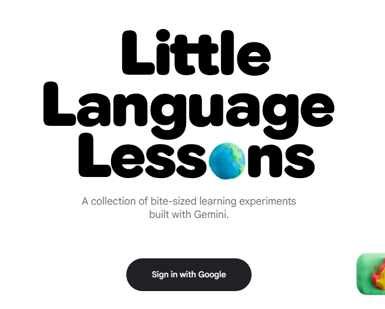

AIを使ってるので正しくないこともあるみたいです。チェックを入れてContinueをクリックしましょう。

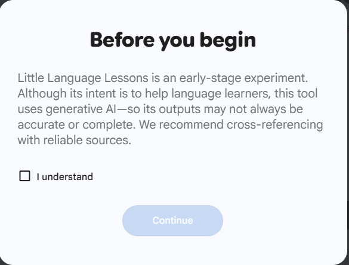

ログインが完了すると3つのトピックが出てきます。レッスンとスラングとカメラで単語を学ぶという項目ですね。

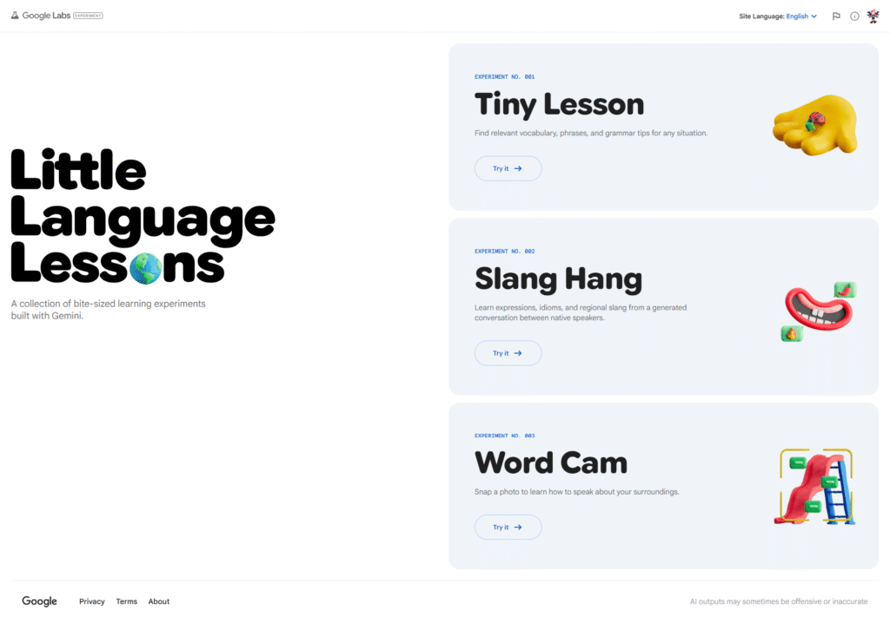

### Little\_Language\_Lessons Tiny\_Lesson

まずはTiny Lessonから始めてみます。言語の選択をして学びたい単語を入力します。英語はアメリカ、イギリス、オーストラリアの3種類があります。私はニュージーランドなのでイギリスですかね？

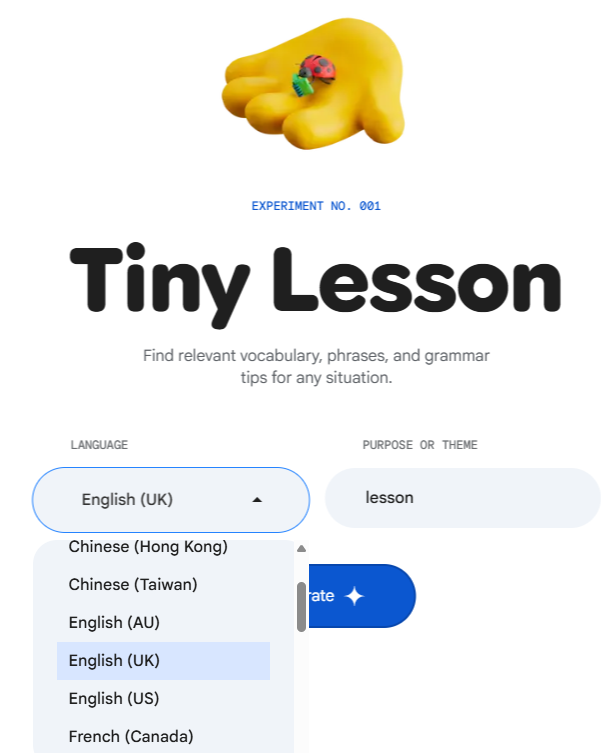

入力するとこんな感じ。関連するボキャブラリーとフレーズ、tipsを見ることができます。フレーズは調べた単語に関わるよく使われるフレーズですかね？tipsはどんな場面でよく使われるかが表示されています。

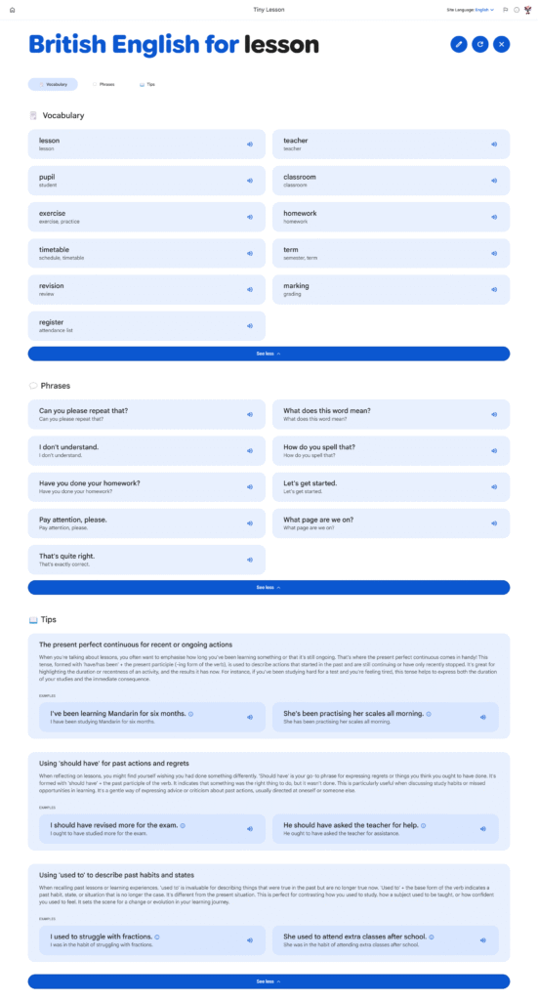

もちろん日本語のフレーズを入力することもできます。tipsの解説が英語なのが少し残念ですね。

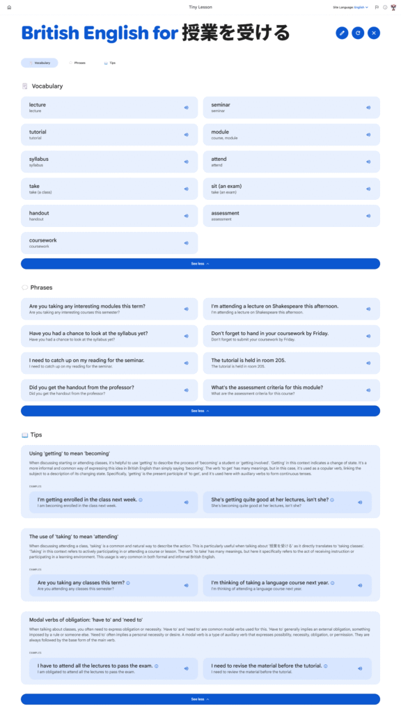

### Little\_Language\_Lessons Slang\_Hang

次はスラングですね。こちらも同じように言語を選択して作成していきます。

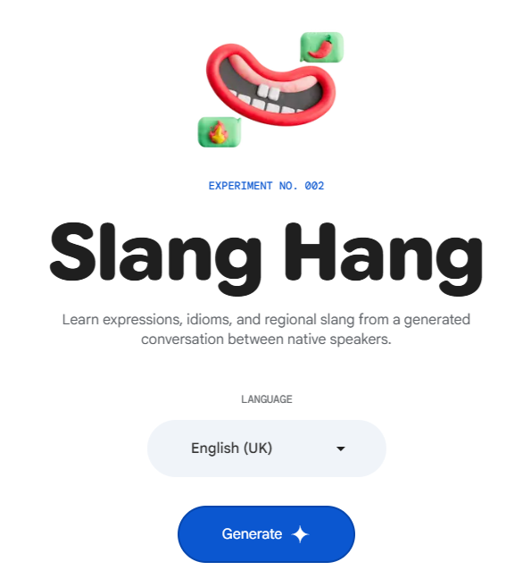

簡単な物語の背景が作成された後、会話が始まります。下線部にマウスを合わせるとスラングの意味を知ることができます。スペースを最後まで押すと会話が終わって次の会話に移ります。

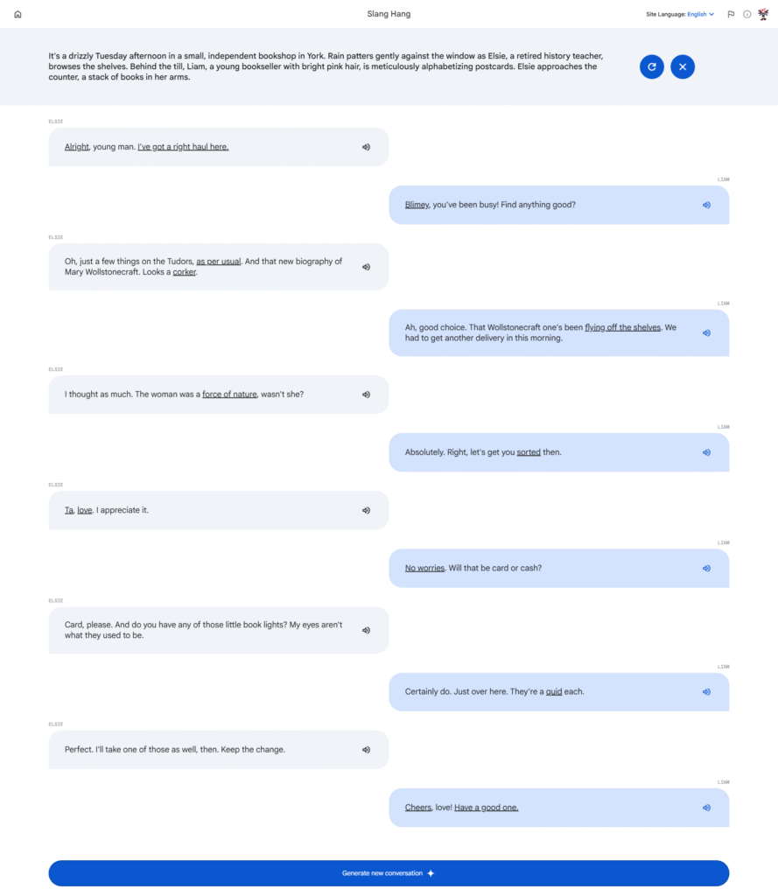

### Little\_Language\_Lessons Word\_Cam

最後はカメラで物の単語を知ることができます。こちらはスマホを使ったほうが良いと思います。

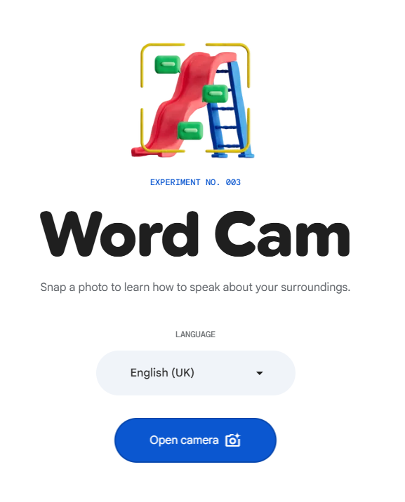

カメラで撮るとこんな感じで表示されます。基本的には複数ではなく1つか2つくらいを写真に収めたほうが良いと思います。また、角度などによっては正しく認識されないので気を付けたほうが良いと思います。

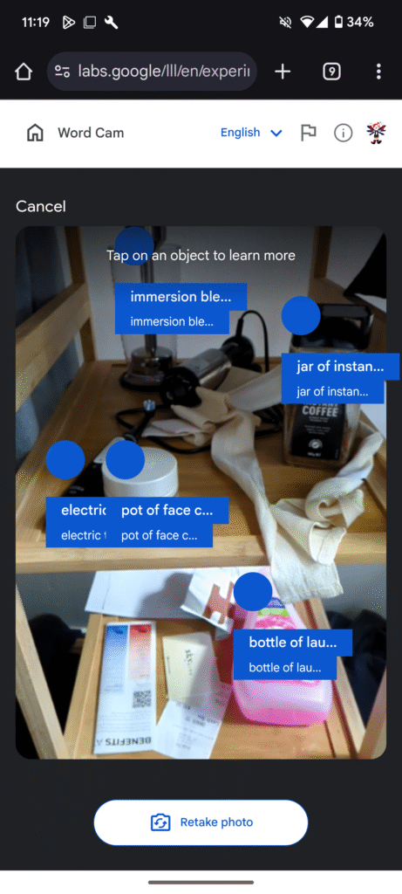

出てきた単語をタップすると関連する単語と例文が出てくるみたいです。

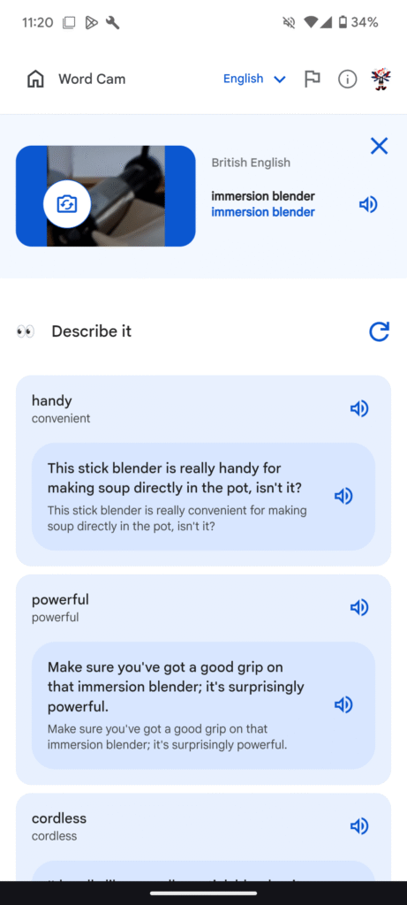

ざっくりとこんな感じですね。うまく使えれば色んな物の単語を知れますし、フレーズを覚えればある程度話すことができるとは思います。

ただ、個人的には人との会話のほうが楽しいのでこれを上手く使いながらであればより効率的になるかもなぐらいだと思います。ではでは。

## AI採点

英訳文の評価は **55点/100点** です。

全体的な印象：  
英文にはかなりの文法ミスや語彙の不自然さがあり、IELTSで8を目指す場合には、より正確で自然な英文に修正する必要があります。

## 詳細なフィードバック：

### 段落ごとに細かく指摘：

### Little\_Language\_Lessons 原文：

> GoogleがGeminiを活用した言語学習サイトを公開したみたいなので試してみました。こちらからログインして試すことができます。初めの画面はこんな感じ

### 訂正案：

- ❌ `I tried to access learning language website which Google published using Gemini.`  
    → ✅ `I tried out the language learning website that Google released using Gemini.`  
    誤りの種類：冠詞（aがない）、関係代名詞の選択（which→that）、動詞の不自然さ(access→try out/release)、語順。

- ❌ `You can try to access this.`  
    → ✅ `You can log in and try it out here.`  
    誤りの種類：accessよりlog inを使用すると自然。

- ❌ `First view is like this.`  
    → ✅ `The initial screen looks like this:`  
    誤りの種類：冠詞（theが必要）、viewよりscreenが適切、コロンを追加。

* * *

### Little\_Language\_Lessons 原文：

> AIを使ってるので正しくないこともあるみたいです。チェックを入れてContinueをクリックしましょう。

### 訂正案：

- ❌ `It's not occasionally correct because of AI.`  
    → ✅ `It might not always be accurate since it uses AI.`  
    誤りの種類：not occasionally は意味が曖昧。might not always be accurateの方が自然で丁寧。

- ❌ `You can click "check" and "Continue".`  
    → ✅ `Check the box and click "Continue."`  
    誤りの種類：動詞の使い方（check the boxが正しい表現）

* * *

### Little\_Language\_Lessons 原文：

> ログインが完了すると3つのトピックが出てきます。レッスンとスラングとカメラで単語を学ぶという項目ですね。

### 訂正案：

- ❌ `If you can login completely, it shows three topics.`  
    → ✅ `Once you have logged in, three topics appear.`  
    誤りの種類：If you can login completely は不自然。完了形が適切。

- ❌ `They are lesson, slang and learning with camera.`  
    → ✅ `These are Lessons, Slang, and Learning Words with the Camera.`  
    誤りの種類：名詞の単数複数（lesson→Lessons）、冠詞(the)、より自然な語彙選択。

* * *

### Little\_Language\_Lessons 原文：

> Little\_Language\_Lessons Tiny\_Lesson  
> まずはTiny Lessonから始めてみます。

### 訂正案：

- ❌ `Firstly, I tried "Tiny Lesson".`  
    → ✅ `First, I tried the "Tiny Lesson."`  
    誤りの種類：Firstly→Firstの方が自然。冠詞(the)、ピリオド位置。

* * *

### Little\_Language\_Lessons 原文：

> 言語の選択をして学びたい単語を入力します。英語はアメリカ、イギリス、オーストラリアの3種類があります。私はニュージーランドなのでイギリスですかね？

### 訂正案：

- ❌ `You choose language.`  
    → ✅ `You select a language and input words you want to learn.`  
    誤りの種類：冠詞(aが必要)、単語不足（inputが必要）。

- ❌ `English has three accents which are American, British and Australian.`  
    → ✅ `English has three varieties: American, British, and Australian.`  
    誤りの種類：accentsよりvarietiesが自然。コロンを使用した列挙。

- ❌ `I live in NZ so I choose English(U.K).`  
    → ✅ `I live in New Zealand, so I chose British English.`  
    誤りの種類：略語(NZ)は避け、自然な言い方に修正。時制（choose→chose）も修正。

* * *

### Little\_Language\_Lessons 原文：

> 入力するとこんな感じ。関連するボキャブラリーとフレーズ、tipsを見ることができます。

### 訂正案：

- ❌ `The view is like this after choosing language.`  
    → ✅ `After selecting the language, it looks like this:`  
    誤りの種類：不自然な表現(view→it looks)、語順。

- ❌ `It shows related vocabulary, phrases and tips.`  
    → ✅（これは比較的良いが、カンマの後にスペース必須）  
    `It shows related vocabulary, phrases, and tips.`

* * *

### 原文：

> tipsはどんな場面でよく使われるかが表示されています。

### 訂正案：

- ❌ `It shows tips which are used in circumstances`  
    → ✅ `The tips show the situations where the words are commonly used.`  
    誤りの種類：不自然な表現（used in circumstancesは曖昧）

* * *

### 原文：

> 日本語のフレーズを入力することもできます。tipsの解説が英語なのが少し残念ですね。

### 訂正案：

- ❌ `Actually, you can text Japanese phrases.`  
    → ✅ `You can also enter phrases in Japanese.`  
    誤りの種類：textは「携帯で送信」の意味で使われることが多い。enterが自然。

- ❌ `It's a bit pitty because explanation of tips are English.`  
    → ✅ `It's a bit unfortunate that the tips are explained in English.`  
    誤りの種類：綴りミス(pitty→pity)、文法（explanation単数→is）

* * *

### 原文：

> 下線部にマウスを合わせるとスラングの意味を知ることができます。

### 訂正案：

- ❌ `You can mouseover underline with a mouse and know meaning of slang.`  
    → ✅ `Hover your mouse over the underlined words to see the meanings of slang expressions.`  
    誤りの種類：mouseover→hover、冠詞や前置詞不足。

* * *

### 原文：

> 最後はカメラで物の単語を知ることができます。

### 訂正案：

- ❌ `Finally, you can know about vocabulary which is material for using camera.`  
    → ✅ `Lastly, you can learn vocabulary for objects by using your camera.`  
    誤りの種類：know about→learn、表現が不自然(materialは不要)

* * *

### 原文：

> うまく使えれば色んな物の単語を知れますし、フレーズを覚えればある程度話すことができるとは思います。

### 訂正案：

- ❌ `If also you remember some phrases, you can fairy speak.`  
    → ✅ `If you also memorize some phrases, you'll be able to speak reasonably well.`  
    誤りの種類：fairyは妖精の意味。fairlyまたはreasonablyが適切。

* * *

### 原文：

> 個人的には人との会話のほうが楽しいのでこれを上手く使いながらであればより効率的になるかもなぐらいだと思います。

### 訂正案：

- ❌ `However, I think it's more effective if we can use very well because it's fun for me to talk with someone.`  
    → ✅ `However, personally, I find conversation with people more enjoyable, so combining this tool with real conversations might be more effective.`  
    誤りの種類：意味不明確、表現が複雑。
