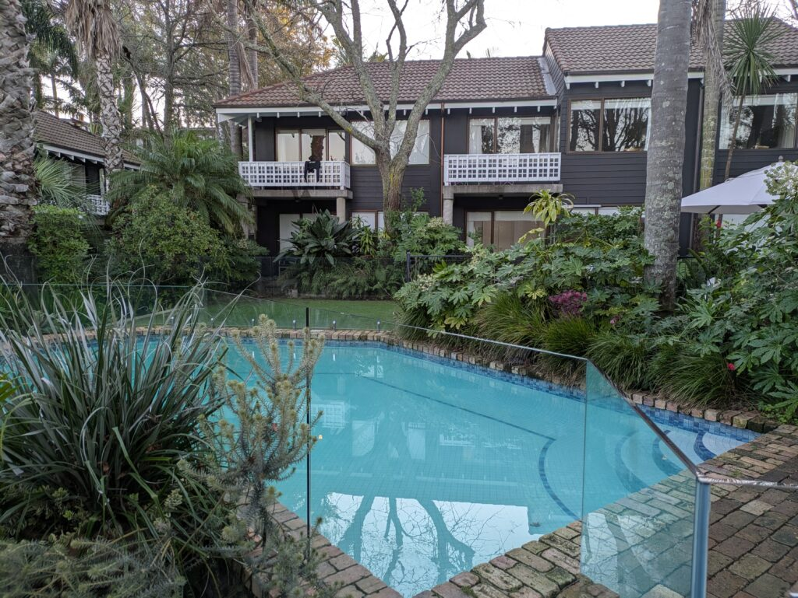
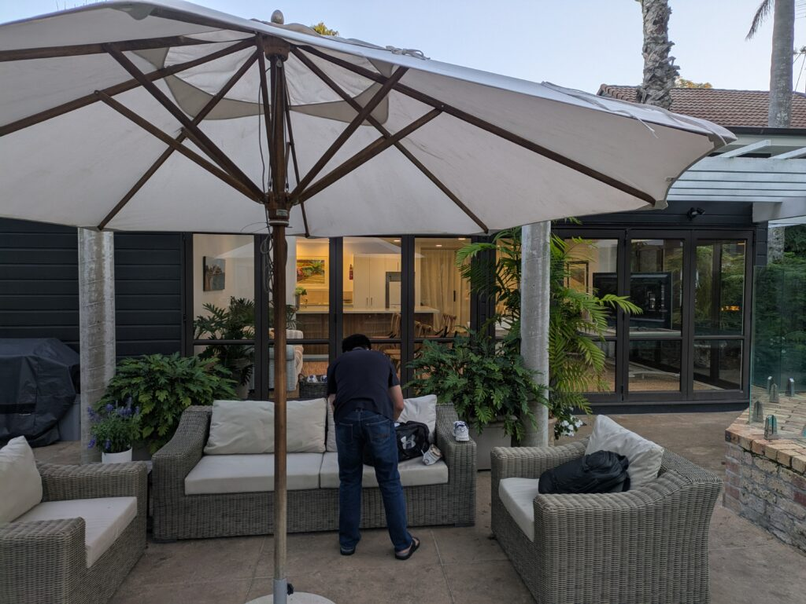
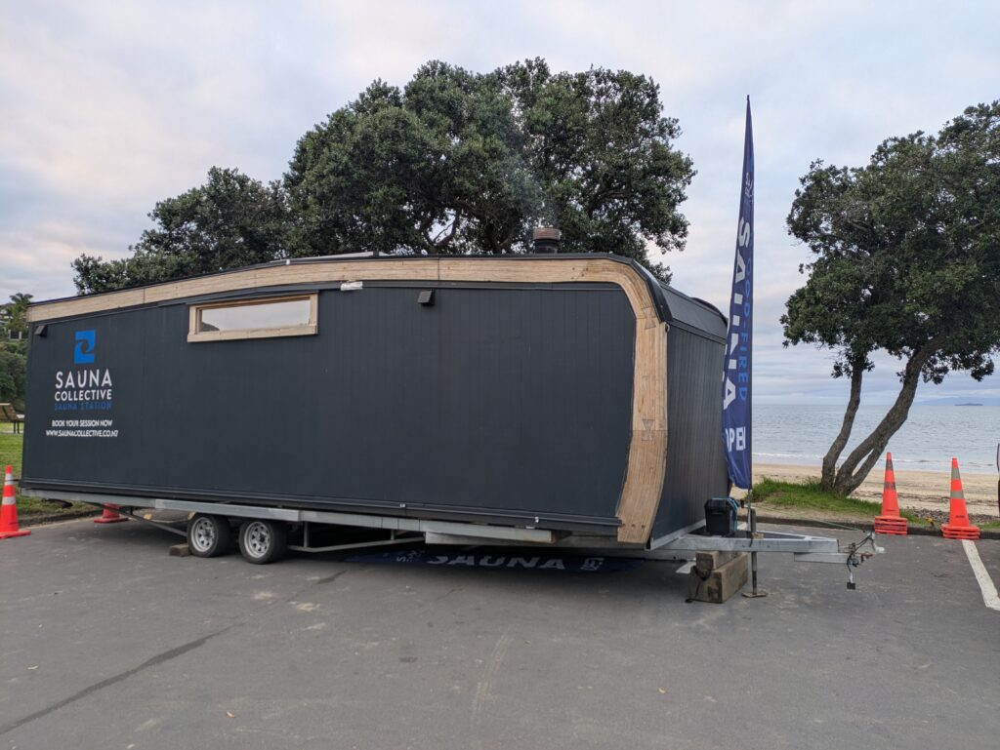

## English\_Practice

If there is a sauna, I'll go there but I didn't know about details so I went there with my friends. They know if so I was told it by them. We were five people who consist of one Laotian and four Japanese.

### Sauna\_Optional

This sauna is a traveling sauna so it differs due to date. I enjoyed the sauna in Takapuna last Monday.

There was a pool, shower and the sea but we had to walk for five minutes.

The poor was a bit dirty but it's excellent because there was relaxing spaces and shower. It's just a good space when there were five people.

### Sauna\_Contents

The owner put into firewood outside and flavored loyly. My friends know sauna so they covered heat wave.

I felt comfortable. Moreover, I enjoyed a bit professional sauna first time. I went and came back between sauna and water bath. However, I soaked in the sea first time and second time. It's ordinary cold because of autumn in NZ.

I went to a pool third time. It's a bit dirty but we can get in the pool quickly. Therefore, it has a shower so we could be clean our body quickly.

I didn't know the owner offered good water in NZ. I didn't know about "totonou" but I inspired because I didn't felt cold outside.

### The END

I enjoyed first sauna in NZ. I left my water bottle there. I went to Milford last Tuesday but the owner left it in Talapuna so I will have to take it next week.

This equipment is just sauna but it's great because of nearby the sea. I don't know because I'm not a professional of sauna. I enjoyed it so if I obtain a chance, I will go there again. See you later.

## 日本語版

私自身はサウナがあれば行きますが、詳しくは知らなかったので友達と一緒に行ってみました。彼らは詳しかったので少しだけ教えてもらいました。私を含めて5人で行き、一人はラオスで他は日本人ですね。

### Sauna\_オプション

このサウナは移動式サウナなので曜日によって異なります。今回は月曜に行ったのでタカプナという場所でサウナを楽しみました。

タカプナではプールあり、シャワーあり、海もあるけど5分ほど歩くといった感じですね。

プールは少し汚いですが、くつろぐ場所とシャワーもあったので設備的にはかなり良いと思います。サウナの中は5人いればちょうどよい広さになります。

### Sauna\_内容

外でオーナーが薪を入れたり、香り付きのロウリュをしてくれました。友達はサウナに詳しかったので熱波をしてくれました。

プロでないとはいえ心地よかったです。初めて少し本格的なサウナを感じました。合計3回サウナと水風呂を行き来しました。とは言え1回目と2回目のサウナは海に浸かりました。ニュージーランドは秋なので普通に寒いです。

3回目はプールに行きました。少し汚いですが、すぐに入れるのが利点ですね。シャワーもあるので体はすぐにきれいにできました。

私は知らなかったのですが、ニュージーランドで美味しい水を提供してたみたいです。整うというのはまだわかってないのですが、3回もすれば外が寒く感じないのは感動しました。

### 終わりに

という感じでニュージーランドでの初めてのサウナは終わりました。余談ですが水筒を忘れたので取りに行くことになりました。火曜はMilfordだったので行ってみましたが、タカプナに置いてるので来週取りに行くことになりました。

ここは設備はサウナだけですが、海に近いので非常に良いと思われます。サウナのプロじゃないのでわかりませんが…というわけで楽しめたので機会があればまた行ってみたいと思います。ではでは。

## AI採点

評価：**62点 / 100点**

### 全体評価

英語表現に多くのミスがあり、文法、語彙、表現の面で改善が必要です。特に不自然な直訳表現や、冠詞、前置詞、動詞の時制の使い方に問題があります。

* * *

### 詳細なフィードバック

以下、修正点を具体的に指摘します。

### 段落1

原文：

> If there is a sauna, I'll go there but I didn't know about details so I went there with my friends. They know if so I was told it by them. We were five people who consist of one Laotian and four Japanese.

修正点：

- 「If there is a sauna, I'll go there」は不自然。原文のニュアンスを考慮し、自然な表現に変えるべき。

- 「I didn't know about details」は「the details」の冠詞が必要。

- 「They know if」は意味不明。おそらく「They knew about saunas」とするべき。

- 「I was told it by them」は不自然。「They taught me a little about it」の方が自然。

- 「We were five people who consist of...」は文法的に不自然。「There were five of us: one Laotian and four Japanese.」の方が適切。

自然な表現例：

> I'm the kind of person who enjoys saunas if they're available, but I didn't know much about them, so I went with some friends. They knew more about saunas, so they taught me a little bit. There were five of us: one Laotian and four Japanese including myself.

* * *

### 段落2 (Sauna\_Optional)

原文：

> This sauna is a traveling sauna so it differs due to date. I enjoyed the sauna in Takapuna last Monday.

修正点：

- 「differs due to date」は不自然。曜日ごとに場所が変わるニュアンスを伝えるには「location changes depending on the day」が自然。

自然な表現例：

> This sauna is a mobile sauna, so its location changes depending on the day. This time, we went to Takapuna because it was Monday.

* * *

原文：

> There was a pool, shower and the sea but we had to walk for five minutes.

修正点：

- 「There was a」は複数の施設があるので「There were」に修正。

- 「we had to walk for five minutes」は「the sea was about five minutes away on foot」が明確で自然。

自然な表現例：

> There were a pool and showers, and the sea was about five minutes away on foot.

* * *

原文：

> The poor was a bit dirty but it's excellent because there was relaxing spaces and shower. It's just a good space when there were five people.

修正点：

- スペルミス：「poor」→「pool」

- 「it's excellent」は現在形で不自然。過去形を使い、「it was still good because...」

- 「relaxing spaces」は冠詞不足。複数形でも可能だが「some relaxing spaces」の方が自然。

- 「It's just a good space when there were five people」は不自然。「The sauna itself was just the right size for five people.」が適切。

自然な表現例：

> The pool was a bit dirty, but it was still good because there were showers and some relaxing spaces. The sauna itself was just the right size for five people.

* * *

### 段落3 (Sauna\_Contents)

原文：

> The owner put into firewood outside and flavored loyly. My friends know sauna so they covered heat wave.

修正点：

- 「put into firewood」は不自然。「put firewood into the stove」

- 「flavored loyly」は説明不足。「aromatic löyly」を使い「poured aromatic löyly onto the hot stones」が自然。

- 「covered heat wave」は意味不明。おそらく「performed Aufguss (heat wave technique)」が適切。

自然な表現例：

> The owner put firewood into the stove outside and poured aromatic löyly onto the hot stones. My friends were knowledgeable about saunas, so they performed Aufguss for us.

* * *

原文：

> I felt comfortable. Moreover, I enjoyed a bit professional sauna first time. I went and came back between sauna and water bath. However, I soaked in the sea first time and second time. It's ordinary cold because of autumn in NZ.

修正点：

- 「I felt comfortable」は問題なし。

- 「enjoyed a bit professional sauna first time」は文法的に不自然。「It was my first experience of a somewhat professional sauna」の方が自然。

- 「I went and came back between sauna and water bath」は「I alternated between the sauna and cold water baths」の方が自然。

- 「However」は不要。「For the first two rounds, I soaked in the sea」の方が自然。

- 「It's ordinary cold」は文法ミス。「It was quite cold」は自然。

自然な表現例：

> I felt comfortable. It was my first experience with a somewhat professional sauna. We alternated between the sauna and cold water baths three times. For the first two rounds, we soaked in the sea, which was quite cold as it's autumn in New Zealand.

* * *

原文：

> I went to a pool third time. It's a bit dirty but we can get in the pool quickly. Therefore, it has a shower so we could be clean our body quickly.

修正点：

- 時制を過去形に統一。「I went to the pool the third time」

- 「Therefore」は文脈的に不自然。「However」の方が適切。

- 「clean our body quickly」は文法ミス。「quickly clean ourselves up」が自然。

自然な表現例：

> The third time, we went to the pool. It was slightly dirty, but the advantage was we could get in quickly. However, showers were available, allowing us to quickly clean ourselves up.

* * *

原文：

> I didn't know the owner offered good water in NZ. I didn't know about "totonou" but I inspired because I didn't felt cold outside.

修正点：

- 「offered good water」の意図が不明。「offered high-quality drinking water」が自然。

- 「totonou」はそのまま引用符でよいが、「inspired」は不自然。「impressed」または「amazed」に変更。

- 「didn't felt」は文法ミス。「didn't feel」が正しい。

自然な表現例：

> I wasn't aware that the owner provided high-quality drinking water. I didn't really understand the concept of "totonou," but I was amazed that after three rounds, I didn't feel cold outside anymore.

* * *

### 最終段落

原文：

> I enjoyed first sauna in NZ. I left my water bottle there. I went to Milford last Tuesday but the owner left it in Talapuna so I will have to take it next week.

修正点：

- 「enjoyed first sauna」は冠詞が必要：「enjoyed my first sauna」

- 「left it in Talapuna」はスペルミス。「Takapuna」が正しい。

- 「take it next week」は「pick it up next week」の方が自然。

自然な表現例：

> I enjoyed my first sauna experience in New Zealand. Unfortunately, I left my water bottle behind. I went to Milford on Tuesday, but the owner had left it in Takapuna, so I'll pick it up next week.
