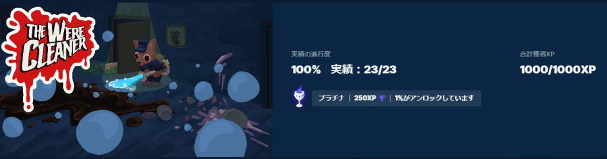
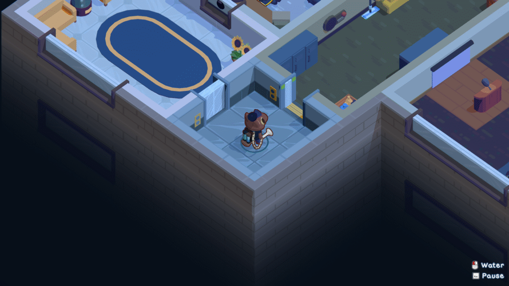
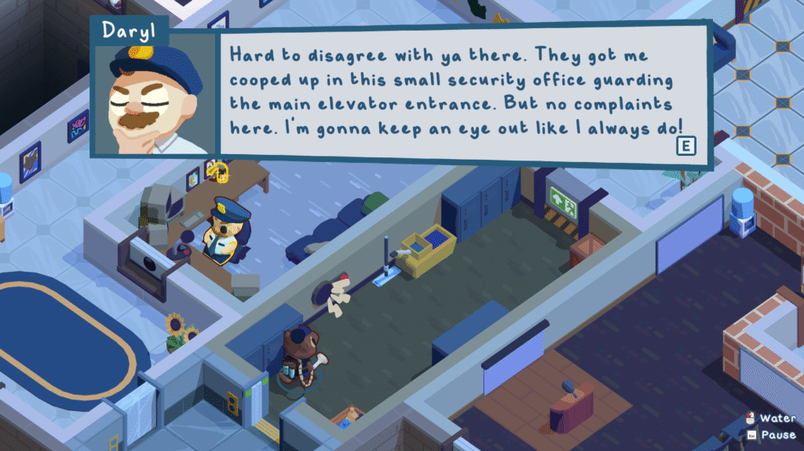
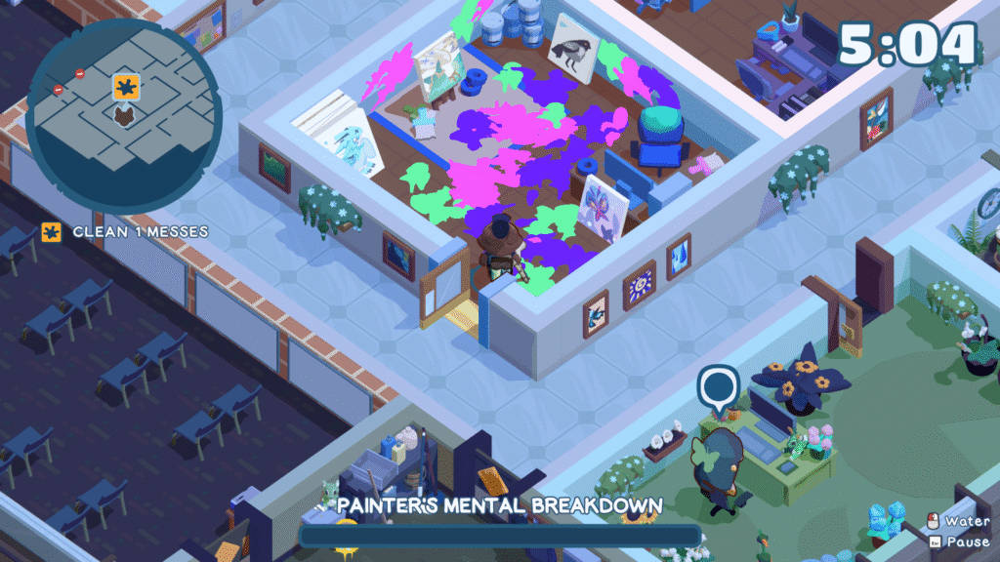
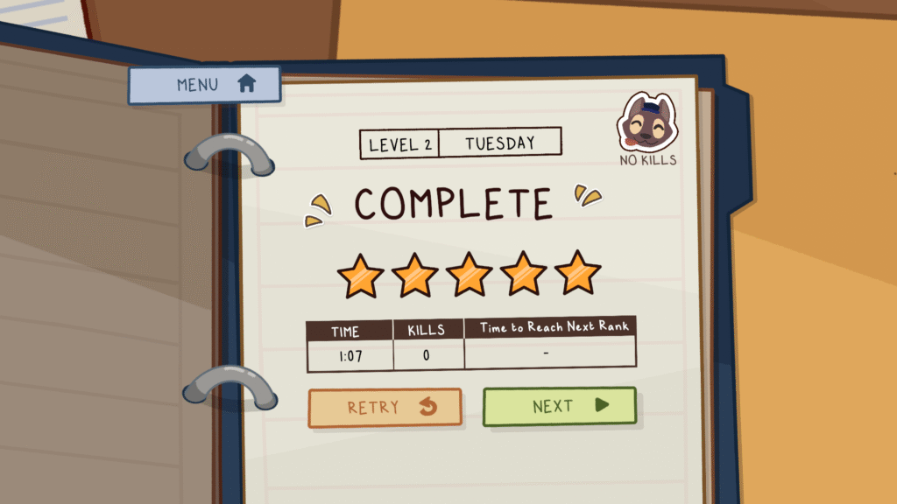
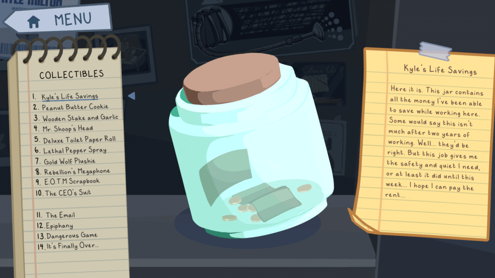

## English\_Practice

The Epic Games distributes free games each weeks, so I played The WereCleaner. It is free on the Steam.

### WereCleaner\_Overall

This game has a short story and a few stages so I finished playing it quickly. Moreover, we can complete achievements for 2 hours.

However, The game's language is only English so you must be careful. If you just play games, you don't need to translate it. On the other hand, if you want to see description of story and collection, you need to translate it.

Overall, a werewolf works as a cleaning staff and he cleans in the company at night as he won't be found.

However, a security guard is getting to suspect day by day and finally... like that. It is the best not to be found but it is not fail even though being found.

### WereCleaner\_Details

The view is lie this. First, the werewolf washes on the floor and wall but vacuum cleaner and rubbish box function are added. The conversation is like this. The colleague explains how to clean and the game starts after going out the room.

The room is dirty like this so you clean up not seen colleagues. If they find you, you kill them. Let's play to watch.

You can take score which is changed by a number of kill and time. Exactly, the number of kill and score are related of achievements so you should move up as soon as possible. You need to take good timing and good ways.

### WereCleaner\_Archievements

Finally, these are collection items. There are collections a couple of rooms. You can collect them other levels even though you miss them because they are common all levels. If you complete achievements, you have to wander rooms so you can collect them.

I have not played the video game for a long time but it was fun. In addition, I understand fairly English so I would like to play video games only used English. See you later.

## 日本語版

Epic Gamesが週替わりで無料ゲームを配布しているので、その一つの[The WereCleaner](https://store.steampowered.com/app/2795000/The_WereCleaner/)というゲームを遊びました。Steamでも無料みたいです。

### WereCleaner\_概要

このゲームはストーリーも短く、ステージも少なめでサクッと終わるゲームになります。また、実績をコンプするにしても2時間ほどで出来ると思います。

ただ、英語でしかできないのでそこだけ注意が必要ですね。ゲームをプレイするだけなら特に翻訳しなくてもよいですが、ストーリーやコレクションの説明を見たければ翻訳が必要ですね。

ざっくり概要を言えば狼男が掃除係になり、夜の掃除になったため見つからないように社内を掃除するという感じですね。

ただ、日が経つにつれて警備員の人が怪しみ始め最終日に…という感じです。見つからないのがベストですが、見つかっても失敗になることはないです。

### WereCleaner\_詳細

画面はこんな感じ。最初は水掃除だけですが、掃除機の機能やゴミ箱機能も付いてきます。会話はこんな感じです。同僚の説明が軽くあって部屋を出るとスタートになります。

部屋がこんな感じで汚れてますので同僚に見つからないように掃除をしていきます。見つかった場合KILLが発生します。どんな感じかはぜひ遊んでみてください。

KILL数とタイムによってスコアが変わります。当然KILL数やスコアは実績に関わってきますので、可能な限り上を目指していくと良いと思います。RTAほど厳しくはないですがルート取りやタイミング取りも必要ですね。

### WereCleaner\_実績

最後にコレクションアイテムですね。どこかの部屋にコレクションがあります。全てのレベルで共通なのでとり逃しても他のレベルで集めることができます。実績コンプする際にあちこち回ることがあるので、ついでに集めれば問題ないと思います。

久しぶりにゲームをしましたが、やっぱり楽しかったです。せっかく英語がある程度できるようになったので、英語だけでしか出してないようなゲームにも手を出していきたいと思います。ではでは。

## AI採点

## 総合評価：**58点 / 100点**

* * *

## 採点基準別内訳：

| 項目 | 点数 | コメント |
| --- | --- | --- |
| 文法 (Grammar) | 15 / 30 | 複数形・冠詞・時制・構文ミスが多く、文意がやや曖昧になっています。 |
| 語彙 (Vocabulary) | 13 / 20 | 不自然な表現・誤用（e.g. "lie this", "rubbish box", "move up"）が多く見られます。 |
| 表現の自然さ (Fluency / Naturalness) | 12 / 20 | 英語話者には意味が伝わるが、不自然な構文や不慣れな表現が頻出。 |
| 構成力 (Cohesion / Organization) | 10 / 15 | 文章の展開は原文に忠実だが、文同士の接続が弱い箇所あり。 |
| 原文理解・忠実度 | 8 / 15 | 原文の細かいニュアンスが伝わっていない箇所がある（例：RTA, 実績の説明など） |

* * *

## 詳細なフィードバック（文法・語彙のミスなどすべて）：

### 冒頭

- ❌ _"The Epic Games distributes free games each weeks"_
    - ✅ _Epic Games distributes free games every week._
    
    - ❗️「each weeks」は誤り（each + 単数形）

- ❌ _It is free on the Steam._
    - ✅ _It’s also free on Steam._
    
    - ❗️Steamに “the” は不要。プラットフォーム名は基本的に冠詞なし。

* * *

### WereCleaner\_Overall

- ❌ _we can complete achievements for 2 hours._
    - ✅ _you can complete all the achievements in about two hours._
    
    - ❗️ "for 2 hours" は「2時間やり続ける」意味になってしまう。

- ❌ _The game's language is only English so you must be careful._
    - ✅ _The game is only available in English, so be aware of that._
    
    - ❗️"must be careful" は少し強すぎる・不自然。

- ❌ _if you want to see description of story and collection_
    - ✅ _if you want to read the story or view item descriptions_

* * *

### WereCleaner\_Details

- ❌ _The view is lie this._
    - ✅ _The game looks like this._
    
    - ❗️ “lie this” → 意味不明（typo？）

- ❌ _the werewolf washes on the floor and wall_
    - ✅ _The werewolf starts by cleaning the floors and walls with water._
    
    - ❗️"washes on" は誤用

- ❌ _vacuum cleaner and rubbish box function are added._
    - ✅ _Later, you unlock a vacuum cleaner and a trash bin function._
    
    - ❗️“rubbish box” は不自然（イギリス英語の “bin” またはアメリカ英語の “trash can”）

- ❌ _clean up not seen colleagues_
    - ✅ _clean without being spotted by your colleagues_

- ❌ _you kill them. Let's play to watch._
    - ✅ _you'll have to eliminate them. Try playing to see how it works._
    
    - ❗️"Let's play to watch" は意味が不明。

* * *

### WereCleaner\_Achievements

- ❌ _You can collect them other levels even though you miss them_
    - ✅ _You can still collect them in other levels even if you miss them the first time._

- ❌ _you have to wander rooms so you can collect them._
    - ✅ _you’ll end up exploring different rooms, so it’s easy to collect them along the way._

* * *

### 結語

- ❌ _I understand fairly English_
    - ✅ _I can understand English fairly well_

- ❌ _video games only used English_
    - ✅ _English-only games / games that are only available in English_

* * *

## 改善された例（冒頭部分）：

> **Epic Games gives away free games every week, so I tried playing one of them called _The WereCleaner_. It seems to be free on Steam as well.**

* * *

## 総合コメント：

あなたの翻訳は全体的に原文の構成に忠実で、意味も大きく外していませんが、「英語らしい自然な言い回し」や「細かい文法・語彙のミス」が目立ちます。IELTSスピーキングやライティングでこのレベルだと **6.0～6.5** に相当する可能性があります。
