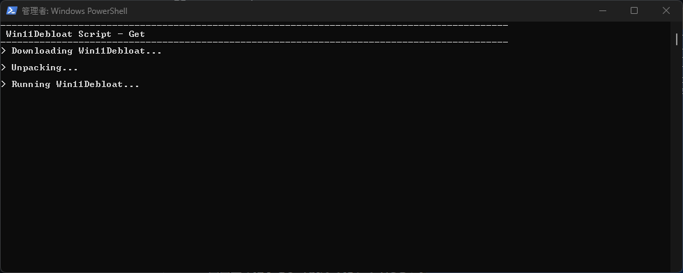
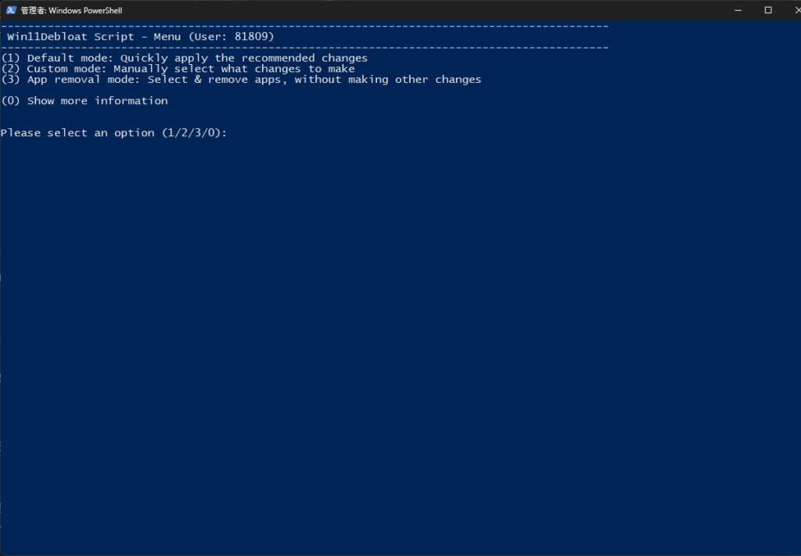
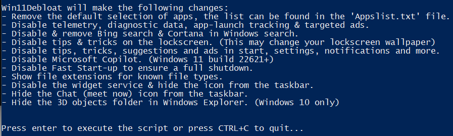
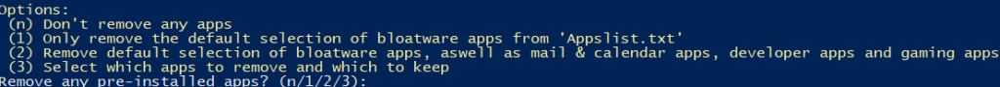
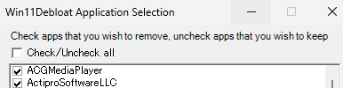
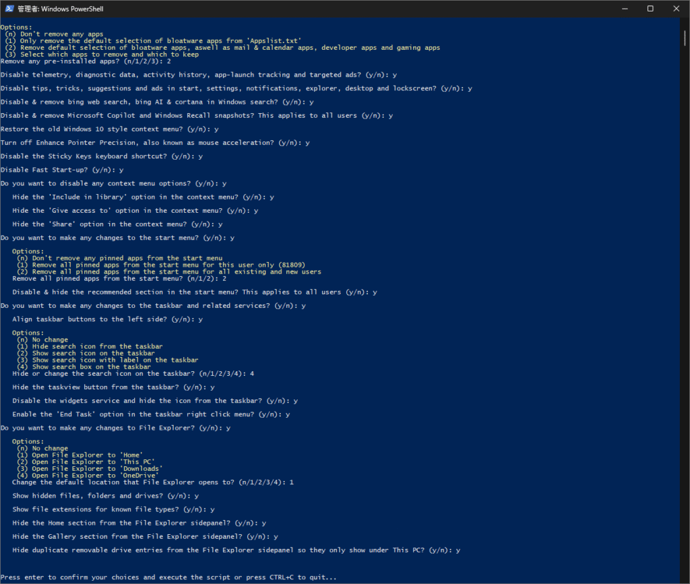
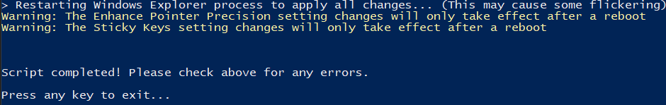

## Win11Debloat

たまたま見つけた記事でFreeTimeTechという企業のwindows11debloaterが紹介されていました。ただ、アプリを導入するのは少し躊躇したので調べた結果、Win11Debloatというツールに至りました。

[こちら](https://github.com/Raphire/Win11Debloat)からツールの詳細を知ることができます。Githubからの導入なので多少ハードルが上がりますが、心理的なハードルは下がる気がします。

注意事項としては重要なアプリを消さないこと、効果が限定的であるかもしれないということですね。もともとあるアプリがそこまでCUPやメモリを使用してないと考えられるので、効果が限定的だと考えられます。私はこれに気づく前にやってしまいましたが…

### Win11Debloat\_導入方法

導入方法は簡単でpowershellまたはコマンドプロンプトを管理者権限で開き、以下のコマンドを実行します。その後、画面の指示に従って実行していきます。

```
& ([scriptblock]::Create((irm "https://debloat.raphi.re/")))
```

他の方法もありますが、そちらが良ければ確認してみてください。コマンドを実行すると以下のような画面になり、別のターミナルが開きます。





### Win11Debloat\_内容

ここから数字を選択します。一旦0を選んで情報を確認したほうが良いとは思いますが、面倒であれば1を選択すれば十分だと思います。



1を選択するとこんな感じで何を削除したり変えたりするのかが表示されます。問題なければ決定します。一応削除前のCPUとメモリを見てみました。こんな感じ。


2を選択するとこんな感じです。ここから更に選択して削除していきます。3を出すとリストを表示してどれを消すか選択できます。ぶっちゃけ詳しくなければやらないほうが良い気がします。重要なシステムを消す可能性がありますので。





2を選択するとこんな感じでどのようなアプリを消して変更するか選択していきます。こちらは最悪翻訳しながらできるので、面倒でなければこちらでもよいかと思います。





### 終わりに

終わったらボタンを押して終了ですね。終わった後がこんな感じ。正直そこまで変わった感じはしないですね。メモリは私がタブを開きすぎなので良いとして、それがあったとしても大きく変わった感じはない気がします。


とは言え少しでも軽くしたければ使うのもありだと思います。Windowsには余計なものも入ってることが多いので。気になるのであれば試してください。ではでは。
