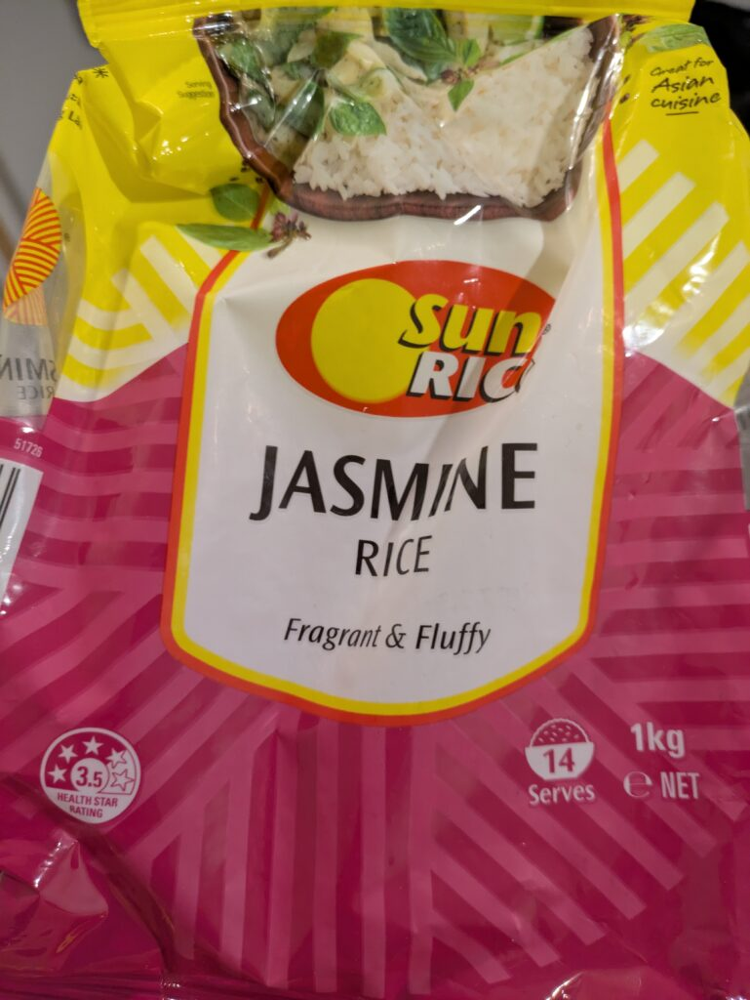
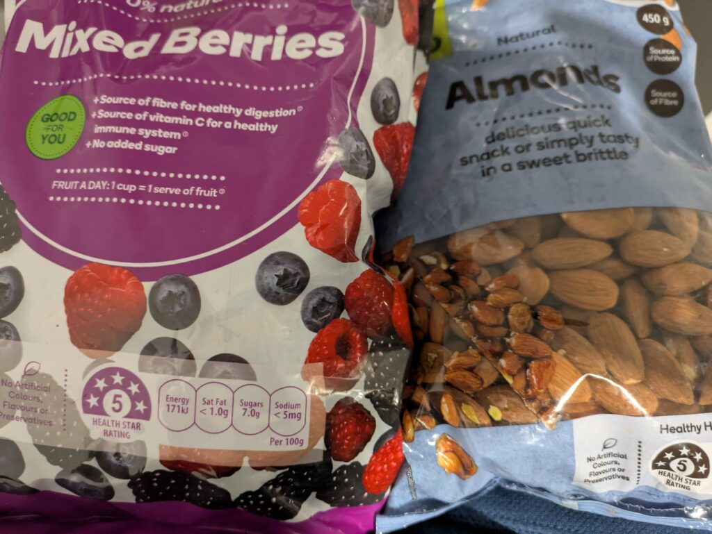
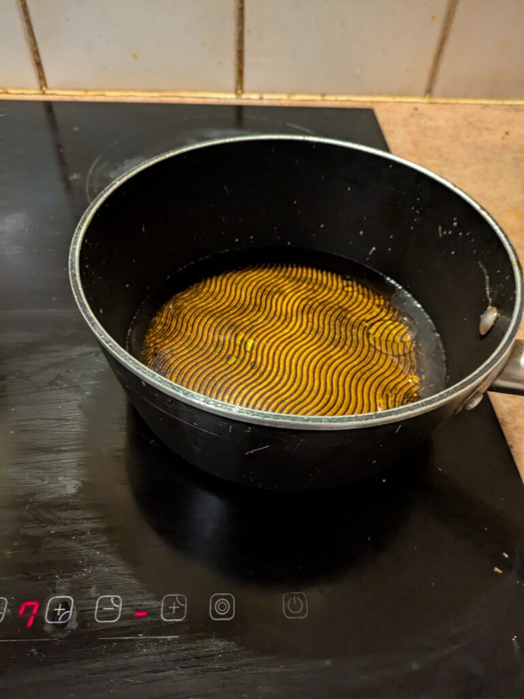
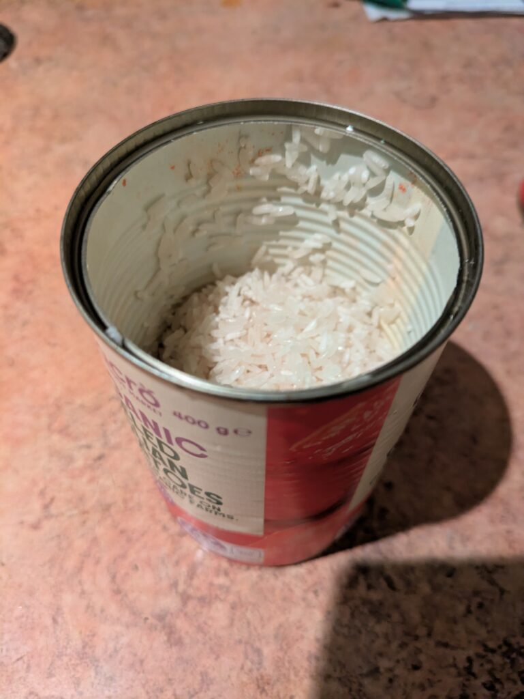
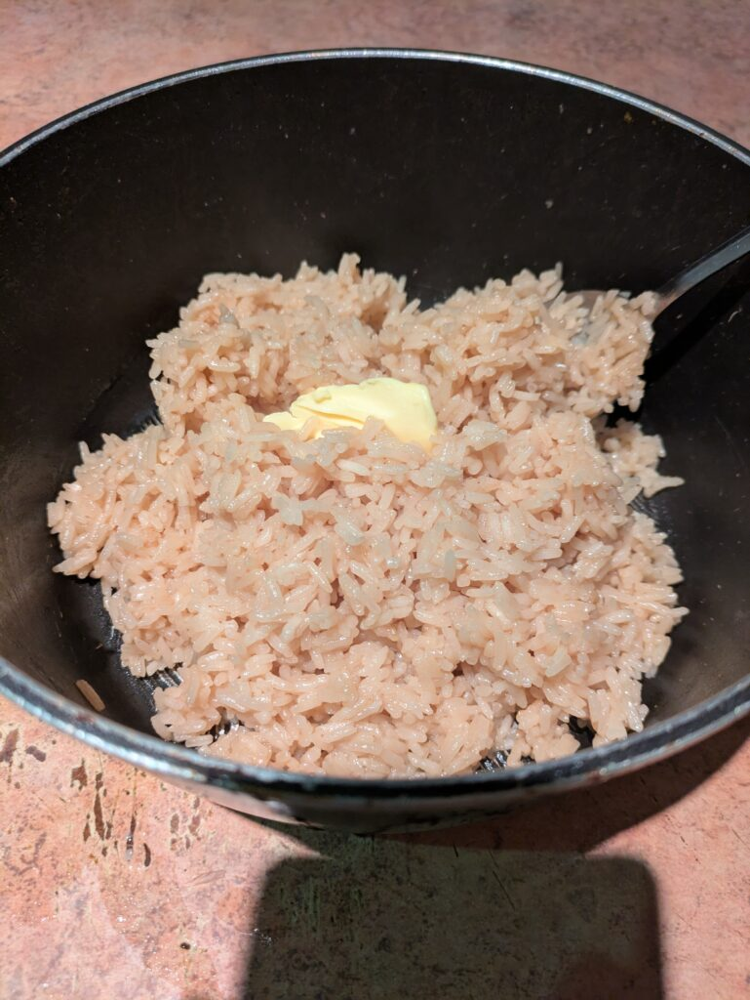
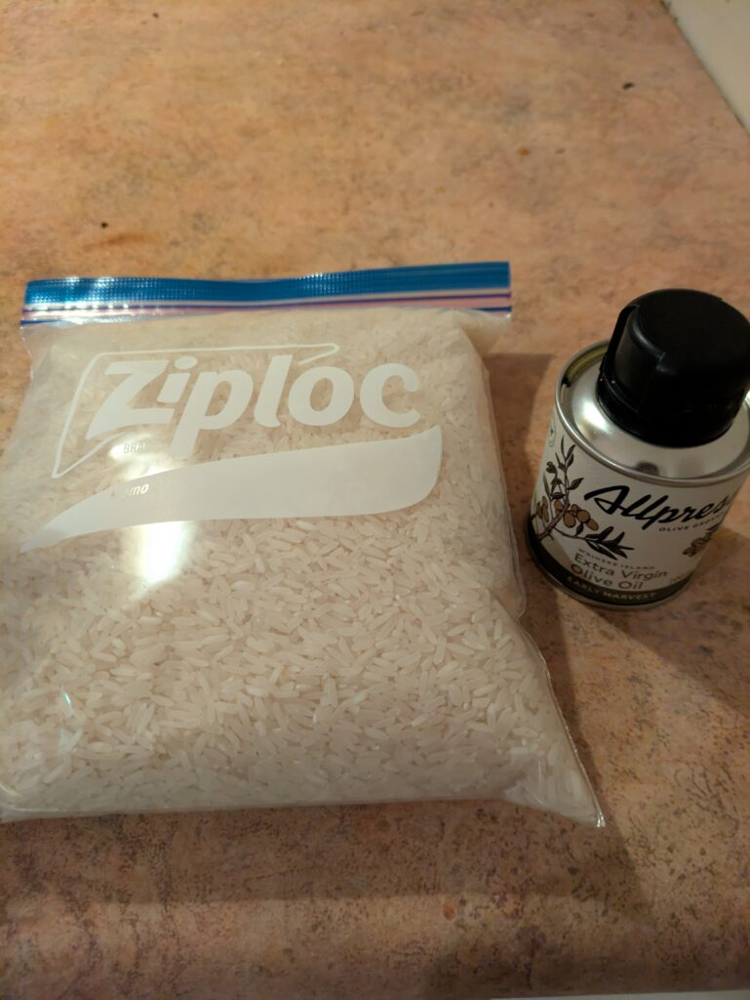

## English\_Practice

When I lived in Japan, I often cooked rice useing a rice-cooker. For instance, white rice, brown rice and mixed rice.

### Introducing rice

I thought I hadn't cooked rice in NZ. However, there are a lot of rice in the supermarket. As you know, Japonica rice are sold only unique supermarkets, but there are much indica rice.

The represent of indica rice is basmati rice, but I used jasmine rice this time. They are used in Thai and Vietnam. I can cook fourteen bowls of rice per 1kg and it costs $3.5(approximatly 300 yen).

As a side note, it is a sign which is healthy or not on the left below. The number is higher and higher so it is healthier. I'm not sure it is true. I show other examples which frozen berries and almonds has five stars and potato chips has 1.5 stars.

### How to cook rice

It's not main topic, it's easy to cook rice.

1. Prepare rice and water as boiling in the rice-cooker

3. Wash rice before boiling

5. Boil on the midium heat and put rice in the pot and change the low heat and put the lid

7. After 10 to 20 minutes, stop heat and steam it

I added a spoon of olive oil and soy sauce in the water this time. Japonica rice done that is good taste so I tried that other rice because I was interested in it.

I didn't have a cup so I used a tomato can which I cooked other meal. I cooked rice 180g so it is two bowl of rice. If I cook like that, it is convenience to reduce dish.

The rice a little steamed is like that after boiling and putting. After that, it mixed butter. I wanted to put garlic and the stock is better than water. However, it was delicious.

I used ziploc which I brought in Japan to save rice. It is useful because I often used it. I recommend it if you live in New Zealand for a long time. Moreover, I used good olive oil which I bought in Waiheke Island.

I will try other rice especially brown rice. it is like "genmai" and healthy. See you later.

## 日本語版

日本にいたころは炊飯器があったのでよくご飯を作っていました。簡単な白米や玄米、たまに炊き込みご飯という感じですね。

### 米の紹介

こちらにいてご飯を食べることはないと思ってましたが、意外とお米は売ってたりします。もちろん日本米は特定の店舗以外流通してないのですが、インディカ米はよく見かけます。

インディカ米で代表的なのはバスマティライスですが、今回使用したのはジャスミン米になります。よくタイやベトナムで使用されているみたいです。1kgで14杯ぐらい作れて料金が$3.5(約300円)くらいになります。

余談ですが左下にある星は健康の良さに対する指標になっていて、高ければ高いほど健康に良いとされています。本当かどうかはわかりませんが。他の例を出すと冷凍ベリーやアーモンドだと星5でポテチだと星1.5とかになります。

### 米の作り方

話がそれましたが、米の作り方自体は簡単で

1. 炊飯器で炊くのと同じように米とそれに対する水を用意します。

3. 水が沸騰する前に米を軽く研ぐ

5. 中火で沸騰したら米を入れて弱火にして蓋をする

7. 10~20分経過したら火を止めて蒸らして完成

今回は水にオリーブオイルと醤油を少し入れました。日本米でやった時は美味しかったので他の米だとどうなるか気になったので同じように試してみます。

カップがなかったので別の料理で使ったトマト缶をカップにしました。今回は180gほどなので2杯分くらいです。これくらい雑でも作れるようになるなら使えるものも減ってお得な気がしてます（笑）

沸騰して米を入れて少しして蒸らしたらこんな感じ。そこにバターを入れて混ぜたら完成です。本当はニンニクを入れて、水の代わりにストックをいれたらもっと良いんですが…それでも割と美味しかったので良かったです。

米の保管は日本から持ってきたジップロックを使います。ジップロックを箱ごと持ってきましたがちょくちょく使うので便利です。長期滞在するなら多少あるとおすすめです。それからオリーブはワイヘケで買った良いやつを使ってみました。

ニュージーランドでは他にも米があるのでいくつか試してみようと思います。特にブラウン米ですね。玄米のようなもので健康に良さそうなので。ではでは。

## AI採点

**合計：60点（100点満点）**

## フィードバック詳細

### 文法ミス・改善点（Grammar mistakes and improvements）

**元の文：**  
"When I lived in Japan, I often cooked rice useing a rice-cooker."

**修正後：**  
"When I lived in Japan, I often cooked rice **using** a rice cooker."

- "useing" → **using** (スペルミス)

- "rice-cooker" → **rice cooker** (ハイフン不要)

* * *

**元の文：**  
"For instance, white rice, brown rice and mixed rice."

**修正後：**  
"For instance, **I cooked** white rice, brown rice, and mixed rice."

- 主語と動詞を補って完全な文に修正。

* * *

**元の文：**  
"I thought I hadn't cooked rice in NZ."

**修正後：**  
"I thought **I wouldn’t cook rice** in NZ."

- 意味的に「作らないだろう」と未来形が適切。

* * *

**元の文：**  
"As you know, Japonica rice are sold only unique supermarkets, but there are much indica rice."

**修正後：**  
"As you know, Japonica rice **is** sold only **at specific** supermarkets, but there **is plenty of** indica rice."

- "rice" は不可算名詞なので単数扱い (are → is)

- "unique supermarkets" → "specific supermarkets"

- "much indica rice" は不自然。→ "plenty of indica rice" が適切。

* * *

**元の文：**  
"The represent of indica rice is basmati rice, but I used jasmine rice this time."

**修正後：**  
"A typical example of indica rice is basmati rice, but this time I used jasmine rice."

- "The represent" は不適切。"A typical example" または "The most common type" が良い。

* * *

**元の文：**  
"They are used in Thai and Vietnam."

**修正後：**  
"It is commonly used in Thailand and Vietnam."

- 主語が jasmine rice（単数）なので "It" が適切。

- 国名は "Thailand"（タイ王国）、"Vietnam" が正しい。

* * *

**元の文：**  
"I can cook fourteen bowls of rice per 1kg and it costs $3.5(approximatly 300 yen)."

**修正後：**  
"I can cook about fourteen bowls of rice from 1 kg, and it costs about $3.5 (approximately 300 yen)."

- "per 1kg" → "from 1 kg"が自然。

- "approximatly" → "approximately" (スペルミス)

* * *

**元の文：**  
"As a side note, it is a sign which is healthy or not on the left below."

**修正後：**  
"As a side note, the star rating at the bottom left indicates how healthy the product is."

- "sign" → "star rating"が具体的で分かりやすい。

- 語順を修正して明確に。

* * *

**元の文：**  
"The number is higher and higher so it is healthier."

**修正後：**  
"The higher the number, the healthier the product."

- 「～であればあるほど～」は"The 比較級, the 比較級"が正解。

* * *

**元の文：**  
"I show other examples which frozen berries and almonds has five stars and potato chips has 1.5 stars."

**修正後：**  
"For example, frozen berries and almonds have five stars, while potato chips have 1.5 stars."

- 動詞を "have" に修正（複数形なので）。

- "For example" で自然なつなぎに。

* * *

**元の文：**  
"It's not main topic, it's easy to cook rice."

**修正後：**  
"Getting back to the main topic, cooking rice is easy."

- "not main topic" は意味が曖昧。"Getting back to the main topic" で自然に戻る表現。

* * *

**元の文（手順）：**  
"Prepare rice and water as boiling in the rice-cooker  
Wash rice before boiling  
Boil on the midium heat and put rice in the pot and change the low heat and put the lid  
After 10 to 20 minutes, stop heat and steam it"

**修正後：**

1. "Prepare rice and water in the same ratio as when using a rice cooker."

3. "Rinse the rice lightly before the water boils."

5. "Bring water to a boil on medium heat, add rice, reduce to low heat, and cover with a lid."

7. "After 10–20 minutes, turn off the heat and let it steam."

- 手順をより明確かつ具体的に修正。

* * *

**元の文：**  
"Japonica rice done that is good taste so I tried that other rice because I was interested in it."

**修正後：**  
"It tasted good when I tried it with Japonica rice, so I was curious to see how it would turn out with other types of rice."

- 英語表現として不自然な語順を改善。

* * *

**元の文：**  
"I didn't have a cup so I used a tomato can which I cooked other meal."

**修正後：**  
"I didn't have a measuring cup, so I used a tomato can from another meal."

- "cooked other meal" → "from another meal" が自然。

* * *

**元の文：**  
"If I cook like that, it is convenience to reduce dish."

**修正後：**  
"Cooking like this is convenient because it reduces the number of dishes."

- "convenience" → "convenient" (形容詞)

- "reduce dish" は "reduce dishes" か "reduce the number of dishes" が適切。

* * *

**元の文：**  
"After that, it mixed butter."

**修正後：**  
"After that, I mixed in some butter."

- 主語と適切な前置詞を追加。

* * *

**元の文：**  
"I wanted to put garlic and the stock is better than water."

**修正後：**  
"I wanted to add garlic, and using stock instead of water would have been even better."

- 自然な表現に修正。

* * *

**元の文：**  
"I used ziploc which I brought in Japan to save rice."

**修正後：**  
"I stored the rice in Ziploc bags that I brought from Japan."

- "save"より"store"が適切。固有名詞Ziplocは大文字に。

* * *

**元の文：**  
"I used good olive oil which I bought in Waiheke Island."

**修正後：**  
"I used high-quality olive oil that I bought on Waiheke Island."

- "good" → "high-quality" (より適切な語彙)

- 島の前置詞は"on"が適切。

* * *

**元の文：**  
"I will try other rice especially brown rice. it is like "genmai" and healthy."

**修正後：**  
"I plan to try other types of rice, especially brown rice. It’s similar to genmai and considered healthy."

- 文を明確に分割、自然な表現へ。
