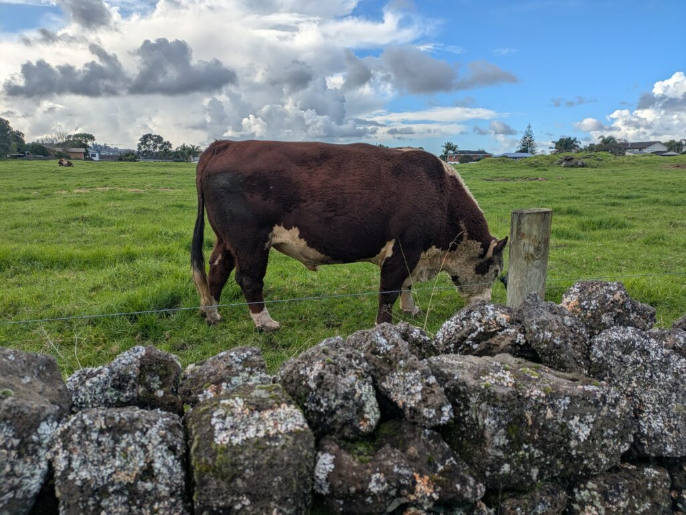
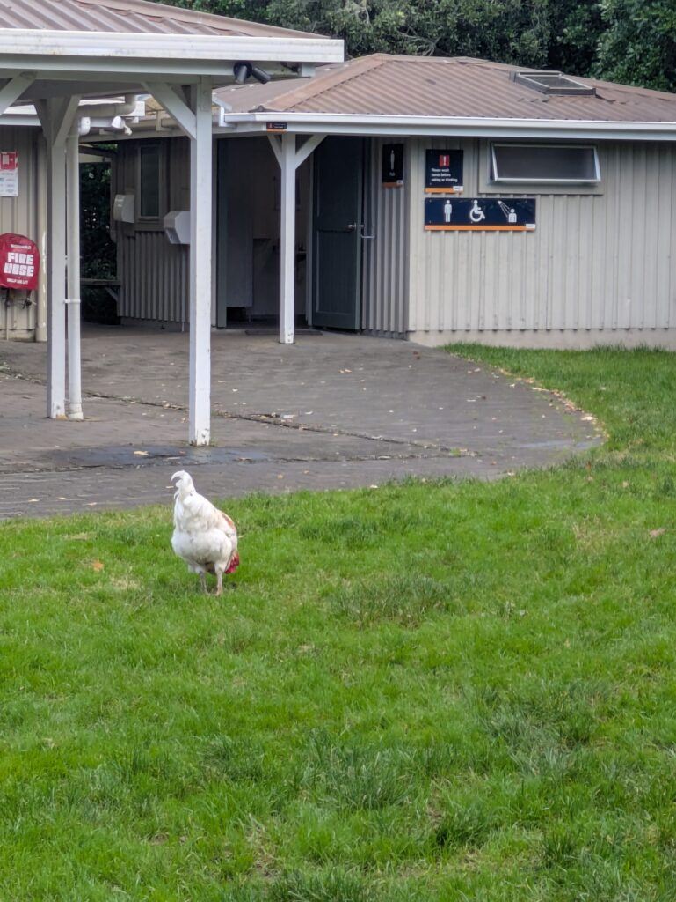
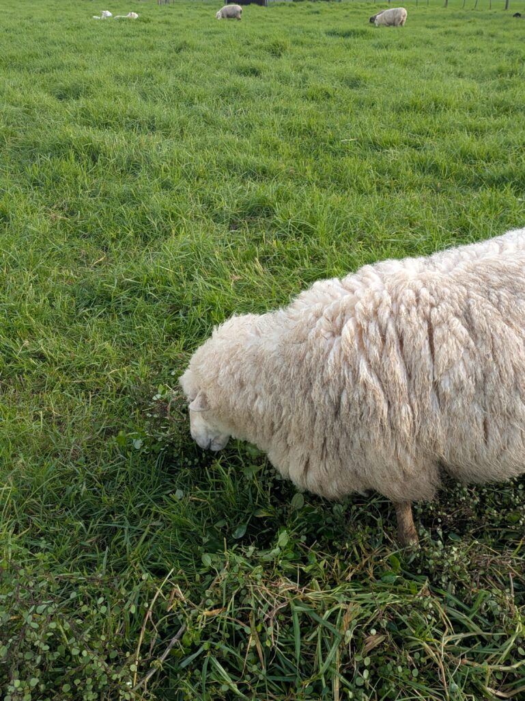

## English\_Practice

I went to ambury farm because my Thai friend recommended it. It's free so anybody can enter it.

### ambury farm bull and horse

I saw bulls at first time. My imagination is that cows are female but I saw bulls there. The warning is written on the sign; Don't approach their territory.

I have seen them a few times so I was surprised when I saw them. They moved their tongue to eat grasses so it was interesting. I felt complexed because tasty tongue is made of them.

I saw horses next time. Horses were also so big. They didn't use their tongue but it's same how to eat. I guess it's similar to herbivore because sheep were also similar how to eat.

### ambury farm chicken and pig

I then saw chickens and pigs. NZ’s eggs are more expensive than Japanese because they are free range. They are free range in the large land as a lot of chickens in Japan are in narrow gages.

They sang somewhere so it was a little noisy but it was comfortable. Moreover, young birds walked with their parents so it was very cute.

The pig was sleeping. When I spoke it, it reacted waving their tail. I felt its feeling because it looked very confortable sleeping on the grass.

### ambury farm goat, sheep and peacock

There were goats, sheeps and a peacock. In addition, I gave grass in other area to them. They ate it if they liked it. They were extremely cute.

There was a peacock in the parking but I'm not sure. I guess it was given feed but it's not good to give it people food because some sigh illustrate that do not feed birds.

I enjoyed like that. It was fun but it took for one hour by bus. I want to try to be a farmer once. Long working doesn't match my personality. See you later.

## 日本語版

タイの友達におススメされたので[ambury farm](https://www.aucklandcouncil.govt.nz/parkmaps/map-ambury-regional-park.pdf)という場所に行ってきました。ちなみにフリーで入ることができるので誰でも自由に出入りできます。

### ambury farm 牛と馬

初めに見ることができるのはブルですね。牛のイメージがメス牛ですがここで見たのは雄牛ですね。警告があってテリトリーに近づきすぎないよう気を付けてと書いてありました。

あまり見る機会がなかったので想像以上にでかくてびっくりしました。食べるときに舌を動かして食べてたのが興味深かったですね。あそこから美味しい牛のタンができると思うと複雑ですが（笑）

次に見たのは馬ですね。馬も大きいですね。舌は使ってなかったですが、食べ方としては同じでした。草食動物は似たような感じかもしれません。羊も似たような感じだったので。

### ambury farm 鶏と豚

その後に見たのは鶏と豚でした。ニュージーランドの特徴ですが、卵が日本よりも高価です。というのも放し飼いをしている点があります。日本のように狭いケージの中で大量に入れられてるわけではなく、広い土地で放し飼いをしてますね。

あちこちで鳴いてるので少しうるさいですが、それもよいです。また、ひな？もいて一緒に歩いている姿は可愛かったです。

ちなみに豚は寝てました。声を掛けるとシッポを振って反応してくれました。こんな光景を見ると芝生の上に転がって寝たくなる気持ちもわかります。

### ambury farm ヤギと羊と孔雀

後はヤギと羊と孔雀がいました。ヤギと羊は触ることができました。また、別のエリアの草をむしって与えることもできました。好みであれば食べてくれます。めちゃくちゃかわいいです。

クジャクはなぜか駐車場にいました。恐らく食べ物をもらっていたと思われますが、人の餌を与えるのはあまり良くなかった気がします。よく看板などで餌を与えないようにと言われてますので。

という感じで楽しんできました。CBDから少し離れているのでバスで1時間ぐらいかかりましたが楽しめました。一回ぐらいはファーマーの仕事してみたくなりました。長く働くのは性に合わないとは思いますが。ではでは。

## AI採点

## 採点予想

### Task Response（タスク達成度）: 6.0

- 全体の内容は明瞭だが、一部情報が曖昧または不自然で伝わりにくい箇所あり。

### Coherence and Cohesion（論理性とまとまり）: 6.0

- 接続詞や構成がやや単調で、段落内の流れが自然でない部分あり。

### Lexical Resource（語彙）: 5.5

- 単語選択に誤りがあり、不自然な表現が複数見られる。

### Grammatical Range and Accuracy（文法）: 5.0

- 文法的エラーが多数見られ、特に冠詞、単複、時制、語順などの誤りが目立つ。

**総合評価：5.5（IELTS）**

* * *

## 細かな修正ポイント（語彙・文法の修正）

以下、特に問題のある文を修正します。

### 修正例

**原文:**  
I went to ambury farm because my Thai friend recommended it. It's free so anybody can enter it.

**修正版:**  
I visited Ambury Farm because a Thai friend recommended it. It’s free to enter, so anyone can visit.

- **Ambury Farm**：固有名詞のため大文字。

- **visited**：「行く」はvisitの方が自然。

- **a Thai friend**：冠詞の付け忘れ。

- **anyone**：「anybody」より適切。

* * *

### Bulls and Horses

**原文:**  
I saw bulls at first time. My imagination is that cows are female but I saw bulls there. The warning is written on the sign; Don't approach their territory.

**修正版:**  
I saw bulls first. I always imagined cows as female, but there I saw bulls. A warning sign said, “Do not approach their territory.”

- **at first time → first**：自然な表現は"first"。

- **My imagination is that cows are female → I always imagined cows as female**：より自然で簡潔。

- **written on the sign → a warning sign said**：自然な表現への変更。

* * *

**原文:**  
I have seen them a few times so I was surprised when I saw them.

**修正版:**  
I hadn't seen them often before, so I was surprised by how big they were.

- 表現が曖昧で意図が伝わりづらいため修正。

* * *

**原文:**  
They moved their tongue to eat grasses so it was interesting. I felt complexed because tasty tongue is made of them.

**修正版:**  
It was interesting how they moved their tongues while eating grass. I felt conflicted knowing delicious beef tongue comes from them.

- **complexed → conflicted**：正しい感情表現。

- **tasty tongue is made of them → delicious beef tongue comes from them**：より自然。

* * *

### Chickens and Pigs

**原文:**  
NZ’s eggs are more expensive than Japanese because they are free range. They are free range in the large land as a lot of chickens in Japan are in narrow gages.

**修正版:**  
Eggs in New Zealand are more expensive than in Japan because chickens here are free-range, unlike in Japan where many chickens are kept in small cages.

- **free range → free-range**：形容詞の表記。

- **gages → cages**：スペルミス。

- **as → unlike**：自然な比較。

* * *

**原文:**  
They sang somewhere so it was a little noisy but it was comfortable.

**修正版:**  
They were crowing everywhere, which made it a bit noisy but pleasant.

- **sang → crowing**：鶏の鳴き声は「crow」。

- **comfortable → pleasant**：状況に適した表現。

* * *

**原文:**  
The pig was sleeping. When I spoke it, it reacted waving their tail. I felt its feeling because it looked very confortable sleeping on the grass.

**修正版:**  
The pig was sleeping. When I spoke to it, it reacted by wagging its tail. I could understand how it felt because it looked so comfortable sleeping on the grass.

- **spoke it → spoke to it**：前置詞toが必要。

- **their tail → its tail**：単数の動物なのでits。

- **confortable → comfortable**：スペルミス修正。

* * *

### Goats, Sheep, and Peacock

**原文:**  
There were goats, sheeps and a peacock. In addition, I gave grass in other area to them.

**修正版:**  
There were goats, sheep, and a peacock. Additionally, I picked grass from another area and gave it to them.

- **sheeps → sheep**：sheepは単複同形。

- **In addition → Additionally**：接続詞を自然なものに変更。

- **in other area → from another area**：適切な前置詞・表現。

* * *

**原文:**  
There was a peacock in the parking but I'm not sure. I guess it was given feed but it's not good to give it people food because some sigh illustrate that do not feed birds.

**修正版:**  
There was a peacock in the parking lot, though I'm not sure why. It might have been fed by people, but that's not good because some signs explicitly say, “Do not feed the birds.”

- **parking → parking lot**：一般的表現。

- **sigh illustrate → signs explicitly say**：表現を修正。

- **it’s not good to give it people food → not good for people to feed it**：より明確な表現に修正。

* * *

### 結びの表現

**原文:**  
I enjoyed like that. It was fun but it took for one hour by bus. I want to try to be a farmer once. Long working doesn't match my personality. See you later.

**修正版:**  
I really enjoyed the visit, although it took about an hour by bus from the CBD. I'd like to experience working as a farmer once, although working long hours wouldn't suit my personality. See you later!

- **enjoyed like that → really enjoyed the visit**：より自然。

- **it took for one hour → it took about an hour**：時間表現修正。

- **long working → working long hours**：自然な表現。

* * *

## 全体的な改善点まとめ

- **冠詞の適切な使用**

- **単複形（sheep/sheepsなど）の間違い**

- **適切な動詞の選択（sang → crowing）**

- **語順や前置詞の適切な選択**

- **スペルミス（gages → cages、confortable → comfortable、sigh → signs）**
