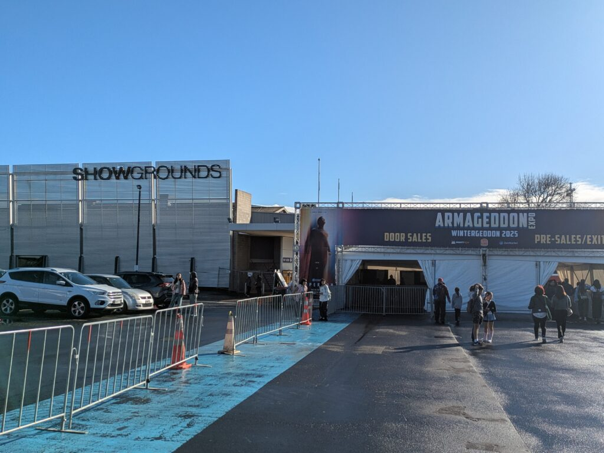
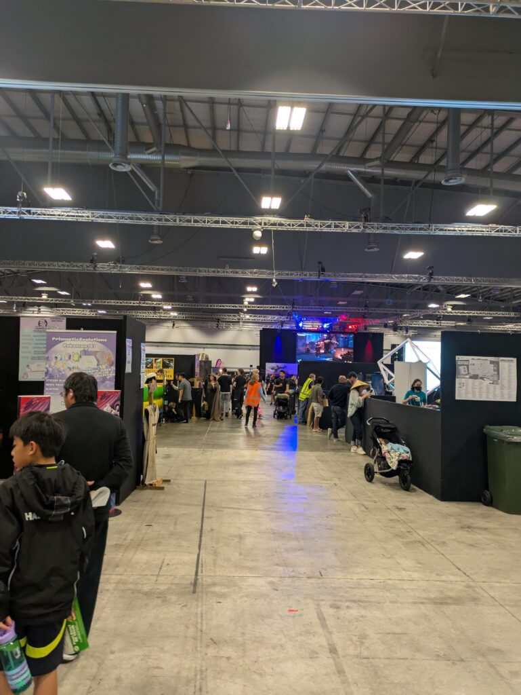
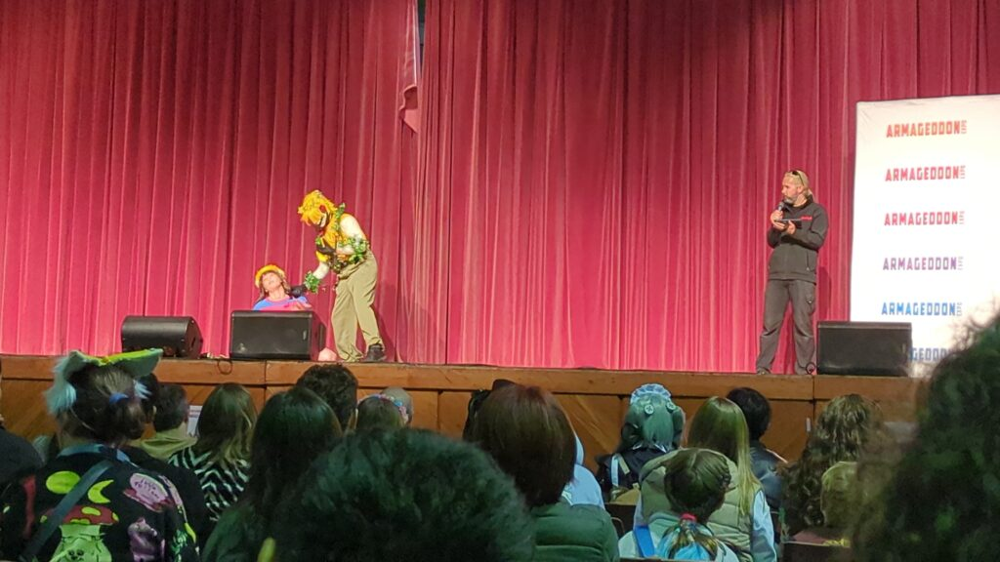

## English\_Practice

I enjoyed a event called "ARMAGEDDON EXPO" which is held annual. It was held at the "SHOWGROUND" and almost all events are held there. The previous Easter event was also there.

There were a lot of people. Of course, many people did cosplay. Some people did high quality cosplay and other people dressed simple costume. In my opinion, if they enjoyed it, it should be fine.

### Armageddon Hall

There were a lot of stalls to eat. However, it is same food as Easter.

There were booths and event halls in the hall. The booths is merchandise and some people sold variety of goods related animation. Not only animation, but also original goods and shaking hands in the space.

### Armageddon Goods

However, I didn't but goods because I'm not sure they are sold by the company which has copyrights and they are luggages for traveling. Moreover, a part of booths are strange. Personally, I don't want to buy them.

I'm interested in face masks. There were fox and cat face masks but I didn't buy them because I didn't like their shapes. Perhaps, if I had liked their colors and shapes, I would have bought them. I'm not sure why I'm attracted for the face mask.

### Armageddon Interview

There was an event in the other hall. Normally, professionals interviewed about themselves and their experiences. For instance, voice actors, designers and dress maker. I didn't hear all because of English but they talked useful.

The designer talked about design to match for a role and actor or actress. The voice actor talked about how to take roles.

### The End

Finally, I watched the cosplay parade. Cosplayers went up to the stage and got posing when they were called their name. It was awesome because the atmosphere is great and they were respectful and cheered up. This is cosplay as UNDERTALE.

I enjoyed this event like this. If I come back Auckland and there are this event, I want to do cosplay. However, I wish easily cosplay. Eventually, a company advertised them using Japanese at the event hall. I was surprised at hearing Japanese. See you later.

## 日本語版

[ARMAGEDDON](https://www.armageddonexpo.com/) EXPOというイベントが年一で開催されているみたいなので行ってきました。会場はSHOWGROUNDという場所で、大体のイベント会場はここですね。前の[イースターイベント](/posts/2025/04/auckland-easter-show-review/)の会場もここでした。

会場には多くの人がいました。もちろんコスプレしている人もたくさんいました。クオリティーの高いコスプレの人もいれば、簡単な衣装を着ている人もいました。個人的には楽しんでいればなんでもいい気はします。

### armageddon 会場

会場外には屋台が多くあり、食べるものも多くあります。とは言えイースターの時とラインナップはあまり変わりませんが…

会場内はブースとイベントホールに分かれています。ブースは物販になっていて色んなアニメ関連のグッズが売ってあります。もちろんアニメだけでなくオリジナル商品や握手会などの場所もありました。

### armageddon グッズ

ただ、グッズに関しては正規品かわからなかったのと旅行で荷物になるので買いませんでした。一部のブースは会社が運営していたので正規品だとは思います。ただ、一部のブースは怪しいものもありましたね。個人的にはそういったものは買いたくないですね。

個人的な興味があったのはマスクですね。キツネやネコのマスクがあったのですが、形が好みじゃなかったので買いませんでした。多分、好きな色と形だったら買ってましたね。なぜかマスクは憧れるところがあります。

### armageddon 対談

別会場ではイベントがありました。基本的にはその道のプロが対談をしたり、自身の経験を話したりしてました。例えば声優やデザイナー、衣装づくりの人ですね。全て英語なので全部聞き取れたわけではないですが、ためになることを話してました。

デザイナーさんだと役と俳優に合わせてデザインしたり、声優だとどうやって役を取ったかなどを話していました。

### 終わりに

最後にコスプレのパレードをしていました。パレードと言っても名前を呼ばれたら壇上に上がって軽くポージングするくらいですが。お互いがリスペクトをもって盛り上げていたので、とてもいい雰囲気で見れたのは良かったですね。これはUNDERTALEのコスプレ。

という感じでイベントを楽しんできました。次オークランドに戻った時イベントがあったらコスプレしてみたい気もしますね。とは言え簡単なコスプレが良いですが。最後にイベント会場では日本語の音声で会社の宣伝をしてました。日本語が聞こえたのは少し感動でした。ではでは。

## AI採点

スコア: **68/100**

以下、細かく修正点を指摘します。

### 文法と語彙のミス指摘

#### 導入部

- ❌ `a event` → ✅ **an event**  
    母音で始まる単語の前は冠詞が「an」。

- ❌ `annual` → ✅ **annually**  
    「毎年開催されている」は副詞が適切。

- ❌ `almost all events are held there` → ✅ **most events are held there**  
    「ほとんどの」はmostがより自然。

#### コスプレ描写

- ❌ `did cosplay` → ✅ **were cosplaying / dressed up in cosplay**  
    「コスプレする」はbe動詞 + ingが自然。

- ❌ `other people dressed simple costume` → ✅ **other people wore simple costumes**  
    costumeは可算名詞で複数形、動詞はwearが適切。

#### 食事の屋台

- ❌ `it is same food as Easter` → ✅ **it was the same food as at Easter**  
    時制は過去に統一し、冠詞theが必要。

#### 会場内の説明

- ❌ `The booths is merchandise` → ✅ **The booths were selling merchandise**  
    動詞はwereにし、「物販している」と動作を明確化。

- ❌ `variety of goods related animation` → ✅ **a variety of anime-related goods**  
    a variety of の冠詞が必要、アニメ関連はanime-relatedが自然。

- ❌ `shaking hands in the space` → ✅ **areas for handshake events**  
    「握手会」はhandshake eventsと訳すべき。

#### グッズの購入について

- ❌ `I didn't but goods` → ✅ **I didn't buy goods**  
    タイプミス。

- ❌ `they are sold by the company which has copyrights` → ✅ **they were officially licensed goods**  
    著作権がある正規品の表現はofficially licensed goodsが適切。

- ❌ `luggages for traveling` → ✅ **they would become extra luggage for traveling**  
    luggageは不可算名詞、複数形不可。「旅行で荷物になる」を明確化。

- ❌ `a part of booths are strange` → ✅ **some booths seemed suspicious**  
    strangeよりもsuspicious（怪しい）が適切。

#### マスクについて

- ❌ `I'm not sure why I'm attracted for the face mask.` → ✅ **I'm not sure why I'm attracted to face masks.**  
    attractedの後は前置詞toが正しい。maskは通常複数形で。

#### イベント（対談）の説明

- ❌ `professionals interviewed about themselves` → ✅ **professionals talked about themselves / gave interviews about their experiences**  
    interviewは受け身か明確にgive interviewが自然。

- ❌ `dress maker` → ✅ **costume makers**  
    コスプレ衣装の場合はcostume makersが一般的。

- ❌ `they talked useful` → ✅ **they said useful things / shared useful information**  
    talkedの目的語が必要。

#### パレードの説明

- ❌ `got posing` → ✅ **posed briefly**  
    「ポーズをとった」はposeを動詞として使うのが自然。

- ❌ `they were called their name` → ✅ **their names were called**  
    受け身形で名前が呼ばれる表現が自然。

- ❌ `cosplay as UNDERTALE` → ✅ **cosplay from UNDERTALE**  
    ゲームや作品のコスプレはfromを使用。

#### 結びの部分

- ❌ `If I come back Auckland and there are this event` → ✅ **If I come back to Auckland and this event is happening again**  
    「オークランドに戻ったら」はcome back to。

- ❌ `I wish easily cosplay` → ✅ **I would prefer to do something simple**  
    wishは文脈的に適切ではなく、preferやwould like toを用いる。

- ❌ `Eventually, a company advertised them` → ✅ **At the end, a company was advertising itself**  
    「最後に」はat the end、広告対象を明確にitselfに。

### 改善後の模範訳例

I attended an event called "ARMAGEDDON EXPO," which is held annually. The event took place at the "SHOWGROUND," where most events are held. The previous Easter event was held there as well.

There were many people at the venue. Of course, many were cosplaying. Some wore high-quality costumes, while others had simple outfits. Personally, as long as they enjoyed themselves, I think it’s fine.

**Armageddon Hall**

Outside the venue, there were many food stalls, although the lineup was basically the same as at Easter.

Inside, the venue was divided into booths and event halls. The booths sold merchandise, mainly anime-related goods. In addition to anime merchandise, there were original goods and areas for handshake events.

**Armageddon Goods**

However, I didn’t buy any goods because I wasn’t sure if they were officially licensed, and they would become extra luggage while traveling. Some booths seemed suspicious, and personally, I prefer not to buy from such places.

I was particularly interested in face masks. There were fox and cat masks available, but I didn't buy any because their shapes weren’t appealing to me. If they had been in my preferred colors and shapes, I probably would have bought them. I’m not exactly sure why I'm attracted to masks.

**Armageddon Interviews**

Another hall hosted special events. Typically, professionals shared their experiences or held panel discussions. Examples included voice actors, designers, and costume makers. I couldn't catch everything since it was all in English, but they shared useful information.

Designers talked about creating costumes that match specific roles and actors, while voice actors discussed how they secured their roles.

**Conclusion**

Finally, there was a cosplay parade. Participants went on stage and briefly posed when their names were called. It was great to see the mutual respect and enthusiasm from the audience and cosplayers alike. The cosplay in the photo was from UNDERTALE.

Overall, I had a great time at this event. Next time I’m back in Auckland and this event happens again, I’d like to try cosplaying, though preferably something simple. Lastly, a company at the venue advertised itself using Japanese, and hearing Japanese made me feel a little nostalgic. See you!
