## English\_Practice

I went to the Auckland Zoo last Sunday. We can see variety of animals, but I took photos because there were a few rare animals.

### Zoo Australia and South America

I went to Australia area at first. For instance, emu, kangaroo and tasmanian devil.

Moreover, I recorded a video due to parrots strange behavior. I feel mysterious because I watched its tongue was unique moving.

I went to South America area later. There were mainly monkeys. For instance, squirrel monkeys, golden lion tamarins and spider monkeys.

### Zoo Asia and New Zealand

I then went to Asia area. There were kinds of animals. For example, a tiger, otters and orangutans.

After that, I went to New Zealand area. Perhaps there are a lot of unique animals. For example, kiwi, seal and eel. Nevertheless, main animals were birds. There are lots of birds which can not fly. In addition, I didn't see kiwi birds.

### Zoo Africa and Dinosaur

Finally, I went to Africa area. It is fascinating in each countries. For instance, ostrech, rinocerous and cheetah. There is a serval, but I didn't see it.

I later went to Dinosaur area. These were not fossils but robots. However, I fairly enjoyed it. Moreover, the night event was held, but it is a little different to compare with the day.

I enjoyed like that. If I go there again, I would like to see animals which I have never seen but I was satisfied. I saw kiwis birthplace and species so I want to travel based on them. See you later.

## 日本語版

先日[オークランド動物園](https://www.aucklandzoo.co.nz/)に行ってきました。日本でもいろんな動物を見ることができますが、こちらでも珍しい動物がちょこちょこいたので写真を撮ってきました。

### Zoo オーストラリアと南アメリカ

最初のエリアはオーストラリアエリアでした。例えばエミューやカンガルー、タスマニアデビルなどですね。

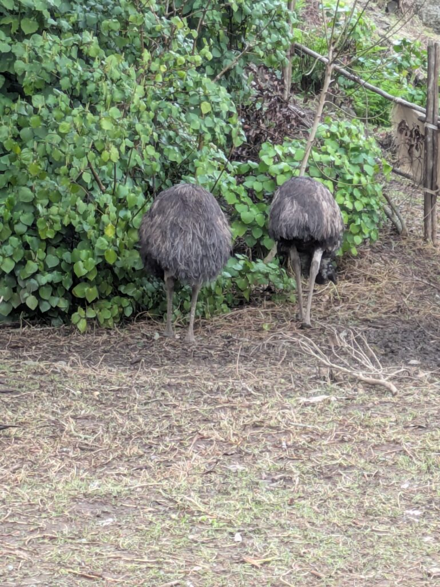

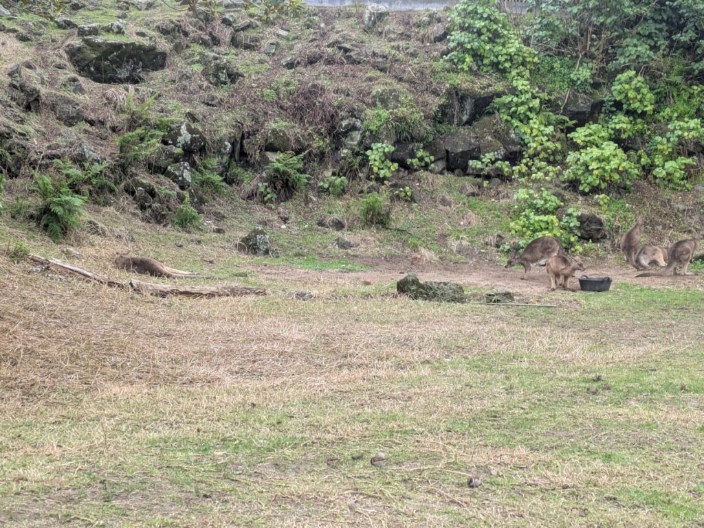

それからオウムが不思議な行動をしていたので撮ってみました。舌の動きが独特で見ていて不思議な気持ちになりますね。

次に行ったのは南アメリカエリアですね。主にサルが多かったです。リスザルやゴールデンライオンタマリン、クモザルなどですね。

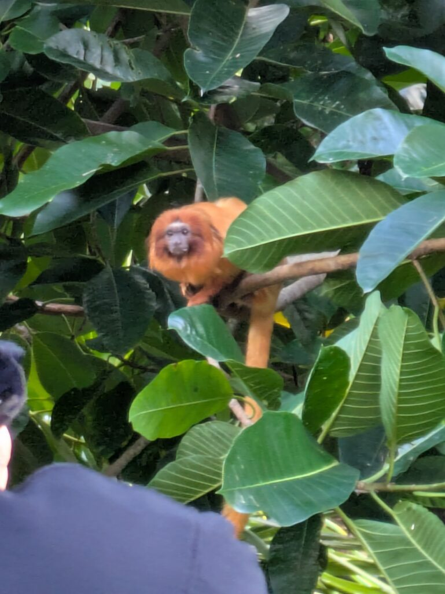

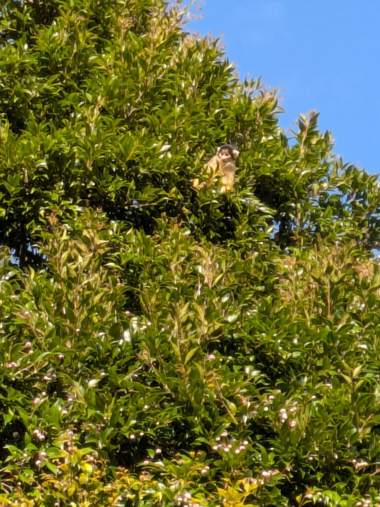

### Zoo アジアとニュージーランド

その後はアジアエリアに行きました。トラ、カワウソ、オラウータンなどいろんな動物がいました。

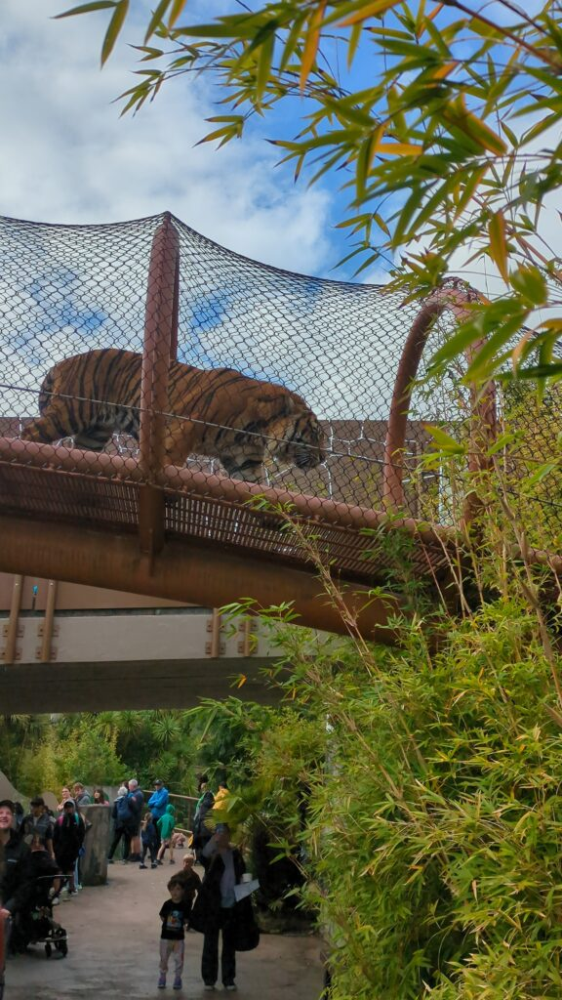

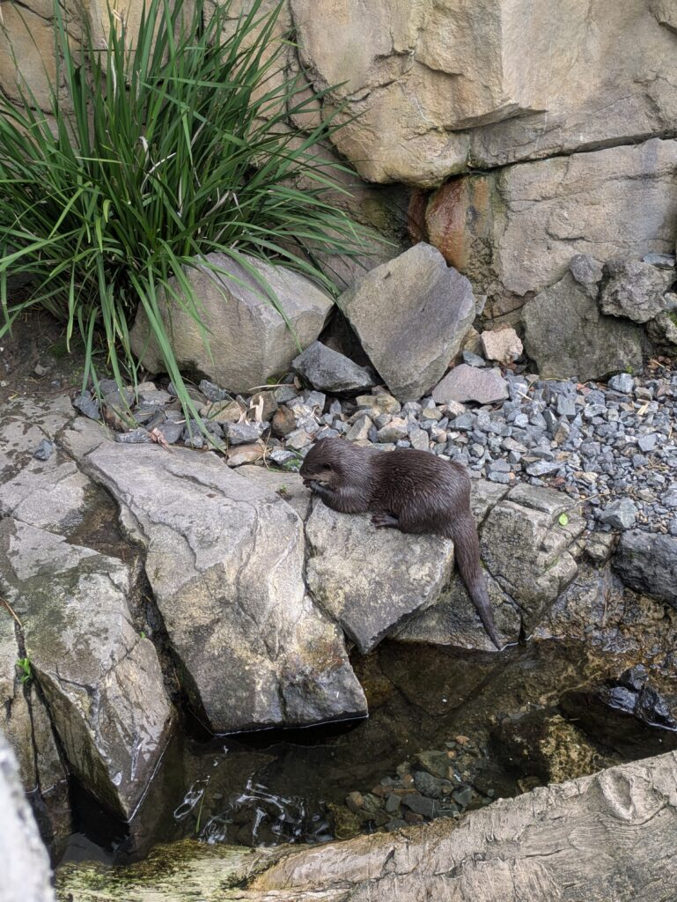

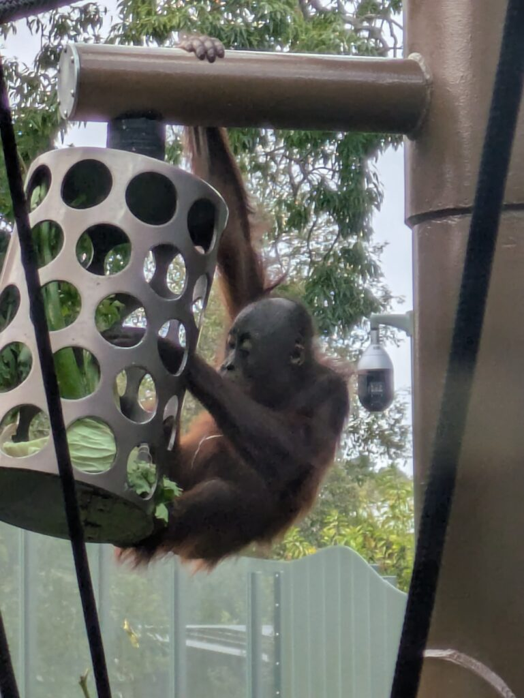

その次に行ったエリアはニュージーランドエリアですね。恐らく固有の動物も含めて近場の動物が集まってました。キウイはもちろんアザラシや鰻ですね。ただ、鳥類が多かったと思います。飛べない鳥が多いのもこの国の特徴ですね。ちなみにキウイを見ることはできませんでした…

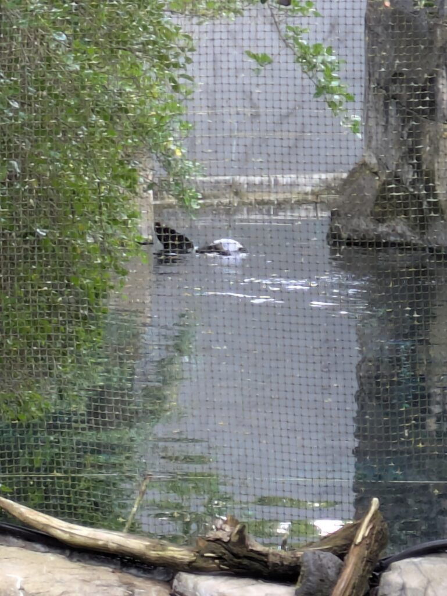

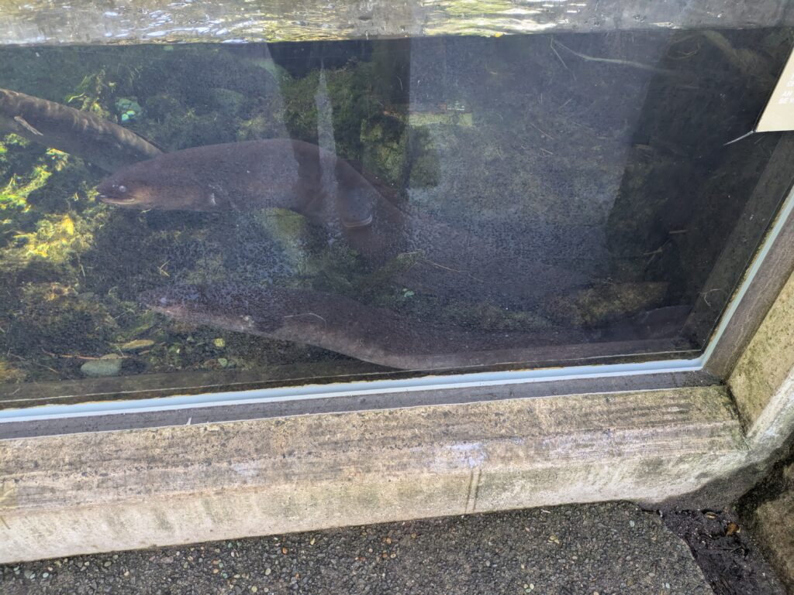

### Zoo アフリカと恐竜

最後に行ったのはアフリカエリアですね。どこの国もそうですが、ここが一番見ごたえがある気がします。ダチョウやキリン、サイ、チーターなどです。サーバルもいるみたいですが、今回は見ることができませんでした。

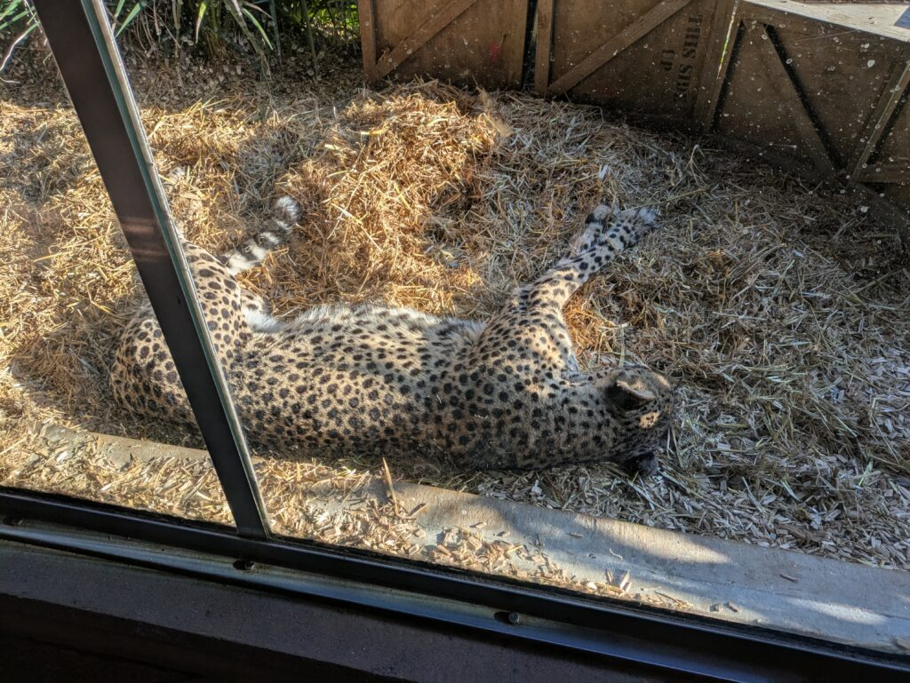

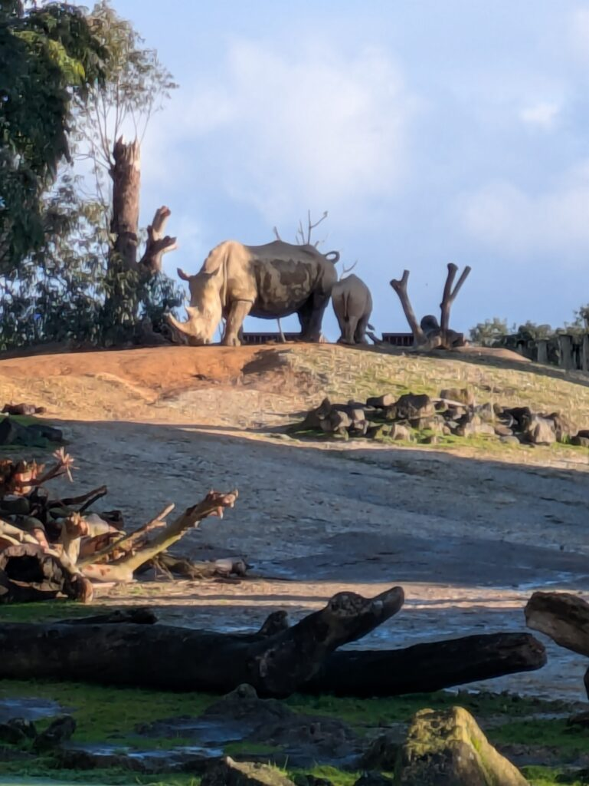

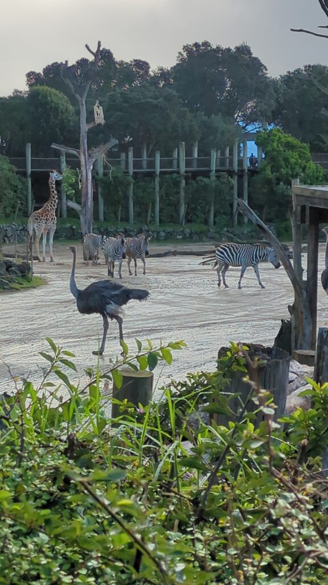

最後に恐竜エリアに行ってきました。こっちは化石とかではなくロボットですが、それなりに楽しむことができました。また、夜限定のイベントも今だけ開催されています。とは言え昼に行った時とそこまで大きく変わらないのですが。

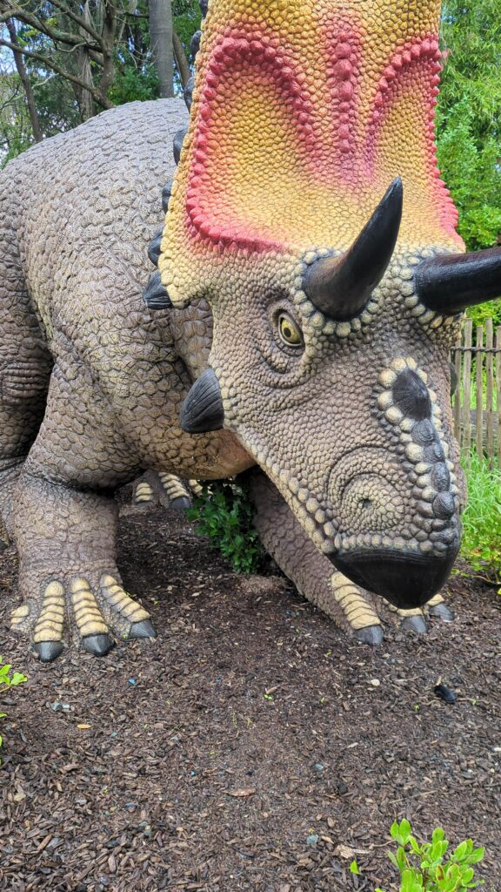

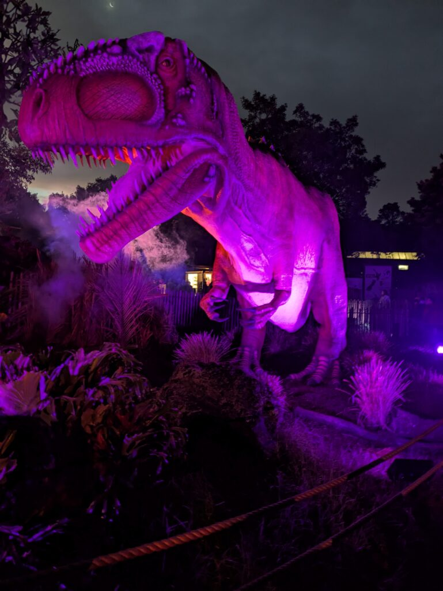

という感じで楽しんできました。次行くとすればまだ見てない動物を見ておきたいですんが、一旦は満足したという感じですね。キウイの生息地と種を見かけたのでそれを元に旅もしてみたいと思います。ではでは。

## AI採点

## 総合評価 (Estimated Band): **5.5 - 6.0**

理由:

- アイデアや内容は明確で理解しやすい。

- 構成や接続語句に多少不自然な箇所あり。

- 語彙や文法の誤りが目立ち、自然さを損なっている。

* * *

## Detailed Feedback:

### 1\. Task Achievement (達成度): **6.5**

- 内容は伝わるが、各エリアについてもう少し具体的な描写があれば高得点に繋がる。

- 動物の説明は良いが、一部表現が曖昧。

### 改善点:

- もう少し動物の特徴や印象を具体的に述べること。

* * *

### 2\. Coherence and Cohesion (一貫性と結束性): **5.5**

- 段落間の接続語が不足し、文同士のつながりが弱い。

- 「For instance」の多用で単調な印象。

#### 改善点:

- 接続詞・副詞（then, next, also, however, furthermore）を適切に用いること。

- 「For instance」の代わりに、「such as」「including」などバリエーションを使う。

* * *

### 3\. Lexical Resource (語彙): **5.5**

- 語彙の選択が単調でやや限定的。

- スペルや単数複数形のミスが複数ある。

#### 減点対象:

- variety → a variety  
    **誤**: We can see variety of animals  
    **正**: We can see **a variety of animals**

- Australia area → Australian area  
    **誤**: I went to Australia area  
    **正**: I went to **the Australian area**

- mysterious → strangeまたはcurious（この文脈ではstrange/curiousの方が自然）  
    **誤**: I feel mysterious because I watched its tongue was unique moving  
    **正**: I felt **curious/strange** watching its unique tongue movements.

- ostrech → ostrich  
    rinocerous → rhinoceros

#### 改善点:

- 動物や国名の形容詞形の正しい使用に注意。

- より豊富な語彙を用いて表現力を高める。

* * *

### 4\. Grammatical Range and Accuracy (文法): **5.5**

- 主語・動詞の一致、冠詞、単数・複数形にミスが目立つ。

- 時制の一貫性に欠ける部分あり。

#### 減点対象・詳細解説:

- 冠詞の欠落:
    - **誤**: I went to Australia area at first.
    
    - **正**: I went to **the** Australian area first.

- 時制のミス:
    - **誤**: I feel mysterious because I watched...
    
    - **正**: I **felt** strange/curious watching...

- 動詞の形容詞化:
    - **誤**: its tongue was unique moving
    
    - **正**: its tongue **moved uniquely**.

- 可算・不可算名詞:
    - **誤**: There were kinds of animals.
    
    - **正**: There were **many different kinds** of animals.

- 比較表現のミス:
    - **誤**: it is a little different to compare with the day
    
    - **正**: it was **only slightly different compared to the daytime**.

#### 改善点:

- 適切な時制（主に過去形）の使用を徹底。

- 動詞、副詞、形容詞の正しい形を確認すること。

* * *

## 改善例（参考例文）:

I visited the Auckland Zoo last Sunday. We can see a variety of animals in Japan too, but I took some photos because there were a few rare animals here.

**Zoo: Australian and South American Areas**

First, I went to the Australian area and saw animals such as emus, kangaroos, and Tasmanian devils.

Additionally, I recorded a video of parrots exhibiting strange behavior. I felt curious watching their unique tongue movements.

Later, I visited the South American area, which mainly housed monkeys, including squirrel monkeys, golden lion tamarins, and spider monkeys.

**Zoo: Asian and New Zealand Areas**

Next, I moved on to the Asian area. There were many different animals like tigers, otters, and orangutans.

After that, I explored the New Zealand area, which included many native animals, such as kiwis, seals, and eels. However, birds were predominant, especially flightless ones. Unfortunately, I couldn't see any kiwi birds.

**Zoo: African and Dinosaur Areas**

Lastly, I visited the African area, which tends to be the most fascinating in any zoo. There were ostriches, giraffes, rhinoceroses, and cheetahs. Although servals were there too, I missed seeing them this time.

Finally, I went to the dinosaur area. These weren't fossils but robots. Still, I enjoyed them quite a bit. There was also a night event happening, but it wasn’t significantly different from the daytime experience.

I enjoyed my visit overall. If I visit again, I'd like to see animals I missed this time, but I'm satisfied for now. Having learned about the kiwi’s habitat and species, I'd love to travel to explore them further. See you!
