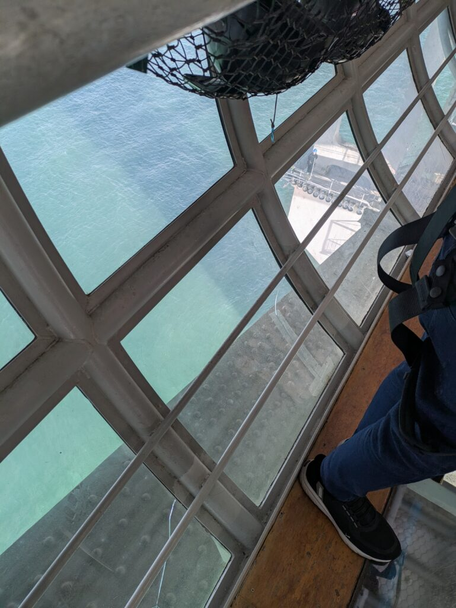
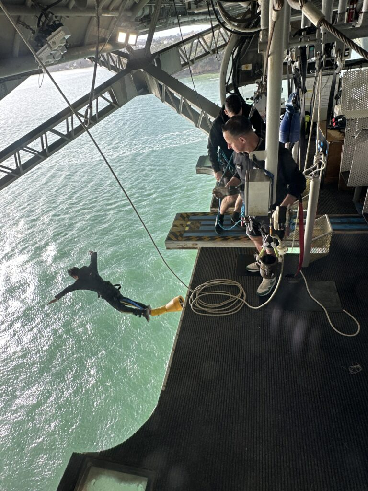

## English\_Practice

My friend went back Japan suddenly and he said he wanted to do bungee jumping. Therefore, I did bungee jumping with him.

The company manage it as the same company manage the base jumping at the sky tower.

### Bungee Jumping Preparing

I did it on weekday at afternoon. It should be fine when I booked on the day. I could choose reception which I use a bus or go to there directly. I decided to use the bus.

I checked in a part of reception while moving by bus. A assistant made sure my condition and personal information. I went to the reception near the bridge and checked my weight to prepare bungee jumping.

### Bungee Jumping Moving

I went to the place where I can do bungee jumping after preparing. I moved the middle of bridge. We can bring our smartphone but be careful not to drop it because there are equally pits to the middle of way.

It was very scared because the height is 15 meter and I watched the sea while the way. Perhaps I can't fall in the sea. I prepared bungee jumping after arriving at the back and putting off the helmet. Absolutely, I had to pick off my smartphone.

After that, I jumped with stuff said ”3, 2, 1, Go”. I felt fear and excited. Pasonally, It was more scared than Base Jumping at the Sky Tower. It has a little brake.

### The End

When I went back the reception after bungee jumping, I received a T-shirt and checked photos and videos. I got the link by email so I can also watch them.

I think it was a good opportunity. I wouldn't have gone there if I had been alone. I have never played sky jumping so I would like to do it. See you later.

## 日本語版

私の友人が日本に急遽帰ることになり、[バンジージャンプ](https://www.bungy.co.nz/auckland/auckland-bridge/auckland-bridge-bungy/)をすると言ってたので一緒に体験してきました。

運営している会社は[以前](/posts/2025/05/bungee-jumping/)やったスカイタワーからのベースジャンプと同じ会社みたいです。

### バンジージャンプ 準備

平日の昼間だったので当日予約でも問題ありませんでした。予約をする際はバスを使って移動するか、現地に集合するかを選ぶことができます。私はバスを使うことにしました。

バスで移動している間に受付の一部を済ませました。体調や個人情報の確認ですね。橋の近くの受付まで行って、体重確認やバンジーの準備をしました。

### バンジージャンプ 移動

準備が完了したらバンジーができる場所まで移動ですね。橋の中心部近くまで移動します。スマホを持っていくことも可能ですが、中心部に行くまでの道は等間隔の穴が空いてるため落とさないように注意する必要があります。

道中は海が見えるうえに15mほどの高さなので割と怖いですね。一応ロープで繋がってるので落ちないとは思いますが。奥に着いたらヘルメットを外してバンジーの準備をします。当たり前ですがスマホは取り出しておきましょう。

3, 2, 1の掛け声で後は飛ぶだけですね。言葉では尽くせませんが、恐怖と高揚感がありました。個人的にはスカイタワーのベースジャンプより怖いですね。あっちは降りてるときに多少ブレーキがかかりますので。

### 終わりに

バンジーが終わって受付まで戻ったら、Tシャツを受け取って写真やビデオを確認して終了です。メールでリンクをもらえるので、そっちでも写真やビデオも見れます。

おそらく誰かと一緒でなければ行くこともなかったのでいい機会だったと思います。個人的に残っているアトラクションがスカイダイビングなのでそっちもいずれやってみたいと思います。ではでは。

## AI採点

## Overall IELTS 推定スコア

- **Task Response:** 7（内容は十分に伝わるが、細部に誤りが多い）

- **Coherence and Cohesion:** 6（段落構成はあるが、不自然な接続や繰り返しが多い）

- **Lexical Resource:** 6（単語の使い方が不自然で語彙の誤用が散見される）

- **Grammatical Range and Accuracy:** 5.5（基本的な文法ミスや冠詞・前置詞・動詞の活用ミスが頻繁に見られる）

推定総合スコア：**6.0**

* * *

## 詳細な文法・語彙のミスと改善例

### Paragraph 1

**原文：**  
My friend went back Japan suddenly and he said he wanted to do bungee jumping. Therefore, I did bungee jumping with him.

**修正点：**

- went back **to** Japan（toが必要）

- 同じ表現を繰り返さない工夫が必要

**改善例：**  
My friend suddenly had to go back to Japan, and since he said he wanted to try bungee jumping, we decided to experience it together.

* * *

### Paragraph 2

**原文：**  
The company manage it as the same company manage the base jumping at the sky tower.

**修正点：**

- 主語と動詞の一致ミス（company manages）

- 表現が不自然（as the same company は間違い）

**改善例：**  
The company managing the bungee jump seemed to be the same one operating the base jumping at Sky Tower.

* * *

### Bungee Jumping Preparing

**原文：**  
I did it on weekday at afternoon. It should be fine when I booked on the day. I could choose reception which I use a bus or go to there directly. I decided to use the bus.

**修正点：**

- weekday → a weekday

- at afternoon → in the afternoon

- It should be fineは不自然

- receptionは「受付」という意味だが、ここでは不自然。transportationかarrivalを使うべき

- whichの使い方が誤り

**改善例：**  
I did it on a weekday in the afternoon, so booking on the same day wasn’t an issue. When making the reservation, I could choose whether to use the provided bus or go there directly. I decided to use the bus.

* * *

**原文：**  
I checked in a part of reception while moving by bus. A assistant made sure my condition and personal information. I went to the reception near the bridge and checked my weight to prepare bungee jumping.

**修正点：**

- a part of reception → part of the check-in process

- A assistant → An assistant

- made sure → checked

- to prepare bungee jumping → to prepare for bungee jumping

**改善例：**  
I completed part of the check-in process during the bus ride. An assistant checked my physical condition and personal information. After arriving at the reception area near the bridge, my weight was checked as part of the preparation for bungee jumping.

* * *

### Bungee Jumping Moving

**原文：**  
I went to the place where I can do bungee jumping after preparing. I moved the middle of bridge. We can bring our smartphone but be careful not to drop it because there are equally pits to the middle of way.

**修正点：**

- 時制の統一：I could do

- moved the middle of bridge → moved toward the middle of the bridge

- equally pitsは誤り：equally spaced gaps

- to the middle of way → along the way

**改善例：**  
After preparation, I moved toward the jumping spot near the middle of the bridge. You can bring your smartphone, but you must be careful not to drop it, as there are equally spaced gaps along the walkway.

* * *

**原文：**  
It was very scared because the height is 15 meter and I watched the sea while the way. Perhaps I can't fall in the sea. I prepared bungee jumping after arriving at the back and putting off the helmet. Absolutely, I had to pick off my smartphone.

**修正点：**

- very scared → very scary (感情を与えるのはscary、感情を感じるのはscared)

- 15 meter → 15 meters

- watched → saw, viewed（watchedはじっと見るニュアンス）

- Perhaps I can't fall → But at least I wouldn't fall

- putting off → taking off

- pick off → take out（pick offは不適切）

- Absolutely は不自然

**改善例：**  
It was very scary because the bridge is about 15 meters high and I could see the sea below. However, I was attached by a rope, so at least I wouldn't fall. Once at the jumping spot, I took off my helmet and took out my smartphone.

* * *

**原文：**  
After that, I jumped with stuff said ”3, 2, 1, Go”. I felt fear and excited. Pasonally, It was more scared than Base Jumping at the Sky Tower. It has a little brake.

**修正点：**

- with stuff → when the staff said (staffのスペル注意)

- fear and excited → fear and excitement（形容詞と名詞を混ぜない）

- Pasonally → Personally（スペルミス）

- more scared → scarier（比較級のミス）

- It has a little brake → That jump had a braking system

**改善例：**  
After the staff counted down "3, 2, 1, Go!", I jumped. I felt both fear and excitement. Personally, this jump was scarier than the base jump at Sky Tower, as that one had a braking system to slow the fall.

* * *

### The End

**原文：**  
When I went back the reception after bungee jumping, I received a T-shirt and checked photos and videos. I got the link by email so I can also watch them.

**修正点：**

- went back the reception → went back to the reception

- checked photos and videos → checked the photos and videos

- got the link by email → received a link via email

- watch → viewが自然

**改善例：**  
When I went back to the reception after the jump, I received a T-shirt and checked the photos and videos. I also received a link via email to view them later.

* * *

**原文：**  
I think it was a good opportunity. I wouldn't have gone there if I had been alone. I have never played sky jumping so I would like to do it. See you later.

**修正点：**

- played sky jumpingは間違い（playはゲームやスポーツ競技に使うが、この場合は不自然）

- sky jumping → skydiving（一般的な用語）

- 文の流れを自然に調整

**改善例：**  
I think it was a great opportunity—I wouldn’t have done it if I'd been alone. I haven’t tried skydiving yet, so I’d like to experience that someday too. See you later!

* * *

## 改善のポイントまとめ：

- 文法的に単数複数や冠詞の使用に注意

- 時制や助動詞を一貫して使うこと

- 語彙選択をより自然な英語表現に置き換える

- 繰り返し表現を避け、より滑らかな接続表現を使う
