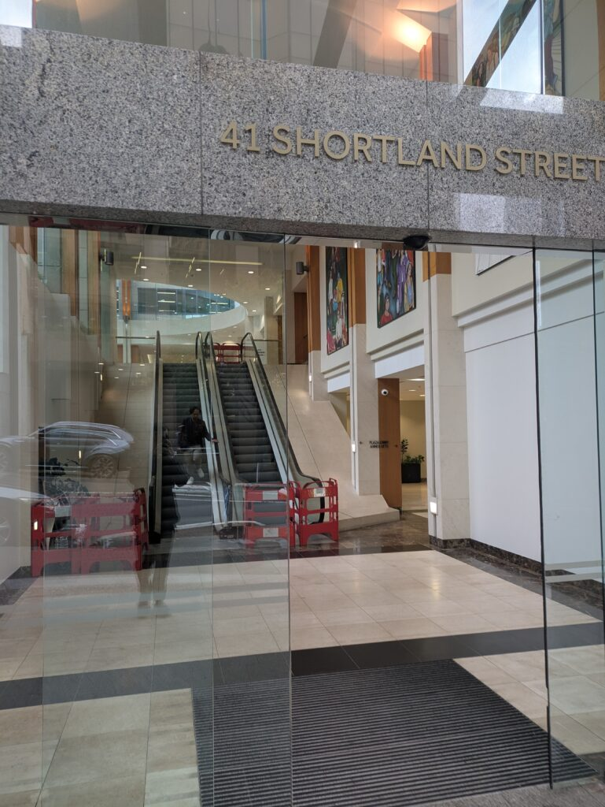
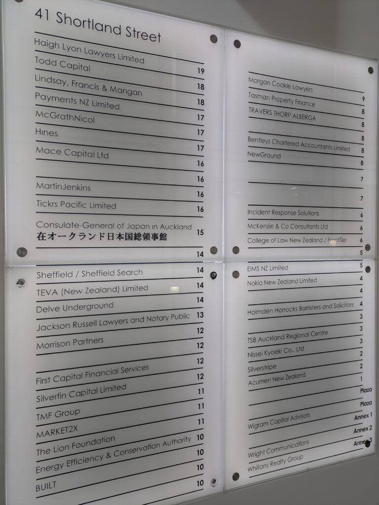
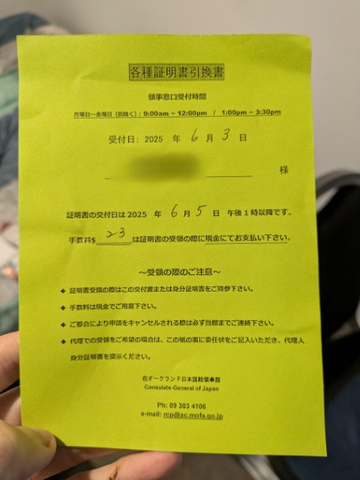

## English\_Practice

I have been there for 5 months so I decided to obtain a NZ driver licence because I am going to extend for one year. You can access on the Japanese embassy how to get a driver licence so it should be fine basically if you follow it. However, you do not need a driver licence if you stay here for one year or less due to cost some money.

### How to get a translated driver licence

Firstly, you must go to the embassy. In Auckland case, the embassy is on the road besides Queen Street. You can check the map for using Japanese.

You go to the level 15 with elevator after entering at the back. The security guards check the security in front of the gate after your arriving.

However, he ask that you have a dangerous things or not. I did not understand what he was saying so I asked him again. He asked me "Do you have a knife?". I answered "No" so he allowed me to go through. Perhaps some countries check the security seriously.

I received this paper after telling my requirement at the reception. She said it took a few days so you came back again. I paid on cash next time coming. I recieved a translated driver licence after paying so I went to the place which makes NZ driver licences.

### Applying a driver licence

I then went to the AA. You can apply a driver license. You can also apply related vehicle. For instance, vehicle registration.

I submitted form which I wrote requirements. I also submitted a translated driver license and passport same time. We needed a color copy driver license and passport before but there is a copy machine so I paid a little fee.

After that, I was taken a photo and did a vision screening. I was confused because it was different between Japan and New Zealand. I answered blank of like “C” in Japan. The letters are on lines and columns in New Zealand. A assistant appointed the line and I read later letters on the line.

I answered the left or right light which shines after reading letters. I answered three times while watching in like the glass. When it was not a problem, I paid fee eventually.

I will recieve a NZ driver licence a few weeks later. I can use it for a long time so I am looking forward to obtaing it. See you later.

## 日本語版

こっちに来て5か月ほど経つのですが、後1年延長する予定なのでNZの運転免許証を取ることにしました。[日本国総領事館](https://www.auckland.nz.emb-japan.go.jp/itpr_ja/anzen_untenmenkyo.html)に取り方が載ってるのでそれに従えば基本的には問題ないですね。ただ、1年もいない人は無理に取る必要はないと思います。お金もかかりますし。

### 免許証翻訳版の入手

まずはその領事館に行きましょう。オークランドの場合はQueen Streetから少し道にそれた場所にあります。日本語で調べてもわかるので地図を見れば大丈夫だと思います。

中に入って奥に進みエレベーターで15階まで行きます。到着すると玄関前に人がいてセキュリティチェックをしています。

とは言え危ないものを持ってるか聞かれるだけです。私の時は最初何言われたかわからず、聞き返すとナイフ持ってる？と聞かれました。Noと答えたらそのまま通してくれました。もしかしたら国によっては厳重にチェックしてるかもしれません。

受付で要件を伝えた後、少し待ってこの紙をもらいました。少し時間がかかるのでまた今度来てくださいということです。次来たときに現金で払うようです。払ったら翻訳版の免許証をもらったのでそのままNZの免許証を作ってもらえる場所に行きました。

### 運転免許の申請

この後は[AA](https://www.aa.co.nz/)という場所に行きました。ここで免許の申請ができます。他にも車両登録など車関係の申請もできますね。

[申請書](https://www.nzta.govt.nz/assets/resources/application-conversion-overseas-licence-dl5/docs/dl5.pdf)に必要事項を書いて提出します。この時一緒に翻訳版の運転免許書とパスポートも提出します。以前はコピー用紙も必要だったみたいですが、今は事務所にコピー機があるので少し手数料払うだけで問題ありません。

その後は写真撮影と視力検査ですね。視力検査が日本と全く違うので少し戸惑いました。日本だとCの形を見て穴が空いてる場所を答えてました。こっちでは文字が縦と横に並んでいます。ラインを指示されるのでそのライン上の文字を読み上げます。

文字読み上げの後は横のライトが点灯するので右か左かを答えます。眼鏡？を見つつ3回ほど答えたら終わりになります。特に問題なければ料金を払って申請完了ですね。

この後は数週間後に届くみたいなので受け取るだけですね。長い間使えると思うので楽しみです。ではでは。

## AI採点

## Band評価（推定）: 約 **5.5**

理由:

- 文章の主旨はわかるが、文法や語彙の誤りが多数見受けられる。

- 表現が直訳的で流暢さに欠ける部分がある。

- 文章の論理展開にはやや改善が必要。

* * *

## フィードバック詳細:

### 文法の誤り:

- **I have been there for 5 months** → **I have been here for 5 months**（現在いる場所なのでhereを使う）

- **access on the Japanese embassy how to get a driver licence** → **find instructions on how to obtain a driver's licence on the Japanese consulate website**（"embassy"は大使館、領事館なら"consulate"が適切。文法的にも整える。）

- **due to cost some money** → **because it costs money**（文法的誤り。"due to"の後ろは名詞や動名詞）

- **the embassy is on the road besides Queen Street** → **the consulate is on a street just off Queen Street**（besidesは「〜以外にも」という意味。"beside"は「横に」だが、地理的説明には通常 "off"を使う）

- **You can check the map for using Japanese** → **You can easily find it on a map if you search in Japanese**（自然な表現に変更）

- **you must go to the level 15 with elevator after entering at the back** → **take the elevator at the back and go up to the 15th floor**（冠詞、序数の使い方が不自然。）

- **he ask that you have a dangerous things or not** → **he asks if you have any dangerous items**（三単現のs、"things"→"items"）

- **I paid on cash next time coming** → **I paid in cash when I returned**（前置詞の誤り、文構造の修正）

- **a assistant appointed the line and I read later letters on the line** → **An assistant pointed at a line and I read the letters on it**（冠詞、語彙の選択、動詞表現の改善）

* * *

### 語彙の誤り・改善点:

- **requirement at the reception** → **what I needed at the reception**（"requirement"より具体的に）

- **apply related vehicle** → **apply for vehicle-related services**（"apply for"が自然、表現を具体的に改善）

- **blank of like "C"** → **gap/opening in the letter "C"**（"blank"ではなく"gap/opening"）

- **while watching in like the glass** → **while looking into the device**（"like the glass"は曖昧。具体的に視力検査機器を示すなら"device"などを使用）

* * *

### 流暢さと自然な表現への改善例:

- **I was taken a photo and did a vision screening** → **I had my photo taken and underwent a vision test**

- **She said it took a few days so you came back again** → **She told me it would take a few days and asked me to come back later**

- **I answered three times while watching in like the glass** → **I had to identify the lights three times while looking into a special device**

* * *

### 論理性と構成:

- 各段落の目的は明確だが、接続詞や自然な繋がりを作るフレーズ（First, Next, Finally, Afterwardなど）を追加することで論理性を強化できる。

* * *

## 改善後の例文（一部抜粋）:

I have been here for about five months and decided to obtain a New Zealand driver's licence because I plan to stay for another year. You can find instructions on how to obtain the licence on the Japanese consulate website, so you should have no trouble following them. However, if you're staying for one year or less, you probably don't need to obtain a local licence due to the cost.

* * *

## 推奨アクション:

- 文法特に冠詞、前置詞、動詞時制に注意して書き直す。

- 語彙はより自然で適切な表現を使うよう意識する。

- IELTSでBand 7以上を目指すには、文法精度の向上と自然な言い回しが必要。
