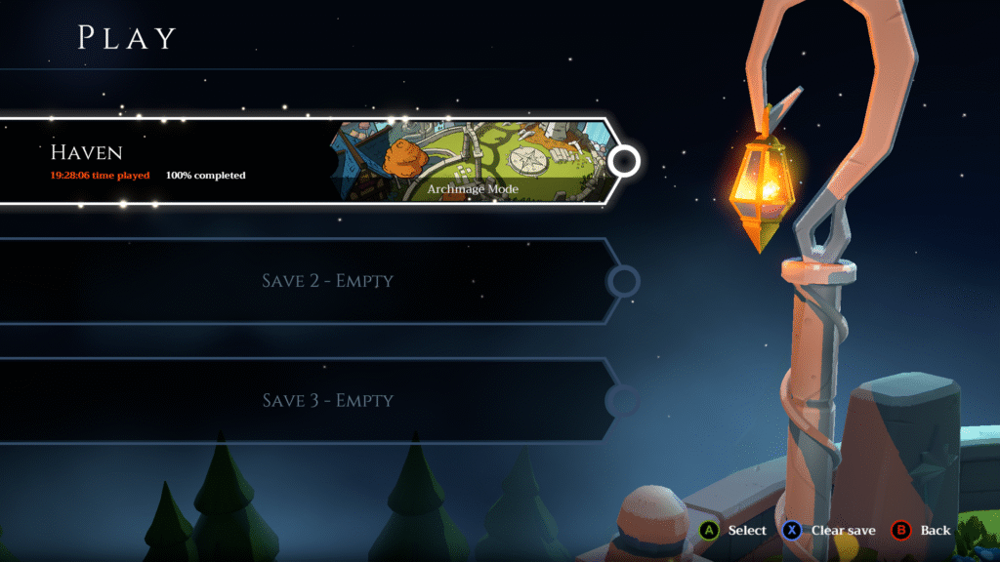
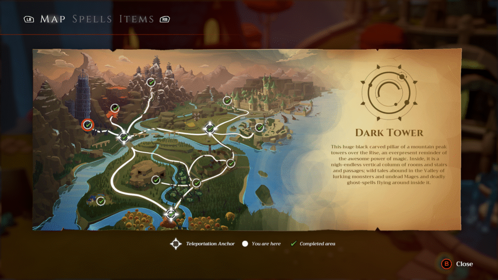
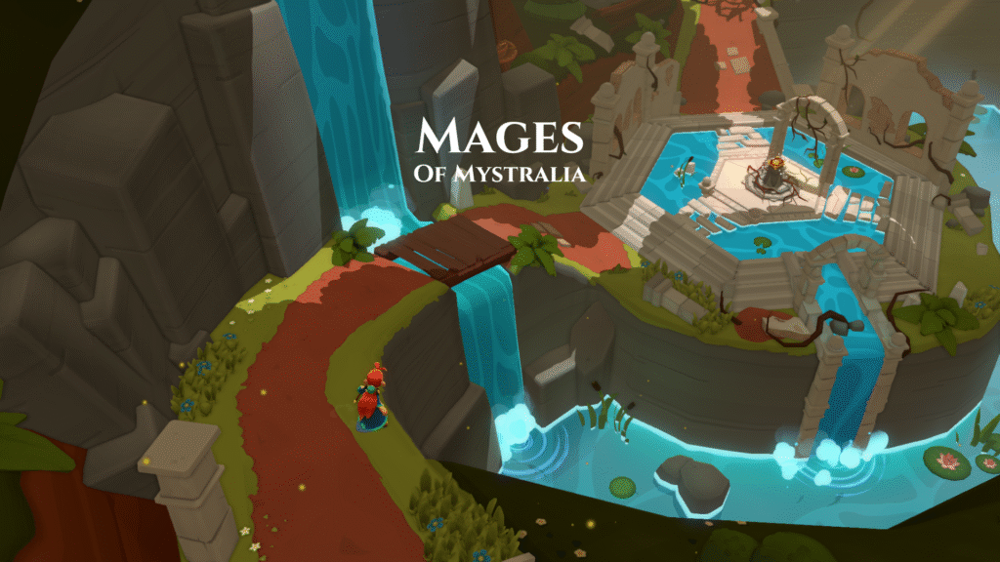
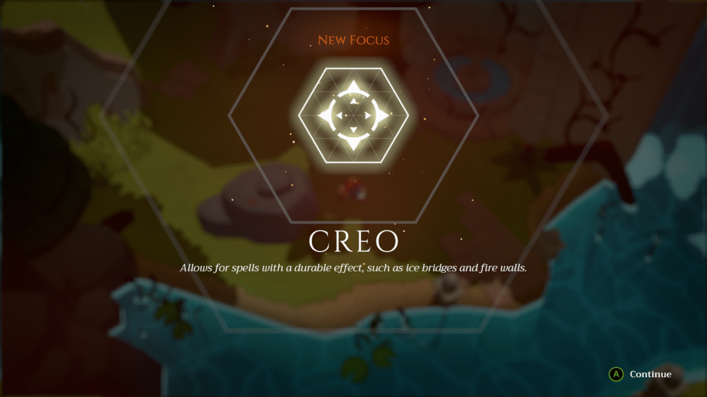
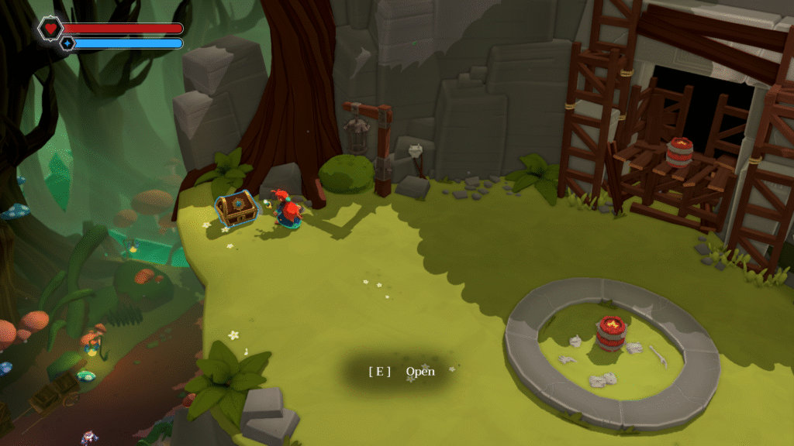
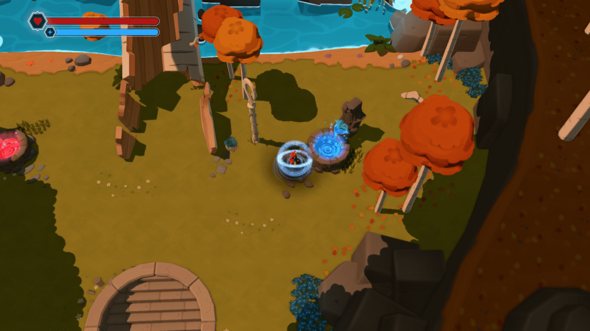
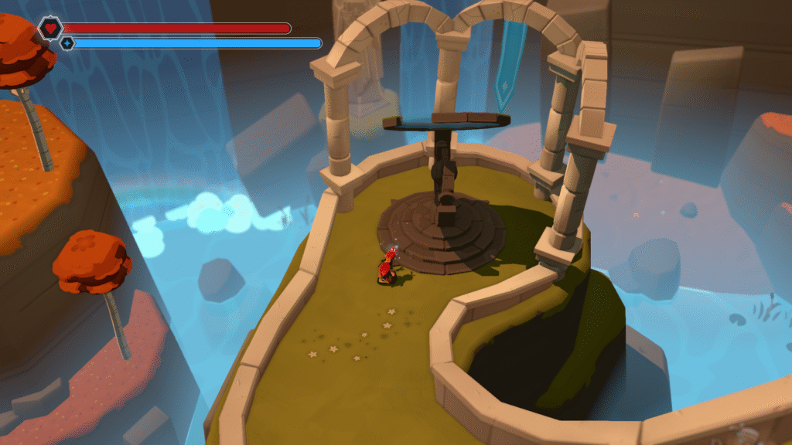
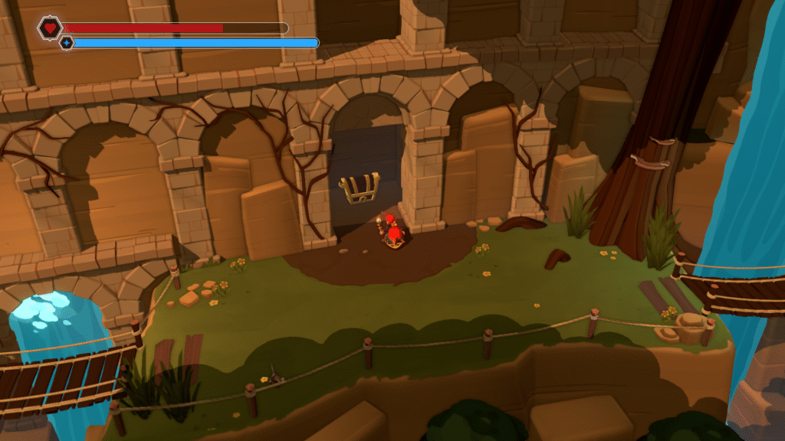
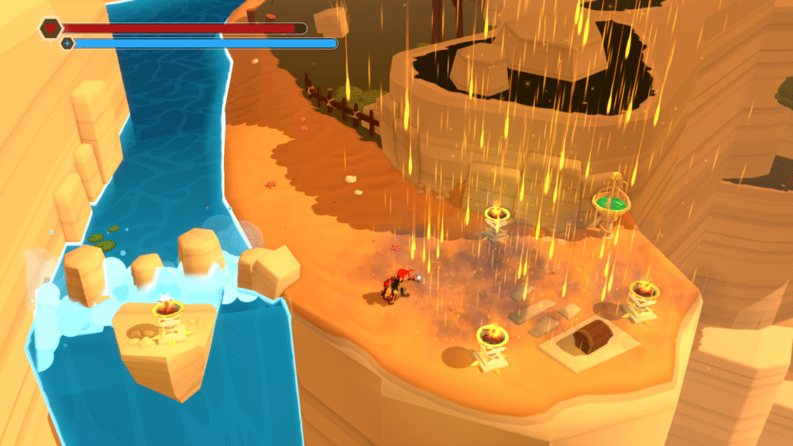
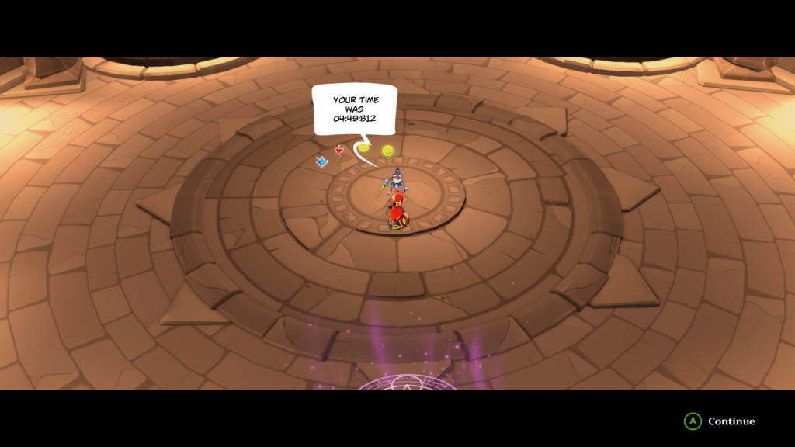

最近[ゲーム](/posts/2025/05/the-werecleaner-game-review/)熱が出てきたのでMages of Mystraliaをプレイしました。相変わらず難易度は少し高いものを指定しました。一応英語でプレイをしてみましたが、そのせいでストーリーはほぼ覚えてないですね（笑）日本語版もありますので興味があればぜひやってみてください。

今回もEpicの無料配布でプレイしました。[Steam](https://store.steampowered.com/app/529660/Mages_of_Mystralia/)だと実績がありますが、[Epic](https://store.epicgames.com/en-US/p/mages-of-mystralia)だとないみたいですね。なので100%クリアだけを目指してやってました。

### Mages of Mystralia 概要

ざっくり概要を話せば魔法に目覚めた少女が世界を救うため、師匠とマスターの力を借りて世界を救う話です。

ストーリー自体は王道ですが、この世界は魔法使いが嫌われています。更に目覚めたとき家を爆発させたというのもあり、割と絶望的な始まりを迎えます。その後、同じ村の人に会いますが嫌われている描写もあります。

### Mages of Mystralia 詳細画面

Mages of Mystraliaのプレイ画面はこんな感じ。崖から落ちるとダメージを受けるので注意が必要ですね。もちろん海や池に落ちても同様にダメージを受けます。

魔法はこんな感じ。今回は4種類の魔法、4種類のタイプとたくさんのルーンで構成されています。ルーンに関しては魔法、タイプ、他のルーンとの組み合わせで色んな効果を作り出します。そこが面白いところのポイントですが、よくわからず使わないで終わったルーンもありますね。

このタイプの宝箱は貴重なものが入っています。ルーンや強化アイテムですね。もう少し質素なものであれば強化アイテムやお金が入ってます。

強化アイテムを消費することで体力かSPを増やすことができます。最大5回までなのでSPから強化しても問題ありません。全てのアイテムを集めれば最終的には両方最大まで強化できます。

### Mages of Mystralia 不明箇所

Mages of Mystraliaをプレイして少し不明だった部分や攻略について話していこうと思います。まずはこの部分ですね。物語の後半でHavenの観測機からスカイシェードを入手できます。私が見逃しただけで誰かが話していたかもしれませんが、私は調べるまで気づきませんでした。

その後、龍の紋章がある場所(The Rise)に向かってスカイシェードを使うとエリクサーを手に入れることができます。エリクサーは体力とSPの最大値を増やします。

### パズル攻略

最後にパズルや戦闘の攻略についてです。基本パズルを解くときは火炎弾を出して火をつけるのがセオリーです。そこにいろんなルーンを追加してうまいこと玉や時間を調整して火をつけます。

このゲームのパズルですが難易度によって微妙にパズルが異なります。そのため、難易度を上げると敵の強さだけでなくパズルの難易度も少し上がります。

ただ、抜け道があり戦闘ではほぼ無双かつパズルをごり押しする方法があります。それがRainというルーンになります。

魔法のタイプはImmedi(直接攻撃)、Actus(遠距離攻撃)、Creo(地形に作用)、Ego(自身に作用)の4つがあります。rainというルーンはCeroとの相性がかなり良いもので下の画像のようになります。

もちろん炎だけでなく他の属性でも同様の感じになります。範囲が広く断続的に攻撃をし、5秒ほどその場に残るという特性があります。更にこれで松明に火をつけることができるので、ほとんどのパズルをこれでごり押しすることができます。

ただ、このルーンを取得するのは後半になりそうですが。

### "Rain"というルーンについて

更にこのルーンは色んなルーンを付けることで更に強くできます。moveを付ければ正面に発生させ、timeを付ければ滞在時間の延長、sizeを付ければ範囲の拡大ができます。更にrandamを使えばコストを抑える効果があります。

randamは発生する方向がランダムになるが、SPの消費コストを抑えるというものになります。ただ、rainの場合は範囲を広げればそこまで気にならなくなります。そのため、大量に発生させやすくなります。

もう一つrainを使うなら炎がおすすめです。他の属性は道を作ったり、謎を解くのに使うことが多いです。その点炎は全く使い道がないので気軽に設定できます。

個人的にはこれを使う場合はイグニの杖がおすすめです。通常同じ属性の敵は耐性があるのですが、イグニの杖は炎耐性を無視し、炎攻撃の威力を50%上げます。耐性によってどれくらいダメージが減少されるかはわかりませんが、おそらく半減だと思われます。

お金を払って200%ダメージにするというものもありますが、入手のしやすさで言えばこれが楽だと思います。

試練というクエストがあり、12wave敵と戦うというクエストがあります。1度クリアすると2度目の挑戦で10分以内という挑戦が出てきます。これもrainを使えば楽々クリアできるのでおすすめです。

という感じでアクションゲームを楽しみました。また、他のゲームをやりたいなと思いつつも英語も頑張らないといけないので悩ましいですね。ではでは。
