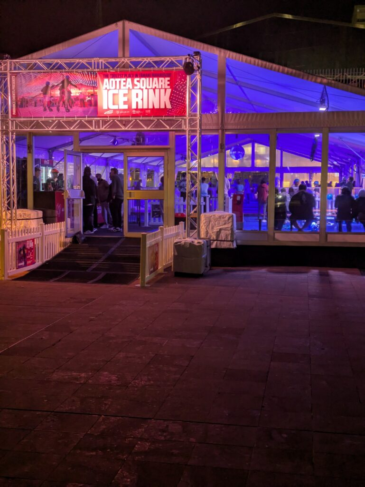
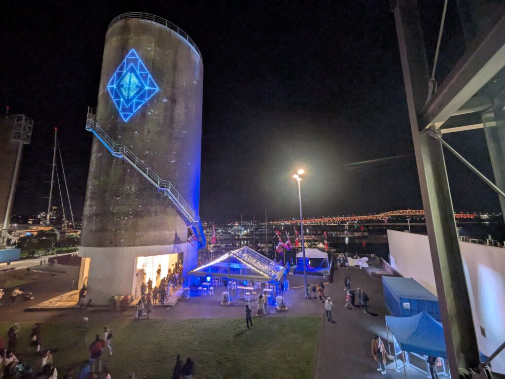
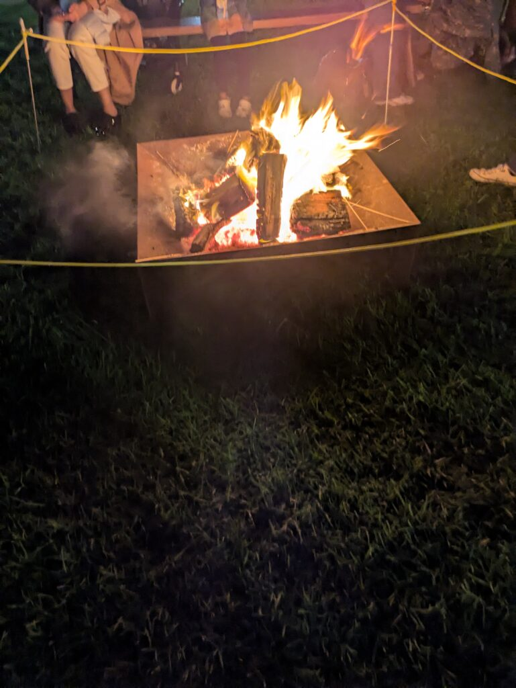

## English\_Practice

I took it easy because of holiday on last Friday called "Matariki". "Matariki" is new year's day of Maori and it depends on annual date. However, it's same that the date is Friday on June.

### Ice Skate

I saw the ice skate at first. I think staffs set up it and they can build easily. There are loads of people inside so I didn't enter, but it looked fun.

I played ice skate before so I can do it. Nevertheless, I remember that my father injured so I felt a little fear.

### Matariki Event

The event was held in the silo park last Saturday. I had never eaten some food at stalls so I bought them. I bought a crispy chicken but it was too crispy.

I saw event stage, illumination and projection mapping. This mapping was out from a car. I guess Tokyo's projection mapping is better than that, but I didn't care because it isn't made by govermment.

Moreover, there was a telescope which I can watch Mars. I watched it after waiting for 10 to 15 minutes. It was quite small but I was glad to watch it.

### Matariki Bonfire

I saw bonfires. I was comfortable because there were 4,5 bonfires. I cooked baked marshmallow and ate it because I received it for free. I wonder if the bonfire is comfortable. It looks hard to camp but I think it is good for bonfire.

I guess some people enjoyed outside, but I like taking it easy so I stayed home. However, I learned so I studied a little hard.

I received announcement which is free course by Japan reskilling consortium. I studied it and listening. I woudl like to level up IELTS Band. See you later.

## 日本語版

金曜日がMatarikiという休日だったのでだらだらと過ごしてました。Matarikiはマオリの元旦みたいで、毎年日付が異なります。とは言え6月の金曜日であることは変わりませんが。

### アイススケート

最初見かけたのはアイススケートですね。設置型なので組み立てなども自由なんだと思います。中は人が多かったので入ってはないですが、楽しそうではありました。

昔滑ったことがあるのでできるとは思いますが、父がこけて怪我したことを思い出したので少し怖い部分もありますが…

### Matariki イベント

次の日はsilo parkというとこで[イベント](https://www.matarikifestival.org.nz/matariki-events/matariki-evening-lights/)っぽいものをやってました。屋台はいつも出てますが、食べたことなかったのでいくつか買ってみました。クリスピーチキンを買いましたが、カリカリすぎて微妙でしたね。

それ以外だとイベントの舞台とイルミネーションとプロジェクションマッピングですね。ちなみにこのマッピングは車から出ていました。恐らく東京の物よりは見劣りしますが、こっちは民間だと思うので特に気にはなりませんでした。

それから火星を見ることができる望遠鏡がありました。並んでましたが10-15分くらいで見ることができました。かなり小さかったですが久しぶりに見れて良かったです。

### Matariki 焚火

後は焚火ですね。4,5か所ぐらいあって心地よかったです。マシュマロが無料で配布されてたのでもらって焼きマシュマロにして食べました。なぜ焚火はあんなに落ち着くのか不思議ですね。キャンプは大変そうですが、焚火のためならありな気もします。

人によってはいろんな場所で楽しんでいると思いますが、私はだらだらとしてるのが好きなので家にいました。とは言え勉強もしていたので完全にだらだらしてたわけではないですが。

少し前に日本リスキリングコンソーシアムから無料コースのお知らせが来てたので、そちらを少しやったり、リスニングなどをしてました。IELTSのバンドも上げていきたいですし。ではでは。

## AI採点

## スコア評価（Band推定）：

- **Task Response (TR)**: 7.0

- **Coherence and Cohesion (CC)**: 6.0

- **Lexical Resource (LR)**: 6.0

- **Grammatical Range and Accuracy (GRA)**: 5.5

- **総合予測スコア**: **6.0**

* * *

## 詳細なフィードバック

### Task Response（内容の適切性）

良かった点:

- トピックを幅広くカバーし、個人の経験や感想を明確に述べている。

減点対象:

- 一部の内容が曖昧で具体性がやや不足している箇所がある（例：Ice skateの説明）。

改善提案:

- 各体験に対してもう少し詳細な描写や具体例を加えると、説得力が増します。

* * *

### Coherence and Cohesion（論理性とまとまり）

良かった点:

- 段落構成は明確で、セクションごとの見出しが役立っている。

減点対象:

- 文章の繋がりが不自然な部分や、接続語の不足がある（例："However, it's same that the date is Friday on June." →不自然な表現）。

改善提案:

- 接続詞や論理展開を整理し、スムーズな繋がりを作ること。

* * *

### Lexical Resource（語彙力）

良かった点:

- 一般的な語彙の範囲で十分コミュニケーションが取れている。

減点対象・改善ポイント:

- 語彙の不適切な使用や表現が曖昧な箇所あり：
    - 「ice skate」→「ice skating rink」
    
    - 「build easily」→「easily assembled」
    
    - 「I was comfortable because there were 4,5 bonfires」→「It felt cozy because there were four or five bonfires」
    
    - 「received announcement」→「received an announcement」
    
    - 「I studied it and listening」→「I studied it and also did some listening practice」

改善提案:

- より自然な英語の表現を意識し、状況に適切な語彙を選ぶこと。

* * *

### Grammatical Range and Accuracy（文法の多様性と正確さ）

良かった点:

- 単純な文構造は概ね正確。

減点対象・改善ポイント:

- 冠詞や前置詞、時制のミスが散見される。

具体的な誤りの指摘と修正例：

- 「I took it easy because of holiday on last Friday」  
    →「I took it easy because last Friday was a holiday」

- 「new year's day of Maori」  
    →「the Māori New Year」

- 「it depends on annual date」  
    →「its date varies each year」

- 「it's same that the date is Friday on June.」  
    →「it always falls on a Friday in June.」

- 「staffs set up it」  
    →「staff set it up」

- 「I played ice skate before」  
    →「I have ice skated before」

- 「my father injured」  
    →「my father got injured」

- 「I had never eaten some food at stalls」  
    →「I had never eaten any food from the stalls」

- 「there was a telescope which I can watch Mars」  
    →「there was a telescope through which I could see Mars」

- 「I cooked baked marshmallow and ate it because I received it for free」  
    →「I received marshmallows for free, roasted them over the bonfire, and ate them」

- 「I wonder if the bonfire is comfortable」  
    →「I wonder why bonfires feel so comforting」

- 「I studied it and listening」  
    →「I studied it and practiced listening」

- 「I woudl like to level up IELTS Band」  
    →「I would like to improve my IELTS band score」

改善提案:

- 文法の多様性（現在完了、受動態、比較級など）をより自然に使いこなすこと。

- 時制や冠詞の正確さに注意する。

* * *

### 改善後のサンプル英文

I took it easy because last Friday was a holiday called "Matariki." Matariki is the Māori New Year, and its date varies each year, though it always falls on a Friday in June.

**Ice Skating**  
First, I noticed an ice skating rink. It was a temporary setup, so I assume the staff can easily assemble it. There were many people inside, so I didn’t enter, but it looked enjoyable.

I’ve ice skated before, so I believe I could manage it, but I felt slightly hesitant because I remembered when my father got injured while skating.

**Matariki Event**  
The following day, there was an event at Silo Park. I had never tried food from the stalls before, so I bought some. I got crispy chicken, but it was overly crispy and not great.

Other attractions included an event stage, illuminations, and projection mapping. Interestingly, the projection mapping came from a vehicle. It probably wasn’t as impressive as Tokyo’s, but I didn't mind since this was privately organized.

Additionally, there was a telescope through which I could view Mars. After waiting about 10 to 15 minutes, I got a chance to see it. Though it was quite small, it was exciting to see Mars after such a long time.

**Matariki Bonfire**  
There were four or five bonfires, creating a cozy atmosphere. Marshmallows were handed out for free, and I roasted and ate some. I wonder why bonfires feel so calming. Camping seems challenging, but doing it just for the bonfire could be worthwhile.

I imagine some people enjoyed outdoor activities, but since I prefer taking it easy, I mostly stayed home. However, I didn’t just relax—I studied as well.

I recently received an announcement about a free course from the Japan Reskilling Consortium, so I studied some of it and did some listening practice too. I aim to improve my IELTS band score. See you later!
