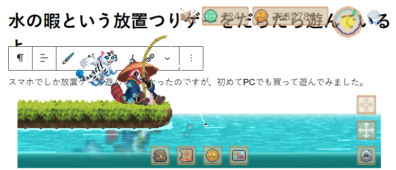
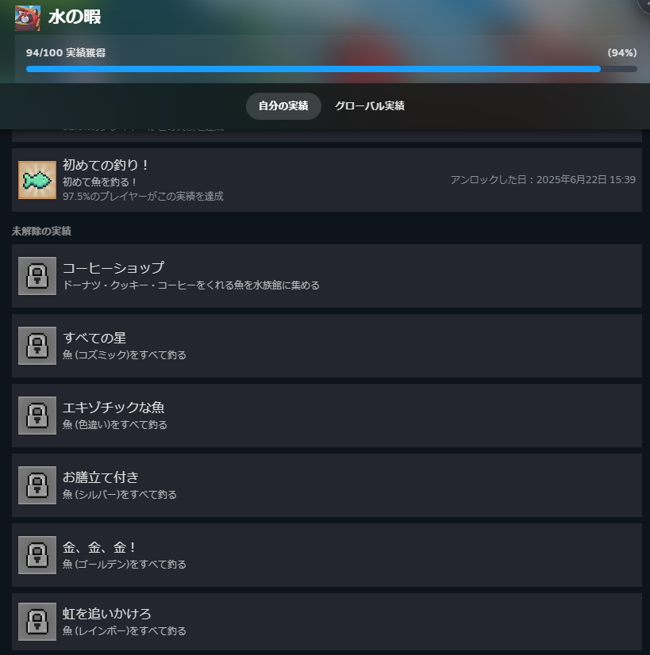
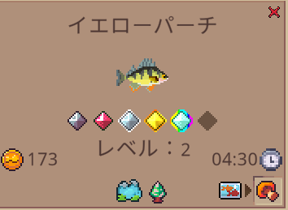

## 水の暇

スマホでしか放置ゲーを遊んでいなかったのですが、初めてPCでも買って遊んでみました。[水の暇](https://store.steampowered.com/app/2963540/_/?l=japanese)というゲームですね。実際の画面はこんな感じ。

### 水の暇 ゲーム概要

画面的には最前面に来て空のほうは透過処理が入っています。もちろん透過は切ることもできます。ゲーム画面はどこにでも移動できます。他のディスプレイに移動させる場合は少し手間ですが、設定から変更することもできます。

つりゲーなので待っている間にひたすら釣りをしてくれます。また、後ろの猫は魚と引き換えにアイテムを探してくれます。価値が高いものを上げるとより良いアイテムを見つけやすくなります。とは言え後半は魚の価値が高くなるのであまり使わなくなりますが。

### 水の暇 進め方

最初のほうはひたすら釣ってお金を稼いでロッドのレベルを上げます。そうすると釣りレベルが上がり新しい場所に行きやすくなります。ただ、レベルが高い魚を釣ると引き上げにかかる時間も多くなります。

そのためには引き上げ速度を上げる必要があるという感じですね。また、魚を水槽に入れるとアイテムを生み出してくれます。このアイテムはチャームづくりやクエストに使ったりします。

チャームはクエストをクリアすると増えたり、レシピをもらうことができます。装備することで特定の魚を釣りやすくなるなどの効果があります。

### 収集要素

最後に収集要素や実績ですね。収集要素としては魚、アイテム、宝物、チャームがあります。とは言え基本的にはクエストをこなせばアイテムや宝物、チャームはコンプリートすると思います。

魚ですがノーマル系はクエストで集まると思います。ただ、レベル10の魚に関しては条件付ですね。この条件はボトルの手紙から判明します。特定の魚やアイテム、時間で釣ることができます。

一番大変なのはレインボー系ですね。ひたすら待つ必要があるので大変ですが時間をかければクリアできると思います。最後の色は全てのクエストをクリアした後、特定の場所で釣るともらえます。レインボーよりは楽だと思います。

という感じで楽しみました。まだ全ての実績をコンプしてませんが、後は放置するだけなのでダラダラと待とうと思います。操作すれば早くクリアできると思いますが、しなくてもまったりできるので画面の余白に余裕があればやってみるといいと思います。安いですし。ではでは。
