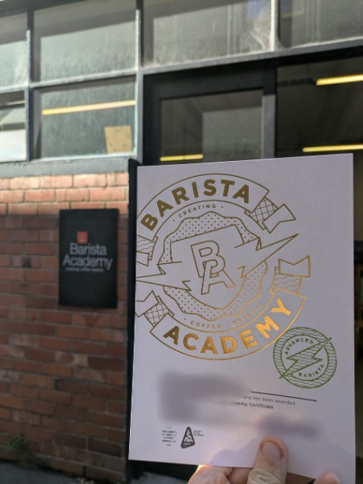
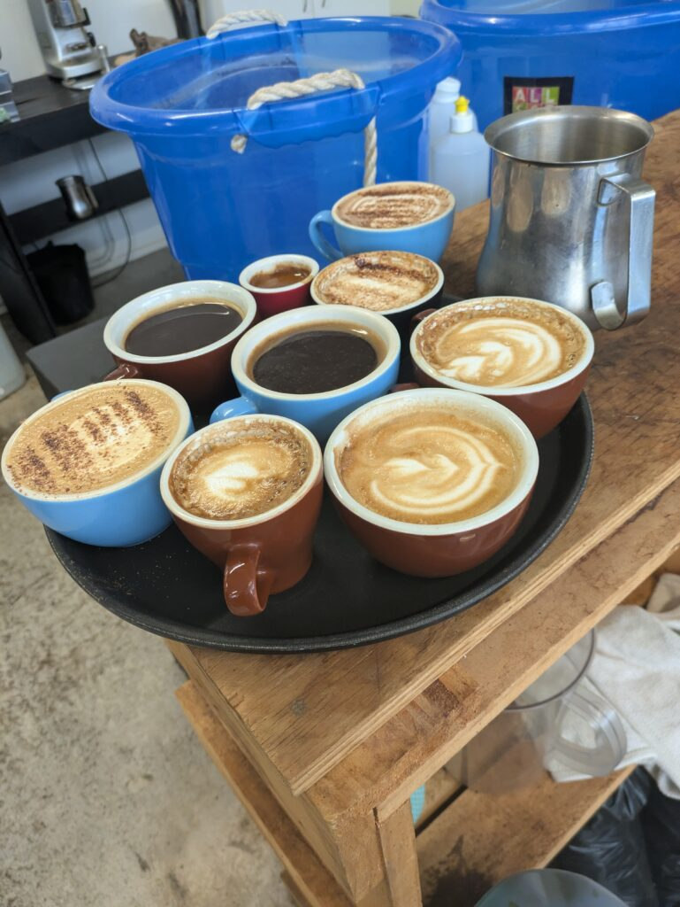

## English\_Practice

### Barista School Overall

I finished my English school for 26 weeks and I learned how to create coffee at the barista school because of useful in the future. I was teached how to create heart latte art and 8 kind of coffee in 5 days course.

I got a qualification and knew how to cook coffee after paying $600. To be honest, I can learn it from videos. I'm not sure that it is worth $600 with a qualification.

The cafe assisstant trust me if I have a qualification so it is better if I work as a barista.

### About Coffee

I learned how to create 8 variety of coffee.

- espresso (default machine)

- mocha(espresso: milk = 5: 5 + choco)

- latte(espresso: milk = 5: 5)

- cappuccino(espresso: milk = 8: 2?)

- flat white(espresso: milk = 9: 1?)

- long brack(espresso: how water = 5: 5, first: how water)

- americano(espresso: how water = 5: 5, first: espresso)

- hot choco(how water + choco + milk)

### Course Contents

First, I learned how to pour milk. It is important to create latte art how much milk foam. There are little milk foam so that it is not enough to create latte art.

Next day, I created latte art which are shape of heart and like flower. I was struggling with it I expected. I was a little disappointed because I couldn't create heart well that day, but I did it next day due to practice.

Next, I learned how to pour coffee. I grinded coffee beans and dripped it to make espresso. It is not difficult because of pushing a button.

Finally, I created 8 kind of coffee above the article. If you understand the difference, it is not difficult, but I'm not sure that my thought is true. My teacher said like that.

Anyhow, it is experience which is barista course. I have to practice creating latte art because I will forget it. See you later.

## 日本語版

### バリスタスクールの概要

26週間もの英語学校生活が終わり、将来に役立つと思って[barista](https://www.baristaacademy.co.nz/barista-coffee-course-auckland)の学校に行ってきました。5日間のコースで8種類ほどのコーヒーとハートのラテアートの作り方を教えてもらいました。

価格は約$600でコーヒーの作り方と卒業証書がもらえるという感じです。ぶっちゃけ作り方自体は動画などでも十分な気はします。卒業証書に$600の価値があるかどうかですね。

一応資格がある分信頼はされやすいので、バリスタになるならちょうどよいかもしれません。

### コーヒーについて

ここで教えてもらったのは8つのコーヒーですね。

- エスプレッソ(マシーンのデフォルト)

- モカ(エスプレッソ:ミルク = 5:5 + チョコなど)

- ラテ(エスプレッソ:ミルク = 5:5)

- カプチーノ(エスプレッソ:ミルク = 8:2 ?)

- フラットホワイト(エスプレッソ:ミルク = 9:1 ?)

- ロングブラック(エスプレッソ:熱湯 = 5:5 熱湯が先)

- アメリカーノ(エスプレッソ:熱湯 = 5:5 エスプレッソが先)

- ホットチョコ (熱湯 + チョコ + ミルク)

### コース内容

最初はスチームミルクの入れ方ですね。ラテアートを作るうえでここが一番重要でどれくらいフォームを作れるかで変わってきますね。ここのフォームが少ないとラテアートを作るうえで足りないことになりますね。

その後はラテアートを作りました。とは言えハートとハートを複数書いた花のような形のものですね。やっぱりここが一番苦戦しました。うまくハートが作れずその日はちょっと落ち込んでましたが、次の日も練習だったのでその時はうまくいきました。

次はコーヒーの入れ方ですね。豆を挽いて必要な分取り出したら抽出してエスプレッソを作るという感じですね。ここはそこまで難しくなくボタンを押すだけなのでサクサクとできました。

最後に上記で描いた8つの種類を作りました。違いを理解すればそこまで難しくないですが、私の考えが合ってるかは微妙ですね。一応先生に聞いた感じだとこんな感じでした。

というわけでバリスタコースを体験した話でした。ラテに関しては練習しないと忘れそうなので家でも練習をしようと思います。ではでは。

## AI採点

## 全体評価（IELTSバンドスコア）: 5.0

理由：

- 全体として、文法、語彙、流暢性のミスがかなり多く、誤用が目立つ。

- 意味は伝わるが、不自然な表現が多く、読み手が努力しないと意図が汲み取れない。

- 語彙の範囲や文法構造が限定的。

* * *

## 項目別評価とフィードバック

### 1\. Task Response（課題への対応）：6.0

- 要求されたトピック（バリスタコースの体験談）を適切に伝えている。

- 情報は明確で比較的整っているが、やや詳細が不足している箇所もある（コースの内容などに深い洞察が欲しい）。

### 2\. Coherence & Cohesion（論理性・一貫性）：5.5

- 段落のまとまりはあるが、接続詞の使用が限定的（First, Next, Finallyなどが単純すぎる）。

- 情報のつながりが弱い部分が多く、文と文の関連性が明確でないことがある。

### 3\. Lexical Resource（語彙の豊富さ）：5.0

- 語彙の幅が狭く、同じ単語の繰り返し（create, coffeeなど）が目立つ。

- 不自然な語彙の選択が多い（cook coffeeなど）。

### 語彙ミスの具体例（修正）：

- create coffee → **make coffee**

- how water → **hot water**

- cook coffee → **make coffee**

- cafe assisstant → **café manager/employer**

- brack → **black**

- grinded → **ground**

- "My teacher said like that." → **My teacher confirmed that.**

### 4\. Grammatical Range & Accuracy（文法の幅・正確さ）：4.5

- 文法的なミスが多く、基本的な動詞の活用・時制のミスが目立つ。

- 受動態の誤用、冠詞のミス、複数形の誤りが多数ある。

### 文法ミスの具体例（修正）：

- "I finished my English school for 26 weeks"  
    → **I finished my 26-week English course.**

- "I was teached"  
    → **I was taught**

- "because of useful in the future"  
    → **because I thought it would be useful for the future**

- "8 kind of coffee"  
    → **8 kinds of coffee**

- "I got a qualification and knew how to cook coffee after paying $600."  
    → **I received a qualification and learned how to make coffee by paying $600.**

- "The cafe assisstant trust me if I have a qualification so it is better if I work as a barista."  
    → **Café employers are likely to trust me more if I have a qualification, so it could be beneficial if I work as a barista.**

- "It is important to create latte art how much milk foam."  
    → **The amount of milk foam is important when creating latte art.**

- "There are little milk foam so that it is not enough to create latte art."  
    → **If there's too little milk foam, it won't be enough to create latte art.**

- "I was struggling with it I expected."  
    → **I struggled with it as I expected.**

- "Next day"  
    → **The next day**

- "I grinded coffee beans and dripped it to make espresso."  
    → **I ground coffee beans and extracted espresso.**

- "It is not difficult because of pushing a button."  
    → **It was not difficult because I just needed to press a button.**

- "Finally, I created 8 kind of coffee above the article."  
    → **Finally, I made the 8 kinds of coffee mentioned above.**

- "it is experience which is barista course."  
    → **This was my experience of the barista course.**

- "I have to practice creating latte art because I will forget it."  
    → **I need to keep practicing latte art so I don't forget it.**

* * *

## 改善のためのアドバイス：

- 基本的な文法事項（冠詞、動詞の時制、複数形、受動態）の正確な使用に集中して練習しましょう。

- 語彙の幅を広げるため、類義語やより自然な表現を学習してください。

- より自然な接続詞（however, although, in addition, furthermore）を使って、論理的な文章構成を意識しましょう。
