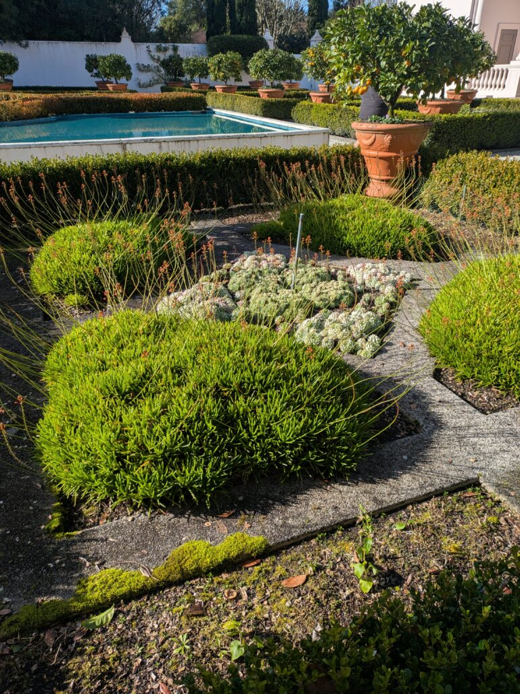
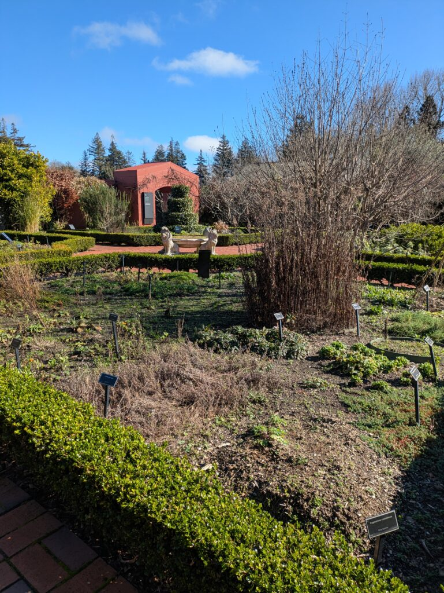

## English\_Practice

I went to the Hamilton Garden at weekend because I bought a car before. I felt a little anxiety because I drove at first time after coming here. It was not problems to just drive. I was a little confused due to different from Japan.

### Hamilton Garden Overall

The Hamilton Garden is open at 10 a.m. I thought there are a lot of flowers in the garden, but this is concept gardens.

For example, Japanese Karesansui. There are concept gardens like that garden and Chinese or Indian garden.

Moreover, the concept garden which is related character was here. For instance, Alice in Wonderland and other movie. I do not know this movie name.

In addition, there are other simple concept. For example, herb, vegetables and sustainability.

It was different from my image, but it was fine to see a couple of gardens.

### Hamilton Garden Thought

Furthermore, developed gardens such as new concept garden will be open if a lot of people donate. For instance, Baroque Garden and Pacific Ocean Garden. I'm a little interested in Baroque Garden. It will look big and gorgeous.

I looked around like this. It was interesting and there were some attractions so you should go there. If you wander around there, it will take for 2,3 hours.

I went there in winter. Probably, it will be spectacular in summer because of many flowers. I want to see it again if the new garden is open. See you later.

## 日本語版

[前回](/posts/2025/07/self-contained-used-car-buying-guide/)車を買ったので週末に[Hamilton Garden](https://hamiltongardens.co.nz/)に行ってきました。こっちに来てほぼ初めての運転になるので少し不安がありましたが、運転自体はそこまで問題なくこなすことができました。若干日本と違う部分もあるので戸惑うこともありましたが。

### Hamilton Garden 概要

Hamilton Gardenは10 a.m.から開いています。ガーデンというと私は花がたくさんあるというイメージでしたが、ここはコンセプトガーデンになっています。

具体的に言えば日本の枯山水がイメージしやすいですね。あのような庭をオマージュしたものや他の国である中国やインドがコンセプトのガーデンがありました。

それからキャラクターがコンセプトになっているガーデンもありました。アリスインワンダーランドがイメージとなってるものや他の映画のコンセプトもありました。私は知らないので名前を忘れましたが。

他にもシンプルなコンセプトもありました。単純にハーブに関する庭や野菜、持続可能性のある庭などいろんなコンセプトとなる庭がありました。

イメージしてたものとはちょっと違いましたがこれはこれで色んなものを見ることができてよかったです。

### Hamilton Garden 感想

また、今開発中の庭などもあり寄付などをすれば新しいコンセプトのガーデンも作られるみたいです。例えばバロックガーデンやパシフィックオーシャンのガーデンですね。バロックガーデンは少し興味がありますね。大きくて豪華そうなので。

という感じで見てきました。割と興味深いですし、見どころがあると思うので是非一度見てみると良いと思います。じっくり見たとしても2,3時間で見舞われれるかと思います。

私が行ったのが冬でした。恐らく夏だと花も咲いてるはずなので壮観だと思います。また、新しいガーデンが出来たら見てみたいですね。ではでは。

## AI採点

## 採点基準別のフィードバック

* * *

### ① 流暢さと一貫性 (Fluency and Coherence): 6.0

- 全体的に一貫した説明ができているが、一部文法や表現の不自然さで流れが途切れている。

- 文同士の接続が弱く、内容がやや断片的になっている。接続詞や論理展開を明確に示すフレーズが不足している。

改善例：

- "Moreover" や "In addition" だけでなく、より自然なつなぎ言葉（Also, Besides, On top of that, Another interesting point is...）を使いましょう。

- "I went there in winter" の後に季節比較を述べるなら、"However, in summer..." のような接続を明確にするとよいでしょう。

* * *

### ② 語彙の豊富さ (Lexical Resource): 5.5

- 語彙は基本的なものが多く、繰り返し使用される語句や単純な語彙に頼っている。

- "garden" や "concept" が頻繁に繰り返され、より具体的で高度な語彙を使用できていない。

語彙のミスの例：

- "It was fine to see a couple of gardens."（fineは弱い。→ interesting, enjoyableなどを使った方がよい）

- "developed gardens"（developedは完成されたものに使うと不自然。→ gardens under development）

改善例：

- "It was fascinating to explore various themed gardens."

- "I felt slightly nervous (anxiousより自然) because it was my first time driving in New Zealand."

* * *

### ③ 文法の正確さと範囲 (Grammatical Range and Accuracy): 5.0

基本的な文法ミスが多く見られ、文法の複雑性も不足。

具体的な文法のミス：

- 誤："I went to the Hamilton Garden at weekend because I bought a car before."  
    正："I went to Hamilton Garden at the weekend because I had bought a car recently."
    - 理由の"before"は曖昧。recently や a few days ago が適切。

- 誤："I felt a little anxiety because I drove at first time after coming here."  
    正："I felt a bit anxious because it was my first time driving since I arrived here."

- 誤："It was not problems to just drive."  
    正："There weren't any major problems while driving."

- 誤："I was a little confused due to different from Japan."  
    正："I was a bit confused because some things were different from Japan."

- 誤："the concept garden which is related character was here."  
    正："There was also a garden inspired by characters."

- 誤："If you wander around there, it will take for 2,3 hours."  
    正："If you walk around carefully, it will take around two to three hours."

* * *

### ④ 発音 (Pronunciation): 評価対象外（音声がないため）

* * *

## 総合的な改善点のまとめ：

- 文法ミスを避け、基本的な文法構造を正確に使用することを重視しましょう。

- 単語の選択をより豊かにし、同じ言葉の繰り返しを避けましょう。

- 内容を説明するときは、具体的で自然な接続詞や表現を使いましょう。

- 正確な過去形、完了形を意識的に使用し、時制を正しく扱いましょう。

* * *

## 改善した模範回答の一例：

"I recently bought a car, so I went to Hamilton Garden at the weekend. Since it was almost my first time driving here, I felt a bit nervous, but driving itself wasn't too difficult. However, I got slightly confused at times because some traffic rules are different from Japan.

Overview of Hamilton Garden

Hamilton Garden opens at 10 a.m. Initially, I imagined gardens full of flowers, but these gardens were themed instead. For instance, there were gardens inspired by the Japanese Karesansui style, as well as gardens reflecting Chinese and Indian concepts.

Additionally, some gardens were based on famous characters or movies, such as Alice in Wonderland, along with other movies whose names I don’t remember.

There were also simpler concepts like herb gardens, vegetable gardens, and sustainability-themed gardens. Although it was different from what I initially expected, I enjoyed seeing various types of gardens.

Impressions of Hamilton Garden

Furthermore, new gardens are currently under development and will open if donations are made. Examples include a Baroque Garden and a Pacific Ocean Garden. The Baroque Garden caught my interest because it sounds large and impressive.

Overall, it was an interesting experience with several highlights, so I recommend visiting at least once. If you take your time exploring, it should take around two to three hours.

I went there in winter, but I imagine it would be spectacular in summer with many blooming flowers. I’d definitely like to visit again when the new gardens open."
