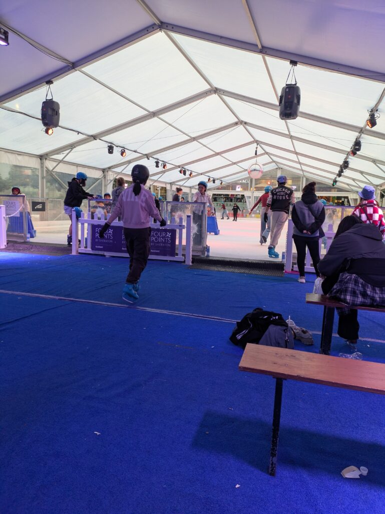

## English\_Practice

The ice skating rink was set at Aotea square in Auckland. I have never seen it in Japan, but it might be ordinaly oversea.

As I wrote about matariki, I played a lot. This was also a schools activity.

I have played once, but I don't remember. I remember that my father had injury before.

### Ice skating fee

Adult cost is $25. Student cost is $19 on every Wednesday. The charge includes ice skating shoes and a helmet. When beginners are not good at playing ice skating, they can use kind of carts. We don't worry about falling over because center of gravity is put front.

### Ice skating thought

If there are 20 or more people, I suffered from playing ice skating due to be narrow. It was fun to use like carts because I played it faster.

Playing ice skating is just sliding so it is a little range for playing, but it was fun. Some people were good at playing it like professional. They slided behind direction and spined. However, I worried about incidents because there were many people there.

I would like to play skiing or snowboarding because I have never played. See you later.

## 日本語版

オークランドの[Aotea square](https://www.aucklandlive.co.nz/show/aotea-square-ice-rink)でアイススケートリンクが設置されていました。あまり日本で即席のリンクを見た記憶がないですが、海外だと普通かもしれません。

以前[matariki](/posts/2025/06/matariki-maori-new-year-experience/)で少し触れましたが今回はガッツリ滑ってきました。学校のアクティビティというのもありますので。

一応昔滑ったことはありますが、ほとんど覚えてないですね。父親が怪我して針を縫った記憶だけはあります（笑）

### 料金

ここのスケートは大人が$25ですね。水曜であれば$19で滑ることができます。スケート靴とヘルメットは料金内に含まれます。初心者でうまく滑れない場合はカートのようなものも使えます。重心を前におけるのでこける心配はないですね。

### 感想

中はそこまで広くないので20人以上いると滑るのに苦労しますね。カートのようなものを使えば早く滑れるのでそれは楽しかったです。

スケートは滑るだけなのであまり遊びの幅はないですが、それなりに楽しめました。中にはプロ目指してたのか？というくらいうまい人もいました。後ろ向きで滑ったり、スピンをしたり。ただ、人も多く危ないので事故らないか心配になりましたが。

次はスキーかスノボーをしてみたいですね。まだやったことないので。ではでは。

## AI採点

### Band Score推定: **5.0**

（以下、各基準ごとのフィードバックを示します。）

* * *

## 1\. Task Response (課題への回答): 5.5

- 内容は概ね質問に沿っていますが、一部の情報が明確でない箇所があります。

- 読み手にとって不自然または曖昧な表現が散見されます。

**改善すべき箇所:**

- "I have never seen it in Japan" →「日本ではほとんど見た記憶がない」が正しいので、"I rarely see temporary ice skating rinks in Japan"とするほうが自然です。

- "Ice skating thought"や"Ice skating fee"という見出しは不自然。"Thoughts on ice skating"や"Pricing"が自然です。

* * *

## 2\. Coherence and Cohesion (一貫性と結束性): 5.0

- 文章間のつながりが弱く、文と文の接続がぎこちない印象があります。

- ディスコースマーカー（接続語句）の使用が少なく、説明の流れが分かりづらくなっています。

**改善すべき箇所:**

- "As I wrote about matariki, I played a lot." →「マタリキについて以前少し触れましたが」の意味が正しく伝わりません。"I briefly mentioned ice skating during Matariki previously, but this time I spent more time enjoying it." などのように書き換えるべきです。

- "This was also a schools activity." →「学校のアクティビティ」→ "This was part of a school activity."

* * *

## 3\. Lexical Resource (語彙力): 5.0

- 語彙のミスや不適切な単語選択が多く、特に基本的な語彙での誤用が目立ちます。

**改善すべき箇所（語彙ミス）:**

- "ordinaly" → **ordinary**

- "oversea" → **overseas**

- "played ice skating" → **went ice skating**または**skated**

- "ice skating shoes" → **ice skates**

- "carts" → **support frames**または**skating aids**

- "slided behind direction" → **skated backwards**

- "spined" → **spun**

- "incident" → **accidents**

- "Adult cost is $25." → **The cost for adults is $25.**

- "Student cost is $19 on every Wednesday." → **Students can skate for $19 every Wednesday.**

* * *

## 4\. Grammatical Range and Accuracy (文法の範囲と正確さ): 4.5

- 文法的な誤りが頻繁に見られ、複雑な構文の使用が少ないです。

- 時制の誤りや前置詞・冠詞の不適切な使用が特に目立ちます。

**改善すべき箇所（文法のミス）:**

- "The ice skating rink was set at Aotea square" → **An ice skating rink was set up in Aotea Square.**
    - 施設の設置には通常 "set up" を使います。
    
    - 固有名詞の「Square」は大文字が正しいです。

- "I have played once, but I don't remember." → **I had skated once before, but I hardly remember it.**
    - 経験を話す場合は過去完了か現在完了が自然です。

- "my father had injury before." → **my father got injured once.**
    - 「injury」は名詞であり、動詞のinjuredを使います。

- "center of gravity is put front." → **the center of gravity is shifted forward.**

- "I suffered from playing ice skating due to be narrow." → **I found it difficult to skate because the rink was small.**
    - "suffer from"は病気や痛みを表現するときに使うので、ここでは不適切。

* * *

## 模範例文（改善後の参考例）:

An ice skating rink was set up at Aotea Square in Auckland. I rarely see temporary ice rinks in Japan, but they might be common overseas.

I briefly mentioned ice skating during Matariki previously, but this time I skated properly, as it was part of a school activity.

I had skated once before, but I hardly remember it, apart from my father getting injured that time.

**Pricing**

The cost for adults is $25, but students can skate for $19 every Wednesday. The fee includes ice skates and a helmet. Beginners who have difficulty skating can use skating aids (support frames), which shift your center of gravity forward and prevent falls.

**Thoughts on ice skating**

The rink isn't very spacious, so skating becomes challenging when there are more than 20 people. However, using skating aids was enjoyable because they allowed me to skate faster.

Ice skating mainly involves sliding, so there isn't much variety in terms of activities, but it was still enjoyable. Some people skated exceptionally well, almost professionally, skating backwards and spinning. Still, I worried about accidents because the rink was crowded.

Next time, I would like to try skiing or snowboarding since I've never done either before. See you later!
