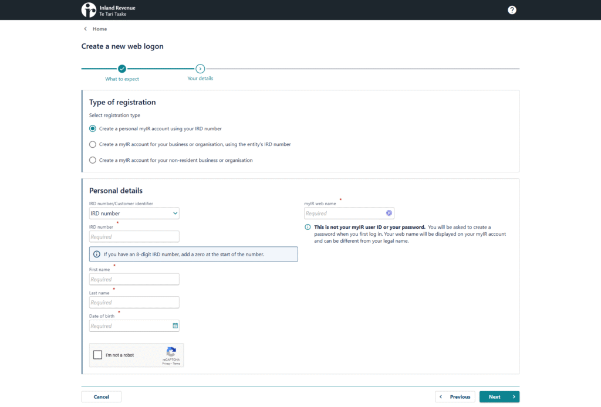
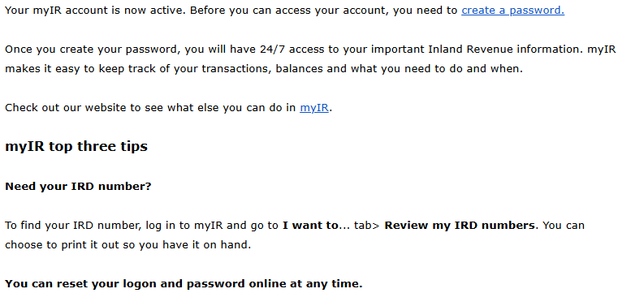

## English\_Practice

I received an IRD number before. I needed to register on myIR, but I felt bored because of calling.

However, I gonna graduate the school and I will start to work so I decided to activate my myIR account. I'm not sure other way how to activate, but someone quotes this page.

### myIR\_Process

Firstly, I accessed this webpage and filled in an IRD number, name and birthdate.

I got the order which the view was written after filling in an userID. I later called and the voice AI asked requirement.

### myIR\_Phone Register

I needed to register the voiceID so I started to do.

I needed my IRD number and phone number to register the voiceID. It didn't take for long time to speak slowly. I struggled with registering.

I called the ordered number after registering. I also called to the voice AI. However, I didn't tell better for activating my account. I gave up and called other phone number because I didn't do better.

I called the voice AI next, but the reception phoned me after telling my IRD number. I toled that I couldn't activate my account. After that, she emailed to me.

The email showed that I created password because of activating my account. I finished createing password and loging in the website. I was quite stressful but I completed. See you later.

## 日本語版

[以前](/posts/2025/02/ird-application-guide/)IRDナンバーの取得を行いました。そこからmyIRへの登録が必要なのですが、電話が面倒でやらずにそのままにしてました。

ただ、もうすぐ学校を卒業で仕事も始める予定なので重い腰を上げてアカウントの有効化をすることにしました。人によっては別のやり方もありそうなので、参考程度になればと思います。

### 手順

まずは[サイト](https://myir.ird.govt.nz/tools/_/#1)にアクセスしIRDナンバー、名前、誕生日付を入力します。

userIDを決めて進めると電話を掛けてくださいと指示が出ます。そこで電話を掛けると音声AIが出て要件を聞かれます。

### 電話登録

とは言えvoiceIDを登録する必要があるのでまずはそこから始めました。

voiceIDを登録する際はIRDナンバーと電話番号が必要になると思います。早口でしゃべらずゆっくりめに意識すればそこまで時間はかからないと思います。私は登録にすら苦戦しましたが…

登録した後は指示があった場所に電話を掛けました。ここでも同様に音声AIとの通話になります。ただ、IRDナンバーを伝えた後、アカウントの有効化を伝えましたがうまくいきませんでした。何度やってもうまくいかなかったので、諦めて他の電話番号にかけました。

次にかけたとき電話に出たのは同様に音声AIでしたが、IRDナンバーを伝えると受付の人が出ました。そこで有効化できない旨を伝えるとメールを送ってくれました。

メールには有効化ができたのでパスワードを作成してくださいという内容でした。パスワードを作成してログイン出来ればそれで完了ですね。個人的にはかなりストレスがかかりましたが、なんとか終わらせることができました。ではでは。

## AI採点

### 採点・フィードバック（IELTS Writing Task 2基準）

**採点観点**

1. **Task Response**

3. **Coherence and Cohesion**

5. **Lexical Resource（語彙）**

7. **Grammatical Range and Accuracy（文法）**

* * *

## 1\. Task Response（タスク達成度）

- 内容は一通り説明できていますが、英語文は日本語文に比べて詳細やニュアンスが抜けている部分が多く、**説明の流れや意図が曖昧**な箇所が複数あります。

- 一部の内容が不明瞭で、読者視点では「何をしたのか」「なぜそれが問題だったのか」**十分に伝わらない**部分が目立ちます。

* * *

## 2\. Coherence and Cohesion（論理展開と結束）

- 文や段落のつながりが弱く、**論理的な流れに欠ける**ところが多いです。

- "I struggled with registering." や "I didn't tell better for activating my account." のように、前後の因果関係や理由があいまいです。

- "See you later." はこの文脈には合いません（カジュアルな別れの挨拶であり、説明文では不要です）。

* * *

## 3\. Lexical Resource（語彙）

- **語彙の選択ミス・不自然な表現**が多いです。
    - "I felt bored because of calling." → boredは「退屈」。「面倒」と言いたい場合は "I found it bothersome" や "I couldn't be bothered to call"。
    
    - "I gonna graduate the school" → "I'm going to graduate from school"（カジュアル表現gonnaは適切でない）。
    
    - "quotes this page" → 意味が不明。「refer to this page」などが自然。
    
    - "I got the order which the view was written after filling in an userID." → 意味不明。指示/メッセージが表示された旨をはっきり書く。
    
    - "the voice AI asked requirement." → 文法的にも意味的にも不自然。 "the voice AI asked me what I wanted to do."など。
    
    - "I didn't tell better for activating my account." → 意味不明。おそらく「アカウントの有効化をうまく伝えられなかった」→ "I couldn't successfully activate my account over the phone."
    
    - "I didn't do better." → "It didn't work"などが正しい。
    
    - "the reception phoned me" →「受付が電話をかけてきた」という意味だが、実際は「受付に繋がった」ので "I was connected to a staff member."
    
    - "The email showed that I created password because of activating my account." → "The email instructed me to create a password to activate my account."
    
    - "I finished createing password and loging in the website." → "I created the password and logged in to the website."
    
    - "I was quite stressful but I completed." → "It was quite stressful, but I managed to complete the process."

* * *

## 4\. Grammatical Range and Accuracy（文法・冠詞・単複）

- **文法ミス・冠詞ミス・単複ミスが多い**です。
    - "I needed to register on myIR, but I felt bored because of calling."
        - "felt bored"は文脈不一致。
    
    - "I gonna graduate the school"
        - "gonna"はフォーマルでNG、"the school"は"school"でOK。
    
    - "I needed my IRD number and phone number to register the voiceID."
        - 正しいが、その後の文が途切れている。
    
    - "It didn't take for long time to speak slowly."
        - "It didn't take long to register as long as I spoke slowly."
    
    - "I struggled with registering."
        - OKだが、その前の説明があいまい。
    
    - "I was quite stressful but I completed."
        - "stressful"は人に使えない、"It was quite stressful, but I managed to complete it."
    
    - "I finished createing password and loging in the website."
        - "I finished creating the password and logging in to the website."
        
        - 動名詞のスペルミス・並列構造
    
    - "I toled that I couldn't activate my account."
        - "told" のスペルミス。加えて "I told her" など主語も必要。

* * *

### フィードバック（詳細）

#### 主な減点箇所

1. **語彙と表現**
    - 不自然な言い回しが多く、正確に意味が伝わっていません。

3. **文法・スペルミス**
    - 多数の文法ミス（冠詞、動詞の形、前置詞、動名詞、スペルなど）。

5. **コヒーレンス**
    - 文同士のつながりが弱く、説明が飛び飛びで、全体像が見えづらい。

7. **一貫性のある時制の使用**
    - 時制が混乱しています（過去形/現在形の混在）。

9. **不明瞭な内容**
    - 何をどの順番で、どう苦労したかがはっきり書かれていません。

* * *

## IELTSバンド目安

- **内容や情報量**…5.0〜5.5相当
    - Task responseは満たしているが、語彙や文法エラーでかなり減点

- **語彙/文法**…4.5〜5.0相当
    - 日常会話は伝わるが、やや曖昧・誤用が多く、自然な英語になっていません

* * *

## 修正例（改善モデル文）

以下はよりナチュラルでIELTS 7.0+を目指せるモデル文です。

* * *

**Model Answer:**

I obtained my IRD number some time ago, but I put off registering for my myIR account because I found the process—especially making a phone call—a bit troublesome.

However, since I will be graduating from school soon and starting a job, I finally decided to activate my account. There might be other ways to do it, but I hope this account will be helpful to some.

Here’s how I did it:

First, I accessed the website and entered my IRD number, name, and date of birth. After setting up my user ID, I was instructed to call a specific phone number. When I called, I was greeted by a voice AI that asked me for my requirements.

Before proceeding, I had to register for a voice ID. To do this, I needed both my IRD number and my phone number. If you speak slowly, the registration doesn’t take very long—but I personally struggled with this step.

Once I registered my voice ID, I called the number I had been given. Again, the voice AI answered, and after providing my IRD number and requesting to activate my account, I still couldn’t complete the process. After several unsuccessful attempts, I tried calling a different number.

This time, after giving my IRD number, I was connected to a staff member. I explained that I was having trouble activating my account, and she kindly sent me an email with instructions.

The email told me that my account had been activated and that I should create a password. Once I created my password and logged in, the process was finally complete. Although it was quite stressful, I managed to get everything done in the end.

* * *

**主な改善点**

- 内容の抜けや曖昧な点を補完

- 語彙や文法の正確性を強化

- パラグラフ構成を明確にし、論理的な流れを強調

- IELTS 7.0+水準のナチュラルな表現に修正
