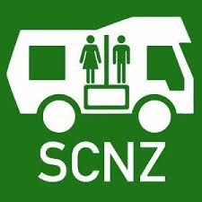

## English\_Practice

I had a student visa when I came here, but I wanted to stay for a long time so I applied for working holiday visa. I will write about working holiday visa someday.

I extend my visa for 1 year so I bought a car because I thought I would like to go around in NZ. Moreover, I wanted to try to stay in my car. Therefore, I bought it.

### Sleeping in my car

I think you can sleep in your car in Japan in case where you park. On the other hand, it is difficult to sleep in the car in NZ if you use your ordinally car. In addition, if you want to stay parking for free, it is more difficult.

Therefore, I have to have a sticker called "self-contained" in this country. In case I register it to this car, I can sleep in the car in a campsite. You need to prepare a lot of equipments to do camp to apply. On the other hand, it is too hard to prepare everything so I bought a old car.

However, if you want how to travel and you stay in accomodation, you should buy a ordinally car. I think almost all of people don't buy a car. It cost $3000 so that you must afford money. It is cheap to buy experience because you can sell same value.

### How to buy self-contained

Anyhow, I bought a old self-contained car. You can buy somewhere especially Trade me or Marketplace. I bought my car at the marketplace. It is simple how to buy it.

You should contact with opponent when you are interested in a car. I think it is better to check description. For example, vehicle inspection, appearance and some equipments. Sometimes, you find difference and dysfunction.

You contact with opponent to buy if you are sure that you check the car for viewing. You can tell immediately or later. However, be careful because other people might buy it.

### After buying

In addition, you need to change to buyer after purchase. You can change it at the post office or online. After that, you get own your car.

Finally, the insurance is different between personal and property accident. You should get insurance despite options.

I bought a old car like that. If you buy a old self-contained car, you should google. However, some people don't realize to tag so that I recommend you should google latest cars.

Furthermore, a lot of cars are sold in Auckland, but there are not many cars in other cities. I think the market is active where there are a lot of people. See you later.

## 日本語版

こっちに来たときは学生ビザで来ましたが、もう少し居たかったのでワーキングホリデービザを申請しました。まだ書いてないのでいつか書いておこうと思います。

1年延長したのでせっかくならあちこち行ってみようと思って車を買うことにしました。更に車中泊をしてみたかったので、そこも考慮して購入した車になります。

### 車中泊について

日本だとどんな車でも車中泊ができると思います。車を止める場所は場合によりけりかもしれませんが。ニュージーランドでは普通の車で車中泊することは難しいですね。更に無料の場所となると限られた場所になると思います。

そのため、この国ではself-containedと呼ばれるステッカーが存在します。これを登録している車はキャンプサイトなどで車中泊できるというものですね。これを登録するにはいろいろと設備を整えたうえで申請をする必要があります。一から整えるのは大変なので中古を買ったという経緯がありますね。

ただ、単純に移動手段が欲しくて宿泊は施設に泊まるのであれば普通車でいいと思います。とは言えそもそも車を買う人はそこまで多くないと思いますが。買うにしても$3000(25.5万円)くらいなのである程度余裕がないと買えないですからね。もちろん同じ値段で売れるとは思うので経験を買うと思えば安いかもしれませんが。

### self-containedを買った手順

ともかくこっちでself-contained付きの中古車を買うことにしました。買うところは色々ありますがメインは[Trade me](https://www.trademe.co.nz/a/motors)かFacebookの[Marketplace](https://www.facebook.com/marketplace/?ref=app_tab)になります。私はmarketplaceで買いました。買い方自体はシンプルですね。

気になった車があれば連絡をします。しっかりと説明が書かれてあるものが良いと思います。車検や外観、どんな器具があるか見ておいた方が良いと思うので。更に内見もした方がいいですね。思ったのと違ったや不備が見つかったりすると大変だと思うので。

連絡をして下見もして問題なければ購入する旨を伝えます。もちろんその場で購入する意思を伝えてもいいですし、後で伝えてもいいと思います。後で伝えた場合は他の人が購入することもありますので注意が必要ですね。

### 購入後

また、購入した後は購入者の変更が必要ですね。オンラインでもできますし郵便局でも変更できます。そこで購入者の変更ができれば無事自身の物ですね。

最後に保険ですが、人身事故に関しては国が保証してくれますが物損に関しては別になります。なので任意ですが入ったほうがいいかもしれません。

という感じで中古車を購入した話でした。もし私と同じようにself-containedを買うのであればself-containedで検索するのもよいと思います。ただ、人によってはタグ付けしてないことに気づいてないこともあるので、最新の車から検索すると選択肢の幅は広がるかと思います。

また、オークランドだとたくさんの車が売られているみたいですが、それ以外の都市は多くないみたいです。やっぱり人が多く集まるところのほうが市場が活発になるんだと思います。ではでは。

## AI採点

### 採点と詳細フィードバック：

#### ① Task Response (タスク達成度): 7.5

- タスクには明確に応えており、情報が具体的。

- ただし、「まだ書いてないのでいつか書いておこうと思います」の部分は話の流れから外れ、やや冗長に感じられます。

#### ② Coherence and Cohesion (一貫性とまとまり): 7.0

- 全体的にまとまりがあり、段落分けも適切です。

- 接続語（However, Therefore, Moreover）の使い方は良いが、一部不自然なつなぎ方があります。

- 特に「Therefore, I bought it」は文脈的に唐突で説明不足です。

#### ③ Lexical Resource (語彙の豊富さ): 6.5

- 語彙は適度に使われているが、不適切または不自然な表現が複数あります。

##### 語彙ミスの詳細な指摘:

- **Ordinally → ordinary**（普通の車）

- **a old → an old**（冠詞ミス）

- **contact with opponent → contact the seller**（相手はseller/buyerなどが適切で、opponentは「敵・対戦相手」）

- **google → search**（googleは動詞として使えますが、この文脈ではsearchのほうがフォーマルでIELTSに適します）

- **stay parking → park overnight**

- **equipments → equipment**（不可算名詞）

#### ④ Grammatical Range and Accuracy (文法の正確さ): 6.0

文法ミスが多く、減点の主な要因となっています。

##### 文法ミスの詳細な指摘:

- **I had a student visa when I came here, but I wanted to stay for a long time**  
    →「longer」のほうが適切（比較表現が明確）

- **I extend my visa for 1 year**  
    →過去形にして「extended」

- **so I bought a car because I thought I would like to go around in NZ**  
    →「go around NZ」（in不要）

- **I wanted to try to stay in my car.**  
    →「I wanted to try sleeping/staying overnight in my car.」

- **if you use your ordinally car**  
    →「if you use an ordinary car」

- **I have to have a sticker called "self-contained"**  
    →「Cars need to have...」「You must have...」が自然

- **I can sleep in the car in a campsite**  
    →「You can sleep at designated campsites.」が自然

- **it is too hard to prepare everything so I bought a old car.**  
    →「it was too difficult to prepare everything, so I bought an old car.」

- **if you want how to travel and you stay in accomodation, you should buy a ordinally car.**  
    →「If you just want a way to travel and plan to stay in accommodation, an ordinary car is sufficient.」

- **It cost $3000 so that you must afford money.**  
    →「It costs around $3000, so you need to have enough money.」

- **you can sell same value.**  
    →「you can resell it for roughly the same price.」

- **You should contact with opponent**  
    →「You should contact the seller.」

- **difference and dysfunction.**  
    →「differences or defects」

- **you need to change to buyer after purchase.**  
    →「You need to register yourself as the new owner.」

- **you get own your car.**  
    →「the car officially becomes yours.」

- **despite options.**  
    →「though it's optional.」

- **some people don't realize to tag**  
    →「some people don't realize they need to tag their listings.」

#### 総合スコア： 6.5～7.0

- 全体的にタスク達成度と一貫性は高いですが、文法と語彙のエラーが目立ちます。

- 文法的なミスと語彙の不自然さが改善されれば、7.5以上も狙えます。
