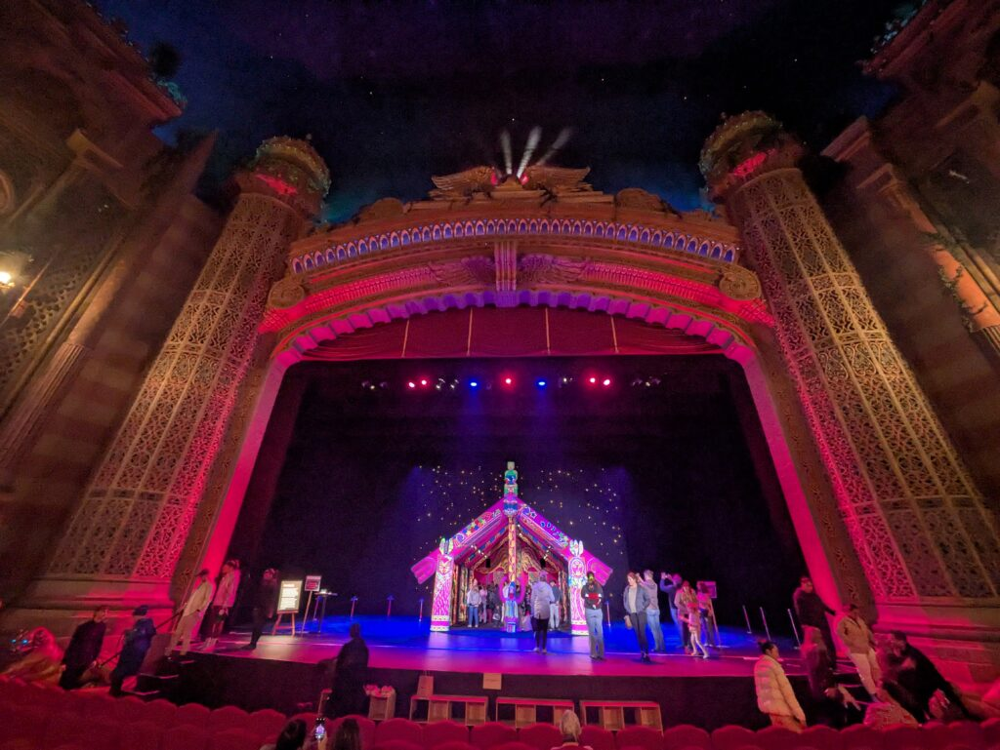

## English\_Practice

I think this event is similar to a matariki event. Anyway, I joined the Wharenui event. This is held at the Civic. Moreover, it costs free.

In addition, there are some events such as misucal, shows and live there. I came there at first time so I thought I want to see some performances once.

### Wharenui Event Details

I saw knitted objects in this event. Like this.

These objects normally put in this house object. I listened to music and voice inside by accident. The light using live was used usefully.

After that, I heard researcher's talking. I couldn't listen all of his talking because of English. I was admired for his talking.

### Wharenui Event Thought

Kiwi believed appearance, which is taniwha. This is the word which is used like monsters and guardians. I remembered about Japanese God. It is a little similar to Japanese myth which God resides in variety of materials. It is similar between Maori's and Japanese myth.

My friend said Maori's culture is alike Japanese bacause Maori is not related to religion. Anyhow, I enjoyed like this. It took for one hour or less, but I was glad to touch this culture a little.

Moreover, the sigh showed that if someone knits, please hung it. If your hobby is knitting, you should try to challenge. See you later.

## 日本語版

[以前](/posts/2025/06/matariki-maori-new-year-experience/)のmatarikiイベントと似たようなものだと思いますが、Wharenuiというイベントに行ってきました。[ここ](https://www.aucklandlive.co.nz/show/wharenui-harikoa)はThe Civicという場所で開催されています。ちなみに無料で見ることができます。

ちなみにこのCivicという場所は普段ミュージカルやショー、ライブをやってる場所になります。始めて来ましたが、一度は何か見てみたいですね。

### イベント詳細

このイベントは毛糸で作られたオブジェクトの鑑賞ができます。こんな感じですね。

基本的にはこの家のオブジェクト内に作品が飾られていました。たまたま時間が良かったのか、中に入ると音楽と音声が流れるイベントが始まりました。ライブで使われるライトがうまく使われていました。

その後研究者によるトークがありました。もちろん英語なので全ては聞き取れませんでしたが、少し感心する部分がありました。

### イベント感想

マオリにはtaniwha(タイファ)という存在が信じられてました。怪物や守護者として使われる単語のようですね。私が思い出したのは日本の八百万の神ですね。様々なものに神様が宿ると言われてますが、少し似た部分もあるかなと思います。

私の友人曰くマオリも宗教とは無縁なので日本と似たような感じになったらしいです。という感じで楽しんできました。時間は1時間ないくらいですが、少しだけ文化に触れることができてよかったです。

また、毛糸が置いてあり編んだものを壁にかけてくださいと書かれていました。もし編み物が趣味ならば挑戦してみると良いかもしれません。ではでは。

## AI採点

### 採点とフィードバック（IELTS基準）

## 流暢さと一貫性 (Fluency and Coherence): **6.0**

良い点：

- 全体の内容は理解可能で、構成も明確。

- トピックごとに区切られていて整理されている。

改善点：

- 話題のつなぎに使われている表現が単調で不自然 ("Moreover", "Anyway", "In addition"など)。

- 文と文のつながりが途切れる箇所が複数ある。

* * *

## 語彙 (Lexical Resource): **5.5**

良い点：

- 基本的な語彙は十分に使えている。

改善点：

- 語彙選択の誤りや不自然な表現が多い。
    - 「costs free」→「it’s free」または「free of charge」  
        **（「cost」はお金がかかる場合に使う。無料は「free」でOK）**
    
    - 「misucal」→「musicals」（スペルミス）
    
    - 「came there at first time」→「visited for the first time」  
        **（場所に初めて来る場合はvisitを使う）**
    
    - 「hung it」→「hang it on the wall」  
        **（現在形の指示なのでhangを使用）**
    
    - 「appearance」→「existence」または「creature」  
        **（appearanceだと「外見」の意味になる）**
    
    - 「admired for his talking」→「impressed by his talk」  
        **（admireは尊敬や憧れの意味が強く、内容に感銘を受ける場合はimpressedを使用）**
    
    - 「took for one hour or less」→「took less than an hour」  
        **（時間の表現はless thanのほうが自然）**
    
    - 「challenge」→「try it」または「give it a try」  
        **（編み物のような軽い挑戦ではgive it a tryが自然）**

* * *

## 文法の範囲と正確さ (Grammatical Range and Accuracy): **5.0**

良い点：

- 簡単な文法構造は適切に使用できている。

改善点：

- 時制や受動態のミスが目立つ。
    - 「These objects normally put in this house object」→「These objects were displayed inside the house object」  
        **（受動態で展示されていることを表現）**
    
    - 「The light using live was used usefully」→「The lighting used for live shows was effectively utilized」  
        **（語順と語法の修正）**
    
    - 「Kiwi believed appearance, which is taniwha.」→「Maori people believed in a creature called taniwha.」  
        **（文法構造の改善、明確な表現）**
    
    - 「I couldn't listen all of his talking because of English」→「I couldn't understand all of his talk because it was in English.」  
        **（「listen」は「聞く」動作、「understand」は内容を理解するという意味）**
    
    - 「Maori's culture is alike Japanese」→「Maori culture is similar to Japanese culture」  
        **（「alike」は単体で述語的に使う。「similar to」の方が自然）**

* * *

## 発音 (Pronunciation): **評価対象外（文章評価のため）**

* * *

### 全体のバンドスコア: **5.5**

* * *

### 改善後の参考文例（IELTS 7.5レベル相当）

I think this event is similar to the Matariki event I attended before. Anyway, I visited the Wharenui event held at the Civic. By the way, it was free to attend.

The Civic usually hosts musicals, shows, and live performances. This was my first visit there, and I'd love to attend some performances someday.

**Wharenui Event Details**  
At the event, there were various knitted objects displayed, mostly inside a house-like structure. Fortunately, when I entered, music and recorded voices started playing. The lighting, similar to what you'd see at live concerts, was effectively utilized.

Afterwards, there was a talk by a researcher. Although I couldn’t fully understand because it was in English, I found some parts impressive.

**My Thoughts on the Wharenui Event**  
The Maori people traditionally believed in creatures known as taniwha, which can be monsters or guardians. This reminded me of Japanese beliefs, specifically the concept of "Yaoyorozu no Kami," meaning gods residing in various objects or natural elements. There seems to be a similarity between Maori and Japanese myths.

My friend mentioned that Maori culture, like Japanese culture, is not heavily religious nowadays, which makes them quite similar. Overall, I enjoyed the event, even though it lasted less than an hour. It was great to briefly experience Maori culture.

Also, there was yarn provided, and a sign encouraged people to hang their knitted creations on the wall. If knitting is your hobby, I recommend giving it a try. See you later!
