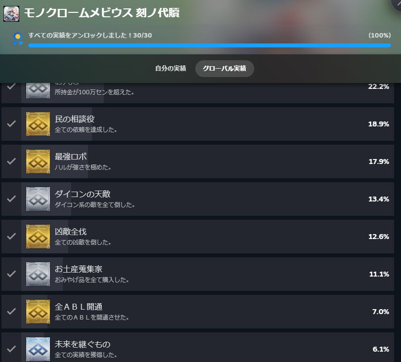
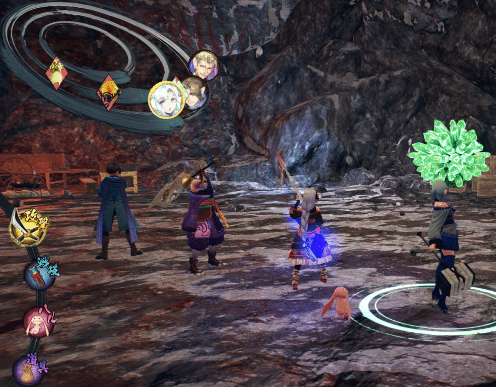
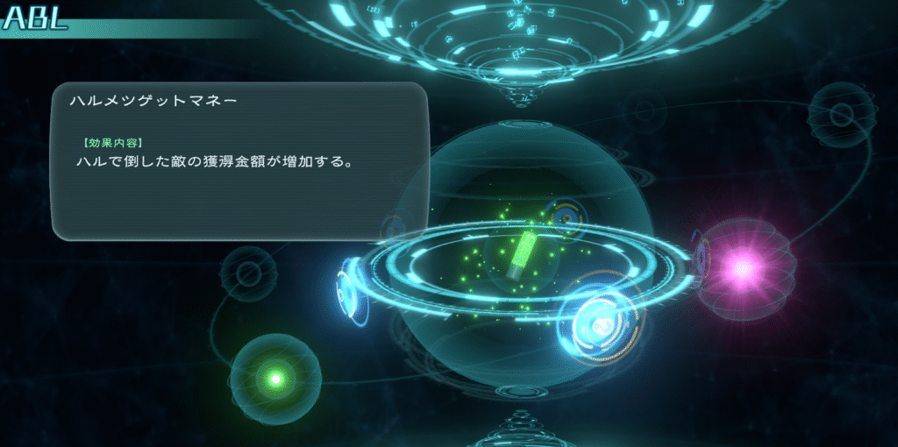
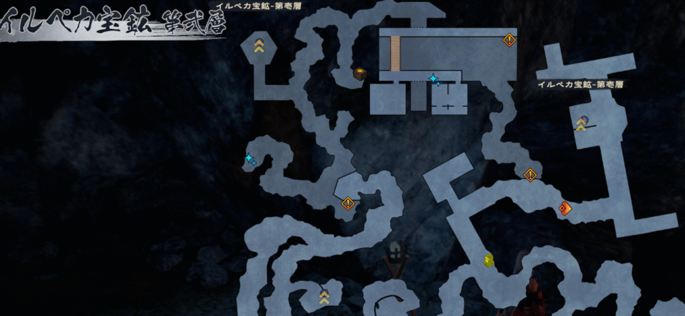

## モノクロームメビウス\_概要

[セール](https://store.steampowered.com/app/1962430/_/?l=japanese)でたまたま見かけたので買ってプレイしました。そもそもうたわれるものというゲーム自体はプレイ済みで「散りゆく者への子守唄」「偽りの仮面」「二人の白皇」全てやってます。さらに実績もコンプ済みです。

少し補足をすると「偽りの仮面」「二人の白皇」はハクというキャラが主人公になっています。このゲームはオシュトルが主人公で、ハクと似た友人に当たります。そのオシュトルが若い時から近衛大将になるまでの経緯が描かれます。

モノクロームメビウスの概要を話すとオシュトルがシューニャという少女と出会い、亡くなったと思われた父が生きていたことに気づきます。真相を知るため仲間になったムネチカ、ミカヅチとともに自身を成長させていく話になります。

バトルシステムとしては旧作のうたわれるものとは異なり、RPG方式になっています。そういった意味ではレベル差と武器次第でごり押しすることもできると言えます。

### 苦戦したこと\_戦闘

ここからはモノクロームメビウスをプレイして苦戦したことや実績について書いていこうかと思います。

基本的にはレベルと武器、ステ振りさえしていれば苦戦することは少ないと思います。ただ、ターン性にバトルにおいてスピードはかなり重要です。ここを理解していなかったので試練の番人相手に初めて苦戦しました。

円環というシステムがあり、3重の円があり内側にいるほど早くターンが回ってきます。これは味方だけでなく敵も内側に入れます。内側に入るには相手をよろめかせた後、攻撃する。それか気力上昇を使うの2択ですね。

ここで敵が内側に入ってくると厄介なのでそうしないよう対処することが大切になります。また、ミカヅチの雷やムネチカの召喚は場合によって邪魔になることがあります。これらは勝手に攻撃する上に内側に移動もするので。

### 苦戦したこと\_HALU

戦闘はそのくらいであとは実績やABLの解放ですね。

ABLはHALUというキャラクターと他のキャラを全体的に底上げするシステムの一つになります。例えば気力が上がりやすくなるや経験値が増加するなどですね。

このABLの条件で大変なのが30体以上HALUで倒すというものですね。この条件に関しては意図的に使って倒さないと達成できない気がします。更に私の場合はフィールドアタックで倒しことがほとんどだったので、戦闘になることも少なかったですね。

もう少し言えばHALUはほぼ単発攻撃で、範囲攻撃もランダムかつ2体が最低保障になります。そうなるとかなり面倒なので事前に意図的に使って倒していくことをおすすめします。

後は素材集めですね。特に最後のエリアでしか取れない素材を取ることですね。運が良ければクリア前に全部取れますが、私は何回も出入りして取らないといけませんでした。

### モノクロームメビウス\_実績

最後に実績のダイコンですね。経験値を大量に持つダイコンが存在してそれを倒して図鑑登録するのに苦戦しました。場所はここにいるので1階と2階を往復して、出現したらエンカウントという感じでやれば難しくないですが、面倒ではありました。

それから注意する点が依頼系ですね。物語を進めて時間が経ってしまうと期限切れになることもあります。また、タイミングを逃すと後に戻れなくなることもあるので、受領したらすぐにやったほうがよいですね。

という感じで苦戦した話でした。戦闘はそこまで苦戦したことはないのであまり覚えてないですが。

余談ですが今年中に「うたわれるもの斬」と「白の道標」が出るみたいです。ただ、内部はごたついてたりしてるのでどうなるかわかりませんが。白の道標はモノクロームメビウスの続編になるのでものすごく楽しみですね。ではでは。
