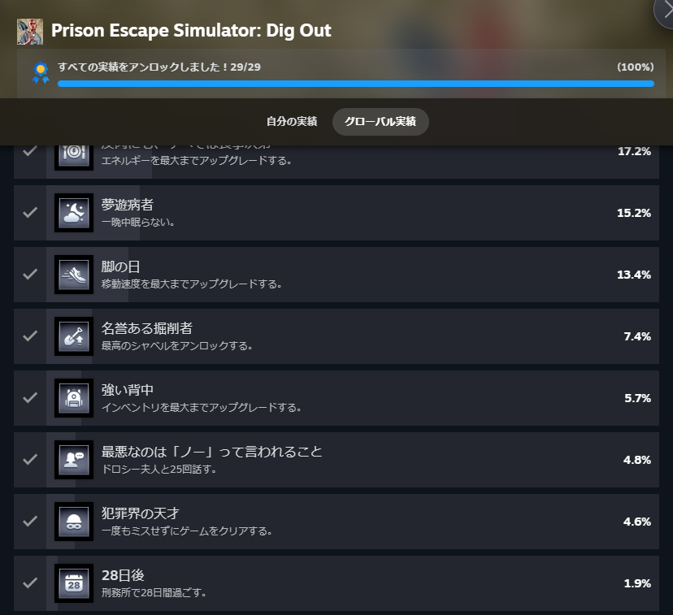
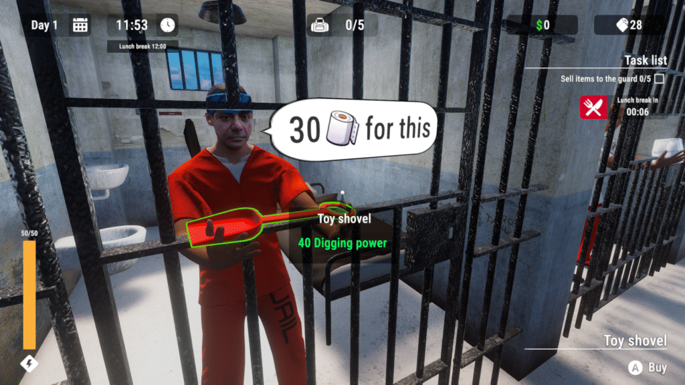
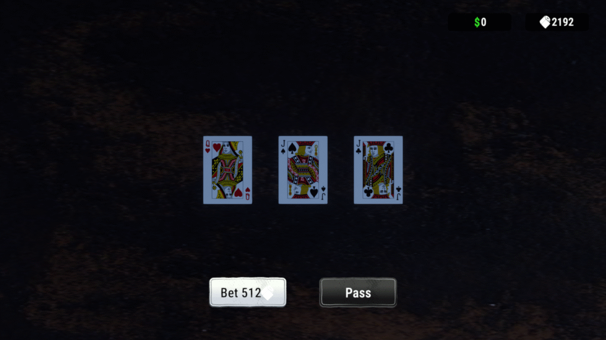
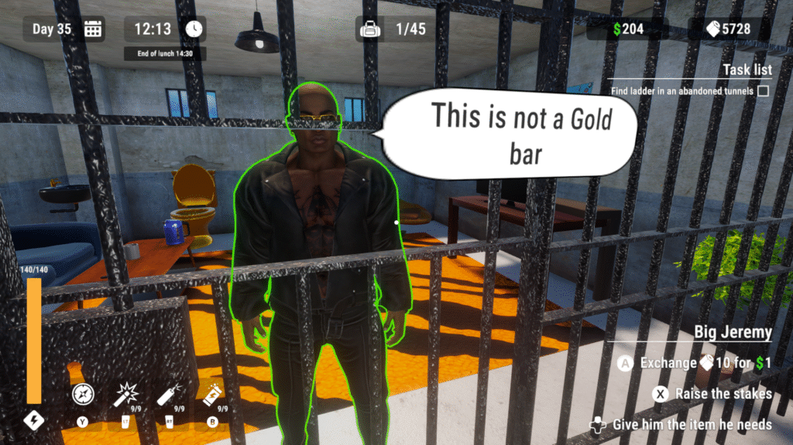
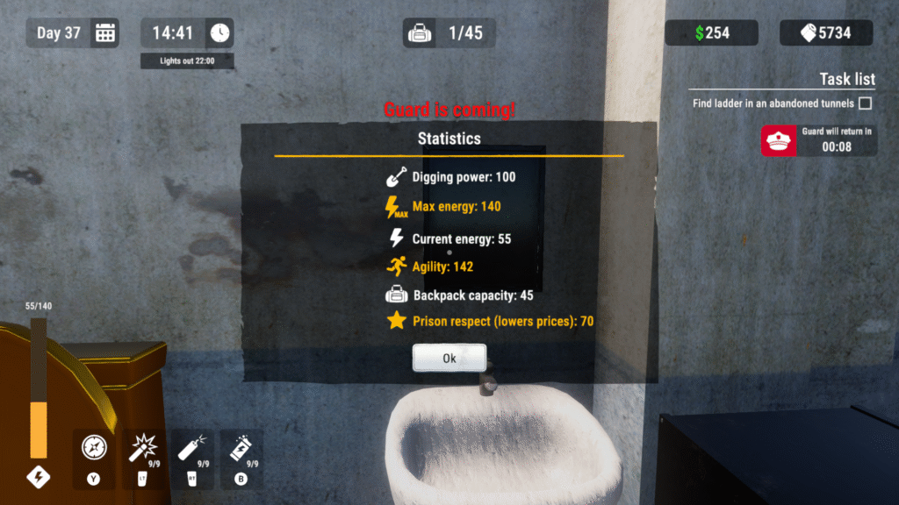

最近発売された[Dig out](https://store.steampowered.com/app/3672720/Prison_Escape_Simulator_Dig_Out/)というシミュレーションゲームをクリアしました。実績も全部開放しました。

### Dig Out 概要

このゲームはざっくり言うと穴を掘って刑務所から脱出するというゲームですね。

穴を掘るとアイテムが出るので刑務官に渡してトイペをもらいます。そのトイペを使ってスコップやリュックの強化をしてさらに深く掘っていくことになります。

脱出方法は日々の手紙にも書かれてますが、地下を掘っていって車を見つけてヘリで脱出することになります。車からヘリに乗り換える理由はよくわかりませんがそんな感じです。

### Dig Out 実績について

これらの実績の中で大変だったものを紹介しようと思います。とは言え難しいものは少ないと思いますね。厄介なところで言えばミスをしないや28日過ごすぐらいですが、この辺は慎重かつ放置で何とかなりますね。

問題はスコップまたはリュックを最大まで強化するのが一番大変だと思います。強化するごとに求められるトイペの量がどんどん増えるので、交換だけだと大変な気もしますね。

とは言え一度捕まれば穴がリセットされアイテムも復活するのでその繰り返しで何とかなると思います。

アイテムを売った時に得られるトイペの数が数個~数十個で最大5000個ほど要求されます。後述で1500個まで割引にはなりますが、大変なのは変わりませんね。

### Dig Out 攻略について

クリアだけならシンプルに穴を掘ってたまにアイテム交換するだけでもクリアはできます。ただ、効率を求めるなら早めの倉庫解放が大事ですね。倉庫を開けるには鍵が必要で3.5mの深さにある棺を開けることで手に入れることができます。

なので最初にある程度トイペを集めてスコップの強化が手っ取り早いですね。手っ取り早い手段としてカードゲームというものがあります。J,J,Qの3枚のカードがシャッフルされるのでQをあてるというゲームですね。初めはゆっくりでだんだんスピードが上がります。

このゲームは最初1個のトイペまた$1をかけて始めます。当てれば2倍、更に次は倍プッシュで2つ毛けることができます。そこから4,8,16と上がっていきます。私は512辺りまではできました。なれると思うので少しづつ確定する基準を上げていくと稼ぎやすいと思います。

### おまけ

このゲームの他の要素に依頼があります。依頼を受けて渡すことでお金を得られます。毎日1つか2つ昼の間のみ受けられます。これは金の延べ棒を渡したら依頼がなくなります。この辺は実績にも関係ないですし、カードのほうが稼ぎやすいので自由に受けるといいと思います。

それからトイペ以外の強化要素ですね。昼世間のみ筋トレとバスケをすることができます。筋トレでスタミナ強化ができ、バスケで俊敏性を上げることができます。

筋トレは200kgまで上げることができ、それ以降は使えなくなりますね。バスケはよくわかりません。上限はあると思いますが、センスがないので途中であきらめました（笑）最終的な能力値がこんな感じですね。

### 終わりに

ゲーム自体は安いですしクリアも簡単なので気軽にプレイできるゲームだとは思います。カードを使えば5日ほどでクリアもできますし。

ゲームの内容もシンプルですし、強化も楽しく、クリアも苦じゃないので気軽に楽しめるゲームだと思います。ではでは。
