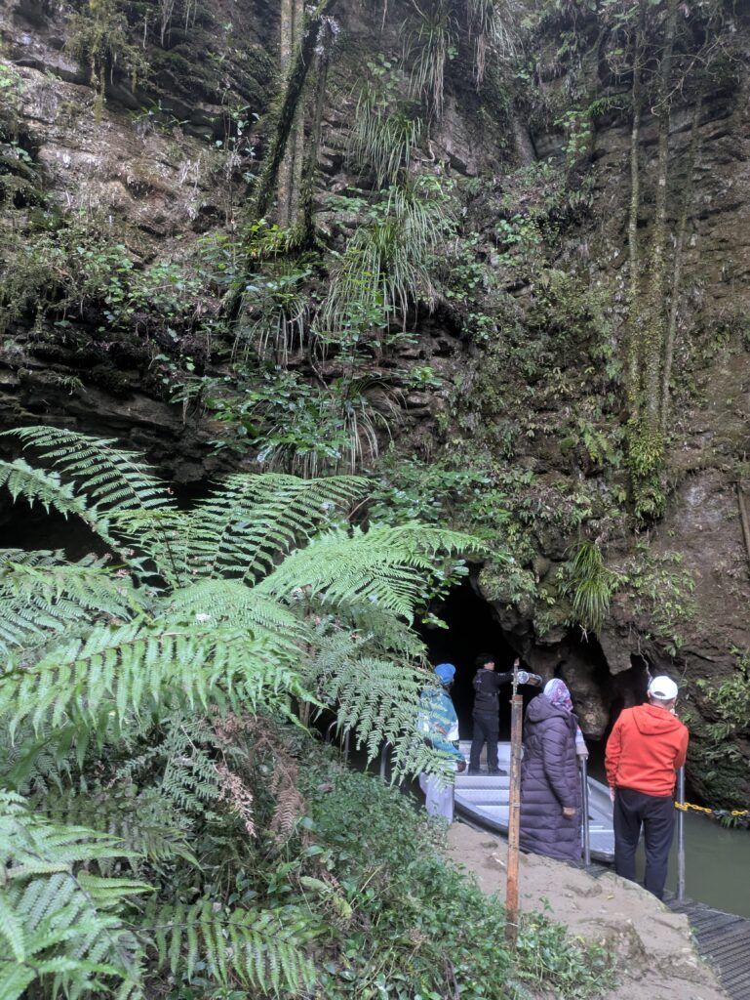
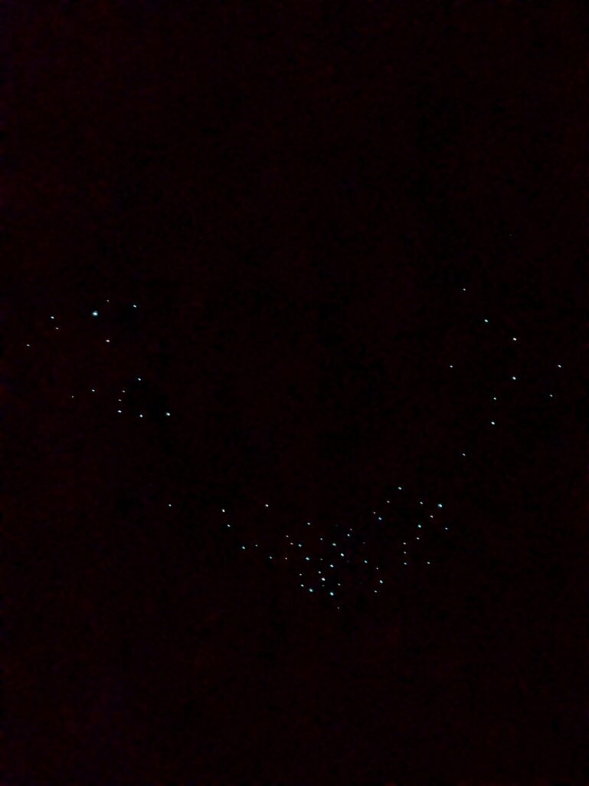
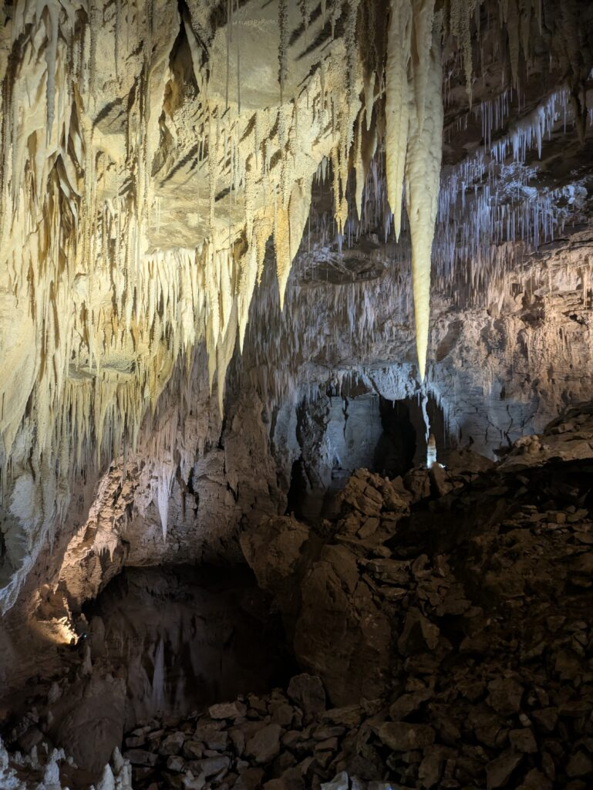

## English\_Practice

I went to the Waitomo cave before going to the South Island. It is close to Hamilton and you can see shining worms in the dark cave and go to the limestone cave. However, there is limestone caves in Japan.

These shining worms are named glowworm, Japanese name is "Tsutibotaru". I guess firefly factor is just shining. They looks like thin long worms literally.

### Waitomo Cave Overall

There are three kind of caves; Glowworms in Waitomo cave, see glowworms near limestone in Ruakuri cave, Aranui cave like limestone cave. I went to the Waitomo cave and Ruakuri cave which is combo.

I couldn't take photos in Waitomo cave except final of the cave. Firstly, I explored inside. Finally, I enjoyed boarding and looking sky filled with light. It was so beautiful. However, I am not sure that I recommend it.

### Ruakuri cave Overall

I went to the Ruakuri cave next. This structure is similar to the Waitomo cave one. It is made of limestone and there were glowworms in this cave. I took photos anytime in this area, and I saw glowworms closely. Some people do not like them because of worms.

When I went down on the long slope, it is limestone cave so I wondered. It was moisty because of moisture and shining. Moreover, I saw glowworms in the dark area of cave.

### Moa Fossils

There is a Moa fossil. I wrote about that I saw it in the museum before. To be honest, I knew about Moa at first time. Furthermore, I touched the fossil here. The guide said it is probably a thighs bone.

I am not sure about fossils, but I understood a bone became the fossil and it was smooth. However, I did not have a chance to touch it so I am glad to go there because of a rare opportunity. I recommend it this cave.

I enjoyed the Waitomo cave like that. I do not have a chance to go there, but it was fun to see unique things. In my opinion, you should go there with your friends rather than alone. See you there.

## 日本語版

南島に行く前に[Waitomo Caves](https://www.waitomo.com/glowworms-and-caves/waitomo-glowworm-caves)という場所に行ってきました。場所的にはHmiltonに近く、暗い洞窟に光る虫や鍾乳洞を見ることができます。鍾乳洞なら日本にもあるとは思いますが。

この光虫たちのことをグロウワーム、別名ツチボタルといます。蛍要素は光っているだけな気がします。見た目はワームと書いている通り虫のように細長い姿をしていますので。

### Waitomo Cave 概要

洞窟の種類は3種類くらいあり、グロウワームがいるWaitomo cave、グロウワームが近くで見れる石灰岩のRuakuri cave、鍾乳洞のAranui caveですね。私が行ったのはWaitomo caveとRuakuri caveのパックになったやつに行きました。

Waitomo caveに関しては最後の部分以外は写真撮影禁止でしたね。初めのほうは歩いて中を探索し、最後はボートに乗って満点の光を堪能するというものでした。きれいでとてもよかったと思います。ただ、他人に勧めるかは微妙ですね。

### Ruakuri cave 概要

次はRuakuri caveに行きました。こちらも造りとしては似たようなものだと思います。石灰岩でできた洞窟にところグロウワームがいました。こちらはいつでも写真撮影ができ、グロウワームも間近で見ることができます。虫なので人によっては苦手だと思いますが。

長いスロープを下っていき中に入ると石灰岩の洞窟になっており不思議な感じでした。周りは湿気で湿っており岩が光ってるような感じでキラキラしてました。途中では暗い場所に入りグロウワームを近くで見ることができます。

### Moa 化石

それからMoaの化石がありました。[以前](/posts/2025/08/prepare-for-new-zealand-south-island-road-trip/)Moaの化石を博物館で見たという話をしました。実はここで初めてMoaのことを知ります。しかもここでは実際に触ることができました。恐らく太もも当たりの骨だろうと話していました。

化石にあまり明るくないのでわからないですが、骨が化石になっていることとすべすべしているんだなということだけわかりました。ただ、化石に触れる機会は相当少ないと思うので、貴重な機会と捉えれば行ってよかったなと思います。こちらの方をお勧めします。

という感じでWaitomo caveを楽しんできました。こちらは次行く機会はないかもしれませんが、中々見れないものが見れて楽しめました。一人で行ってもよいですがツアーなので友達と行くとより楽しいかと思います。ではでは。

## AI採点

以下は**IELTS Writing（Taskに厳密合致しない自由記述）としての近似採点**です。正式課題ではないため「目安」です。

# 総合評価（目安）

- **Overall**: **Band 5.5**

- **Task Response（参考）**: 6.0（体験の要点は述べられているが、論旨の焦点と評価基準が散漫）

- **Coherence & Cohesion**: 6.0（段落や見出しはあるが、接続と参照が不自然）

- **Lexical Resource**: 5.5（語彙は十分だが不自然なコロケーション・直訳調・スペル/語形誤りが頻発）

- **Grammatical Range & Accuracy**: 5.0（冠詞・単複・時制・前置詞・SV一致の誤りが多く、文構造も単調）

> **総評（短く）**：内容は伝わりますが、**冠詞・単複・コロケーション**の誤りと、\*\*評価軸のブレ（何を勧めたいのか）\*\*がBandを下げています。Band 7+を狙うには、自然な表現（_boat ride beneath a ceiling of lights_ など）と正確な文法制御が必要です。

* * *

# 文ごとの添削（主要文のみ／原文→修正→理由）

**1.** _I went to the Waitomo cave before going to the South Island._  
→ **I visited the Waitomo Caves before heading to the South Island.**  
理由：固有名詞は **Waitomo Caves**（複数形）が一般的。_went to_ より _visited_ が自然。

**2.** _It is close to Hamilton and you can see shining worms in the dark cave and go to the limestone cave._  
→ **They’re close to Hamilton, where you can see glowworms in dark caverns and explore limestone formations.**  
理由：_shining worms_ は不自然→**glowworms**。重複と直訳調を整理。_It is_→複数施設なので _They’re_。

**3.** _However, there is limestone caves in Japan._  
→ **However, there are limestone caves in Japan as well.**  
理由：**there are**＋**caves**（複数）。語尾に **as well** が自然。

**4.** _These shining worms are named glowworm, Japanese name is "Tsutibotaru"._  
→ **These “shining worms” are called glowworms (Japanese: ツチボタル).**  
理由：**are called**、**glowworms**（複数）。カンマ splice解消。ローマ字は _tsuchibotaru_ が一般的。

**5.** _I guess firefly factor is just shining._  
→ **They resemble fireflies only in that they glow.**  
理由：_firefly factor_ は不自然。比較構文で明確化。

**6.** _They looks like thin long worms literally._  
→ **They literally look like long, thin worms.**  
理由：SV一致（**look**）。形容詞順とカンマ。

**7.（見出し）** _Waitomo Cave Overall_  
→ **Waitomo Caves – Overview**  
理由：複数形・見出し表現の自然さ。

**8.** _There are three kind of caves; Glowworms in Waitomo cave, see glowworms near limestone in Ruakuri cave, Aranui cave like limestone cave._  
→ **There are roughly three cave experiences: the Waitomo Glowworm Cave; Ruakuri Cave, where you can see glowworms up close; and Aranui Cave, a classic limestone cave.**  
理由：**kinds**→**experiences** の方が適合。箇条書きの構文整理。

**9.** _I went to the Waitomo cave and Ruakuri cave which is combo._  
→ **I bought a combo ticket for the Waitomo Glowworm Cave and Ruakuri Cave.**  
理由：名詞の修飾と可算名詞処理。

**10.** _I couldn't take photos in Waitomo cave except final of the cave._  
→ **Photography wasn’t allowed in the Waitomo Glowworm Cave except at the very end.**  
理由：前置詞・語順の自然化。

**11.** _Firstly, I explored inside._  
→ **First, I walked through the cave.**  
理由：_Firstly_ より **First** が一般的。_explored inside_ は過剰・曖昧。

**12.** _Finally, I enjoyed boarding and looking sky filled with light._  
→ **At the end, I enjoyed a boat ride beneath a ceiling of lights.**  
理由：_enjoyed boarding_ は不自然。情景語彙を自然化。

**13.** _However, I am not sure that I recommend it._  
→ **However, I’m not sure I’d recommend it to others.**  
理由：仮定法 **I’d**。目的語の明示。

**14.（見出し）** _Ruakuri cave Overall_  
→ **Ruakuri Cave – Overview**  
理由：固有名詞の大文字・自然な見出し。

**15.** _This structure is similar to the Waitomo cave one._  
→ **Its layout is similar to that of the Waitomo Cave.**  
理由：所有・比較の構文。

**16.** _I took photos anytime in this area, and I saw glowworms closely._  
→ **Photography was allowed throughout, and you can see the glowworms up close.**  
理由：_anytime_→**throughout**、_closely_→**up close**。

**17.** _Some people do not like them because of worms._  
→ **Some people might find them off-putting because they’re worms.**  
理由：原因表現の自然化と丁寧な語調。

**18.** _When I went down on the long slope, it is limestone cave so I wondered._  
→ **Descending the long ramp into the limestone chambers felt surreal.**  
理由：意味補完・時制統一・自然コロケーション。

**19.** _It was moisty because of moisture and shining._  
→ **The walls were damp and seemed to glisten.**  
理由：_moisty_ は誤用。語彙自然化。

**20.** _Moreover, I saw glowworms in the dark area of cave._  
→ **We also entered a dark section where we could view the glowworms up close.**  
理由：_Moreover_ は論証向け。叙述用の接続に変更。

**21.（見出し）** _Moa Fossils_ ✅（OK）

**22.** _There is a Moa fossil._  
→ **There was a moa fossil.**  
理由：叙述時制の一貫性（過去）。

**23.** _I wrote about that I saw it in the museum before._  
→ **I’ve mentioned seeing moa fossils in a museum before.**  
理由：不自然な _wrote about that_ を現在完了で自然化。

**24.** _To be honest, I knew about Moa at first time._  
→ **To be honest, that was the first time I learned about moa.**  
理由：語形・前置詞・数（_moa_ は複数同形が一般）。

**25.** _Furthermore, I touched the fossil here._  
→ **I was even allowed to touch the fossil here.**  
理由：許可のニュアンス。

**26.** _The guide said it is probably a thighs bone._  
→ **The guide said it was probably a thigh bone (femur).**  
理由：時制一致・単複・語彙。

**27.** _I am not sure about fossils, but I understood a bone became the fossil and it was smooth._  
→ **I don’t know much about fossils, but I noticed the bone had fossilized and felt smooth.**  
理由：時制・語彙の自然化。

**28.** _I recommend it this cave._  
→ **I’d recommend this cave.**  
理由：語順。

**29.** _I enjoyed the Waitomo cave like that._  
→ **Overall, I enjoyed the Waitomo caves.**  
理由：締めの自然さ・複数形。

**30.** _I do not have a chance to go there, but it was fun to see unique things._  
→ **I might not go again, but it was fun to see something so unique.**  
理由：仮定表現・自然なコロケーション。

**31.** _In my opinion, you should go there with your friends rather than alone. See you there._  
→ **In my view, it’s better to go with friends than alone.**  
理由：締めの一貫性。_See you there_ は場違い。

* * *

# よくある減点ポイント（あなたの原稿で実際に出たもの）

- **冠詞**：_the Waitomo Glowworm Cave / a thigh bone / the fossil_ の使い分け

- **単複と一致**：_there are_, _glowworms_, _They look_

- **前置詞**：_except at the end / into the cave / up close_

- **コロケーション**：_enjoy a boat ride_, _ceiling of lights_, _felt surreal_, _take photos_

- **接続・論理**：_However/Moreover_ の過剰使用と位置。叙述なら **Overall/Also/Then** を多用

- **時制の一貫性**：体験記は基本 **過去**、一般説明は **現在**

- **固有名詞**：**Waitomo Caves / Ruakuri Cave / Aranui Cave / Hamilton**

* * *

# 改善例（Band 7.5相当の自然な英語・約170語）

_I visited the Waitomo Caves before heading to the South Island. They’re close to Hamilton, and you can see glowworms in dark caverns and explore impressive limestone formations. There are three main experiences: the Waitomo Glowworm Cave, Ruakuri Cave—where you can view glowworms up close—and Aranui Cave, a classic limestone cave. I bought a combo ticket for Waitomo and Ruakuri. In the Waitomo Glowworm Cave, photography wasn’t allowed until the very end. First, I walked through the passages; then I took a quiet boat ride beneath a ceiling of lights. It was beautiful, though I’m not sure I’d recommend it to everyone. Ruakuri felt similar in layout, but photography was permitted throughout, and the glowworms were very close. Descending the long ramp into the limestone chambers felt surreal; the damp walls seemed to glisten. There was also a moa fossil on display. I’d seen one in a museum before, but here I was even allowed to touch it—the guide said it was probably a thigh bone. I might not go again, but it was a unique experience; going with friends would make it even better._

* * *

# 日本語原文の軽微な指摘

- **Hmilton → Hamilton**（スペル）

- **グロウワーム、別名ツチボタルと**→「**グロウワーム（ツチボタル）と**いいます」

- **石灰岩のRuakuri cave**→「**石灰岩の洞窟で、グロウワームを間近で見られる Ruakuri Cave**」

- **ところグロウワームがいました**→「**所々にグロウワームがいました**」

* * *

# Band 8に近づくための短期課題（要点だけ）

1. **冠詞&単複ドリル**：固有名詞＋可算名詞（_the cave / a boat ride / the guide_）を10文×3日。

3. **コロケーション置換**：直訳を避け、自然表現に置換（_moisty → damp_, _enjoy boarding → enjoy a boat ride_）。

5. **接続語の整理**：叙述＝**First / Then / At the end / Overall**、対立＝**However** のみに厳選。

7. **見出し→主張文**：各段落の冒頭に**要点1文**（例：_Photography rules differ between the caves._）。

9. **音読→書き直し**：自分の文を音読し、不自然に引っかかる箇所を必ず修正。
