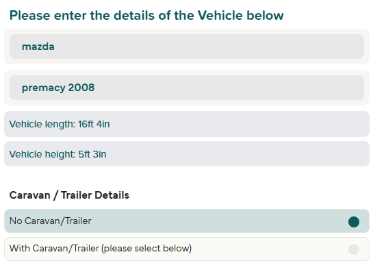
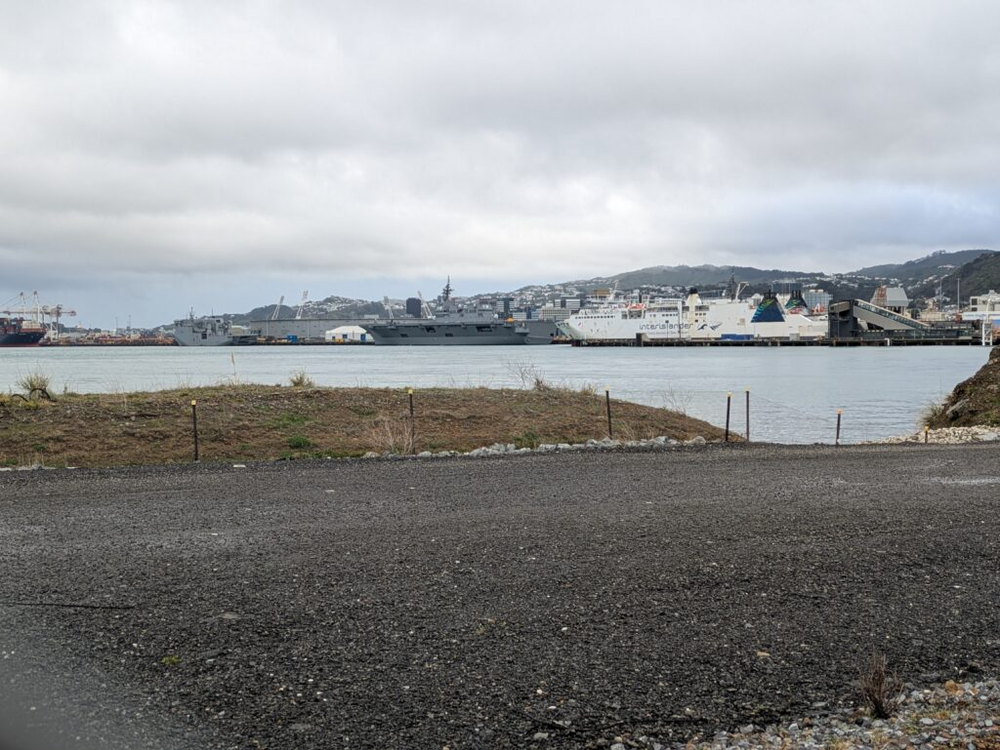
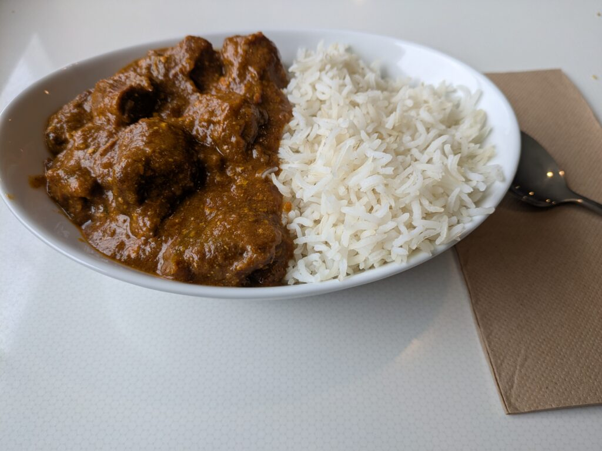
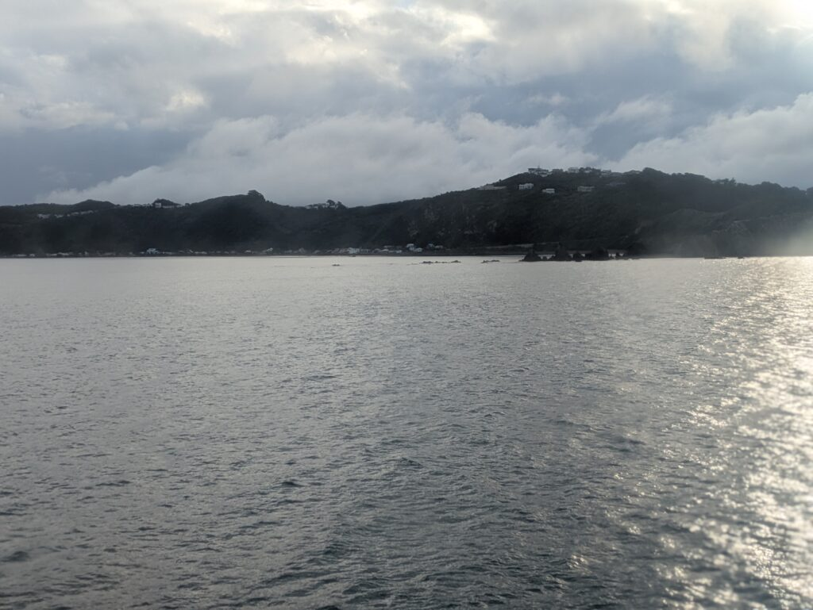

## English\_Practice

This story continues to previous story. I went to Wellington and the South Island. At that time, I boarded on the ferry.

### Interislander Reservation

When I used a ferry, I chose a company called "interislander". Moreover, I can choose "bluebridge", but I compared to time on the compareing website.

In my opinion, if I go to the South Island, I use an airplane because it is fast and good cost performance. In my case, I had my car so I used it.

When I booked it, I filled in time, place, and vehicle information which I needed. If you use a rental car, you need to call the rental company. I think you should borrow it again at the South Island.

The vehicle information is make, model, height, width and caravan availability. I applied for that height and width were higher than accurate height and width. I did not like problems that It was not enough car height or width into the ferry. It depends on cars with caravan. In that case, the height and width vary.

It cost $250. If you do not have a car, you can use approximately $80. It cost $200 or less when you use an airplane, but I recommend to use an airplane unless you do not have enough money.

### Interislander Boarding and Departure

When I arrived at the harbor before one hour, I showed the barcode at the reception and I received a ticket. The reception looks like toll gate in the highway or airport. After that, I wait on the line number which was written to the ticket. It is fine to follow other cars.

I rode on the ferry following order. On the other hand, when I got off the ferry, the staff announced about that. Even though you do not understand English, other people return to their cars so it is no problem.

### Inside Ferry

The ferry inside was large and I sat every seat except VIP lounge. When there are a few people, you can lie down on the seat.

There is a restaurant. The price is not too expensive. However, it is expensive to compare with Japan. Furthermore, I went to the ferry outside. I went to two places; beside and top the ferry. If it is sunny, you can see a good viewing.

I experienced like that I rode my car in the ferry. I have never done this experience so I enjoyed it fleshly. I am looking forward to returning. See you there.

## 日本語版

[前回](/posts/2025/08/road-trip-taupo-palmerston-north-wellington/)の話の続きになります。Wellingtonまで行った後、南島に行きました。その時船を使って乗ったのでその時の話になります。

### interislander 予約

船を使う際は[interislander](https://www.directferries.co.nz/picton_wellington_ferry.htm)という会社を使いました。他にもbluebridgeという会社もありますが、比較できるサイトで都合の良い時間を選んだらここでした。

単純に南島に行く場合はフェリーでなくても飛行機という手段があるのでそちらの方が早いし、コスパもよいと思います。私の場合は車があったのでこちらを使いました。

予約をする際に時間と場所、必要であれば車の情報も入力します。レンタカーを使っている場合はレンタル会社に連絡する必要があると思います。南島で借りなおしたほうが良いとは思いますが。

車の情報はメーカー、モデル、高さ、幅、キャラバンの有無ですね。高さや幅はオーバー気味に申請しました。車を船に入れるのに高さが足りなかったり、幅で問題が起きても嫌だったので。キャラバンは車によってはついてると思います。それ次第で高さや幅も変わってくると思います。

価格は大体$250くらいだったと思います。車がなければ$80前後で渡れると思います。飛行機なら$200以下ですが、ここに来るまでの時間と労力を考えたらよっぽど金欠でない限り飛行機が良い気がします。

### interislander 搭乗と出航

出発1時間前までに港に到着したら受付でバーコードを見せてチケットをもらいます。受付と言っても高速や空港の料金所みたいな感じです。チケットにはライン番号が載ってるので番号が書かれたラインに並びます。他の車についていけば大体大丈夫です。

後は指示に従って船に乗り込むだけですね。逆に船から降りるときはアナウンスが流れます。英語が良くわからなくても周りの人が車に戻っていくのでついていけば特に問題はないです。

### 船内

船の中は広々としておりVIPラウンジ以外なら自由に座れます。人が少なければ寝転がって寝ても大丈夫だと思います。

もちろん食堂もあります。値段は高すぎではないですね。日本と比べたら高いんですが…それから船外に出ることもできます。すぐ横の場所と船の上の方の2か所に行くことができます。天気が良く昼頃であれば景色もよいと思います。

こんな感じで初めて船に車を乗せるという体験をしました。こういった経験が日本ではやらなかったので新鮮で楽しかったです。帰りも楽しみですね。ではでは。

## AI採点

# IELTS Writing 評価（推定）

**想定タスク**：旅行体験の説明（GT Task 1/2の厳密な形式ではないため“参考スコア”）  
**総合：Band 5.5（目安）**

- **Task Response（TR）: 6.0** — 体験の流れ・手順・価格などの要点はカバー。目的や読者を明確化し、比較や助言を一貫した視点で整理できると向上。

- **Coherence & Cohesion（CC）: 5.5** — 見出しで構成は良好。ただし指示語・接続語の精度が弱く、重複や話題の跳躍あり（例：価格比較→主観的な推奨の唐突な転換）。

- **Lexical Resource（LR）: 5.5** — 語彙は足りているが不自然な連語・直訳が多い（_cost performance_, _compareing website_, _borrow a car_ など）。見出し・固有名詞の大文字化も要改善。

- **Grammatical Range & Accuracy（GRA）: 5.0** — 前置詞・冠詞・時制・可算/不可算・動詞目的語の誤りが頻発（_boarded on_, _written to the ticket_, _I applied for that height…_ など）。複文のコントロール不足。

* * *

## 代表的なエラーと直し方（要点だけ）

### 語彙・コロケーション

- × **cost performance** → ○ **value for money / cost-effectiveness**

- × **compareing website** → ○ **comparison website**（_comparing_ は誤綴）

- × **borrow it again at the South Island** → ○ **rent again on the South Island**（_borrow_ は「借りる（無料/私的）」の含み）

- × **car with caravan**（文脈不明）→ ○ **towing a caravan / with a roof box**（意図に応じ明確化）

- × **the ferry inside** → ○ **the inside of the ferry / the ferry was spacious inside**

- × **good viewing** → ○ **great views / good visibility**

- × **reception (for ferries)** → ○ **check-in booth / gate / terminal**

- 固有名詞の大文字：**Interislander / Bluebridge / South Island / Wellington / Picton**。NZ綴り：**harbour**（英/NZ式）。

### 文法・用法

- × **I boarded on the ferry.** → ○ **I boarded the ferry.**（_board_ は他動詞）

- × **I compared to time on the comparison website.** → ○ **I used a comparison site to choose a convenient time.**

- × **When I arrived at the harbor before one hour,** → ○ **When I arrived at the harbour an hour early,** / **…at least an hour before departure,**

- × **written to the ticket / wait on the line number** → ○ **written on the ticket / wait in the assigned lane**（車は _lane_）

- × **I rode on the ferry following order.** → ○ **I drove onto the ferry as instructed.**

- × **Even though you do not understand English… it is no problem.** → ○ **Even if you don’t understand the announcements, just follow the crowd back to your car.**

- × **I sat every seat except VIP lounge.** → ○ **You can sit anywhere except in the VIP lounge.**

- × **I applied for that height and width were higher…** → ○ **I slightly over-declared the vehicle’s height and width**（分詞構文で簡潔に）

### 冠詞・単複

- **the**/**a** の使い分け：_the ferry / the harbour_（特定の場所）、_a comparison site / a restaurant_（初出の一般）。

- **複数形**：_two outdoor decks_ / _side decks and the top deck_。

### 論理の一貫性（TR/CC）

- 「飛行機の方がコスパ良い」→ 直後に「金欠でない限り飛行機が良い」は逆説が曖昧。**価格・所要時間・車有無**の条件で分けて提示すると明確。

* * *

## 改稿例（自然でBand 7相当の文体・簡潔版）

**Ferry to the South Island: what to expect**

After Wellington I crossed to the South Island by **Interislander** (you can also use **Bluebridge**). I picked a convenient sailing on a **comparison website**. If you don’t have a car, flying is usually faster and often **better value for money**; I had a car, so the ferry made sense.

**Booking.** You enter the time, route, and **vehicle details** (make, model, height, width, whether you’re **towing a caravan**, etc.). I slightly **over-declared** the vehicle’s height/width to avoid clearance issues. If it’s a rental, check with the company; in many cases it’s simpler to **rent again on the South Island**.

**Price.** My crossing was about **$250 with a car**; **foot passengers** are roughly **$80**. Flights can be **under $200**, but factor in airport transfers and baggage.

**Boarding.** Arrive **at least an hour before departure**. Show the barcode at the **check-in booth**, get your ticket, and queue in the assigned **lane**. Then **drive onto the car deck** as directed. On arrival, announcements tell you when to **return to your vehicle**—just follow everyone else.

**On board.** The ferry is **spacious**; you can sit anywhere outside the VIP lounge. There’s a **cafeteria/restaurant**—a bit pricier than in Japan but reasonable. You can go out on the **side decks** and the **top deck**; on a sunny midday sailing the **views are superb**.

It was my **first time driving a car onto a ferry**, and it felt new and fun. I’m already looking forward to the return trip.

* * *

## 原文（あなたの英訳）からの主な修正サンプル（Before → After）

- _I boarded on the ferry._ → **I boarded the ferry.**

- _I compared to time on the compareing website._ → **I used a comparison website to choose a convenient time.**

- _It is fast and good cost performance._ → **It’s faster and offers better value for money.**

- _borrow it again at the South Island_ → **rent again on the South Island**

- _written to the ticket / wait on the line number_ → **written on the ticket / wait in the lane**

- _The ferry inside was large and I sat every seat except VIP lounge._ → **The ferry was spacious; you can sit anywhere except the VIP lounge.**

- _good viewing_ → **great views**

- _I enjoyed it fleshly._ → **It felt new and exciting.**

* * *

## Band 8 を目指すためのピンポイント改善

1. **コロケーションを磨く**：旅行・交通の定番表現（_arrive at the terminal / queue in a lane / drive onto the car deck / disembark_）。

3. **因果と条件を明示**：_If you have a car…; Without a car…; However, when time matters…_ のように読者別に整理。

5. **文法の精度**：_board + O_, 前置詞（_on deck / at check-in / on the ticket_）、冠詞の一貫性。

7. **複文の多様化**：分詞構文・関係節・名詞化で情報を圧縮（例：_Arriving an hour early, I…_ / _a decision that saved time_）。

9. **語の重複削減**：_the ferry_ の連続を _it / the vessel / the crossing_ で回避。

* * *
