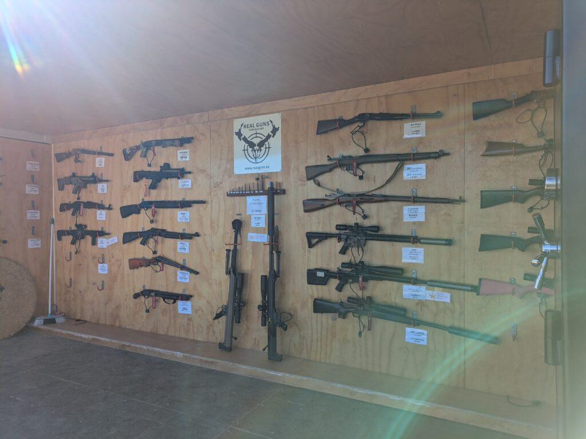

## English\_Practice

I think we can not only play one of activities which is shooting guns in Japan. Moreover, Other activity is the casino. I have ever been to the casino, but I will write this story.

I went to the Real Guns for shooting variety of guns. I think you can experience to do in the North Island or other places in the South Island. However, I decided here because I wanted to shoot many guns.

### Experienced Guns

I experienced below guns.

- semi-auto Ruger .22(20 rounds)

- practice handling recoil(10 rounds)

- AR-15(10 rounds)

- rifle .308(3 rounds)

- .50BMG(1 rounds)

I could shoot above two guns when I booked. In my opinion, these are a practical rifle and shotgun. Actually, it was difficult to shoot a shotgun.

I ordered to add below three guns. I chose them which are attached stars. If I have a chance, I will try other guns.

### Experience Shotgun

Firstly, a practical rifle was easy to aim and had little recoil. On the other hand, it had little power. a shotguns had much power and recoil even though beginners one. However, it does not have a scope so it was difficult to aim and I shot three clays per ten.

Nextly, AR is assault rifle and similar to practicing one. Personally, AK is more famous than it. It was easy to aim and fire rapidly so it was fun.

.308 is a long rifle and it has much recoil as shotgun. On the other hand, it has a scope to aim. I thought it is interesting to hunt.

### .50BMG (Anti-material Rifle)

Finally, it was .50BMG. It is anti-material rifle which is bigger one and it is used for tank destruction. This is the much biggest power, recoil and sounds. It is better to use a earmuff when I shot a shotgun and rifle, but I had to use it when I shot it.

The assistant taught me about recoil before shooting. Therefore, I did not fall down. I ordered loud .50BMG so I had tinnitus when I shot. I wonder if I did not have a earmuff.

It took for two hours and there were a lot of people. There is not handguns, but I understand about guns. I feel like that some people get into hunting or shooting clays. In addition, it is much fun. See you there.

## 日本語版

海外でしかできないことの一つに銃を扱うアクティビティがあると思います。他に思いつくのはカジノぐらいですね。カジノに行ったことはあるのですが、その話はまたいつかやります。

今回は[Real Guns](https://www.realguns.nz/)という場所で色んな銃を撃ってきたという話になります。探せば北島や別の場所にも体験できる場所はあると思います。ただ、私は色んな銃を撃ってみたいと思ってここにしました。

### 体験した銃

体験した銃は以下になります。

- semi-auto Ruger .22(20発)

- practice handling recoil(10発)

- AR-15(10発)

- rifle .308(3発)

- .50BMG(1発)

上の2つは予約時に使えるものになります。初心者向きのライフルとショットガンだと思います。とは言えショットガンのほうは難しかったですが…

下の3つは追加でお願いしました。☆がついてるおススメをとりあえず選んでみた形になります。次やる機会があれば他のも試してみたいですね。

### ライフル系の実体験

最初のライフルはシンプルで反動も少なく狙いも付けやすいものでした。その分威力は少ないと思います。ショットガンのほうは練習用とは言え威力も反動も凄いですね。ただ、スコープがないので狙いがつけにくく3/10しかクレーを破壊できませんでした。

次のARはアサルトライフルと呼ばれるもので練習用のものと少し似ています。AKのほうがゲーム的には有名な気がしますね。こちらはある程度連射が効き狙いも付けやすいので、使ってて楽しいと思います。

.308は長めのライフルで反動はショットガン並みに大きいです。とは言えスコープがあるので狙いは付けやすくこれを使ってハンティングなどは楽しいのかなと思いました。

### .50BMG(対物ライフル)について

最後は.50BMGですね。対物ライフルと呼ばれる大型のライフルで戦車破壊にも使われたりするみたいです。こちらは言うまでもなく威力、反動、音ともに凄まじいです。上記のショットガンやライフルはイヤーマフがあったほうがよいくらいでしたが、こちらは必須ですね。

撃つ前に反動の強さを教えてくれましたが、わからなかったらひっくり返ってました。私は音が大きい方をお願いしたので近くで撃った時に耳鳴りがしました。イヤーマフがなかったらどうなってたか…

時間は2時間ほどでしたが人が多かったのであっという間に時間が経ちました。短銃は扱ってないですが銃がこんな感じというのがわかってよかったです。ハンティングやクレー射撃にはまる人がいるのもわかる気がします。何より楽しいですし。ではでは。

## AI採点

# 総合評価（推定）

- **Overall**: **Band 5.5**

- **Task Response**: **5.0**（IELTSの課題体裁になっておらず、目的・主張・結論が弱い）

- **Coherence & Cohesion**: **6.0**（段落はあるが、論理の流れ・接続表現が不安定／見出しの使い方がIELTS文書に不向き）

- **Lexical Resource**: **6.0**（語彙は足りているが不自然コロケーション多い：_experience guns, practical rifle, Nextly_ など）

- **Grammatical Range & Accuracy**: **5.0**（冠詞・単複・時制・語法のエラー頻発。可読性を損なう文が複数）

> **注意**：この原稿は体験記ブログに近く、**Task 2エッセイ**としては「問いへの立場提示→理由→例→結論」の枠組み不足、**GT Task 1書簡**としても書式不備です。形式面で減点。

* * *

## 主な減点ポイント（要点）

1. **形式の不一致**：IELTS課題の体裁（目的・宛先・主張の明確化）が弱い。

3. **文法の反復ミス**：冠詞 (_a/the_), 単複, 前置詞, 不定詞/動名詞, 比較の用法。

5. **不自然コロケーション**：_experience guns_ → _try/fire/shoot firearms_ など。

7. **語義誤り**：_AR = assault rifle_（誤）。_anti-material_（誤綴）など。

9. **明確性不足**：_practice handling recoil_ が何の銃か不明、.308 は口径名なのに _a long rifle_ と表現。

* * *

## 文法・語彙ミス（抜粋・修正案・理由）

- **“I think we can not only play one of activities which is shooting guns in Japan.”**  
    → _One thing you can do overseas but not in Japan is shooting firearms._  
    （語順/語法/直訳調。_play activities_ 不自然）

- **“Moreover, Other activity is the casino.”**  
    → _Another such activity is going to a casino._（大文字/冠詞/コロケーション）

- **“I have ever been to the casino, but I will write this story.”**  
    → _I’ve been to a casino before, but I’ll save that story for another time._（_have ever_ 誤用）

- **“I went to the Real Guns for shooting variety of guns.”**  
    → _I went to Real Guns to shoot a variety of firearms._（冠詞/the不要・不定詞目的・_variety of_）

- **“I think you can experience to do in the North Island…”**  
    → _You can find similar experiences in the North Island or elsewhere._（_experience to do_ 誤）

- **“I decided here because…”**  
    → _I chose this place because…_（語法）

- **見出し “Experienced Guns / I experienced below guns.”**  
    → _Firearms I tried / I fired the following firearms:_（_experience guns_ 不自然）

- **“.50BMG(1 rounds)”** → _.50 BMG (1 round)_（単複）

- **“the above two guns when I booked”**  
    → _the first two were included in the booking/package_（自然な言い方）

- **“practical rifle and shotgun”**  
    → _a beginner-friendly .22 rifle and a training shotgun_（意味ずれ：_practical_ 不自然）

- **“a shotguns had much power”**  
    → _the shotgun had a lot of power and recoil_（冠詞/単複/語選択）

- **“I shot three clays per ten.”**  
    → _I hit three out of ten clays._（通例表現）

- **“Nextly,”** → _Next,_（副詞誤用）

- **“AR is assault rifle”**  
    → _The AR-15 is a semi-automatic rifle; “AR” stands for **ArmaLite**, not “assault rifle”._（事実誤り）

- **“.308 is a long rifle”**  
    → _I tried a bolt-action rifle chambered in .308 Winchester._（正確性）

- **“.50BMG (Anti-material Rifle)”**  
    → _.50 BMG (anti-**materiel** rifle)_（綴り・専門用語）

- **“used for tank destruction”**  
    → _designed for disabling equipment/vehicles at long range, not for destroying tanks_（事実の誇張修正）

- **“This is the much biggest power, recoil and sounds.”**  
    → _It was the most powerful, with the strongest recoil and the loudest report._（最上級/語彙）

- **“use a earmuff”** → _wear **earmuffs** / hearing protection_（冠詞/単複/コロケーション）

- **“The assistant taught me about recoil.”**  
    → _The instructor briefed me on the recoil._（語選択）

- **“Therefore, I did not fall down.”**  
    → _so I didn’t lose my balance._（自然な表現）

- **“I ordered loud .50BMG”**  
    → _I chose the “loud” .50 BMG option they offered_（自然さ）

- **“I wonder if I did not have a earmuff.”**  
    → _I wonder what would have happened without earmuffs._（仮定法/単複）

- **“It took for two hours”** → _It took about two hours / The session lasted about two hours._

- **“There is not handguns”** → _They don’t offer handguns / There weren’t any handguns._

- **“I understand about guns.”** → _I got a sense of how different guns feel._

- **“See you there.”** → _That’s all for now._（場面不適）

### 冠詞・単複・数えられる名詞（代表例）

- _a earmuff_ → **earmuffs**（複数形が普通）

- _1 rounds_ → **1 round**

- _the Real Guns_（固有名の前の _the_ は通常不要：**Real Guns**）

- _a shotguns / a clays_ → **the shotgun / clays**

### 事実関係の微修正（簡潔）

- **AR-15** の **AR** は **ArmaLite**。市販AR-15は通常**セミオート**で、「assault rifle（制式の選択射撃）」とは区別。

- **anti-materiel rifle** は「装備無力化」目的で、**戦車破壊**は一般的用途ではない。

* * *

## もっと読みやすく：構成の直し方

- **導入**：活動の趣旨＋場所選びの理由

- **装備/安全**：耳栓/イヤーマフ、指導手順（簡潔に）

- **各銃の印象**：(.22 → AR-15 → .308 → .50 BMG) の**共通軸**（反動・命中容易さ・音量）で比較

- **結論**：学び・感情・次回やること

* * *

## Band 7.5–8 相当の改善例（約230語）

_(体験記スタイル。課題体裁ではないため、実試験ではTaskの指示に合わせてください)_

I recently visited **Real Guns** to try a range of firearms—a type of experience that’s hard to access in Japan. I chose this venue because it offered several platforms in one session and solid instructor support.

The package included a **semi-automatic Ruger .22** (20 rounds) and a **training shotgun** (10 rounds). The .22 was steady and forgiving, with minimal recoil and easy sight picture—great for building confidence. The shotgun, by contrast, kicked hard; without a scope, tracking clays was tricky and I only managed **3/10** hits.

I then added three options: an **AR-15** (10 rounds), a **.308-chambered bolt-action rifle** (3 rounds), and a **.50 BMG anti-materiel rifle** (1 round). The AR-15’s low recoil and intuitive controls made rapid, accurate strings enjoyable. The .308 produced recoil comparable to the shotgun, but the scope and crisp trigger supported precise shots; I can see why hunters like it. The .50 BMG was on another level entirely—its blast, recoil impulse, and report were immense. The instructor briefed me carefully on stance and shoulder placement, and **hearing protection was essential**.

The two-hour session flew by, and although handguns weren’t available, I left with a clearer sense of how different platforms behave. Above all, it was safe, well-structured, and a lot of fun. Next time, I’d like to explore other calibres and improve my clay results.

* * *

## IELTS 本番向けアドバイス（Band 8を狙う）

1. **形式厳守**：Task 2なら「主張→理由2–3→具体例→結論」。Task 1（GT）なら宛名/目的/依頼事項を明確に。

3. **文法の精度**：冠詞・単複・動詞語法（不定詞/動名詞）を最優先で矯正。

5. **コロケーション**：_shoot/fire/try firearms_, _wear hearing protection_, _included in the package_, _hit X out of Y clays_ など自然な組み合わせを暗記。
