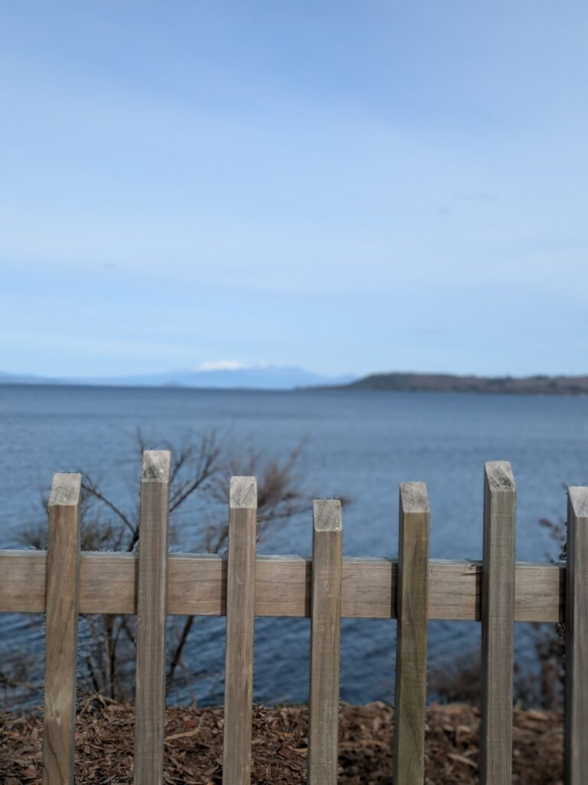
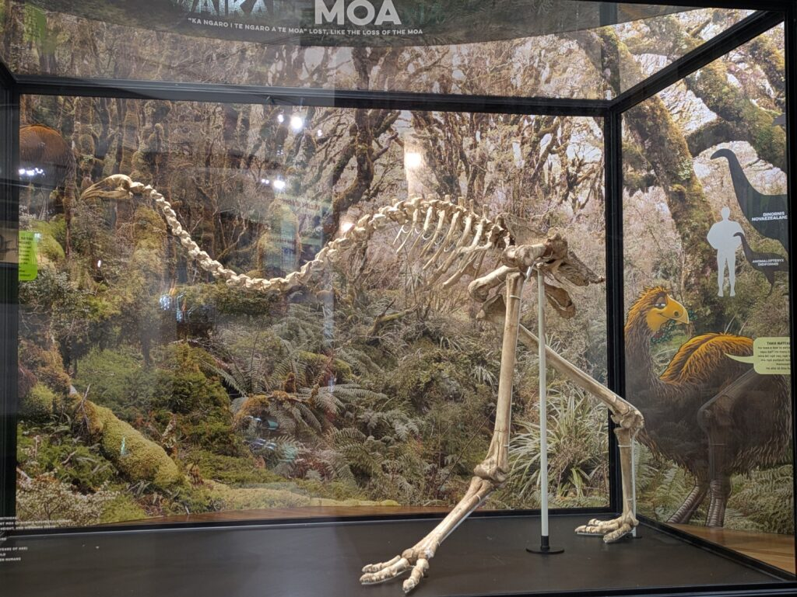
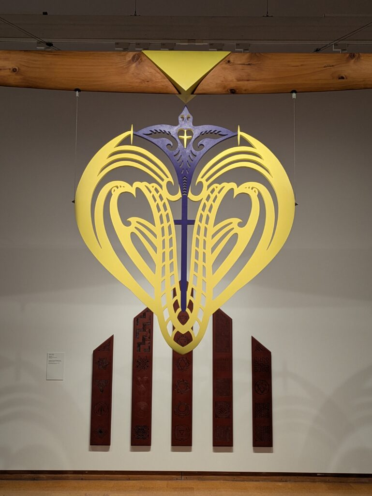
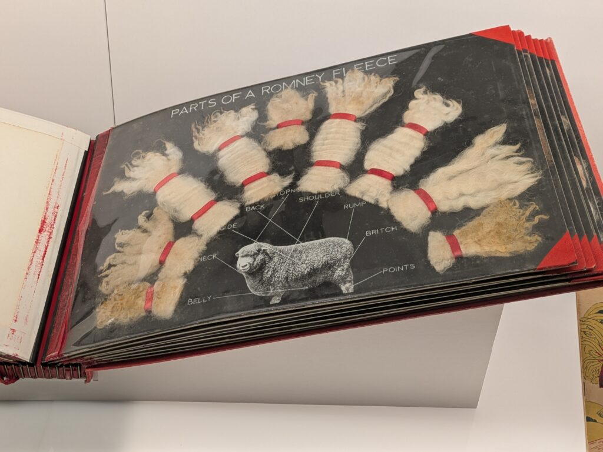
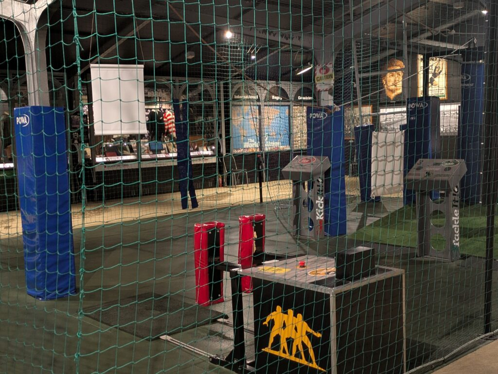
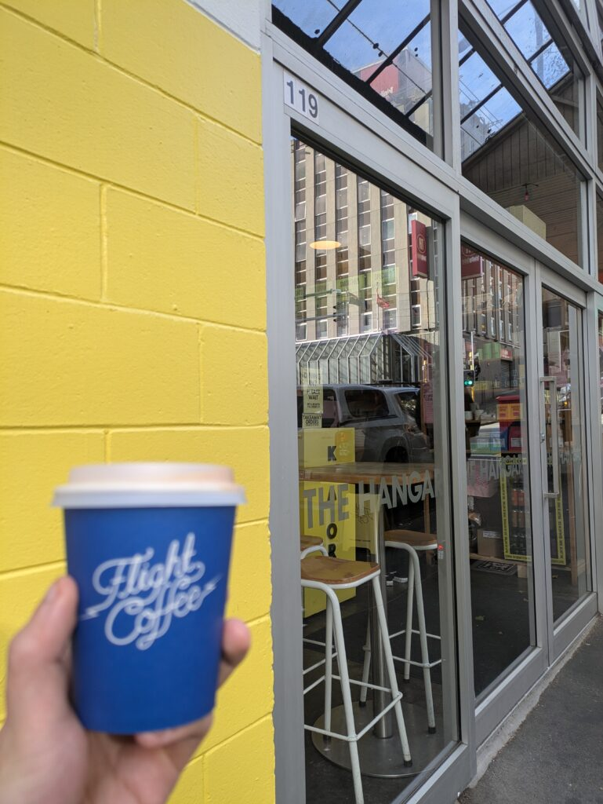
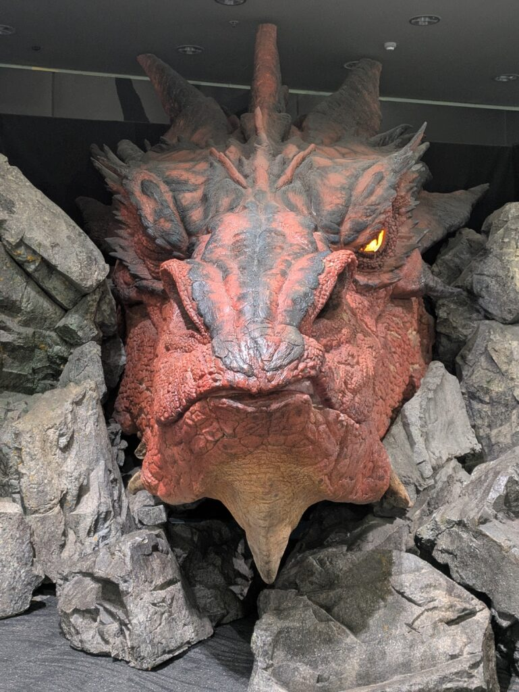

## English\_Practice

I have not written for one week. I didn't have a chance to do, but I take it easy a little now so I will do. I wrote about preparing on road trip at previous time.

I went to Wellington without detour. I went to Taupo and Palmerston North because I went to Hamilton before so I went to Taupo directory. I did not go to other places so when I will go back to North Island, I will go there.

### Taupo

I went to Taupo Lake and museum in Taupo. I saw some monuments near the lake and taught in history in museum.

Moreover, there were "Moa" in New Zealand, but they are extinct because the human came here. I did not know about this animal, but it is a good discovery to know like it. I found another "Moa" fossils in another place.

I went to the city called "Palmerston North" after Taupo. This is a little big city because I had to pay for fee in parking area.

### Palmerston North

I also went to the art gallery and museum. When I went to there, I can understand history of this town. If it is possible, I would like to eat some food, but I have to consult with my wallet. In addition, this is big building which is attached the art gallery.

There is also exhibitions about rugby. I felt vibes about real practicing. Moreover, I can play it like games, but the description shows that be careful as I might get injured. I did not play a lot because I almost were sandals.

I went to Wellington and did sightseeing after I saw that. Actually, I wrote a blog for half of day in the library.

### Wellington

After that, I drank coffee and saw some monuments near the place where I slept in my car. Moreover, I wandered around the city. I enjoyed doing because there is similar to Auckland, but a little bit different.

I went to the Wellington Airport later because there is a shower. Almost all of people are not related, but it is a good place when I travel with my car. I can take a warm shower for free. It might not be for true purpose.

That is it. I have a lot of things to write, but I will do nect time. See you later.

## 日本語版

1週間ほど空いてしまいました。書くタイミングがなかったのですが、少しゆっくりできるタイミングなので書いてみます。前回ロードトリップをするときの準備の話をしました。

ウェリントンまではそこまで寄り道せずにほぼまっすぐ行ったと思います。寄ったところはTaupoとpalmerston Northですね。[前](/posts/2025/07/hamilton-garden-visit/)はHamiltonに行ったのでそこはスルーしてTaupoに直接向かいました。まだ寄ってないところもあるので北島に帰るときによって行こうと思います。

### Taupo

TaupoではTaupo湖と博物館に行きました。とは言っても湖の近場のモニュメントを見たり博物館に行って歴史に触れたりしたぐらいですね。

また、ニュージーランドにはMoaという生物がいたそうで人間が来たことで絶滅したみたいです。この生物については全く知らなかったのですが、こんな生物がいたということがわかってよい発見でした。Moaの化石は他の場所でも見かけることになります。

Taupoに行った後はPalmerston Northという町に行きました。ここも少し大きめの場所でした。大体パーキングエリアでお金を取られたりする場所はそこそこ発展してますからね…

### Palmerston North

ここでも同じように美術館と博物館に行ってきました。そこに行くことでこの町の歴史がわかったりしますので。可能なら料理も食べたいですが財布と要相談ですね。とは言っても併設されてる大き目の博物館でしたが。

またこの博物館ではラグビーに関する展示もしてありました。実際に練習している雰囲気を味わうことができます。また、ゲームのような感覚でプレイもできますが怪我をするかもしれないので注意してくださいともありました。私はサンダルで基本散策しているのでほとんどプレイしませんでしたが。

これを見た後ウェリントンに行き一日観光してました。とは言ってもその半分くらいは図書館にこもってブログを書いていたのですが。

### Wellington

後はコーヒー飲んだり寝泊まりした場所の近くのモニュメントを見たり、町を散策したりという感じです。オークランドと似てるとは思いつつも違った部分もあったので、結構楽しかったですね。

後はウェリントン空港に行きました。というのも中にシャワーがあるからですね。ほとんどの人は関係ないと思いますが、車中泊旅をするのであればここは良いと思います。無料で温かめのシャワーが使えますので。本来はそういった目的のためではないかもしれませんが。

一旦はここまでですね。他にも書くことは色々あるのですがまた次回に書いてみようと思います。ではでは。

## AI採点

Here’s an IELTS-style Writing assessment of your English **translation** (not the Japanese original). Because this isn’t a response to a specific IELTS task prompt, “Task Response” is approximate.

# Estimated Band: **5.0** (Writing)

**Task Response (≈5.0)**  
Main message is clear (a short travel log), but the purpose isn’t explicit, development is uneven, and some sentences are redundant or off-task.

**Coherence & Cohesion (≈5.0)**  
Paragraphing with headings is helpful, but linking is mechanical (“Moreover/After that” overused), referencing is weak (“that/it/there” used vaguely), and some sentences are run-ons or fragments.

**Lexical Resource (≈5.0)**  
Everyday vocabulary is fine, but there are frequent collocation/word-choice errors (“taught in history,” “directory,” “vibes about real practicing”), occasional spelling mistakes (“nect”), and repetition.

**Grammatical Range & Accuracy (≈5.0)**  
Frequent issues with tense, articles, prepositions, subject-verb agreement, and countable/uncountable/plural forms. Meaning is usually recoverable but errors are noticeable.

* * *

## High-impact corrections (before → after | why)

1. _I have not written for one week._ → **I haven’t written for a week.** | Natural present perfect; fixed article/number.

3. _I didn’t have a chance to do, but I take it easy a little now so I will do._ → **I didn’t have a chance before, but I have some downtime now, so I’m writing.** | Add object; natural phrasing; tense consistency.

5. _I wrote about preparing on road trip at previous time._ → **Last time I wrote about preparing for a road trip.** | Preposition “for”; concise time phrase.

7. _I went to Wellington without detour._ → **I went to Wellington without taking many detours.** | Countability/collocation.

9. _I went to Taupo … so I went to Taupo directory._ → **… so I headed straight to Taupo.** | “directly,” not “directory”; natural verb.

11. _I will go back to North Island_ → **(the) North Island** | Missing article with geographic name.

13. _I went to Taupo Lake and museum_ → **I visited Lake Taupo and the local museum.** | Proper place name; add article.

15. _saw some monuments … and taught in history in museum_ → **… and learned about the area’s history at the museum.** | Correct verb; preposition “at.”

17. _there were “Moa”… they are extinct because the human came_ → **I learned about the moa, a bird that became extinct after humans arrived.** | Article/number/relative clause.

19. _I found another “Moa” fossils in another place._ → **I later saw more moa fossils elsewhere.** | Plural agreement; concise.

21. _This is a little big city because I had to pay for fee in parking area._ → **It’s fairly big—you usually have to pay for parking downtown.** | Collocations; article use.

23. _When I went to there, I can understand history of this town._ → **Visiting them helped me understand the town’s history.** | Remove “to”; tense consistency; article “the.”

25. _exhibitions about rugby … vibes about real practicing_ → **a rugby exhibit that simulates a training session.** | Accurate noun/verb choice.

27. _the description shows that be careful as I might get injured_ → **signs warned you could get injured.** | Natural reporting; modal.

29. _I almost were sandals._ → **I was wearing sandals most of the time.** | Past progressive; adverb placement.

31. _for half of day in the library_ → **for half the day at the library.** | Article; preposition.

33. _there is a shower … Almost all of people are not related_ → **the airport has showers. Most people won’t need this, but it’s great for car-campers.** | Existential “there is” → possessive “has”; article/number.

35. _It might not be for true purpose._ → **Probably not its intended purpose.** | Natural idiom.

37. _I will do nect time._ → **I’ll write more next time.** | Spelling; natural verb.

> **Articles & number** you often missed: _the North Island, the museum, a shower, exhibits, fossils_ (plural), _an exhibit_ (singular).

* * *

## Clean, natural version (Band-7 model rewrite)

Last time I wrote about getting ready for a road trip. I hadn’t had time to write for a week, but I’ve got a quiet moment now.

I drove to Wellington without many detours, stopping in Taupo and Palmerston North. I’d visited Hamilton before, so I headed straight to Taupo. There are still places I’ve missed, so I’ll check them out when I’m back on the North Island.

In Taupo I visited Lake Taupo and the local museum. I looked at a few lakeside monuments and learned about the area’s history. I also learned about the moa—a giant bird that became extinct after humans arrived in New Zealand. I later came across more moa fossils elsewhere.

After Taupo I went to Palmerston North. It’s a fairly big city—you usually have to pay for parking in the centre. I visited the art gallery and museum, which helped me understand the town’s history. There was also a rugby exhibit that simulated a training session, with game-like activities, though the signs warned about possible injuries. I didn’t try much because I was wearing sandals.

I spent a day in Wellington. I did some sightseeing, but I actually spent about half the day at the library writing my blog. I grabbed coffee, checked out a few monuments near where I parked overnight, and wandered around the city. It feels similar to Auckland but has its own character. Later, I went to Wellington Airport because they have free warm showers—handy if you’re car-camping, even if that’s not really the intended use.

That’s it for now. I’ll write more next time.

* * *

## What to fix first to reach Band **6.5+**

1. **Tense control for narratives:** keep past simple for the trip (went/visited/saw) and use present perfect only for life-experience links (I’ve visited before).

3. **Articles & plural-singular:** _the North Island, the museum, a shower; fossils/exhibits (pl.)_.

5. **Collocations:** _pay for parking; head straight to; learn about history; spend half the day; wander around; similar to._
