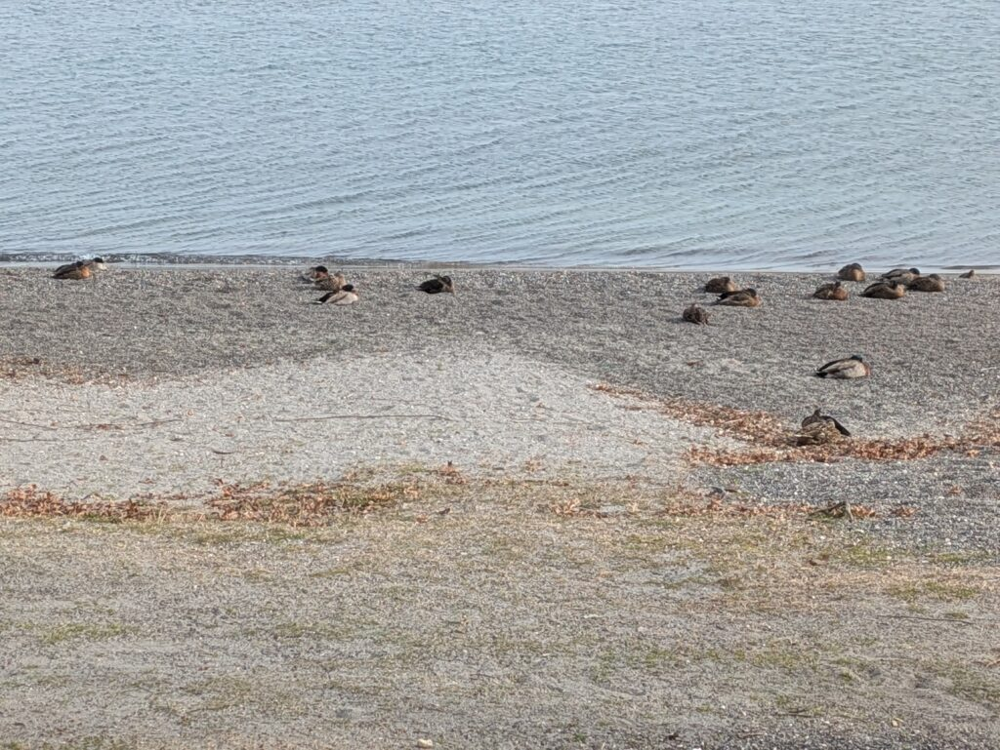

## English\_Practice

### Road Trip Overall

I left my flat and started road trip from last Monday. I told that I bought my car, and I have used it for traveling.

Personally, I will write good points and how to do better. I will write trip details next time.

It spent for three days, I went to Wellington from Auckland. I have more taken it easy than I expected, but I have enjoyed it.

### Attention Bed and Gas Stove

I did not care about buying my car, I will write attention points.

The first issue is the length of the bed. When you're in a sleeping position, it's just the length of the vehicle body. Also, the front seat doesn't recline completely forward, so your feet just touch the bed. I think it would have been better to actually sleep in it and consider whether to buy it, including this point. I think it would be even more difficult for tall people to sleep in it. The previous owner of mine was about 180cm tall, so I wonder how he managed to sleep in it…

Secondly, it is a gas stove. I thought I can use it, but I could not. I guess that it is not empty gas so this is stove's problem. I write how to deal with it at third point.

### About Portable Battery

Thirdly, it is a portable battery. I bought it because I might use it for working with PC. Moreover, due to use for cooking machines. It was the best timing because I realized I could not use gas for them accidentally.

I had to be careful to choose a portable battery because it depends on wat. I bought it which can output 800w stability. I was going to buy 500w one. However, it was not sold in a shop. I think it is good choice.

800W is about the same power as a small microwave. You can't cook grilled dishes, but you can make stews and mixed rice dishes, so I personally think it's enough. By the way, the one I bought was the River 2 Pro, which cost about $860 (¥75,000), and the one I was planning to buy was the River 2 Max, which cost $660 (¥57,420). Both were on sale for this price. Well, you can still buy them used, so I'm not particularly worried.

### Attention Network and Shower

Fourthly, it is network envirnment. This is my mistake that I bought 1.5GB plan in "2degrees", but it reached the data limit immediately. It was no problem when I went to English school so that I think I will use PC with tethering so I changed "Unlimited plan". However, I recommend you change the plan before your trip because I am not sure it changes immediately.

Fifthly, it is a shower. There are loundrys anywhere, but it is a little hard to find warm shower. I research with "CamperMate" which shows there are a lot of warm shower. Nevertheless, you should make sure comments. Some warm shower stop working and there is not warm shower. It is fine that you can endure for one day.

I had some troubles to live in my car like that. I believe I can do anythings now. It is hard to stay in my car but I consider about that because it is useful in my life. See you later.

## 日本語版

### ロードトリップ概要

月曜からフラットを退去してロードトリップを始めました。[以前](/posts/2025/07/self-contained-used-car-buying-guide/)車を購入したという話をしましたが、それを使って車中泊をしながらの旅になります。

個人的にこれが良かったとかこうしておくと良いという点を挙げてみようかと思います。実際にどんな旅だったかはまた次回書いてみようと思います。

現時点では旅から3日ほど経過しましたが、オークランドからウェリントンまで来ました。予定よりものんびりしてますが、割と楽しめてるかと思います。

### 注意点 ベッドとガスコンロ

車を購入する際に気にしてなかったのですが、今気になる点を少し話してみようと思います。

1つ目はベッドの長さですね。寝る態勢が車体のギリギリの長さとなっています。また、前の席も前側に完全には倒れないので足がちょうど当たる位置になっています。ここも含めて実際に寝て購入すべきか検討したほうが良かった気がします。身長が高い人は尚更寝にくい気がしますね。私の前の持ち主が180cmはありそうだったので、どうやって寝たのか気になりますね…

2つ目はガスコンロですね。使えるだろうと高をくくってましたが、使えませんでした。ガスはまだ入っていたので器機側の問題かなという気がします。どうやって対処しているかは3つ目で書いていきます。

### ポータブルバッテリーについて

3つ目はポータブルバッテリーですね。これは私がPCを使って作業をする可能性があったので買ったというのもありますが、料理系の電子機器を使うためでもありました。料理系の電子機器はたまたまガスが使えないとわかったのでちょうど良いタイミングでした。

ポータブルバッテリーに関しては注意が必要で器機によってワット数が異なるところですね。私が買ったのは800Wが安定して出力できるものになります。500Wのものを買う予定でしたが、店舗には売ってなかったので…これは逆に良い選択だったと思います。

800Wであれば小型のレンジが使えるレベルですね。焼く系の料理は作れませんが、煮込みや混ぜご飯の物は作れるので個人的には十分かなと思います。ちなみに私が買ったのは[River 2 Pro](https://ecoflowtech.co.nz/products/ecoflow-river-2-pro?srsltid=AfmBOopmYsaHP08WK72W24qsN74eCtgn3wE5b62YZeDyXdG8Iyh3A1R-)で約$860(¥75,000)、買う予定だったものはRiver 2 Maxの$660(¥57,420)ですね。どちらもセールでこの値段でした。まあ中古でも売れるので特に気にしてません。

### 注意点 ネットとシャワー

4つ目はネット環境ですね。これは僕のミスですが2degreeの1.5GBプランを買ってましたが、すぐに到達しちゃいました。学校に行ってた時は特に問題なかったのですが…なのでPCも使うと思いUnmilitedプランに変更しました。ただ、変更直後に切り替えられるとは限らないので事前に変更することをおすすめします。

5つ目はシャワーですね。ランドリーはどこにでもありますが、温かいシャワーは少しだけ大変な気がします。CamperMateで探すとあちこちにありますが、コメントを見ていくことをおすすめします。止まってたりそもそもない場所もありますので。1日ぐらい我慢できれば大丈夫だと思います。

といった感じで生活をする際に困ったことがいくつかありましたが、今は何とかなりそうという気がしてます。車中泊での旅は大変なこともありますが、今後の参考にもなるのでもう少し色々考えながらやってみたいと思います。ではでは。

## AI採点

### IELTSの採点とフィードバック

**日本語文:**

- **Task Achievement (TA)**: 概ね目的を達成していますが、いくつかの細かい点で明確さが欠けている部分があります。特に、細かい旅行の詳細についての言及はありますが、それらを結びつけて一貫した流れにすることが求められます。具体的な改善点を挙げると、「注意点」セクションではそれぞれの課題に対して何を学んだか、どんな改善策を考えたかをより明確に説明すると良いです。

- **Coherence and Cohesion (CC)**: 基本的に段落ごとの流れは良いですが、文と文のつながりがもう少しスムーズにできるとより効果的です。例えば、「これが良かった」「こうしておくと良い」という部分の接続がやや唐突に感じます。旅行の過程で得た学びや反省点にもっと深く言及し、各部分がどう関連しているかを強調すると良いでしょう。

- **Lexical Resource (LR)**: 単語の選び方に特に問題はありませんが、語彙の多様性を増すためには、「気になる点」や「気がします」のような繰り返しを避けると良いです。また、「ポータブルバッテリー」に関する部分で、同じ語彙が何度も繰り返されているため、少し工夫して言い換えることができます。

- **Grammatical Range and Accuracy (GRA)**: 多少文法的なミスが見受けられます。例えば、動詞の時制の一貫性が欠けていたり、接続詞の使い方に誤りがあったりします。また、「といった感じで生活をする際に困ったことがいくつかありましたが、今は何とかなりそうという気がしてます。」のように、主語が不明確な文や不自然な言い回しが見受けられます。

**英語文 (翻訳文):**

**Task Achievement (TA)**: 内容はほぼ正確に伝わっており、段落ごとのテーマが明確ですが、少し抽象的に感じる部分もあります。特に、「Next time」や「I will write trip details next time」の部分は少し曖昧で、次回どのように書く予定か具体的な指針があれば、さらに効果的です。

**Coherence and Cohesion (CC)**: 全体的に理解しやすいですが、文のつながりが時々ぎこちなくなっています。「Attention Bed and Gas Stove」のセクションで、「I will write attention points」とありますが、「I will write about the issues」や「Here are the points to consider」など、より明確な表現にすることができます。また、情報の順番が少しランダムに感じる部分があるため、構成を見直すとさらに良くなります。

**Lexical Resource (LR)**: 「I wonder how he managed to sleep」など、適切な表現が使われており、全体的に語彙力には問題はありませんが、「tethering」や「research」など、単語選択において少し不自然に感じる部分があります。例えば、「I research with CamperMate」よりも「I searched on CamperMate」などの方が自然です。

**Grammatical Range and Accuracy (GRA)**:

- **時制の不一致**: 「It spent for three days」→「It has been three days」または「Three days have passed」など、より正確な表現に修正できます。

- **語順の誤り**: 「I told that I bought my car」→「I mentioned that I bought my car」や「I told the story that I bought my car」といった表現に変更できます。

- **前置詞の誤り**: 「use it for traveling」→「use it to travel」など、前置詞の選び方に注意が必要です。

- **不自然な表現**: 「I guess that it is not empty gas」→「I think the gas is not the problem」など、もっとシンプルで自然な言い回しにできます。

**詳細なフィードバック**:

- **文法の改善点**:
    1. 「I told that I bought my car」→「I mentioned that I bought my car」や「I said I had bought my car」の方が自然です。
    
    3. 「I can use it, but I could not」→「I thought I could use it, but I couldn't」など、時制の一致を見直しましょう。
    
    5. 「I guess that it is not empty gas」→「I think the gas is still there, so the stove may be broken」という表現がより適切です。

- **語彙の改善点**:
    1. 「It is a little hard to find warm shower」→「It is a bit difficult to find a warm shower」。
    
    3. 「research with CamperMate」→「I searched using CamperMate」または「I checked CamperMate」など。

- **構文の改善点**:
    - 文章のつながりやロジカルな流れを強化するため、接続詞や順番を見直してください。例えば、「Therefore,」「However,」などをうまく活用し、意見や事実をつなげていくと、文全体がより一貫性を持ちます。

### 総合評価:

- **日本語**: 6.5-7.0 (情報はしっかりしているが、文法や語彙の面で改善の余地あり)

- **英語**: 6.0-6.5 (全体的に内容は伝わるが、細かい文法と語彙の改善が必要)

**改善点**:

1. 文法の一貫性と語彙の選択に注意しましょう。

3. 各パラグラフのつながりをスムーズにし、より論理的に構築すると良いです。
