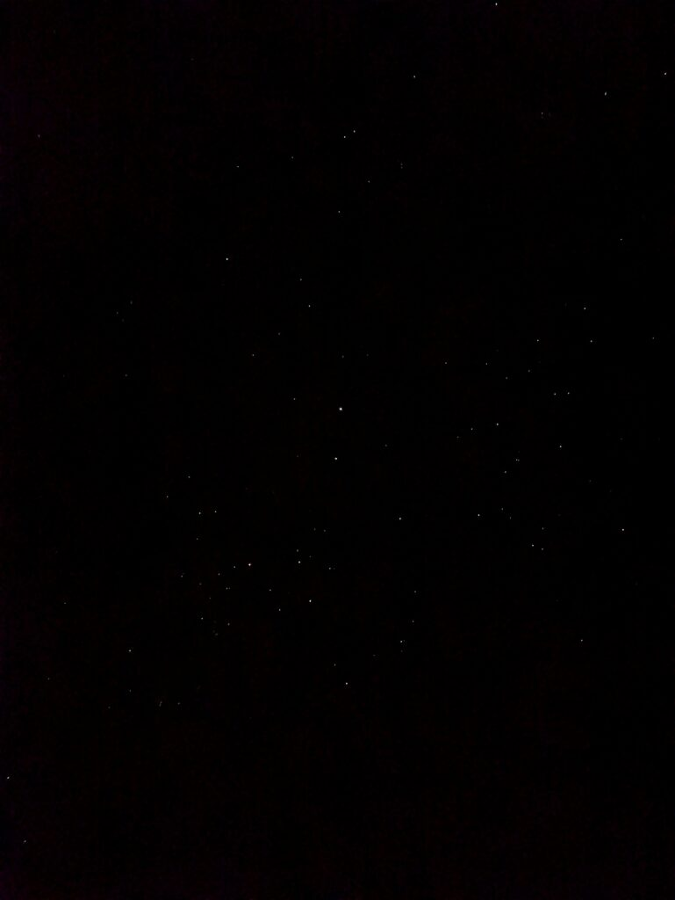
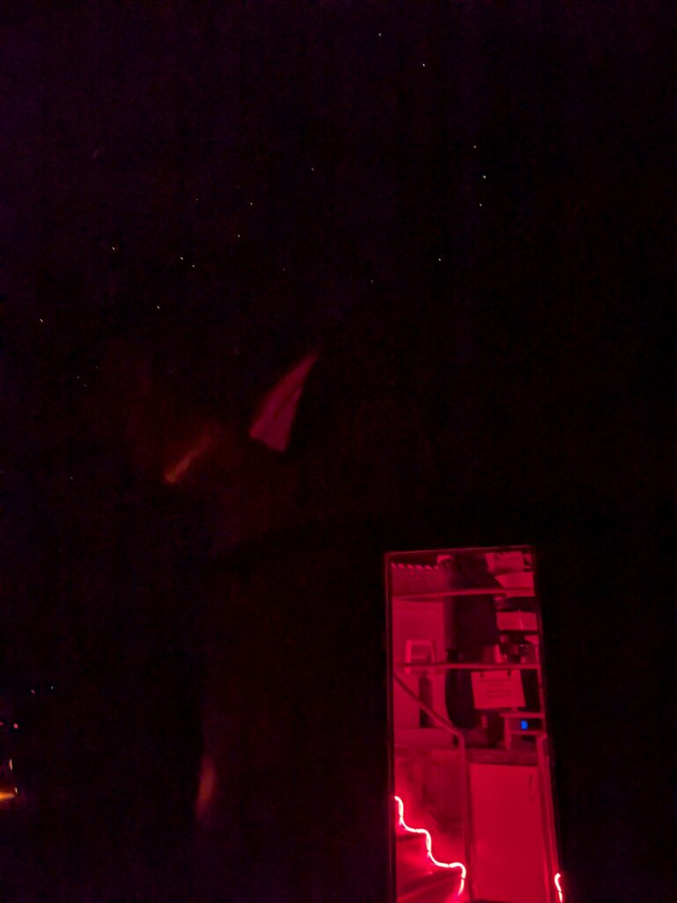

## English\_Practice

I joined a tour called "DarkSkyProject" which is stargazing. I went to the Lake Tekapo. I chose a Japanese tour so it was not a English tour. Actually, English tours were filled in and I could only choose it at 11:45p.m.

Anyway, I arrived there on time. However, when I arrived there, the staff already started describing. The check in time was 9:15 p.m. and departure time was 9:30 p.m., but everyone came here early time. I suspected I an Japanese.

### DarkSkyProject Description

After explaining, I received the light and wore a down jacket. I later got on the bus. It is for free to were a down jacket. Nevertheless, I wore a heattech and three clothes, a down jacket so that either is fine. You should have a cairo.

We must not turn on the light. The white light disturbs the research. However, I could take photos without the light. I saw the starry sky in the milky way galaxy. That is so beautiful. I took photo for using Night sight mode, but I can not take photo with galaxy.

### DarkSkyProject Stargazing

After explaining, there were three telescopes. I wandered around there and enjoyed listening to explanation and asking some questions. It took for two hours so staffs changed the angle of telescope for seeing.

I watched new stars, old stars, the Saturn and alpha star. The Saturn had a ring which I looked. In addition, I learned a lot of knowledges.

Furthermore, I was taught that the twelve zodiac constellations including Scorpio, the Southern Cross, and Canopus. Personally, I wanted to ask for stars related Maori, but I did not have enough time. I will search about that.

I enjoyed like that. To be honest, I would like to see the aurora, but I did not. I guess the electromagnetic waves are not strong. If I have a chance, I will go there again. Perhaps, I can not go there this year. See you later.

## 日本語版

星空観察に適している[Darkskyproject](https://www.darkskyproject.co.nz/)というツアーに参加してきました。これはテカポ湖で行われました。今回参加したツアーは日本語対応の物で英語ではありません。というのも英語はほぼ埋まっていて11:45PM以降の物しかなかったからです。

というわけで時間内に着くよう現地に向かいました。着いたときには説明が始まってましたね。9:15チェックインの30出発だったのですが、早いタイミングでほぼそろったみたいです。私が日本人か疑わしくなりました…

### DarkSkyProject 事前説明

説明を聞いた後、受付でライトをもらってジャケットを着てバスに乗り込みます。ダウンジャケットは無料なので着ていきましょう。とは言え私はヒートテックに3枚着てダウンジャケットもあったのでどっちでもよかったのですが。カイロもあると良いですね。

山頂についたら到着でライトは付けてはいけません。白色ライトは研究の邪魔になるそうです。ただ、写真は問題なしとのことでした。満天の星空に天の川銀河まで見える状況でした。これはいつ見ても壮観ですね。Night sightというモードを使えば多少星を取ることはできます。銀河までは無理でしたが。

### DarkSkyProject 天体観測

少し解説があった後、3つの望遠鏡が設置されてました。そこを見回りながら少し解説や質問をしてツアーを楽しみました。2時間もあるのでもちろん望遠鏡で見る星は変えてました。

ざっくりと新しい星や古い星、土星にアルファ星を見ました。土星はしっかりとリングが見えましたね。他にもいろんな知識が学べてためになったなと感じました。

それからさそり座を含む黄道十二星座と南十字星、カノープスについて教えてもらいました。個人的にはマオリに関連する星も聞いてみたかったのですが、人も多く時間がなかったので断念しました。個人的にあとから調べてみようと思います。

こんな感じで天体観測を楽しんできました。本当の目的としてはワンちゃんオーロラが見えないかなと思ってきたのですが、今回はダメでした。電磁波があまり強くなかったみたいです。まあタイミングがあればまた行ってみようとは思います。今年は無理かもしれませんが。ではでは。

## AI採点

# 総合評価（英訳文）

- **Overall:** **Band 5.5**（推定）

- **Task Response（TA）:** 6.0  
    体験の要点は伝わるが、主張・段落構成・結論の明確さは弱め（エッセイ基準で見ると）。

- **Coherence & Cohesion（CC）:** 6.0  
    時系列で流れは追えるが、接続語の選択と段落内の情報整理が不自然な箇所あり。

- **Lexical Resource（LR）:** 5.5  
    言い換えの幅が狭い／不自然コロケーション・訳語の直訳が散見（_knowledge_ の不可算など）。

- **Grammatical Range & Accuracy（GRA）:** 5.0  
    冠詞・前置詞・単複・時制・語順のエラーが頻発し、読解に負荷。

* * *

## 主な強み

- 体験のディテール（時間、装備、観測対象）が具体的。

- 語彙に天文関連語を取り入れようとする意欲（_Milky Way, telescopes, Southern Cross, Canopus_ など）。

## 主要な減点要因（タイプ別）

1. **冠詞・可算/不可算**
    - _a English tour_ → **an English tour**（母音音 /ɛ/）
    
    - _a lot of knowledges_ → **a lot of knowledge**（_knowledge_ は不可算）
    
    - 固有名詞の冠詞：_the Lake Tekapo_ → **Lake Tekapo**（地名は無冠詞が基本）

3. **コロケーション/語法**
    - _filled in_（用紙記入の意味が強い）→ **fully booked / booked up**
    
    - _I suspected I an Japanese_ → 文法も含め **I started to doubt whether I was being very Japanese about punctuality** など自然表現へ
    
    - _It took for two hours_ → **It lasted two hours / The tour took two hours**
    
    - _I watched new stars, old stars_ → **I viewed young and old stars**（望遠鏡で “watch” より _view/observe_）

5. **動詞・時制・文型**
    - _the staff already started describing_ → **the briefing had already started**
    
    - _It is for free to were a down jacket_ → **The down jacket was free to borrow**（to wear/were 混同）
    
    - _We must not turn on the light_（規則の過去報告）→ **We were told not to turn on white lights**

7. **前置詞・語順**
    - _I arrived there on time. However, when I arrived there…_ → 重複回避：**I arrived on time, but the briefing had already started.**
    
    - _explanation_ の無冠詞使用 → **after the briefing / after the explanation**

9. **固有名詞・大文字**
    - **Dark Sky Project / Milky Way / Saturn / Scorpius**（_Scorpio_ も可）などは大文字始まり

11. **不自然/直訳っぽい表現**
     - _You should have a cairo._（カイロ）→ **Hand warmers are useful.**
     
     - _the electromagnetic waves are not strong_ → **geomagnetic activity was low / the KP index was low**（オーロラは太陽風と地磁気擾乱による現象。_electromagnetic waves_ は不適切）

* * *

## 代表的なエラー→改善例（抜粋）

- **I joined a tour called "DarkSkyProject" which is stargazing.**  
    → **I joined a stargazing tour called the Dark Sky Project.**

- **I went to the Lake Tekapo.**  
    → **I went to Lake Tekapo.**

- **I chose a Japanese tour so it was not a English tour.**  
    → **I chose the Japanese-language tour, so it wasn’t in English.**

- **English tours were filled in and I could only choose it at 11:45 p.m.**  
    → **The English tours were fully booked; the only slot left was after 11:45 p.m.**

- **the staff already started describing**  
    → **the briefing had already started**

- **It is for free to were a down jacket.**  
    → **The down jacket was free to borrow.**

- **I took photo for using Night sight mode, but I can not take photo with galaxy.**  
    → **Using Night Sight mode, I managed to capture some stars, but not the Milky Way.**

- **There were three telescopes. I wandered around there and enjoyed listening to explanation.**  
    → **Three telescopes were set up. I moved between them, listening to the explanations.**

- **It took for two hours so staffs changed the angle of telescope.**  
    → **Over the two hours, the staff adjusted the telescopes to target different objects.**

- **I learned a lot of knowledges.**  
    → **I learned a lot.**

- **I wanted to ask for stars related Maori.**  
    → **I wanted to ask about stars associated with Māori traditions.**

- **the electromagnetic waves are not strong**  
    → **the geomagnetic activity wasn’t strong enough**

* * *

## 科学的な誤りの指摘（簡潔）

- **× electromagnetic waves were not strong**  
    **✓** 南半球でのオーロラ可視性は主に**太陽風・CMEによる地磁気活動（Kp指数）と暗天・雲量**に依存します。ここでは「電磁波の強さ」ではなく**geomagnetic activity（地磁気活動）やsolar wind conditions**が適切です。

* * *

## 推奨リライト（Band 7.5–8 相当の自然な英語）

_（あなたの内容・事実は保持しつつ、英語だけ自然に整えています）_

> I joined a stargazing tour called the **Dark Sky Project** at **Lake Tekapo**. I opted for the Japanese-language tour because the English tours were almost fully booked and the only remaining slot was after 11:45 p.m.
> 
> I arrived on time, but the **pre-tour briefing** had already started—apparently most people had shown up early, which made me feel uncharacteristically late for a Japanese person.
> 
> After the briefing, I picked up a light and a down jacket at reception and boarded the bus. The down jacket was free to borrow. I already had Heattech and three layers plus my own down, and hand warmers were useful too.
> 
> At the summit we were told **not to use white lights** because they interfere with research, but photos were allowed. The sky was breathtaking—**a carpet of stars and the Milky Way**. With Night Sight I could capture a few stars, though not the galaxy itself.
> 
> Three telescopes were set up. Over the **two-hour session**, the staff kept adjusting them so we could observe different objects. I viewed **young and old stars, Saturn—with its rings clearly visible—and an alpha star**. I also learned a great deal from the explanations.
> 
> We covered the **zodiac constellations** (including **Scorpius**), the **Southern Cross**, and **Canopus**. I wanted to ask about stars associated with **Māori** traditions, but there wasn’t enough time. I’ll look into that later.
> 
> Overall, it was a wonderful experience. To be honest, I had hoped to see the **aurora**, but **geomagnetic activity** was low that night. If I get the chance, I’ll go again—maybe not this year, though.

* * *

## Band 6.0～6.5向け「やさしめ」リライト（語彙・文構造を簡潔に）

> I joined a stargazing tour called the Dark Sky Project at Lake Tekapo. I chose the Japanese tour because the English tours were almost full and only a very late time was available.  
> I arrived on time, but the briefing had already started because many people came early.  
> We borrowed lights and free down jackets, then took the bus to the summit. We were told not to use white lights, but photos were allowed. The sky was beautiful, and I could see many stars and the Milky Way. Night Sight helped, but I couldn’t capture the galaxy well.  
> There were three telescopes. During the two-hour tour, the staff adjusted them so we could see different objects. I saw young and old stars, Saturn and its rings, and an alpha star. We also talked about the zodiac constellations, the Southern Cross, and Canopus.  
> I wanted to ask about Māori star traditions, but there wasn’t enough time. I enjoyed the tour, although I didn’t see the aurora because geomagnetic activity was low. I hope to go again.

* * *

## 到達度アップのためのピンポイント練習（Band 7+ へ）

1. **冠詞ドリル**（10分/日）：_a/an/the/Ø_ を文脈で選ぶ
    - Lake Tekapo（Ø）, the Milky Way（the）, a down jacket（a）

3. **コロケーション置換練習**（_fully booked, pre-tour briefing, borrow a jacket, adjust a telescope, geomagnetic activity_）

5. **接続語のメリハリ**：_however, although, overall, in fact, meanwhile, as a result_ を段落頭に的確配置

7. **報告表現**（受動・間接話法）：_We were told (not) to… / We were allowed to…_

9. **分詞・関係詞で情報圧縮**：_Saturn, **with** its rings clearly visible… / the tour **which** lasted two hours → the **two-hour** tour_

* * *

## 参考ミニ語彙（天文）

- **observe / view**（望遠鏡で見る）, **briefing**, **light pollution**, **dark-sky reserve**, **constellation**, **celestial**, **nebula**, **cluster**, **apparent magnitude**
