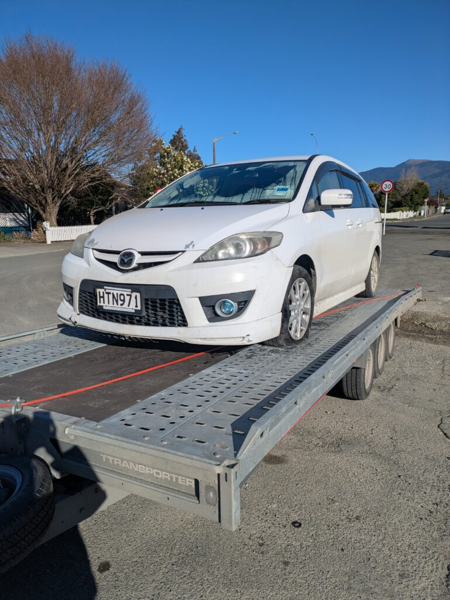
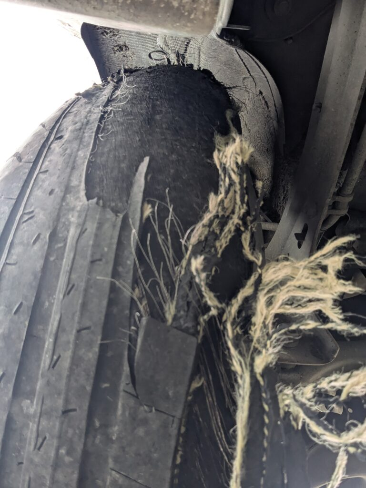
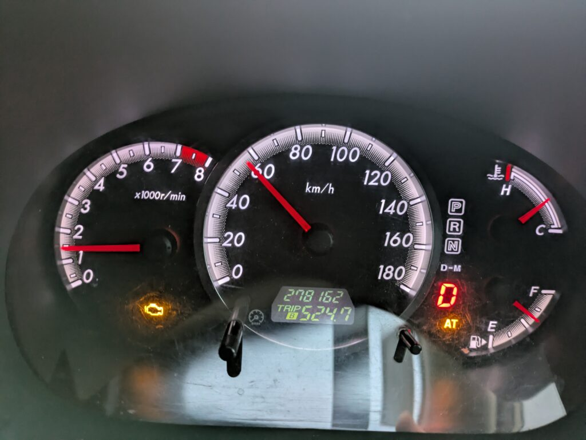

## English\_Practice

I bought a car at first time after coming here. The car is "Mazda premacy 2008". It ran 277000km, it was an old car but it cost $2900 so I purchased it. I told this story before.

I did not about cars detail, tire was reduced and TCM was abnormal.

### Fixing Car About Punk

It is easy to check the tire which has slip signs appearing. Moreover, appearing slip signs are illegal in Japan even New Zealand.

The problem was caused by a reduced tire and gravel road. One day, a front tire was punk so I replaced two front tires. It cost $300. After that, a back tire was punk and I replaced it so that it cost $380. It depends on the tire shop.

"AA" is road service and I asked for moving with wrecker. In a front tire case, we went to the local tire shop. In a back tire case, we went to the service shop related AA. Its cost is higher than other tire shops.

### Fixing Car About TCM

The next part is TCM. I did not realize that the orange light called "AT" was glowing. I worried about that and I asked about TCM to fixing shop. Therefore, TCM was broken. It cost $1800 totally. The part cost $1000. It was too expenseive.

At first time, I was told that a speed sensor was abnormal and it cost $300. However,the staff investigated that TCM was abnormal. If I did not fix it, my car might not change gear to 4 more because of speed abnormally. I decided to repair my car because there are a lot of slopes in NZ.

### Lesson

I think I lost out than buying things. If I buy a old car in Japan, I will care of not only tires and TCM but also break and engine. I had just checked mileage before.

In addition, if you are not member in AA and use road service, it cost $110 each. Membership fee is $100 so that I recommend that you register membership when you will buy a old car. You might use jump start like me. Furthermore, you will be member after registration in one day so it is impossible to be a member on accident day.

It is good experience for me such as trouble and accident with car. Moreover, I realized my English skills. I will make much efforts. See you later.

## 日本語版

こちらに来て初めて[車を買いました](/posts/2025/07/self-contained-used-car-buying-guide/)。この時買ったのがMazda premacy 2008という車になります。走行距離も27.7万キロ走っており、中々の中古車ですが$2900だったので購入することにしました。この話は以前したかと思います。

私が車に対して何も知らないのが良くなかったのですが、タイヤがほぼする切れてる状態かつTCMというコンピューター部分に異常をきたしている状態で買ったみたいでした。

### 車の修理 パンクについて

タイヤについてのチェックは簡単でタイヤの溝にある凸部分(スリップサイン)が露出しかけてなければ大丈夫だと思います。日本でもニュージーランドでもスリップサインが出るまで走った場合は違法みたいですね。

パンクしたのはタイヤが擦り減っている＋砂利道をよく通っていたのが原因みたいです。ある日前輪がパンクして前輪2つとも交換しました。大体$300ですね。その後、後輪がパンクして交換したら$380でした。どうやらタイヤショップによって異なるみたいです。

AAというロードサービスがあり、そこに依頼してレッカーに移動してもらいました。前輪のほうは地元にあるタイヤショップに行き、後輪のほうはAAと提携している場所に行きました。AAと提携しているところは軒並み高めかもしれません。

### 車の修理 TCMについて

次はTCMですね。私が気づいていなかったのですがATというオレンジランプが光っており、気になったので調べて修理屋に出したところTCMが故障しているという話でした。ここの値段が合計$1800ですね。部品自体は$1000になります。高い…

このTCMですが最初はスピードセンサーの異常とも言われそこだけなら$300ほどと言われました。ただ、よく調査したらTCMの異常だったみたいです。ここを直さないとスピード系に異常が出るためギアが4速以上にならなかったりするみたいです。坂が多いニュージーランドでは不便なので修理することにしました。

### 教訓

結果買った以上の損をしたような気もしますね。中古車を買う場合はタイヤやTCM以外のパーツ、例えばブレーキ、エンジンなども気を付けたほうが良いと思うので、日本で買う場合は気にしようかと思います。今まで走行距離しか見てなかったので…

ちなみに[AA](https://www.aa.co.nz/)の会員にならずロードサービスを使用した場合、毎回$110ほどかかります。会員料金は$100ほどだったので中古車を購入するなら入ることをおすすめします。ジャンプスタートをする可能性もありますので。また、登録して1日後にメンバーになるので、事故当日の加入は不可能です。

こういった車の修理に関する事故やトラブルも旅の醍醐味ですし、電話をして自身の英語力のなさも実感できたので良かったかなと思います。もう少し頑張りたいですね。ではでは。

## AI採点

## 採点結果（推定）

- **Task Achievement/Response: 6.0**
    - 内容はしっかり書けていますが、表現が不自然・直訳的で意味が伝わりにくい部分が目立ちます。
    
    - 「教訓」や「結論」に当たる部分が弱く、論理展開がやや曖昧です。

- **Coherence and Cohesion: 6.0**
    - 段落分けはされていますが、接続語が単調（Moreover, Therefore の使い方が不自然）。
    
    - "Fixing Car About Punk" のように見出し的に英語を置いていますが、文としては不自然。

- **Lexical Resource: 5.5–6.0**
    - 語彙の選択が不自然 ("punk" → "puncture/flat tire", "reduce tire" → "worn-out tire")。
    
    - "expenseive" のスペルミスあり。
    
    - 「損をした」などニュアンスを正しく表す語彙が足りていません。

- **Grammatical Range and Accuracy: 5.5**
    - 基本文法のミスが多く、IELTSで減点されます。
    
    - 冠詞 (a/the)、複数形 (tires, details)、前置詞の誤りが頻出。
    
    - "I did not about cars detail" → 動詞が抜けていて意味不明。
    
    - "If I buy a old car" → "an old car"。
    
    - "I will care of not only…" → "I will take care of…"。

* * *

## 主な減点ポイント（文法・語彙）

### 文法

- ❌ "I bought a car at first time after coming here."  
    → ✅ "I bought my first car after coming here."  
    ("at first time" は誤り)

- ❌ "I did not about cars detail"  
    → ✅ "I did not know much about cars."

- ❌ "a front tire was punk"  
    → ✅ "a front tire got a puncture" または "a front tire went flat"

- ❌ "It was too expenseive"  
    → ✅ "It was too expensive"

- ❌ "If I buy a old car in Japan"  
    → ✅ "If I buy an old car in Japan"

- ❌ "I will care of not only tires and TCM…"  
    → ✅ "I will take care of not only the tires and the TCM…"

### 語彙

- "punk" → 誤用。"puncture" または "flat tire" が自然。

- "reduce tire" → 誤用。"worn tire" or "worn-out tire"。

- "abnormal"（医療や機械系では使えるが、ここでは "faulty"/"malfunctioning" が自然）。

- "I lost out than buying things" → 意味不明。 → "I feel I spent more than I gained."

- "good experience" → 繰り返しで単調。 → "valuable experience" や "eye-opening experience" が良い。

* * *

## 改善後サンプル（抜粋修正版）

> I bought my first car after coming to New Zealand, a Mazda Premacy 2008. It had already run 277,000 km, but since the price was only $2900, I decided to buy it. Unfortunately, I didn’t know much about cars, so I failed to notice that the tires were almost worn out and the TCM (Transmission Control Module) had problems.
> 
> One day, my front tire went flat, and I had to replace both front tires for about $300. Later, the rear tire also punctured, costing me $380. The price varied depending on the shop.
> 
> Later, I noticed that the AT warning light was on. After taking the car to a mechanic, I was told that the TCM was broken, which cost me $1800 to repair, including $1000 just for the part. Initially, they thought it was just a faulty speed sensor, which would have been about $300, but after further investigation, it turned out to be the TCM.
> 
> In the end, I feel I spent more on repairs than the car itself was worth. I learned that when buying a used car, I should check not only the mileage but also the tires, brakes, engine, and electronic parts.
> 
> Although it was costly, it was also a valuable experience. I realized both the importance of checking carefully before buying and the limits of my English skills when dealing with mechanics.

* * *

## IELTS バンド予測

- 全体： **5.5〜6.0**
    - 内容量は十分。
    
    - ただし文法ミス・不自然な語彙・直訳的表現で大きく減点。
    
    - IELTS 8 を目指すなら、**正しい文法 + 適切な語彙選択 + 論理的な結論**が必要。
