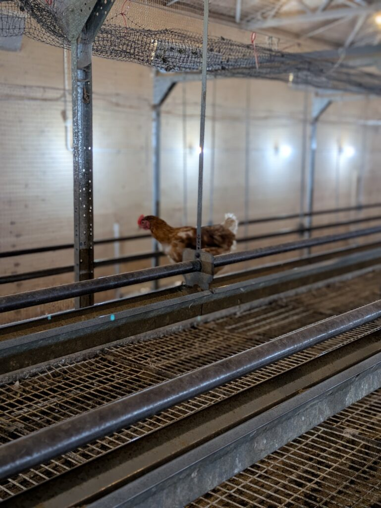

## English\_Practice

I found a job after coming New Zealand. However, it is a part time job. Eventually, I would like to work in the office, but I do not have good English skills.

### How to find jobs

There are a lot of ways to find jobs. I am a backpacker so I do not send CV directly. It is difficult to work in restaurants because of my car.

Therefore, I submit my resume and cover letter on the internet and I might get an interview. If the company need a lot of people, I do not need an interview and get recruited immediately.

I applied for this job that are not enough people. I went to the office and contacted with them. After one day, I went to the place near the chicken farm. Moreover, farmers carried us to the chicken farm.

### Shipping work in Chicken Farm

First day, we worked shipping. I followed chicken to pointed area. After that, some staff killed them so we carried them to the convey. Moreover, when we followed them we wore the gumboots and had a heavy things so that it was tough working. In addition, chicken's weight is 3 or 4 kg so it is hard to fetch for carring them.

Definitely, killed chicken were so terrible. they were stretched and twisted. They later died with raging. Occasionally, chicken head was taken out. I do not think it is fun.

### Cleaning in Chicken Farm

We cleaned the chicken firm in afternoon. For example, dropping mud from wall and picking spider nets under floor. It is a little different in Japan's "3K", but it means "stinky", "dirty", "hard". It is not dengerous.

To sum up, I am working like that. This jos stared from first to thirdth of September. If this job will finish, I need to find other jobs. I am finiding like interesting job now. Finally, I applied for this job on this website. There are many fascinating jobs so let's check it. See you threre.

## 日本語版

ニュージーランドに来て初めて仕事を探してみました。とは言ってもアルバイト的な仕事でオフィスワークではないのですが。最終的にはオフィスワークもやってみたいですが、英語力的にはまだまだなので…

### 仕事の探し方

仕事を探す方法としては色々ありますが、私はバックパッカーという立場なので直接配ることはしてません。お店などで働くのは車の関係上難しいかと思ってますので。

なのでインターネットでサイトにアクセスして履歴書と必要に応じてカバーレターを提出してうまくいけば面接という流れになります。人が多く必要なところであれば面接がなく即採用のパターンもあります。

僕が応募したここは人手が足りないので即採用の場所でした。一度エージェントのオフィスまで行き簡単な手続きをした翌日に指定された場所まで行きました。そこからは農場までバンで運んで行ってもらいます。

### 養鶏場 出荷作業

初日は鶏を出荷するところから始まります。必要に応じて鶏を追いかけ指定の場所まで追い込みます。追い込んだらそこのスタッフが締めるので鶏肉をコンベアまで運ぶという作業ですね。追いかけるときは長靴ですし、重いものをもって音を立てながら追いかけるのでかなり重労働です。また、コンベアに運ぶにしても3,4kgあるので何回も往復すると大変です。

言うまでもないですが、締めるところを見るのは最初は心苦しかったです。頭を伸ばしながらねじった後羽をばたつかせながら絶命します。たまに頭が取れてるものもいますし。これを楽しいと思いながらやるには無理がありますね。

### 養鶏場 清掃

午前はそれで午後以降は清掃になります。こびりついた泥を落としたり、床下にある蜘蛛の巣を払ったりという感じで掃除をしました。日本で言う3Kとは違いますが「臭い」、「汚い」、「きつい」という意味での3Kにはなりますね。さほど危険ではないですが。

そんな感じで今の仕事をしています。この仕事は9月の初週から第3週まであります。それが終わったら他の仕事をする必要がありますね。今も面白そうな仕事がないかなと探しているところです。最後に応募したサイトは[こちら](https://www.backpackerboard.co.nz/work_jobs/job_listings.php)ですね。いろんな仕事があるので見てみると面白いと思います。ではでは。

## AI採点

## バンドスコア推定

- **Task Achievement**: 6.0  
    内容は明確ですが、説明が散漫で一部不自然な表現があります。アイデアの展開がやや不十分。

- **Coherence & Cohesion**: 6.0  
    段落構成はされていますが、接続詞の誤用・不足があり、文のつながりがぎこちない。

- **Lexical Resource**: 5.5–6.0  
    単語の誤用が多く（"convey" / "dengerous" / "threreth"など）、コロケーションも不自然です。

- **Grammatical Range & Accuracy**: 5.5  
    文法ミス（冠詞・複数形・時制・前置詞）が頻出します。

➡️ 総合的に **Band 5.5～6.0** 相当です。Band 8 を目指すには大幅な改善が必要です。

* * *

## 詳細フィードバック

### 1\. 文法ミス

- ❌ _I found a job after coming New Zealand._  
    ✅ _I found a job after coming **to** New Zealand._（前置詞 "to" が必要）

- ❌ _It is difficult to work in restaurants because of my car._  
    ✅ _It is difficult to work in restaurants because I live in my car._（意味を明確化）

- ❌ _If the company need a lot of people…_  
    ✅ _If the company **needs** a lot of people…_（三単現のsが必要）

- ❌ _I applied for this job that are not enough people._  
    ✅ _I applied for this job **because there were not enough people.**_（文構造の誤り）

- ❌ _First day, we worked shipping._  
    ✅ _On the first day, we worked on shipping._

- ❌ _I followed chicken to pointed area._  
    ✅ _I chased the chickens into the designated area._

- ❌ _we wore the gumboots and had a heavy things…_  
    ✅ _we wore gumboots and carried heavy things…_

- ❌ _chicken's weight is 3 or 4 kg so it is hard to fetch for carring them._  
    ✅ _Each chicken weighs 3 or 4 kg, so carrying them back and forth many times was hard._

- ❌ _Definitely, killed chicken were so terrible. they were stretched and twisted._  
    ✅ _Watching the chickens being killed was terrible. Their necks were twisted and they flapped violently._（主語・動詞・文のつながりの誤り）

- ❌ _We cleaned the chicken firm in afternoon._  
    ✅ _We cleaned the chicken farm in the afternoon._（スペル & 冠詞）

- ❌ _It is not dengerous._  
    ✅ _It is not dangerous._

- ❌ _This jos stared from first to thirdth of September._  
    ✅ _This job started from the first to the third week of September._

- ❌ _I am finiding like interesting job now._  
    ✅ _I am currently looking for another interesting job._

* * *

### 2\. 語彙の誤り・不自然さ

- _convey_ → 本来「伝える」の意味。ここは _conveyor belt_ が正しい。

- _contacted with them_ → 正しくは _contacted them_。

- _taken out head_ → 不自然。_some chickens were decapitated_ が自然。

- _picking spider nets_ → 正しくは _removing spider webs_.

- _3K ("stinky", "dirty", "hard")_ → 英語では _dirty, difficult, and dangerous jobs_ が一般的。

- _See you threre_ → スペルミス。_See you there._

* * *

### 3\. コヒーレンス（論理展開）

- パラグラフは分かれているが、接続語が単調。  
    ❌ _Therefore, Moreover, In addition, Definitely_ を多用しすぎ。  
    ✅ より自然に _As a result, Besides that, On top of that, Overall_ などを使うと良い。

* * *

### 改善例（抜粋リライト）

**Before:**  
_First day, we worked shipping. I followed chicken to pointed area. After that, some staff killed them so we carried them to the convey._

**After:**  
_On the first day, we were involved in shipping. I chased the chickens into the designated area. After that, the staff slaughtered them, and we carried them to the conveyor belt._

* * *

## 改善アドバイス（Band 8 に近づくために）

1. **冠詞・複数形・時制の徹底**（基本だが頻繁に誤りあり）。

3. **自然な表現とコロケーションを学習**
    - "chase chickens" / "designated area" / "carry heavy loads" など。

5. **段落構成と接続語の多様化**
    - _Firstly, As a result, Overall, In contrast_ を適切に使う。

7. **スペルチェックを必ず行う**（"firm" vs "farm", "dengerous" vs "dangerous"）。

9. **IELTS Writing Task 1/2 模範解答を参考にして書き直す練習**。
