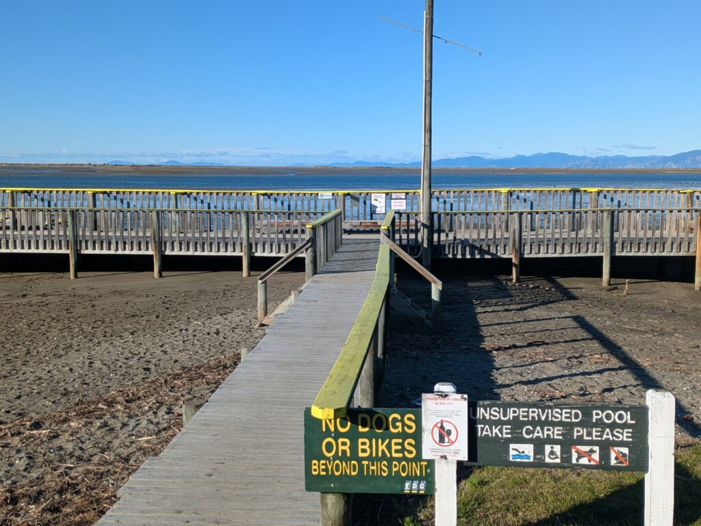
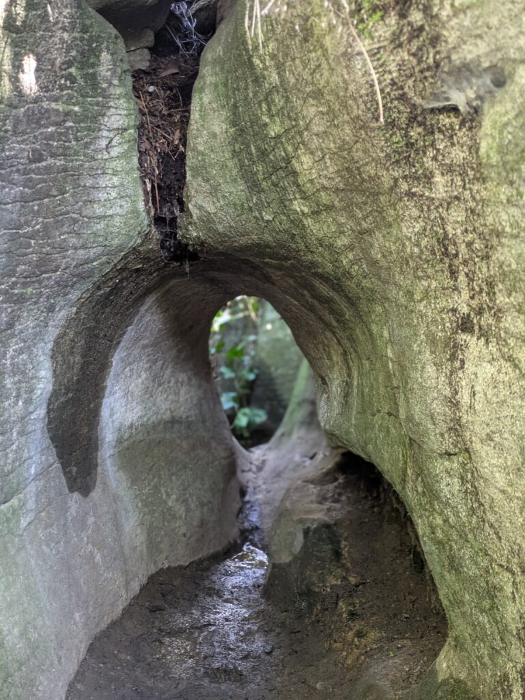
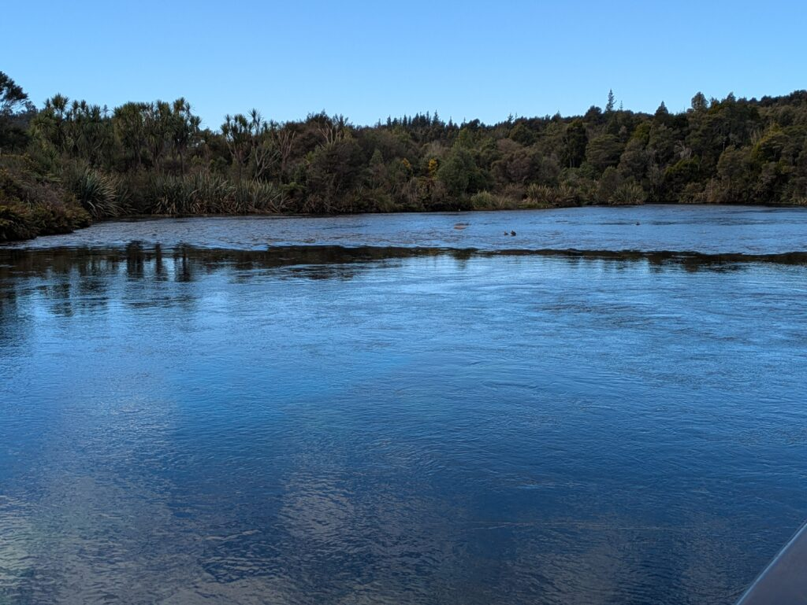
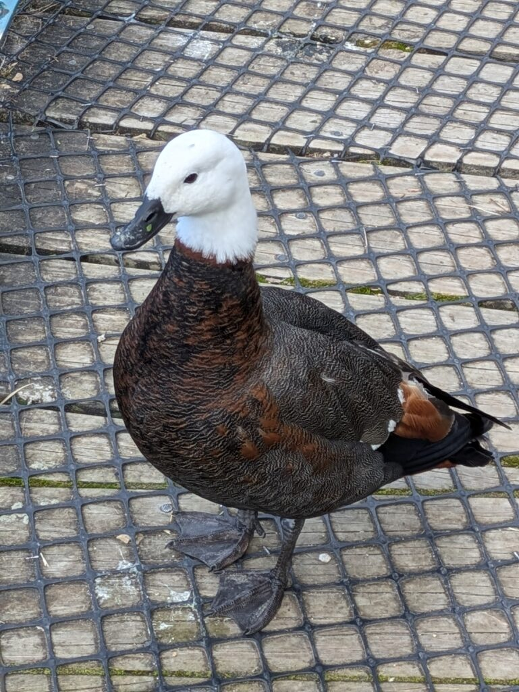
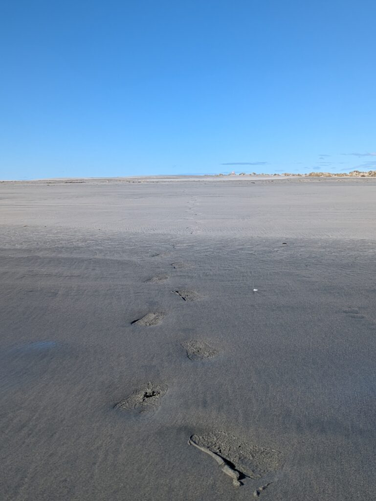

## English\_Practice

I wrote about Nelson before. I will write Motueka, Takaka, Farewell Spit. There is Richmond near Nelson. However, I went through Nelson and went to Motueka.

I worked at the poultry farm in Hope below Richmond. I finished working there because this job had three weeks. Nevertheless, it is good experience. I thought it is tough to work there.

### Motueka

I went to a beach in Motueka. I often go to a beach in NZ. The scene is not different from other places. However, I wanted to go to the beach which is hot pool in summer.

After that, I experienced sleeping in my car near the road because of a flat tire. However, it is good memory because I have never experienced.

### Takaka

I went to Takaka after fixing. I watched rock puzzle and a pond called "Springs". Some small goods are arranged for children in order to be fun in rock puzzle. I felt it is not good.

I looked beautiful pond and river in Springs.I looked around for approximately 30 minutes. You should go there when you will go to Takaka. There is nothing to go other places.

### Dunes

Finally, I went to Dunes above Takaka. There is near farewell spit. We can not go to farewell spit unless it is tour. Actually, there is rules not to approach because of sealls and penguins.

It feel free to go the dune. I have never been there so that it is so fun. I feel good to walk there with naked foot because sand is very smooth. In addition, it was good with sandals.

However, there is places which is mixed sand and water between dune and beach. I walked into there. When I put into my foot there, my knee might be soaked there. I recommend you should not approach wet dune when you will come here alone because you might not take off.

I explored around there like that. Unfortunately, I could not see wild animals like penguins. However, when you come there at morning or evening, you might see them. On the other hand, tuor is better to see them despite $200. See you threre.

## 日本語版

[前回](/posts/2025/09/road-trip-picton-blenheim-nelson-to/)Nelsonまでの話をしました。今回はそれ以降の話になります。近場にはRichmondという場所がありますが、ここはスルーしてMotuekaまで行きました。

ちなみに以前話した[養鶏場](/posts/2025/09/chicken-farm-cleaning-work-experience/)での仕事はHopeというRichmondの下側にあるエリアでやってました。この仕事は3週間だけなのでもう終わってしまいましたが、いい経験にはなったかなと思います。ここで働く人たちは大変だなと感じました。

### Motueka

Motuekaでは一旦ビーチに行きました。ニュージーランドなので大体行くところはビーチになりますね…景色自体は他と大して変わらないので。ただ、夏になると温水プールのような感じになるビーチがあったので入ってみたかったなとは思いました。

この後に初めて[パンク](/posts/2025/09/new-zealand-car-repair/)をして道路付近で車中泊を経験しました。日本では経験したことなかったのでよき思い出にはなりました。

### Takaka

修理が終わった後、Takakaという場所に向かいました。ここでは石の迷路や[Springs](https://www.doc.govt.nz/parks-and-recreation/places-to-go/nelson-tasman/places/takaka-area/te-waikoropupu-springs/)と呼ばれるきれいな池を見ることができます。石の迷路では子供たちが楽しめるように小さなキャラグッズを配置していました。個人的には微妙でしたが…

Springsという池では透き通ったきれいな川と池を見ることができます。大体30分で見回れるのでTakakaによったら行ってみると良いと思います。他に行く場所もないと思いますので。

### Dunes

Takakaから上に向かって最後はDunesに行きました。farewell spitという場所の近くですね。farewell spit自体はツアーじゃないといけない決まりになっています。というのもここはアザラシやペンギンが生息しているのでうかつに近寄らないために決まりがあるのだと思います。

砂丘自体は自由に行き来出来ます。鳥取砂丘に行ったことがなかったので初めて訪れましたがとても楽しいですね。砂もサラサラで裸足が心地よく歩いて気分が良い場所でした。サンダルで来ていたのもちょうどよかったです。

ただ、恐ろしいことがおきまして砂丘と砂浜の間辺りに砂と水が混ざった場所があり、そこに足を踏み入れてしまったことですね。ここに足を踏み入れると膝くらいまで沈むことがあります。一人だと抜け出せなくなる可能性もあるので、濡れていそうな砂丘には近づかないことをおすすめします。

という感じで見てきました。残念ながらペンギンなどの野生動物には会えませんでしたが、朝早くや夕方あたりであれば見れる可能性があるみたいです。ツアーが一番手っ取り早いと思いますが$200ぐらいはするので…ではでは。

## AI採点

Here’s a rigorous IELTS-style review of your English “travel diary” passage. Because it isn’t a response to a typical IELTS task (e.g., an essay prompt or GT letter), I grade your **language performance** against the four criteria and note how to lift it toward Band 8.

* * *

# Estimated Band (language-focused)

- **Task Response**: _(not rateable to a normal IELTS prompt)_ — the content is a personal recount, not an IELTS Task 1/2 response.

- **Coherence & Cohesion**: **5.5** – Basic paragraphing/headings help, but progression is jumpy; limited variety of cohesive devices; some repetition.

- **Lexical Resource**: **5.5** – Meaning is clear, but frequent **word choice/collocation** errors (“rock puzzle,” “naked foot,” “It feel free…”), informal clichés, and repetition (“I went… I went…”).

- **Grammatical Range & Accuracy**: **5.0** – Persistent **tense**, **article**, **plural**, **preposition**, **word form**, and **agreement** errors; limited control of complex sentences; punctuation/capitalization slips.

- **Overall language band estimate**: **~5.5** (could reach 6.0 with corrections below).

Your target is Band 8; the gap is mainly accuracy, natural collocation, and cohesion.

* * *

# Biggest Downward Pressures (what’s costing you marks)

1. **Articles & determiners**: “_the_ beach / _a_ beach,” proper nouns (“Farewell Spit”), zero article with plural/general nouns (“at **beaches**”).

3. **Tense control**: Narrative past vs. present (“it **is** good experience” → “it **was** a good experience”).

5. **Collocation/word choice**:
    - “rock puzzle” → “**stone maze**” / “**rock labyrinth**”
    
    - “naked foot” → “**barefoot**”
    
    - “I experienced sleeping in my car” → “**I ended up sleeping in my car**”
    
    - “hot pool in summer” (for a beach) → “**as warm as a heated pool in summer**”

7. **Prepositions**: “**south of** Richmond,” “**on** the dunes,” “**near** the road,” “**in** New Zealand,” “**to** Motueka.”

9. **Agreement & forms**: “There **are** rules,” “It **feels**,” “**seals**,” “**tour**,” “**there**,” “**tyre**” (NZ spelling).

11. **Cohesion**: Overuse of short simple sentences; missing logical bridges (cause/result, contrast, sequencing).

13. **Register/clarity**: Phrases like “There is nothing to go other places” confuse meaning; headings with telegraphic fragments weaken flow.

* * *

# Sentence-by-sentence Corrections (⚑ = error type)

**Intro**

- **Original:** _I wrote about Nelson before. I will write Motueka, Takaka, Farewell Spit._  
    **Better:** _I wrote about Nelson before; this time I’m writing about what came next—Motueka, Takaka, and Farewell Spit._  
    ⚑ word choice (“write **about**”), list punctuation, cohesion.

- **Original:** _There is Richmond near Nelson. However, I went through Nelson and went to Motueka._  
    **Better:** _Richmond is near Nelson, but I skipped it and drove on to Motueka._  
    ⚑ natural phrasing, cohesion, verb choice.

**Richmond/Hope (poultry farm)**

- **Original:** _I worked at the poultry farm in Hope below Richmond._  
    **Better:** _I worked at a poultry farm in Hope, just south of Richmond._  
    ⚑ article, preposition (“south of”), natural phrasing.

- **Original:** _I finished working there because this job had three weeks._  
    **Better:** _The job lasted only three weeks, so it’s already over._ / _I worked there for just three weeks._  
    ⚑ tense, natural expression.

- **Original:** _Nevertheless, it is good experience. I thought it is tough to work there._  
    **Better:** _Still, it was a good experience. I found the work tough and respect the people who do it._  
    ⚑ tense, idiomatic collocation.

**Motueka**

- **Original:** _I went to a beach in Motueka. I often go to a beach in NZ._  
    **Better:** _In Motueka, I went to the beach. In New Zealand I usually end up at **beaches**._  
    ⚑ article, plural, cohesion.

- **Original:** _The scene is not different from other places._  
    **Better:** _The scenery wasn’t much different from other places._  
    ⚑ word form (scene→scenery), tense.

- **Original:** _However, I wanted to go to the beach which is hot pool in summer._  
    **Better:** _However, there’s a beach that feels as warm as a heated pool in summer, and I wish I’d tried it._  
    ⚑ relative clause, natural phrasing.

- **Original:** _After that, I experienced sleeping in my car near the road because of a flat tire._  
    **Better:** _After that I had a flat **tyre** and ended up sleeping in my car by the roadside._  
    ⚑ collocation, NZ spelling, preposition.

- **Original:** _However, it is good memory because I have never experienced._  
    **Better:** _It turned into a good memory because I’d never done that before._  
    ⚑ tense, object completion.

**Takaka**

- **Original:** _I went to Takaka after fixing._  
    **Better:** _After the repair, I headed to Takaka._  
    ⚑ noun vs. –ing, natural phrasing.

- **Original:** _I watched rock puzzle and a pond called "Springs"._  
    **Better:** _I visited a stone maze and a clear spring-fed pool called “the Springs.”_  
    ⚑ verb choice, collocation, article with nickname.

- **Original:** _Some small goods are arranged for children in order to be fun in rock puzzle._  
    **Better:** _The maze had small figurines hidden for children to find._  
    ⚑ word choice, syntax.

- **Original:** _I felt it is not good._  
    **Better:** _Personally, it wasn’t really my thing._  
    ⚑ register, tense.

- **Original:** _I looked beautiful pond and river in Springs.I looked around for approximately 30 minutes._  
    **Better:** _At the Springs I saw crystal-clear pools and streams. The loop takes about 30 minutes._  
    ⚑ article, natural phrasing, spacing/punctuation.

- **Original:** _You should go there when you will go to Takaka. There is nothing to go other places._  
    **Better:** _If you go to Takaka, it’s worth a quick stop; there isn’t much else nearby._  
    ⚑ conditional form, clarity.

**Dunes / Farewell Spit**

- **Original:** _Finally, I went to Dunes above Takaka. There is near farewell spit._  
    **Better:** _Finally, I drove north to the dunes near **Farewell Spit**._  
    ⚑ capitalization, prepositions, clarity.

- **Original:** _We can not go to farewell spit unless it is tour._  
    **Better:** _You can’t access Farewell Spit unless you’re on a guided tour._  
    ⚑ modal/structure, article.

- **Original:** _Actually, there is rules not to approach because of sealls and penguins._  
    **Better:** _There are rules to protect **seals** and penguins, so access is restricted._  
    ⚑ agreement, spelling, clarity.

- **Original:** _It feel free to go the dune._  
    **Better:** _You’re free to roam the dunes._  
    ⚑ grammar, natural phrasing.

- **Original:** _I have never been there so that it is so fun._  
    **Better:** _I’d never been to dunes like that before, so it was great fun._  
    ⚑ clause linking, register.

- **Original:** _I feel good to walk there with naked foot because sand is very smooth._  
    **Better:** _Walking **barefoot** felt great because the sand is very fine._  
    ⚑ collocation, word choice, article.

- **Original:** _In addition, it was good with sandals._  
    **Better:** _Sandals were a good choice, too._  
    ⚑ natural phrasing.

- **Original:** _there is places which is mixed sand and water between dune and beach. I walked into there._  
    **Better:** _There are areas of water-logged sand between the dunes and the beach, and I stepped into one._  
    ⚑ agreement, word choice, prepositions.

- **Original:** _When I put into my foot there, my knee might be soaked there._  
    **Better:** _My leg sank to about knee depth._  
    ⚑ clarity/conciseness.

- **Original:** _I recommend you should not approach wet dune when you will come here alone because you might not take off._  
    **Better:** _If you’re alone, avoid wet patches—you might not be able to free yourself._  
    ⚑ over-marking with “recommend you should,” article/plural, natural idiom.

**Closing**

- **Original:** _I explored around there like that._  
    **Better:** _That was the gist of my visit._  
    ⚑ clarity.

- **Original:** _Unfortunately, I could not see wild animals like penguins._  
    **Better:** _Unfortunately, I didn’t manage to see any wildlife like penguins._  
    ⚑ natural phrasing.

- **Original:** _However, when you come there at morning or evening, you might see them._  
    **Better:** _Apparently, early morning or around sunset gives you a better chance._  
    ⚑ article/time expression.

- **Original:** _On the other hand, tuor is better to see them despite $200. See you threre._  
    **Better:** _Alternatively, a tour—about $200—is the most reliable way to see them._  
    ⚑ spelling, article, phrasing; remove “See you there” (odd sign-off in an essay).

* * *

# Polished Rewrite (Band-7.5+ style, same content)

_I wrote about Nelson before; this time I’m covering what came next—Motueka, Takaka, and the dunes near Farewell Spit. Although Richmond is close to Nelson, I skipped it and drove on to Motueka. Earlier, I’d worked for three weeks at a poultry farm in Hope, just south of Richmond. It’s over now, but it was a valuable experience, and the work gave me new respect for the people who do it._

_In Motueka I went to the beach—New Zealand trips often seem to lead there. The scenery wasn’t much different from other spots, but there’s a beach that feels as warm as a heated pool in summer; I wish I’d tried it. After that I had my first flat tyre and ended up sleeping in my car by the roadside. Oddly enough, because I’d never done that before, it turned into a good memory._

_Once the car was repaired, I headed to Takaka. I visited a stone maze, where small figurines were hidden for children to find, and a clear spring-fed pool known as “the Springs.” The loop around the springs takes about thirty minutes. If you’re in Takaka, it’s worth a quick stop, as there isn’t much else nearby._

_Finally, I drove north to the dunes near Farewell Spit. You can’t access the Spit itself without a guided tour because of rules protecting seals and penguins, but you’re free to roam the dunes. I’d never been to dunes like that before, and walking barefoot on the fine sand felt great—sandals were a good choice too. Be careful, though: between the dunes and the beach there are patches of water-logged sand. I stepped into one and sank to about knee depth. If you’re alone, avoid wet areas—you might not be able to free yourself._

_I didn’t manage to see any wildlife such as penguins, but I’ve heard early morning or around sunset gives you a better chance. Alternatively, a guided tour—around $200—seems to be the most reliable option._

* * *

# Targeted Error Map (by type)

- **Articles/Determiners:**  
    the beach / the dunes / the Springs; a poultry farm; **Farewell Spit** (proper noun, no article).

- **Plural vs singular:** beaches (general), rules **are**, areas **are**.

- **Tense/aspect:** recount in **past**; wishes/regrets with “I wish I’d…”.

- **Prepositions:** south **of**, near/at/on, drive **to**, end up **sleeping**, step **into**.

- **Collocations:** end up sleeping; take a loop/walk the loop; guided tour; water-logged sand; get stuck/free yourself; warm **as** a heated pool; respect the people who do it.

- **Spelling/typos:** seals, tour, there, **tyre** (NZ).

- **Register:** avoid chatty sign-off (“See you there”) in an essay; prefer precise, neutral tone.

* * *

# How to lift this toward Band 8 (quick wins)

1. **Control your tense**: past for the story; present simple only for general truths.

3. **Add variety of complex sentences**: use because/although/which/so that/so…that, participle clauses, and relative clauses naturally.

5. **Upgrade cohesion**: replace repeated “I went…” with devices like _After that / Once repaired / Finally / Meanwhile / As a result / However / Although_.

7. **Fix collocations**: learn the natural chunks in the corrections above; make an Anki deck.

9. **Proofread for articles & prepositions**: do a separate pass **only** for a/an/the/∅ and for in/at/on/to/of.

* * *

# Micro-drills (10 edits to practice)

Rewrite these correctly:

1. I experienced sleep in my car. → **I ended up sleeping in my car.**

3. It is good memory. → **It was a good memory.**

5. I went to a dune and it feel free. → **I went to the dunes, and you’re free to roam.**

7. There is rules because of sealls. → **There are rules because of seals.**

9. I watched rock puzzle. → **I visited a stone maze.**

11. a beach which is hot pool → **a beach that feels as warm as a heated pool**

13. I went to Takaka after fixing. → **After the repair, I went to Takaka.**

15. There is nothing to go other places. → **There isn’t much else to do nearby.**

17. I put my foot and my knee was soaked. → **I stepped in and sank to knee depth.**

19. When you will go to Takaka, you should go there. → **If you go to Takaka, you should go there.**

* * *

If you’d like, paste your **next revised draft** and I’ll re-score it using the same criteria and push it closer to Band 8.
