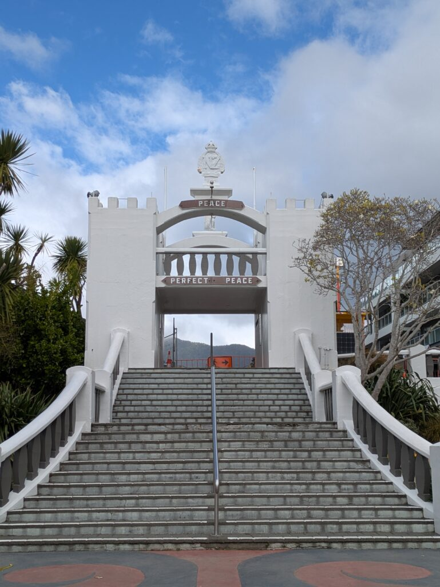
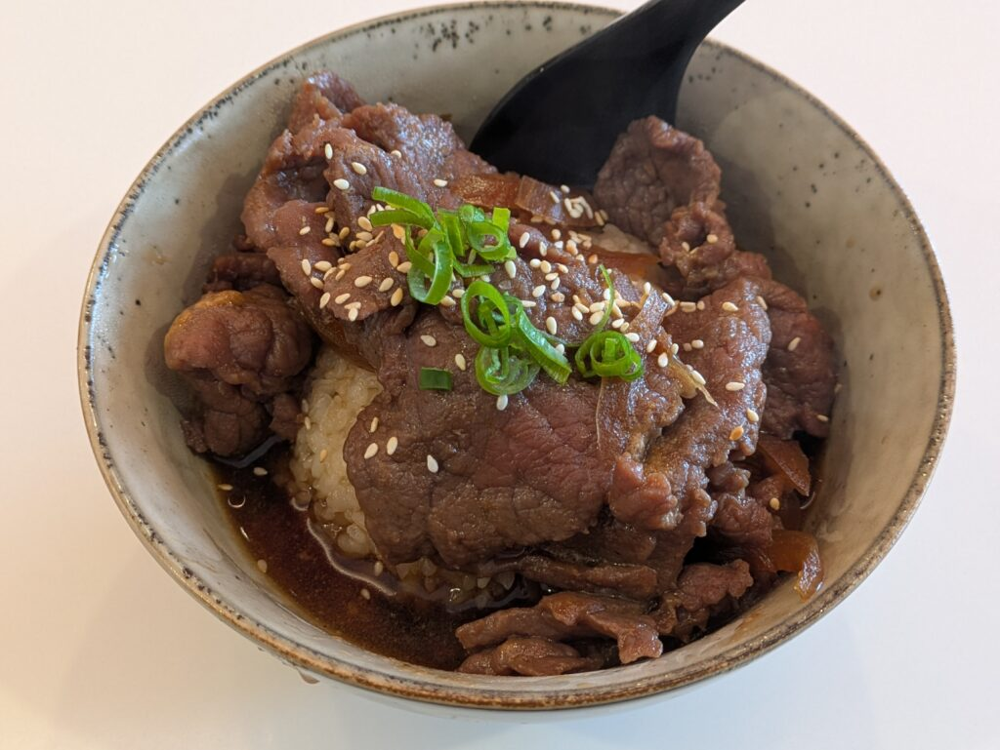
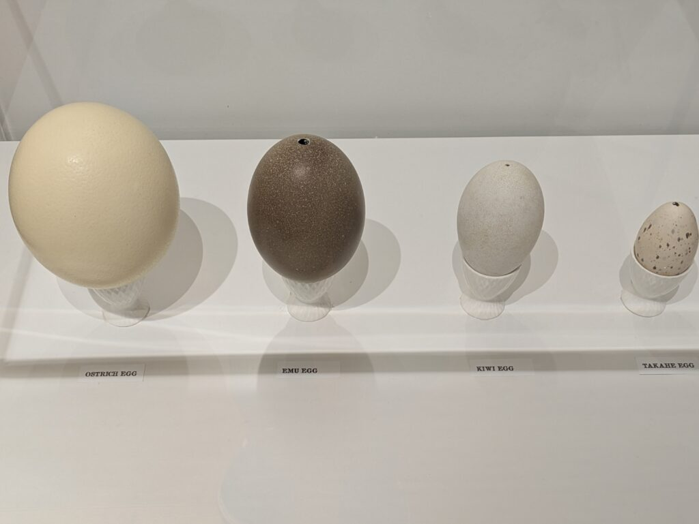
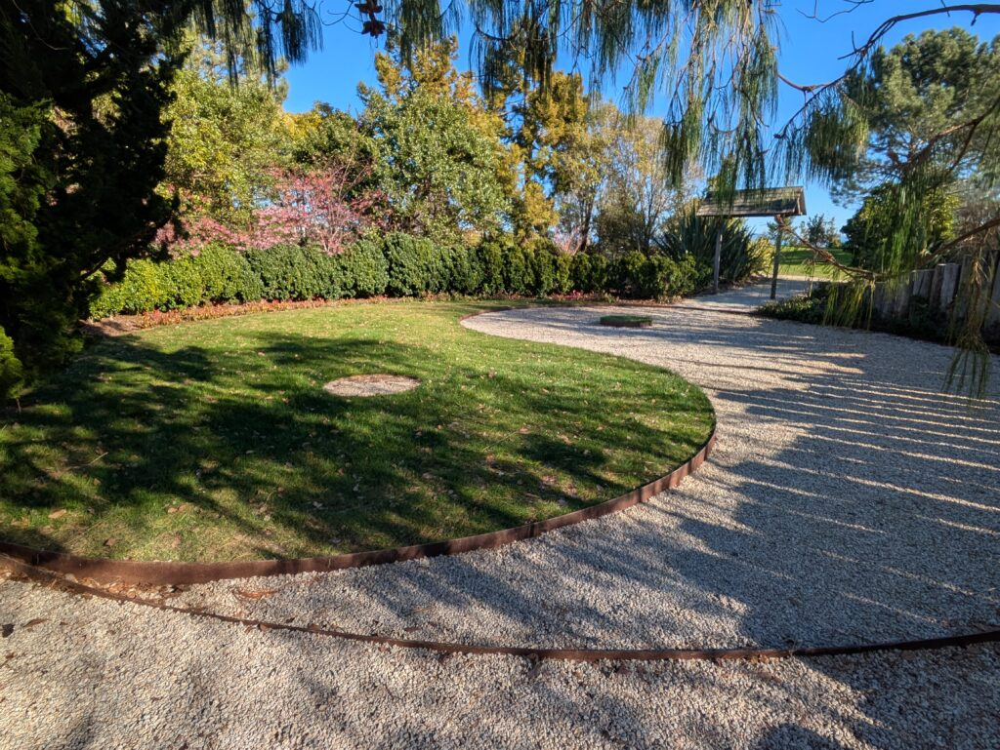
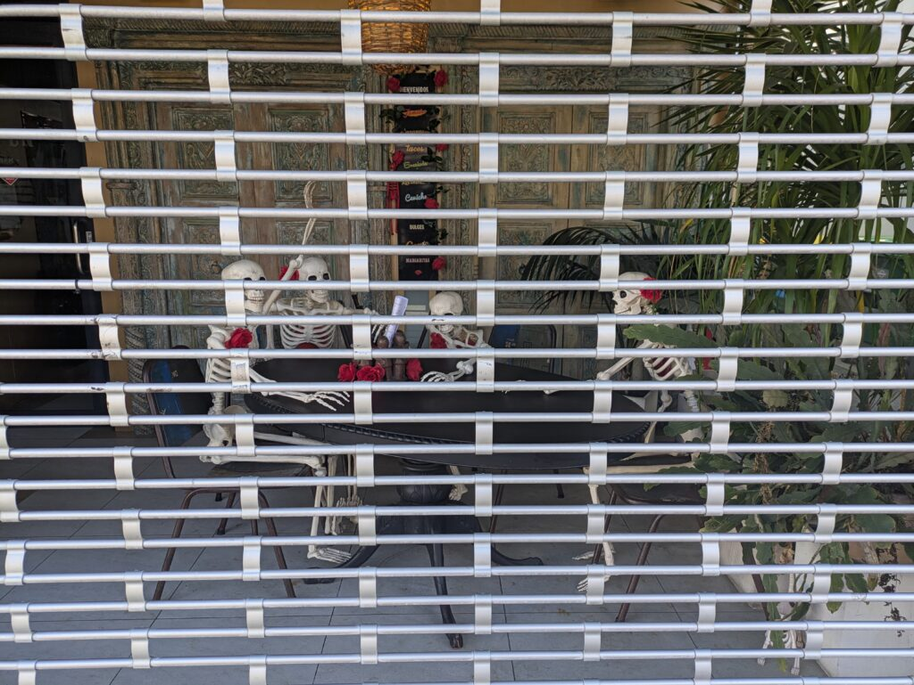
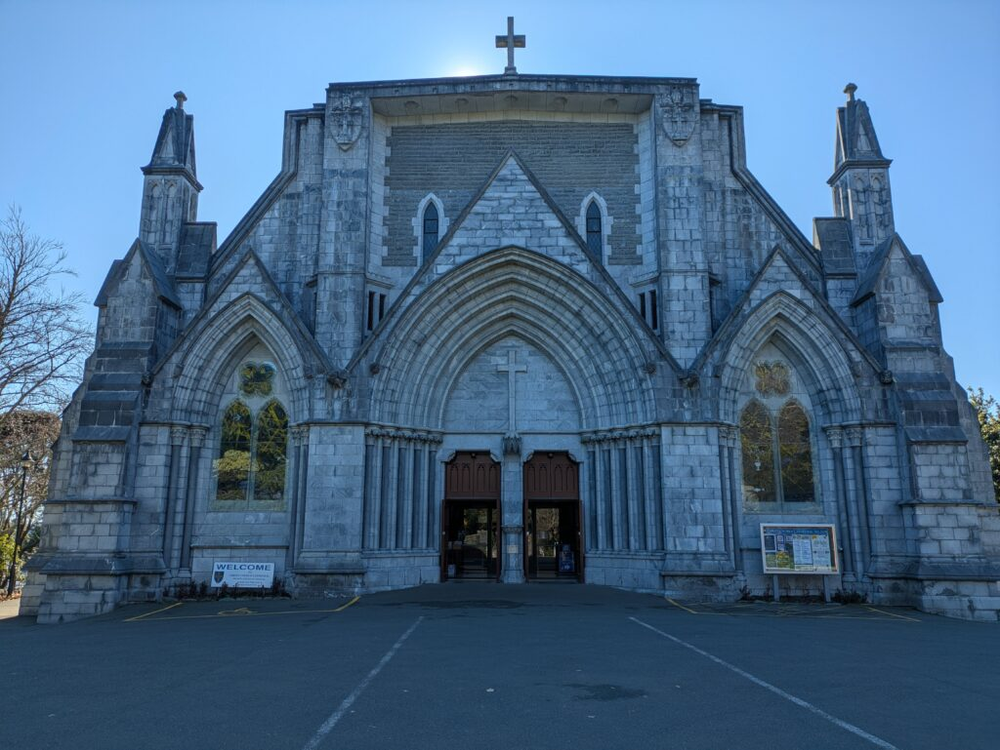

## English\_Practioce

I wrote about coming via ferry from Wellington to Picton. I show you that I went to Blenheim and Nelson.

### Picton

When I arrived at Picton, it was over 7 p.m. and dark so I just went through this city. After that, I came here again and saw some things.

This town is not large so that I explored around harbor and the avenue which is thriving a little. There were many boats there. On the other hand, there was not a ferry which I got on. Moreover, There are a museum and park near the beach. I did not go to the museum because I thought it is similar to Auckland one.

I found like a Japanese restaurant. I ate a gyudon, but it was different from Japanese one. I am used to eat sliced beef.

### Blenheim

Next, I went to Blenheim which is a little big. There are some campsites. Therefore, they do not have limit which is a few time per month. It is comfortable to live in this city for backpackers.

I went to the library due to find jobs. There is not parking near the library, but I parked at the park for 10 minutes on foot. In addition, it is easy to find anything because there are Woolworth, PACK'nSAVE and Warehouse.

I am not sure what is here. I found a little large garden, sports club, library and museum. However, you should not stay here for long time for sightseeing.

### Nelson

Finally, it was Nelson. This is called "art city" and there are many art galleries. Actuacry, there is a museum.

I could only note exhibitions which I was interested in because it banned taking photos. I wanted to go to the art museum, but I did not have time to go there. There are many Japanese people because of listening to Japanese conversation.

I was curious about a bag made of Kiwi and Japanese armor. We can not make a Kiwi bag and I think we can not see Japanese armors except Japan.

Moreover, I found Japanese foods which is Japanese taste. I ate curry and it was so delicious. It has vegetable and meat so it is good for us.

In addition, there is a big cathedral. I did not enter there, but I feel admireing because I have never seen it in Japan. Therefore, there is some campsites in Nelson. However, I have to go out until 8 a.m. due to pay fee. I will write story from motueka to farewell spit. See you there.

## 日本語版

[前回](/posts/2025/08/road-trip-from-interislander/)WellingtonからPictonに行くまで船を使っていった話をしました。今回はそこからBlenheimとNelsonまで行った話を書こうかと思います。

### Picton

Pictonに着いたときはすでに19時を回っていて辺りも暗かったのでただ通過しただけになります。その後、またここに寄ったのでそこで見たものになります。

この町はそこまで広くないので港と少し栄えている通りを軽く見て回りました。港と言っても多くの船が停泊しているくらいで、私がここに渡った時の船は来てませんでした。浜辺の近くにある公園らしきものと博物館はありました。オークランドにあるものと似てると思い行きませんでしたが。

一応日本食っぽいお店はありました。入って食べてみましたが、牛丼とは言い難いですね。やはり細切れに慣れているというのもありますが。

### Blenheim

次にBlenheimここは少し大きめの街ですね。キャンプサイトもいくつかあり、月に数回という制限もないため、バックパッカーの人はかなり過ごしやすい街なのかなと思っています。

ここに関しては仕事を探すときによく図書館へ行ってました。近場に駐車場はありませんが歩いて十分ぐらいのところに公園があるのでそこに停めてました。Woolworth, PACK'nSAVE, Warehouseという基本的な店は揃ってるので食材にも困りません。

とは言えここに何かあるかというとそこまでない気もします。大きめの公園やスポーツクラブ、図書館に博物館ぐらいだと思います。ただ、観光するならそこまでとどまる場所でもないかなと思います。

### Nelson

最後にNelsonですね。ここは芸術の都市と言われる場所で色んな美術館があります。もちろん博物館もありますが。

ここにある博物館は写真が禁止だったので気になったものをメモする程度でした。美術館にも行こうと思ったのですが、行く時間がなく移動しちゃいました。ここは比較的日本人も多く海に行った時や道を歩いているときによく声を聴きます。

私が見て気になったのはKiwiで作られたバッグと日本の鎧あたりですね。Kiwiバッグはもう作れないですし、鎧も日本以外だとほぼ見れないと思いますので。

また、[日本食](https://www.instagram.com/koharushokudo/)もありこちらはNZ風ではなくしっかりとした日本の味となってました。私はカレーを頂きましたがとても美味しかったです。野菜と肉の両方あり健康にも悪くないかと。

ここには大きめの大聖堂もあります。中には入ってないですが日本であまり見たことがないので新鮮でした。

という感じで見てきました。ちなみにNelsonにもキャンプできる場所はありますが、朝8時までには出ないと駐車料金を取られるので注意が必要ですね。次回はmotuekaからfarewell spitまで書けたらと思います。ではでは。

## AI採点

## 総合評価（暫定バンドスコア）

**Band 5.5～6.0** 相当

- 内容は理解できるが、文法と語法の誤りが多く、自然な表現が欠ける。

- 語彙は限定的で、日本語を直訳した印象が強い。

- 段落構成は一応あるが、接続詞や論理展開が不十分。

* * *

## 詳細フィードバック

### 1\. Task Response（課題達成度）

- 内容は「旅行体験の記録」であり、情報は出ているが、**分析や意見が浅い**。

- IELTS Writingでは「体験記録」より「説明＋評価」が必要。例えば「なぜBlenheimは住みやすいか」「Nelsonの文化的な価値」などを論理的に展開すると評価が上がる。

### 2\. Coherence & Cohesion（論理的つながり）

- 「Next」「Finally」などの接続語はあるが、単調。

- 「Therefore」「However」「On the other hand」の使い方が不自然または誤り。
    - 例: _"On the other hand, there was not a ferry which I got on."_ → 対比表現ではないので誤用。

- 段落ごとの統一性はあるが、まとめや導入が弱い。

### 3\. Lexical Resource（語彙力）

- **直訳調で不自然**な表現が多い。
    - _"I show you that I went..."_ → IELTSでは _"I would like to describe my trip..."_ などが自然。
    
    - _"Japanese foods which is Japanese taste"_ → _"authentic Japanese food"_ が適切。
    
    - _"I am used to eat sliced beef"_ → 正しくは _"I am used to eating sliced beef."_

- 「a little big」「a few time per month」など、不自然な形容詞・名詞の組み合わせ。

### 4\. Grammatical Range & Accuracy（文法の幅と正確性）

頻出エラーを具体的に指摘します。

#### 文法エラー例

1. _"I show you that I went to Blenheim and Nelson."_  
    → 時制・表現ミス。  
    ✔ Correct: _"This time, I will write about my trip to Blenheim and Nelson."_

3. _"This town is not large so that I explored around harbor..."_  
    → _so that_ は目的を表すので不自然。  
    ✔ Correct: _"This town is not large, so I explored the harbor..."_

5. _"There are a museum and park near the beach."_  
    → 複数形エラー。  
    ✔ Correct: _"There is a museum and a park near the beach."_

7. _"I ate a gyudon, but it was different from Japanese one."_  
    → 冠詞・数の誤り。  
    ✔ Correct: _"I ate gyudon, but it was different from the Japanese version."_

9. _"Next, I went to Blenheim which is a little big."_  
    → 不自然。  
    ✔ Correct: _"Next, I went to Blenheim, which is a relatively large town."_

11. _"They do not have limit which is a few time per month."_  
     → 名詞・冠詞の誤り。  
     ✔ Correct: _"There is no restriction such as a monthly limit."_

13. _"I went to the library due to find jobs."_  
     → 前置詞誤り。  
     ✔ Correct: _"I often went to the library to look for jobs."_

15. _"We can not make a Kiwi bag and I think we can not see Japanese armors except Japan."_  
     → 複数形・不自然。  
     ✔ Correct: _"Kiwi bags are no longer made, and Japanese armor is rarely seen outside Japan."_

17. _"I feel admireing because I have never seen it in Japan."_  
     → 動詞誤り。  
     ✔ Correct: _"I felt admiration because I had never seen such a cathedral in Japan."_

* * *

## 改善のための具体的アドバイス

1. **文法の基礎（冠詞・単数複数・前置詞）を徹底練習** → IELTSで大きな減点要因。

3. **直訳を避けて自然な表現に置き換える練習** → "Japanese foods which is Japanese taste" → "authentic Japanese food."

5. **接続詞のバリエーション**を増やす → besides, in addition, on the contrary, as a result など。

7. **語彙を広げる** → "a little big" → "fairly large," "relatively big."

9. **IELTS Writing Task 1/2 の模範解答を模写** → 英語のリズムを習得できる。
