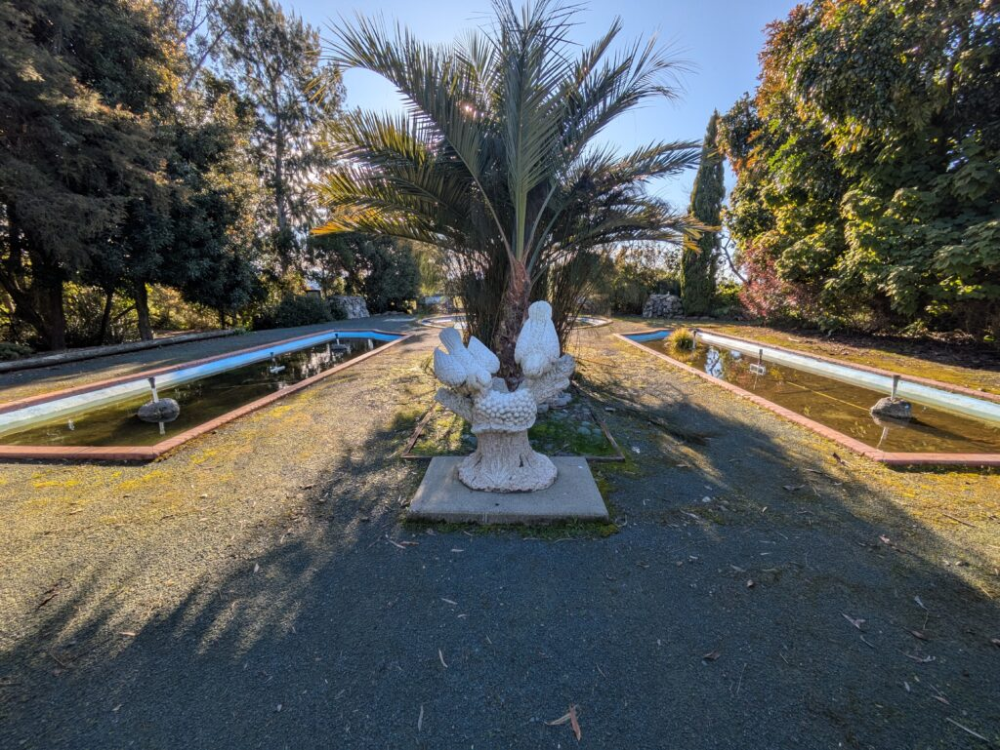
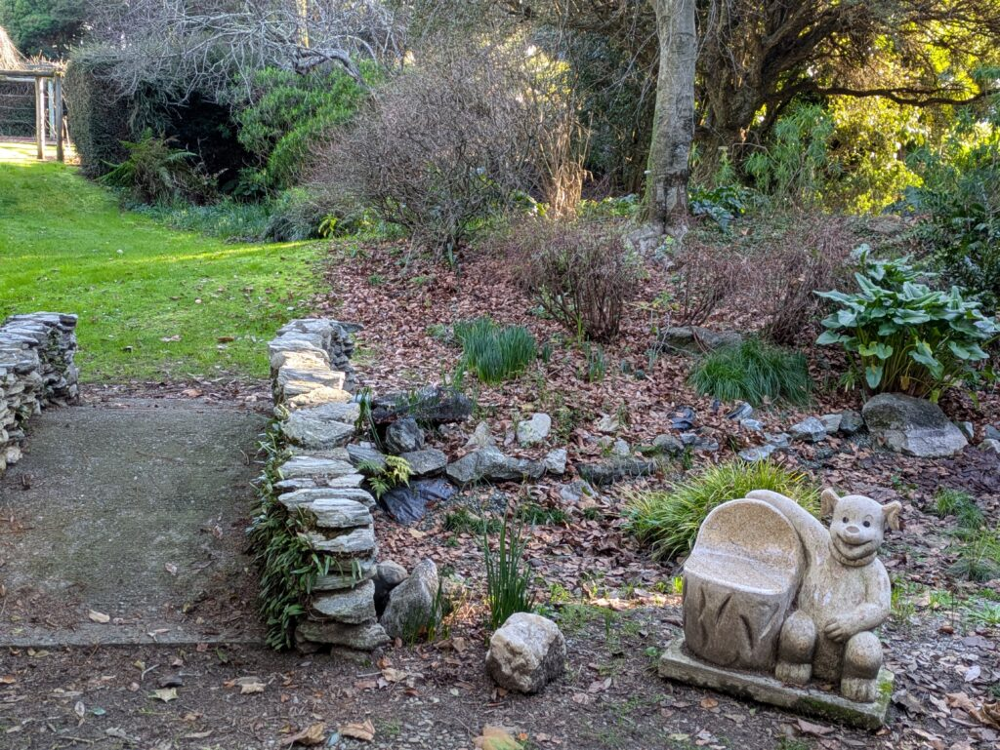
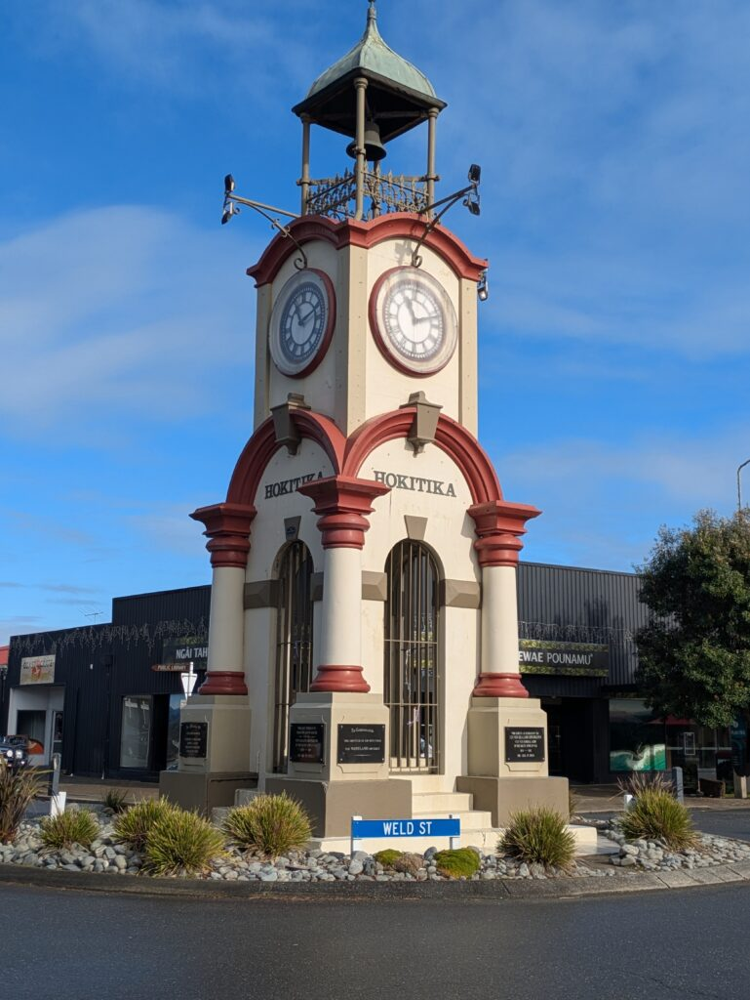
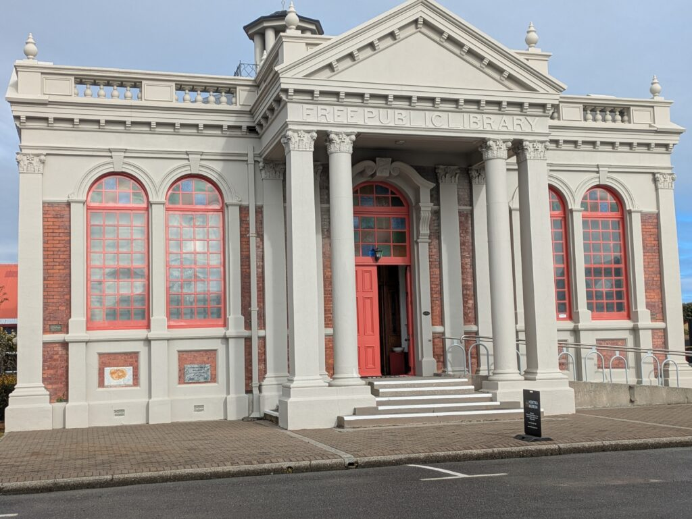
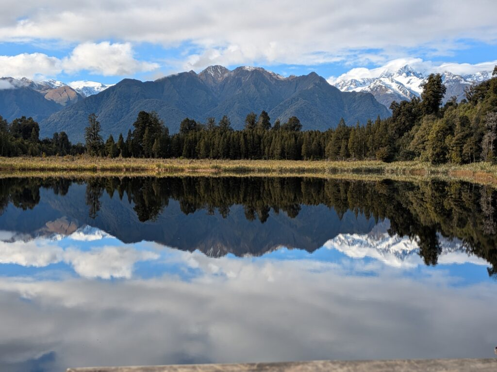
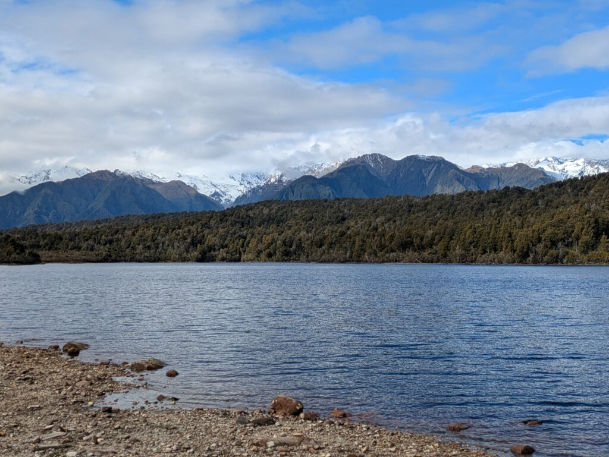
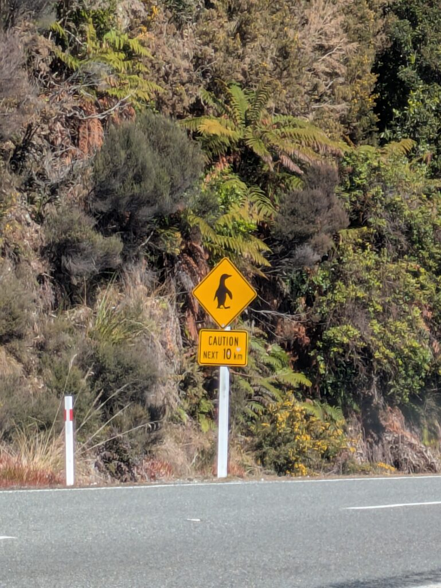

## English\_Practice

I went to the dune near Farewell spit from Motueka. I will write about that I went back Nelson and went to Fox Glacier.

### Gardens of the World

Fistly, I went to the Gardens of the World below Richmond. I could not see beautiful flowers because of winter. It cost $5 and it is cheaper than others.

When you go there in spring or summer, you can see amazing flowers. In addition, there are gardens which are motif each countries. Moreover, I watched the water show so it was a good and relaxing place.

### Hokitika

Secondly, I went to Hokitika. There is Greymouth which is bigger north of Hokitika, but I just bought grocery and added petrol in my car so I did not do alomost all anything. Probably, there is something which you find. For example, collecting gold dust.

Actually, I explored around Hokitika in order to investigate speed sensor. There are a monument, museum and beach. The museum's fee is $10. However, local people enter into there for free.

### Fox Glacier

Finally, I went to Fox Glacier. There is behind of glacier. To be honest, I think front of glacier is better. I saw backside in large area and reflected glacier against the lake.

I walked for 30 minutes at the lake and go up for 1 or 2 hours to watch reflected glacier. I do not recommend to hike a mountain because of hard. Nevertheless, 30 minutes one is awesome so you should go there. It is not good if the weather is bad.

I wandered around like that. I think I went throgh some towns which there are many motels and beach. I did not go those places because it is similar to other scenes. However, I am curious about something so I want to look around there again if I have a chance. See you later.

## 日本語版

[前回](/posts/2025/09/road-trip-motueka-takaka-farewell-spit-to/)MotuekaからFarewell spitのduneまで行きました。今回はNelsonに戻って下の方に行きFox Glacierまで行ったことを話そうと思います。

### Gardens of the World

最初に行ったところは[Gardens of the World](https://www.gardensoftheworld.co.nz/)という場所でRichmondから少し下へ行った場所にあります。とは言えいったタイミングが冬だったのできれいな花などは見られなかったですね。ここは$5払ってみることができます。他と比べると比較的安いと思います。

春や夏に行けばきれいな花が見られますし、各国別の庭をモチーフにした場所もあります。また、水のショーを見ることもできてゆっくりできいい場所だと思います。

### Hokitika

次に寄った場所はHokitikaになります。北の方にGreymouthという大き目の街もありますが、ここは食料を買ったりガソリンを補充するときに寄ったぐらいでほとんど何もしてないですね。探せばいろいろあったとは思います。砂金集めとか。

実はHokitikaでスピードセンサーの調査をしたのでぐるっと見て回ることになりました。ここではモニュメントやミュージアム、ビーチあたりだと思います。ミュージアムは$10ほどかかりますが、地元の人であれば無料で入れたと思います。

### Fox Glacier

最後にFox Glacierという場所に行きました。ここは氷河の裏側になります。ぶっちゃけ表側のほうが見た感じは凄い気がします。ここで行ったところは広い場所から裏側を見れたり、湖に反射した氷河を見れるところになります。

湖に反射した氷河の場所は歩いて30分の場所と山を登って1,2時間の場所があります。山を登る方はまあまあきついのであまりおすす目はしませんが、30分のほうもきれいなので行くと良いと思います。天気が悪いと微妙かもしれませんが。

こんな感じでざっくりと周ってみました。もちろん町の中には素通りした場所もあると思います。モーテルが多くて近くはビーチしかないような場所ですね。この辺はどうしても同じような景色になるのであまり行きませんでした。ただ、気になるものもあったので余裕があればまた周ってみたいですね。ではでは。

## AI採点

了解しました！IELTS Writing Examinerとして、あなたの翻訳文をTask Achievement・Coherence & Cohesion・Lexical Resource・Grammatical Range & Accuracy の4基準で採点し、減点ポイントを詳しく指摘します。最後に総合スコアも提示します。

* * *

## 1\. **Task Achievement (課題達成度)**

- **良い点**:  
    ・旅行記の流れがあり、場所ごとに説明しているのでストラクチャーは明確。  
    ・自分の体験や感想が入っている。

- **減点対象**:  
    ・冒頭の "I will write about that I went back Nelson and went to Fox Glacier." → 不自然で不正確な構文（"that"不要、動詞の使い方も不自然）。  
    ✗ _I will write about that I went back Nelson..._  
    ✓ _I will write about going back to Nelson and then visiting Fox Glacier._  
    ・各パラグラフで「説明 → 感想」の形式はあるが、十分な発展がなくIELTS Task 2としては論理的展開が弱い。

**評価**: Band 5.5–6.0 相当。

* * *

## 2\. **Coherence & Cohesion (一貫性と結束性)**

- **良い点**:  
    ・段落ごとに場所を分けて書いているので、全体の流れは理解できる。  
    ・接続語 _Firstly, Secondly, Finally_ を使用している。

- **減点対象**:  
    ・接続表現が単調（Firstly / Secondly / Finally の繰り返しのみ）。  
    ・ "Moreover" の使い方が不自然。  
    ✗ _Moreover, I watched the water show..._（「さらに」というより「そこで〜した」なので _Also / There was_ の方が自然）  
    ・ "However, local people enter into there for free." → _enter into_ は不自然。単に _can enter for free_。  
    ・最後の _See you later_ はカジュアルすぎてエッセイ文体に合わない。

**評価**: Band 6.0 相当。

* * *

## 3\. **Lexical Resource (語彙)**

- **良い点**:  
    ・「collecting gold dust」「motif each countries」など試みは見られる。

- **減点対象**: 語彙の誤用や不自然さが多数。
    - ✗ _Fistly_ → 綴りミス (_Firstly_)
    
    - ✗ _motif each countries_ → 誤用。✓ _gardens inspired by different countries_
    
    - ✗ _alomost all anything_ → 誤り。✓ _almost nothing_ / _I hardly did anything_
    
    - ✗ _behind of glacier_ → 不自然。✓ _the back side of the glacier_
    
    - ✗ _because of hard_ → 不自然。✓ _because it is tough/difficult_
    
    - ✗ _reflected glacier against the lake_ → 不自然。✓ _the glacier reflected in the lake_
    
    - ✗ _wandered around like that_ → 「何となく歩いた」という意味でトーンがカジュアルすぎる。

語彙の幅は限定的で誤用も多い。

**評価**: Band 5.5–6.0 相当。

* * *

## 4\. **Grammatical Range & Accuracy (文法の正確さと幅)**

- **良い点**:  
    ・単純現在・過去・未来の基本的な時制は使おうとしている。

- **減点対象（主要な文法ミス）**:
    - _I went to the dune near Farewell spit from Motueka._ → 正確には _I went from Motueka to the dunes near Farewell Spit._
    
    - _I will write about that I went back Nelson..._ → "that" 誤用、"back Nelson" 不自然。
    
    - _there are gardens which are motif each countries_ → 間違い。✓ _gardens themed after different countries_
    
    - _I did not do alomost all anything_ → ダブルネガティブ。✓ _I hardly did anything._
    
    - _Actually, I explored around Hokitika in order to investigate speed sensor._ → 冠詞抜け。✓ _the speed sensor_
    
    - _There is behind of glacier._ → 前置詞の誤り。✓ _It is the back side of the glacier._
    
    - _I walked for 30 minutes at the lake and go up for 1 or 2 hours..._ → 時制の不一致。✓ _I walked for 30 minutes to the lake and climbed for 1 or 2 hours..._
    
    - _because of hard_ → 不自然。✓ _because it was hard/difficult_
    
    - _I went throgh some towns which there are many motels..._ → 不自然。✓ _I went through some towns where there were many motels..._

文法エラーが頻発し、複雑な文構造がほとんどない。

**評価**: Band 5.0–5.5 相当。

* * *

## 総合評価

- **Task Achievement**: 5.5–6.0

- **Coherence & Cohesion**: 6.0

- **Lexical Resource**: 5.5–6.0

- **Grammatical Range & Accuracy**: 5.0–5.5

➡ **総合スコア: Band 5.5–6.0**

* * *

## 改善ポイントまとめ

1. **文法**
    - 冠詞 (a, the) を忘れない。
    
    - 前置詞 (_behind of_ → _behind_, _enter into_ → _enter_) を正しく使う。
    
    - 時制を一致させる (_I walked ... and went up_, not _go up_).

3. **語彙**
    - 不自然な直訳を避ける (_reflected glacier against the lake_ → _the glacier reflected in the lake_).
    
    - 「motif」など誤用しがちな単語は確認して正しい表現に。

5. **一貫性**
    - _Firstly / Secondly / Finally_ 以外にも _After that, Then, In addition_ などを使う。
    
    - 結論部分は "See you later" のような口語を避け、_In conclusion_ や _Overall_ を使う。

7. **文章の発展**
    - 「きれいだった」「安かった」だけでなく、「なぜそう感じたか」「他の場所と比べてどうか」など比較や理由を入れると高得点に繋がる。

### Introduction

On my previous trip, I went from Motueka to the dunes near Farewell Spit. This time, I will write about traveling back to Nelson and heading further south to Fox Glacier.

* * *

### Gardens of the World

The first place I visited was the _Gardens of the World_, which is located just south of Richmond. Since I went there in winter, I couldn’t see many beautiful flowers. The entrance fee was only $5, which I found relatively cheap compared to other attractions.

If you go in spring or summer, you can see a wide variety of colorful flowers. In addition, the gardens are designed with themes inspired by different countries, and there is also a water show. Overall, it is a relaxing and pleasant place to spend time.

* * *

### Hokitika

Next, I stopped by Hokitika. To the north, there is a larger town called Greymouth, but in Hokitika I mainly just bought groceries and filled up my car with petrol, so I didn’t do much there. Still, I believe there are interesting activities if you look for them, such as gold panning.

In fact, I spent some time exploring the town because I had to check something related to a speed sensor. The main sights include monuments, a museum, and the beach. The museum costs around $10 to enter, but I heard that local residents can get in for free.

* * *

### Fox Glacier

Finally, I went to Fox Glacier, where I visited the back side of the glacier. To be honest, the front side looked more impressive, but the views from the back were also unique. From a wide open area, I could see the glacier reflected in the lake, which was stunning.

There are two main viewpoints: one is a 30-minute walk to the lake, and the other requires hiking up the mountain for one to two hours. The mountain trail is quite tough, so I wouldn’t recommend it to everyone. However, even the 30-minute walk offers beautiful views, especially on a clear day. On the other hand, the scenery may not be as enjoyable if the weather is bad.

* * *

### Conclusion

That was a brief outline of the places I visited. Of course, I passed through some towns with many motels and beaches, but I skipped them since the scenery looked similar to other areas. Nevertheless, there were still a few places that caught my attention, so I would like to explore them next time if I get the chance.

* * *

## **改善のポイント**

- **文法修正**:
    - _behind of glacier_ → _the back side of the glacier_
    
    - _alomost all anything_ → _hardly did anything_
    
    - _enter into there for free_ → _get in for free_
    
    - 時制の不一致をすべて修正。

- **語彙改善**:
    - _motif each countries_ → _themes inspired by different countries_
    
    - _because of hard_ → _because it is tough/difficult_
    
    - _reflected glacier against the lake_ → _the glacier reflected in the lake_

- **結束性**:
    - _Firstly, Secondly, Finally_ に加え、_In fact, Overall, Nevertheless, On the other hand_ などを使用。
    
    - 最後は "See you later" を避けて、エッセイらしく _Conclusion_ に。

- **IELTS向け強化**:
    - 各段落で「説明 + 具体例 + 感想/評価」の形にした。
    
    - 比較（front vs back of the glacier）、条件（if the weather is bad）などを入れ、複雑文を増やした。

* * *

👉 この改善版だと **Band 7.0–7.5** が十分狙えます。  
さらに Band 8 を目指すには、「比較・対比」「自分の体験からの洞察」や「より豊かな語彙」を加えると良いです。
