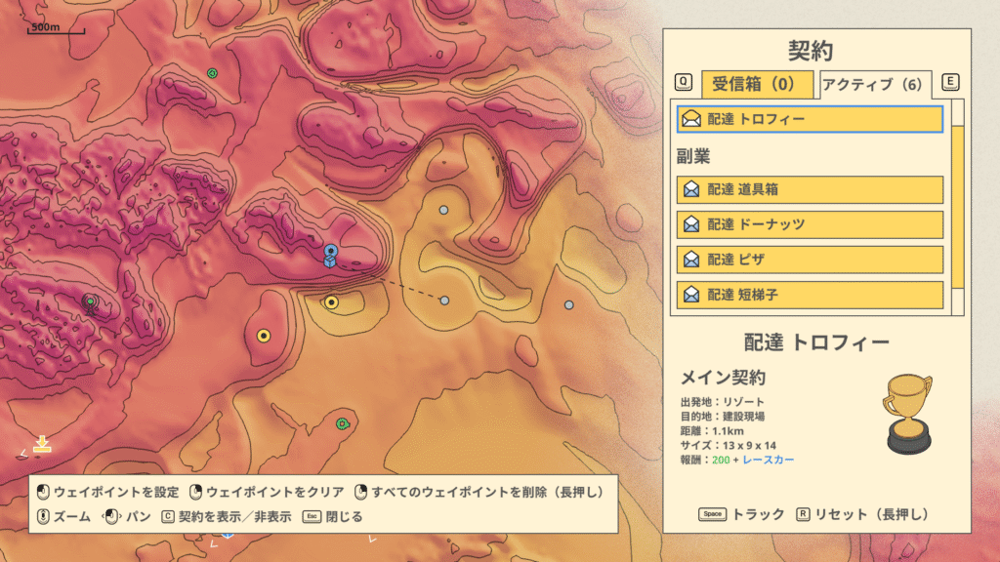
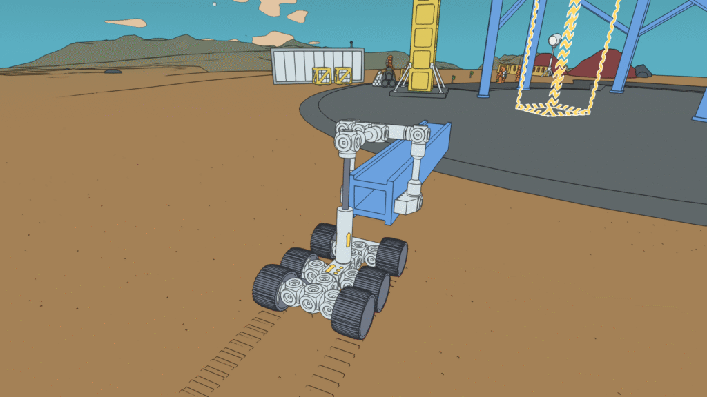
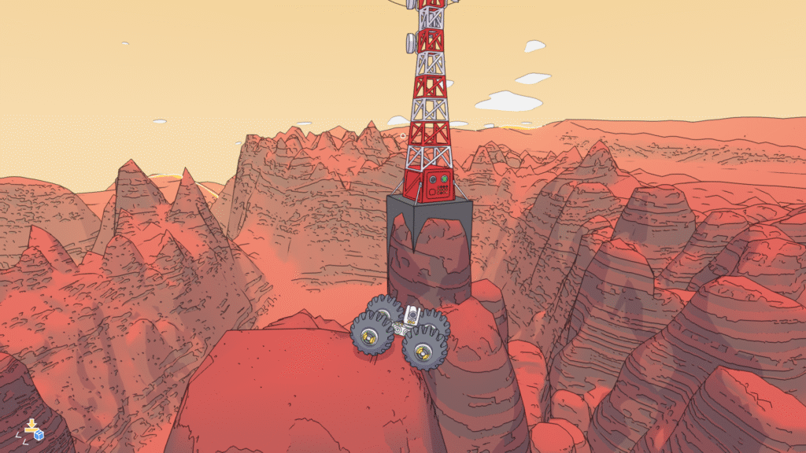
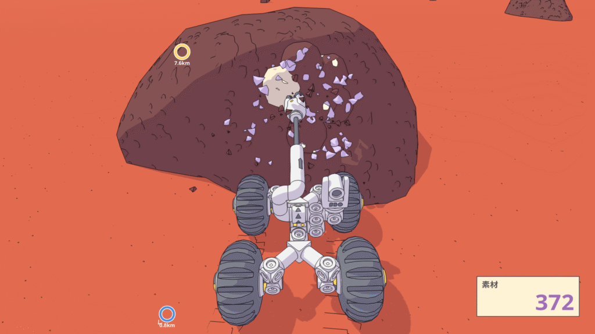

## English\_Practice

I bought a saled video game because I took it easy recently. However, I did not finish getting all achievement, but I enjoy playing it so that I will write.

### Overall Mars First Logistics

This game is so simple that I made a car, carried some material and developed the Mars. I can obtain and buy parts of car. After that, I created a car.

The main purpose is carring material, but other purpose is exploring, mining and creating rail. There are variety of things which are box, toast with bread, ice and weight. I carried it easily initialy, but it is not easy to carry something.

### Carrying, Exploring and Mining in Mars

I was tired that something had outside and inside. For example. Ice cream. When I carried it, I had to carry careful because I retried it if I dropped it. Nevertheless, it is fine to arrive the destination. It is hard to carry long and slender things to put column.

Moreover, there was exploring. I needed to set on the scanner to extend range of map. I recommend to set it at the high place because of electromagnetic wave. When there were obstacles between scanners, I could not set it.

I could mine when I finish carrying main things. I used to set rail for monorail to get the material. I do not recommend to set it random because I had to set it for sub job. However, it was easy to carry after setting. I did not need to move myself because of fast travel.

I played this video game like that. I felt a little uncomfort because it was getting defficult to carry and to operate a car well. Nevertheless, I will do my best as possible. I felt glad to carry complexed things with my creating car. See you later.

## 日本語版

最近まったりするタイミングがあったのでセールになってた[ゲーム](https://store.steampowered.com/app/1532200/Mars_First_Logistics/)を買ってみました。まだ、実績などは全て終わってないですが、割と楽しめてプレイできてるので少し書いてみようと思います。

### 概要

このゲームの内容はシンプルで車を作って、物を運んで火星を発展させていくというゲームになります。車のパーツをもらったり買ったりできるので、そこから車を作成します。

車の作成については物を運ぶことがメインですが、探索、採掘、レールの作成などがあります。運ぶものは多種多様で箱、トースト(パン付き)、氷、おもりなど様々です。最初は簡単に運べますが、段々と運びにくいものが増えていきます。

### 運搬と探索と採掘

面倒なのは外側と中身があるものですね。アイスを運ぶ場合はアイスを落とすとやり直しになったりするので、慎重に運ぶ必要があります。とは言え運べるのであればどんな形であれゴールまでたどり着ければ大丈夫です。細長いものを縦に置く必要があるなど面倒なものもありますが。

それから探索部分ですね。マップの範囲を広げるためスキャナーを設置する必要があります。電波が届くようになるべく高い場所に設置することをおすすめします。スキャナーの間に障害物があると設置することができないので…

採掘はメインを進めていくとできるようになります。得られた素材はモノレールのレールを設置するのに必要になります。このレールはサブの仕事で場所が決まってたりするので無暗に設置はしないほうが良いです。ただ、設置した後は物を運びやすくなります。自身の移動はファストトラベルがあるので必要ないですが。

といった感じでこのゲームを遊んでいます。段々運ぶものが難しくなってきたのとうまく車が動いてくれない不快さが少しありますが、できるところまで頑張ってみようと思います。自分で考えた車で難しいものを運べた時の喜びは大きいですからね。ではでは。

## AI採点

## 🧾 総合評価（推定スコア：Band 5.0）

| 項目 | 評価 | コメント |
| --- | --- | --- |
| **Task Achievement** | 5.5 | 内容は一貫しており、あなたの体験とゲームの説明が明確。ただし論理構成や段落間の接続が弱く、目的（「紹介・レビュー」）が曖昧。 |
| **Coherence & Cohesion** | 5.0 | 段落構成はあるものの、文と文のつながりが不自然な部分が多い。接続詞（However, Therefore, Besides, etc.）の使い方が不正確。 |
| **Lexical Resource** | 5.0 | 語彙の範囲は広げようとしているが、誤用が多い（例：_saled_, _achievement_, _carry careful_など）。自然なコロケーションを増やすと良い。 |
| **Grammatical Range & Accuracy** | 4.5 | 文法ミスが頻発（冠詞、時制、動詞形、前置詞、複数形など）。文構造は単調。正しい文の割合が50%未満。 |

* * *

## 🧩 文法・語彙の詳細な指摘

### 🧠 1. 語彙と表現の誤り

| 原文 | 問題点 | 修正例 |
| --- | --- | --- |
| **I bought a saled video game** | “saled” は誤り。形容詞は “on sale” または “discounted”。 | I bought a video game **on sale**. |
| **because I took it easy recently** | 意図は分かるが不自然。 | because I had some free time recently / because I was relaxing recently |
| **I did not finish getting all achievement** | “achievement” は数えられる名詞。 | I haven’t finished getting all **the achievements**. |
| **so that I will write** | 意味が不自然。「～だから書こうと思う」なら。 | so I thought I’d write about it. |
| **developed the Mars** | 冠詞不要。固有名詞。 | developed Mars. |
| **parts of car** | “car” の前に冠詞が必要。 | parts of **the car** |
| **There are variety of things which are box, toast with bread, ice and weight.** | “a variety of” に冠詞が必要。列挙も不自然。 | There is a **variety of items**, such as boxes, toast, ice, and weights. |
| **I was tired that something had outside and inside.** | 意味不明。「外側と中身があるものは面倒」なら。 | The difficult part was dealing with objects that had both an outer and inner part. |
| **I had to carry careful** | 副詞が必要。 | I had to carry **carefully**. |
| **I retried it if I dropped it.** | “retry” は不自然。ゲームで「やり直しになる」なら。 | I had to **restart** if I dropped it. |
| **It is hard to carry long and slender things to put column.** | 意味不明。 | It was hard to carry long, slender items that needed to be placed vertically. |
| **I recommend to set it at the high place** | “recommend to + verb” は誤用。 | I **recommend setting** it in a high place. |
| **because of electromagnetic wave** | 文脈的に「電波を届かせるため」。 | so that the signal can reach farther. |
| **I used to set rail for monorail to get the material.** | “used to” は過去の習慣で意味が変わる。 | I used the materials to build rails for the monorail. |
| **I do not recommend to set it random** | “at random” が正しい。 | I don’t recommend setting it **at random**. |
| **I felt a little uncomfort** | “uncomfort” は名詞で形容詞ではない。 | I felt a little **uncomfortable**. |
| **to carry complexed things** | “complexed” は誤用。 | to carry **complex** objects. |

* * *

### ⚙️ 2. 文法構造の問題

- **冠詞 (a / an / the)** の使用ミスが頻発。  
    例：`parts of car → parts of the car`、`the Mars → Mars`。  
    → 英語では「一度出たもの」には _the_、一般名詞には _a/an_ が基本です。

- **時制**が統一されていない。  
    例：`I was tired`（過去）と `I recommend`（現在）が混在。  
    → 一つのストーリーでは時制を統一しましょう（ここでは過去が自然）。

- **接続詞の使い方**  
    `However,` `Therefore,` などの文頭使用は多様ですが、文脈に合わない箇所あり。  
    例：`However, I did not finish getting all achievement` → “However” は逆接になっていない。

* * *

### 📏 3. コヒーレンス（論理の流れ）

- 段落間のつながりが弱い。  
    例：「Carrying, Exploring and Mining」部分が突然始まり、前文との接続が不明。  
    → “Next, I’d like to talk about the three main activities: carrying, exploring, and mining.” のように導入を。

- “Overall” や “Moreover” などのディスコースマーカーが正しく使われていない場合あり。  
    → 使うなら “Overall, the game is simple but engaging.” や “Moreover, exploring allows you to unlock new areas.” のように。

* * *

## ✅ 改善後のモデル文（Band 7.0 相当）

> Recently, I had some free time, so I bought a video game that was on sale. Although I haven’t completed all the achievements yet, I’ve been really enjoying it, so I’d like to share my thoughts.
> 
> **Overview**  
> The game is simple: you build cars, transport materials, and develop Mars. You can collect or purchase car parts to design your own vehicles. The main goal is to deliver various items, such as boxes, ice, or weights, but you can also explore, mine, and build rails.
> 
> **Carrying, Exploring, and Mining**  
> Some items are tricky to transport—for example, ice melts easily, so you must handle it carefully. Long, slender items also require precision. To expand the map, you need to place scanners in high places so the signal can reach farther. Once mining is unlocked, you can collect materials to build monorail tracks, which make transportation easier.
> 
> **Impressions**  
> As I progress, the tasks become more challenging, and controlling the car sometimes feels frustrating. However, it’s very satisfying when I manage to transport a difficult item using a car I designed myself.

* * *

## 💬 最終フィードバック

- **冠詞・複数形**の精度を上げましょう（the, a/an, -s）。

- **自然なコロケーション**を意識（carry carefully, build a car, transport materials）。

- **接続語の正確な使い方**（However / Moreover / Therefore）。

- **文のリズムと多様性**（短文と長文を混ぜる）。
