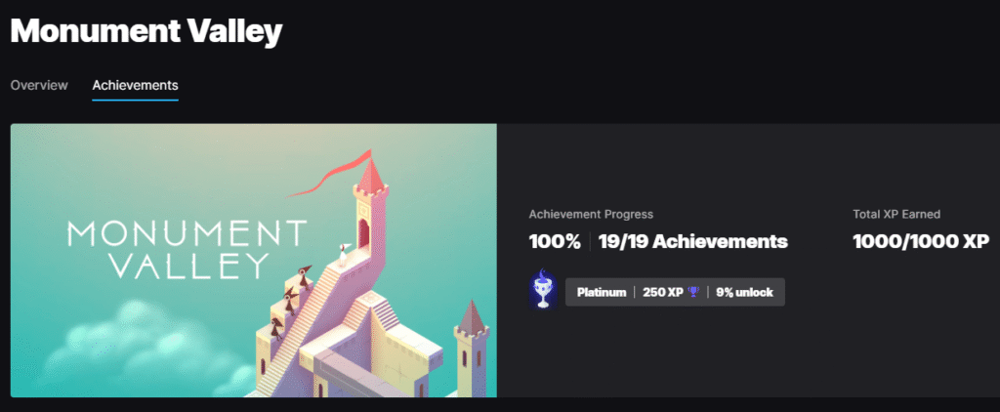
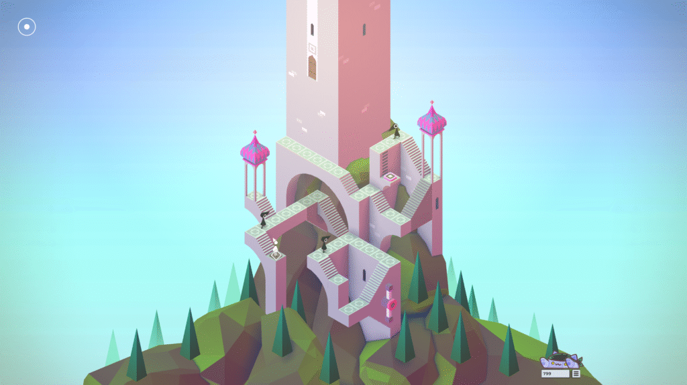
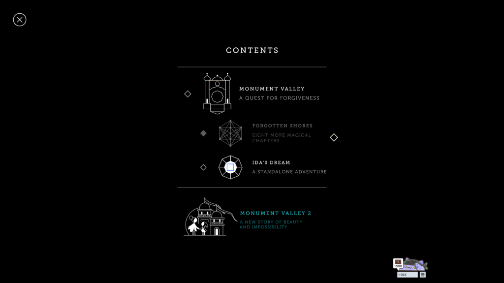

## English\_Practice

I played a video game "Monument Valley" which was distributed from EPIC for free. I just clicked and dragged to play it. It is simple action and I completed all stages a day.

### Monument Valley Contents

It is no problem what I did not understand this story. The princess traveled and crows bother her. Crows change lives at end of journey, but I was not sure.

This game has feature which is illusion in puzzle. For example, she goes through the street if the street connects other street visually even though it does not connect other street physically. Moreover, crows bother the princess as story. However, just disturbing roads.

### Monument Valley Action and Achivement

When I clicked, the princess moved clicked place. In addition, when I dragged specific blocks, backbone changed. After that, I operatd her or a crow to aim goal.

It is not difficult to get all achivement. I just cleared all stages. I needed to complete not only main stages but also side stages.

I enjoyed this game like that. It is simple but I had to use my intelligence because of illusion. Nevertheless, someone who is not good at playing video games can play this game. I recommend it because it has an illusion also. See you later.

## 日本語版

以前EPICで無料配布された[Monument Valley](https://www.monumentvalleygame.com/mv1)というゲームをプレイしてみました。このゲームはクリックとドラッグのみでプレイができるゲームとなっています。操作性がシンプルで1日ほどあれば全クリできるゲームとなっています。

### Monument Valley ゲーム内容

一応物語性はありますが、わからなくても特に問題ない気がします。プリンセスが旅をしてカラスが邪魔をするというものになってます。旅の終わりでカラスが生まれ変わりますが、そこもよくわかってないですね…

このゲームの特徴としては錯覚すらもパズルに組み込んでいる点になります。例えば物理的に繋がっていなくても、視覚的に繋がっていれば道として通ることができます。それからストーリーの通りカラスが邪魔をします。ただ、道をふさぐだけですが。

### Monument Valley 操作と実績

クリックをすればクリックする場所に行きますし、特定のブロックをドラッグすれば背景が変化します。そうすることで主人公やカラスを動かしてゴールを目指していきます。

実績については難しくなくただ、全てのステージをクリアすれば全実績を達成することができます。メインだけじゃなくサイドストーリーもクリアする必要がありますが。

といった感じで楽しみました。シンプルながらも錯覚も踏まえて移動する必要があるので少し頭を使いますが、ゲームが苦手な人でもクリアできるかと思います。錯覚という変わった要素もあるので興味があればぜひぜひ。ではでは。

## AI採点

以下はIELTS Writing Task 1/2の採点基準（Task Achievement/Response, Coherence and Cohesion, Lexical Resource, Grammatical Range and Accuracy）に基づいた詳しいフィードバックです。翻訳文をそのまま採点対象にしています。

* * *

## 総合評価（概算）

- **Task Achievement/Response**: Band 5.5〜6.0  
    （内容は伝わるが説明が浅く、文章構造や情報の整理が不十分）

- **Coherence and Cohesion**: Band 5.5  
    （段落構成・つなぎ言葉が少なく、論理的な流れが弱い）

- **Lexical Resource**: Band 5.5〜6.0  
    （語彙が限定的・不自然なコロケーション多い）

- **Grammatical Range and Accuracy**: Band 5.0〜5.5  
    （文法・冠詞・動詞形・複数形・前置詞・語順の誤りが多い）

→ 総合的に **Band 5.5〜6.0程度**。

* * *

## 主な減点ポイントと詳細フィードバック

### 1\. Task Achievement/Response（課題達成）

- 「ゲームの概要」「特徴」「操作」「実績」などを説明しているが、各段落が短く、情報が断片的。

- IELTSでは「導入→概要→詳細→まとめ」の構造が望ましいが、段落構成が弱く、特に最後の推薦理由が唐突。

**改善例**:  
最初にゲーム概要（配布元・ジャンル）、次に特徴・操作方法・達成要件、最後に感想・推奨理由を論理的にまとめる。

* * *

### 2\. Coherence and Cohesion（論理・一貫性）

- 接続詞や句（for example, moreover, therefore, as a result など）が極端に少ないため、文が単発で並んでいる印象。

- 「Monument Valley Contents」「Action and Achievement」と見出しをつけているが、その後の文の流れが整理されていない。

**改善例**:  
“Firstly… Secondly… Finally…” “In addition…” “However…” “As a result…” などのリンクワードを適切に挿入する。

* * *

### 3\. Lexical Resource（語彙）

- **不自然または誤用**:
    - “It is simple action” → “It is a simple game to play”
    
    - “I completed all stages a day” → “I completed all stages in one day”
    
    - “It is no problem what I did not understand this story.” → “It was not a problem that I did not fully understand the story.”
    
    - “Crows change lives at end of journey” → “The crows are reborn at the end of the journey”
    
    - “has feature which is illusion in puzzle” → “features illusions incorporated into its puzzles”
    
    - “backbone changed” → ここは「background」が正しい。
    
    - “operatd her or a crow” → “I controlled her or the crows”
    
    - “achivement” → “achievement”
    
    - “I recommend it because it has an illusion also.” → “I recommend it because it also incorporates optical illusions.”

- コロケーション不足（e.g. “aim goal” は “reach the goal” が自然）。

* * *

### 4\. Grammatical Range and Accuracy（文法）

- **冠詞ミス**: “a day” “the story” “the princess” “the end of the journey”など、冠詞が抜けている。

- **時制・動詞形ミス**:
    - “I just clicked and dragged to play it. It is simple action…” → “It was a simple action game…”
    
    - “Crows change lives at end…” → “The crows change their form at the end…”
    
    - “I operatd” → “I operated”

- **複数形ミス**: “stage” vs “stages,” “block” vs “blocks.”

- **語順・前置詞**:
    - “She goes through the street if the street connects other street visually” → “She can go through a path if it appears visually connected to another path”
    
    - “moved clicked place” → “moved to the place I clicked”
    
    - “aim goal” → “aim for the goal”

- **句読点不足**で長文が崩れている箇所あり。

* * *

### 5\. 推奨する書き換え（例）

> I played a video game called _Monument Valley_, which was distributed for free on EPIC. It is a simple puzzle game that can be played just by clicking and dragging, and I completed all the stages in one day.
> 
> Although the game has a storyline, it was not a problem that I did not fully understand it. The princess travels through various levels while crows obstruct her path. At the end of the journey, the crows are reborn, but I am still not entirely sure about that part of the story.
> 
> One of the most distinctive features of the game is its use of optical illusions as part of the puzzles. For example, even if two paths are not physically connected, the princess can walk across them if they appear visually connected.
> 
> By clicking, I could move the princess to the desired location, and by dragging specific blocks, the background shifted. This allowed me to guide the princess and sometimes the crows to reach the goal.
> 
> It was not difficult to unlock all the achievements. I only needed to complete all the stages, including the side stories, to obtain them.
> 
> Overall, I enjoyed this game. Although it is simple, it requires some thinking because of the illusions. Nevertheless, even people who are not good at playing video games can enjoy it. I recommend it to anyone interested in puzzles with unique elements.

このレベルまで整えると **Band 7.0近く** に届く可能性があります。

* * *

## まとめ（改善ポイント）

- 段落構造を整える（導入・特徴・操作・実績・感想）。

- 接続詞を増やし、文同士の関係を明確にする。

- 語彙の自然さ（コロケーション）を意識する。

- 冠詞・複数形・前置詞・時制を丁寧に直す。

- スペル（achievement、backgroundなど）に注意する。

これらを修正すると **Band 6.5〜7.0** に近づけます。
