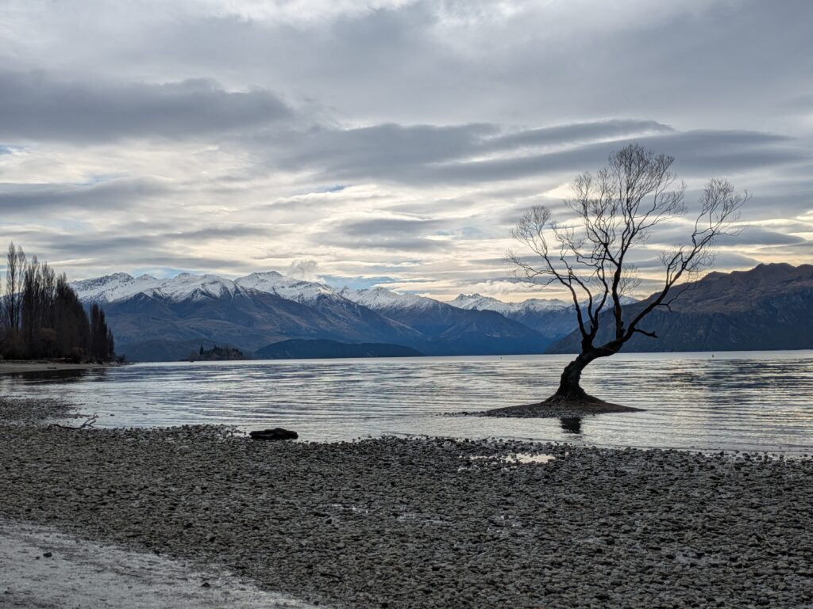
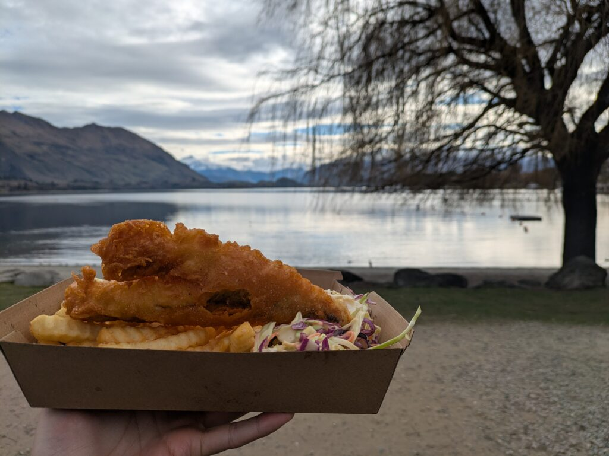
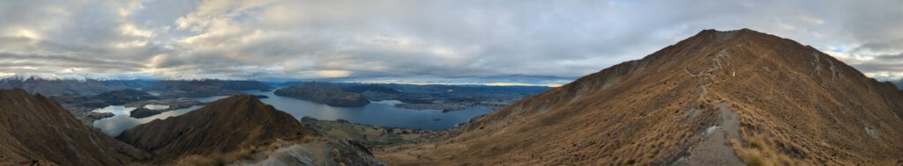
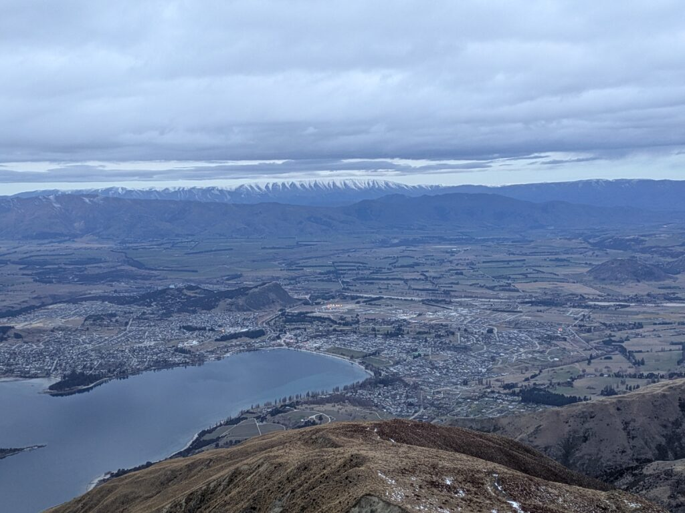

## Enslish\_Practice

I wrote the story about FoxGracier in road trip before. I will write about Wanaka.

There are a lot of tourist attractions because it is big city. I went to three places, but I want to go other places.

### Wanaka Tree

Firstly, I went to the tree in the lake. This tree which is not around no trees grows in the lake. It was mysterious. Moreover, it was more mysterious when I watched this tree with behind the mountain. There were many tourists.

After that, I ate fish and chips near there. I thought it was good for me because of coleslaw. Fried things were crispy so that it was tasty.

### Wanaka Roys Peak

Secondly, I went to Roys Peak. It took for 2 or 3 hours. However, I ended up to climb it. When I came back, it was dark so I came back with smartphone's light. If it had been out of charge, I could not go back.

This mountain has lookout and peak view point. It was good to look at lookout point. It was a little dengerous because of narrow road. On the other hand, when I took photos there, it was a good scene.

Moreover, it was snow left near the peak. It was winter when I went there in middle of August. Actually, it was snow left. It was a good viewing because of summit. There are many mountains, town and lake surronded by them. In addition, it was breezing at the summit.

I had a sore mussle after going up next day. I often do not go up at the mountain and I did not have climbing equipments.

Finally, I went to the shooting range. I wrote about this story. Nevertheless, I recommend it because when I lived in Japan, I could not do this.

I a little explored in Wanaka. I want to go other places so I will go there again. See you later.

## 日本語版

[前回](/posts/2025/09/road-trip-nelson-from-fox-glacier-to/)ロードトリップでFox Gracierまでの話をしました。今回は[Wanaka](https://www.wanaka.co.nz/)に行ってだらだらと過ごした話をしようと思います。

Wanakaは規模が大きめの街で観光名所も多くありますのでその分大きくなっていると考えられます。私が行ったのは3か所ほどでしたが、まだまだ行くべきところはあると思います。

### Wanaka Tree

最初に行ったのは湖にそびえたつ一本の木ですね。周囲10mぐらいには木が生えてない上に湖の中から生えています。それだけでも神秘的ですが、奥に見える山と一緒に見るとより神秘的に見えます。その辺は観光客も多くいました。

その後は近場にあった店でフィッシュアンドチップスを頂きました。コールスローがあるので体には良いと思いながら食べました（笑）揚げ物はサクサクした感触で美味しかったですね。

### Wanaka Roys Peak

その次はRoys Peakに行きました。片道2,3時間かかる道のりでしたがなんとか頂上まで登りました。帰るときは真っ暗で携帯の明かりを頼りに帰ってました。充電が切れたら終わってましたね…

ここの山はlookoutのポイントとpeakがあり、lookoutだけでもよい景色が見られると思います。先端が狭い道となっており少し危ないですが、そこでとるときれいな景色になりますね。

peak付近ではまだ雪が残ってました。行ったのは8月の中旬なので冬ではありますが、意外と残っているものでした。頂上なだけあってそこから見える景色もよかったですね。たくさんの山とそれらに囲まれた町や湖などが見れて良かったです。ちなみに頂上はかなり寒かったです。

余談ですがここを登った翌日は筋肉痛になりました。普段山に登らないですし、登山用の装備も全くしてなかったので。

最後に行ったのは射撃場です。これは前回話したので割愛しますが、ここもおすすめです。日本ではできない体験なのでこっちに来たら行ってみることをおすすめします。

といった感じでWanakaを少し探索してきました。他にもまだ行ってみたい場所があるのでまた来たいと思います。ではでは。

## AI採点

* * *

## 🧾 総合評価（想定スコア）

| 基準 | 評価 | コメント |
| --- | --- | --- |
| **Task Achievement** | **6.0** | 内容は明確で、一貫したテーマ（Wanaka旅行記）が書けています。ただし、時制の一貫性、文の目的（説明・描写・感想）のバランスがやや不明確。論理展開に軽い不自然さがあります。 |
| **Coherence & Cohesion** | **6.0** | 段落構成はあり、接続詞も使えていますが、文のつながり（例: “Moreover”, “On the other hand”などの使い方）が不自然な箇所あり。時系列・論理関係をもっと明確に示せると良いです。 |
| **Lexical Resource** | **5.5** | 語彙は日常的で伝わるものの、誤用・不自然な表現が多い（例: “It took for 2 or 3 hours”, “Fried things”, “good viewing”など）。より自然な語彙選択が必要。 |
| **Grammatical Range & Accuracy** | **5.0** | 文法ミス・不自然な構文が多く、IELTSでは減点対象。冠詞・前置詞・動詞形・語順の誤りが多いです。シンプルな構文を正確に書くことを優先しましょう。 |

📊 **Overall Band: 5.5〜6.0**

* * *

## 🪶 詳細フィードバック（文ごと）

### 🔹 Paragraph 1

> I wrote the story about FoxGracier in road trip before.  
> ❌ 不自然な語順・冠詞の誤り。  
> ✅ 修正: _I wrote about my road trip to Fox Glacier before._

> I will write about Wanaka.  
> ✅ シンプルで正確。

* * *

### 🔹 Paragraph 2

> There are a lot of tourist attractions because it is big city.  
> ❌ “big city” に冠詞が必要、また “because it is a big city” の方が自然。  
> ✅ 修正: _There are many tourist attractions because it is a big city._

> I went to three places, but I want to go other places.  
> ❌ “go other places” → “go to other places”  
> ✅ 修正: _I went to three places, but I’d like to visit other spots next time._

* * *

### 🔹 Paragraph 3 – Wanaka Tree

> Firstly, I went to the tree in the lake.  
> ✅ 良い導入。

> This tree which is not around no trees grows in the lake.  
> ❌ 二重否定・構文崩壊。  
> ✅ 修正: _This tree stands alone in the lake, with no other trees around it._

> It was mysterious. Moreover, it was more mysterious when I watched this tree with behind the mountain.  
> ❌ “with behind” は誤り。  
> ✅ 修正: _It looked even more mysterious with the mountains in the background._

> There were many tourists.  
> ✅ 問題なし。

* * *

### 🔹 Paragraph 4 – Fish and Chips

> After that, I ate fish and chips near there.  
> ✅ 正しい。

> I thought it was good for me because of coleslaw.  
> ❌ “because of coleslaw” → 意味が曖昧。  
> ✅ 修正: _I thought it was a bit healthier because it came with coleslaw._

> Fried things were crispy so that it was tasty.  
> ❌ “so that” は目的節で誤用。  
> ✅ 修正: _The fried food was crispy and delicious._

* * *

### 🔹 Paragraph 5 – Roys Peak

> It took for 2 or 3 hours.  
> ❌ “for” 不要。  
> ✅ 修正: _It took about 2 or 3 hours._

> However, I ended up to climb it.  
> ❌ “end up to V” は誤り。  
> ✅ 修正: _However, I managed to reach the top._

> When I came back, it was dark so I came back with smartphone's light.  
> ❌ 冗長で不自然。  
> ✅ 修正: _When I came down, it was already dark, so I used my phone’s flashlight._

> If it had been out of charge, I could not go back.  
> ✅ 意図は伝わるが “out of battery” が自然。  
> ✅ 修正: _If my phone had run out of battery, I couldn’t have made it back._

* * *

### 🔹 Paragraph 6 – Description

> This mountain has lookout and peak view point.  
> ✅ 修正: _This mountain has both a lookout point and a peak viewpoint._

> It was good to look at lookout point.  
> ✅ 修正: _The view from the lookout point was already amazing._

> It was a little dengerous because of narrow road.  
> ❌ “dengerous” → “dangerous”、冠詞抜け。  
> ✅ 修正: _It was a little dangerous because the path was narrow._

> On the other hand, when I took photos there, it was a good scene.  
> ❌ “On the other hand” は対比ではなく使用誤り。  
> ✅ 修正: _However, the photos I took there were beautiful._

* * *

### 🔹 Paragraph 7 – Snow

> Moreover, it was snow left near the peak.  
> ❌ 誤文構造。  
> ✅ 修正: _Moreover, there was still some snow near the peak._

> It was winter when I went there in middle of August.  
> ✅ 修正: _It was winter when I went there in mid-August._

> Actually, it was snow left.  
> ❌ 冗長・同じ誤り。  
> ✅ 削除か “Surprisingly, some snow remained.”

> It was a good viewing because of summit.  
> ❌ 意味不明。  
> ✅ 修正: _The view from the summit was breathtaking._

> There are many mountains, town and lake surronded by them.  
> ❌ “are” → “were”、名詞の複数一致。  
> ✅ 修正: _There were many mountains, towns, and lakes surrounded by them._

> In addition, it was breezing at the summit.  
> ❌ “breezing” 誤用。  
> ✅ 修正: _In addition, it was very cold and windy at the summit._

* * *

### 🔹 Paragraph 8 – Muscle pain

> I had a sore mussle after going up next day.  
> ❌ “mussle” → “muscle”、語順も誤り。  
> ✅ 修正: _I had sore muscles the next day after climbing._

> I often do not go up at the mountain and I did not have climbing equipments.  
> ❌ “go up at the mountain” 不自然。 “equipments” は不可算名詞。  
> ✅ 修正: _I don’t usually go hiking, and I didn’t have any climbing equipment._

* * *

### 🔹 Paragraph 9 – Shooting range

> Finally, I went to the shooting range. I wrote about this story.  
> ❌ “wrote about this story” → “already wrote about this before.”  
> ✅ 修正: _Finally, I went to the shooting range, which I already mentioned before._

> Nevertheless, I recommend it because when I lived in Japan, I could not do this.  
> ✅ 意図は良いが自然さを改善。  
> ✅ 修正: _Still, I recommend it, since you can’t experience it in Japan._

* * *

### 🔹 Paragraph 10 – Closing

> I a little explored in Wanaka.  
> ❌ 語順誤り。  
> ✅ 修正: _I explored Wanaka a little._

> I want to go other places so I will go there again.  
> ❌ “go other places” → “visit other places”  
> ✅ 修正: _I’d like to visit other places, so I’ll definitely go there again._

> See you later.  
> ✅ カジュアルですが自然。

* * *

## 💬 改善の方向性

1. **文法**
    - “It took for” “end up to” “it was snow left” など構文的な誤りを徹底修正。
    
    - 動詞・前置詞の組み合わせに注意（go to / visit / look at）。
    
    - 時制は過去形で統一（例：_was_, _went_, _had_）。

3. **語彙**
    - “good viewing” → “beautiful view”
    
    - “fried things” → “fried food”
    
    - “out of charge” → “out of battery”
    
    - “equipments” → “equipment”

5. **自然なつながり**
    - “Moreover”, “On the other hand” の誤用が多い。  
        👉 “Also”, “In addition”, “However” に置き換える。

7. **構文バリエーション**
    - 同じ文型が多いため、関係詞や分詞構文などを使って文をつなげると Band 7 に近づきます。
