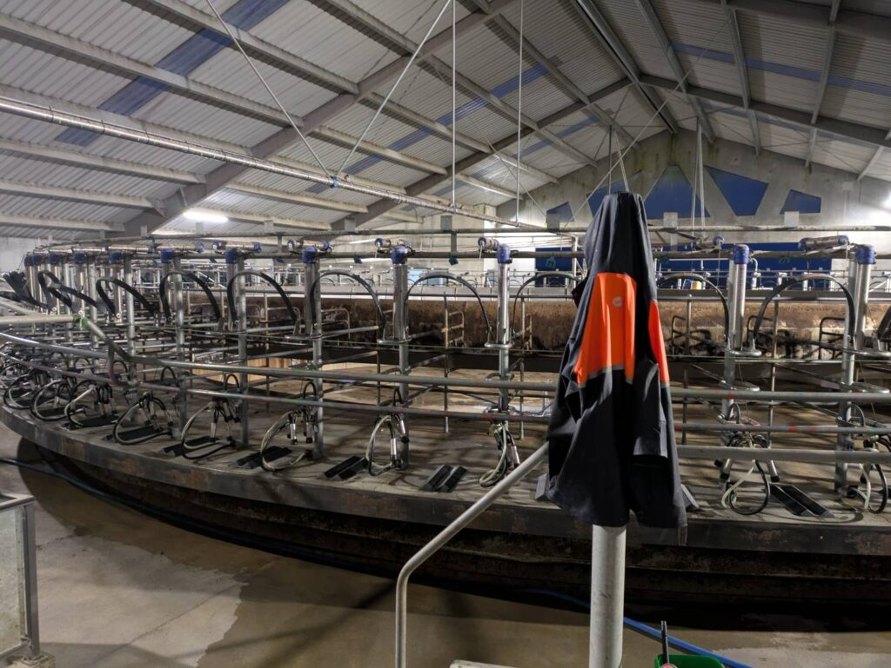
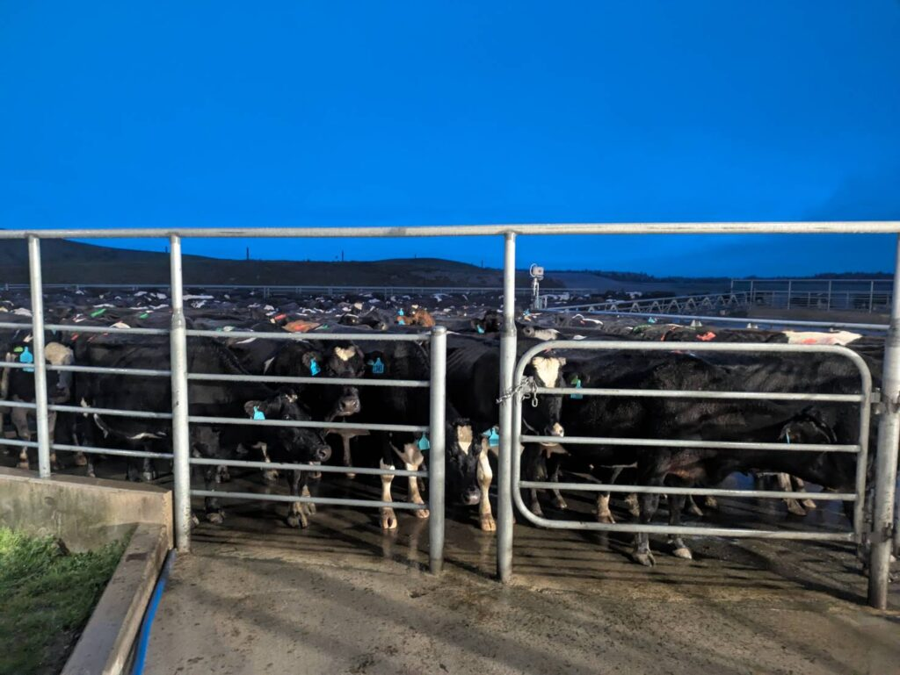

## English\_Practice

I had played video games recently because I worked as a WWOOFer so that I had a free time.

### WWOOF\_Overall

I worked as a WWOOFer for 20 hours per week for free. I was provived accomodation and food instead of that. I am not sure someone can buy anything because it depends on people. I was allowed to buy food free.

There are kind of works in WWOOF. My host is a company staff in dairy farm so that I helped him. There are other jobs such as gardening and taking care of sheep and horse.

### WWOOF\_Job

I alomost worked milking. There is a rotary milking parlour in this farm. I had equiped a milking machine outside after coming cows inside. On the other hand, there is a herringbone milking parlour in oter farm.

The jos starts 4 or 5 a.m. and finishs at 4 or 5 p.m. When the job finished early, I got lunch time for 3 hours. Of course, it was better to finish early.

### Miliking

I needed to adopt the speed of rotary. The feed consists of ingredient which are increasing milk. For example, calcium and magnesium. Cows eat a lot it to get milk in the morning and afternoon.

Moreover, there are kind of milk which are nomarl milk, colostrum and mastertits. The normal milk is sold at supermarket. The colostrum meas milk which cows start milking for a few days. The child cows and training people drink it because it can not be sold. The mastertits is like sick so it is abandoned. I guess they can recover to use injection.

The milking machine is 3 or 4 kg and it is hard to equip cows with one hand because of heavy. In addition, it is really hard even I used to milk because cows kick or pee and boo.

I enjoyed working as a WWOOFer. If I have a chance, I want to take care of horse or sheep. When I can not find jobs. See you later.

## 日本語

ここ最近[ゲーム](/posts/2025/10/mars-first-logistics/)を少しプレイしましたが、[WWOOF](https://wwoof.nz/)として働いていたので時間があったというのが理由です。

### WWOOFの概要

WWOOFは週20時間ほど働くのですが無給になります。その代わり宿泊施設と食料は提供してもらえます。食料については人によるのである物を食べるか好きなものを買えるかはわかりませんが。私のところは自由に買うことを許されていました。

WWOOFでの仕事もいろいろあります。私のところはホストが酪農の雇われ社員だったので彼のミルキングを助けるのが主な仕事でした。他のところではガーデニングや羊、馬の世話というのもありあました。

### WWOOFの仕事内容

私はほとんどミルキングの仕事をしてました。この農場ではロータリー式のパーラーを使ってました。牛が中のロータリーに入り外から搾乳機を装着する仕事です。他の方法だと並行に並べさせて搾乳するパターンもあるようです。

仕事の開始時間は4または5 a.m.で終了時間は4または5 p.m.ですね。午前は早めに終われば3時間ほどの休憩になります。もちろん仕事が早く終わるに越したことはないですが。

### ミルキングについて

ミルキングにもやり方がありロータリーのスピードを調整する必要があったりします。食べさせている餌にミルクの量を増やすような成分が入っています。カルシウムやマグネシウムなどですね。ある程度食べさせて午前と午後にミルクがたくさん取れるようにしていました。

また、牛にもミルクの種類がありノーマル、コロストラムとマスターティトゥがあります。ノーマルは店に並ぶ用ですね。コロストラムは乳が出始めてから数日間のミルクのことを指します。売りものとしてはあまり使えず子牛用またはトレーニングする人が飲んだりします。マスターティトゥは病気なので廃棄します。注射で治せるとは思いますが。

ミルキング用の装備が3,4kgくらいあり、片手で持って牛に装着させるので最初は大変ですね。苦戦するし重いしで大変です。慣れたとしても牛が蹴ったり糞尿をばらまくのでいつになってもきついですね。

仕事は大変でしたがWWOOFは楽しかったです。馬や羊の世話も楽しそうなのでタイミングがあればやってみたいとは思います。仕事が全く見つからなければですが。ではでは。

## AI採点

## 🧾 総合スコア（推定）

**Band 5.0〜5.5**

内容は明確ですが、**文法・語彙・構文の誤りが頻出**し、意味が正確に伝わらない部分が多いです。  
文法的正確さと語彙の自然さを改善すれば、**Band 6.5〜7.0**も十分狙えます。

* * *

## 🟩 1. Task Achievement（課題達成）: Band 6.0

- 内容はよく説明されていますが、**冒頭文が目的と繋がっていない**ため導入が弱いです。  
    → 「I had played video games recently...」は話題として唐突で、WWOOFとの関係が不明確。

- 結論文（最後の文）はありますが、**全体の要約や感想が浅い**です。

✅ **改善例:**

> Recently, I had some free time because I was working as a WWOOFer, so I spent a little of it playing video games.  
> In this essay, I will describe what WWOOF is and my experience working on a dairy farm.

* * *

## 🟦 2. Coherence and Cohesion（一貫性と結束）: Band 6.0

- 段落構成は良いですが、接続表現がほとんど使われていません。

- “WWOOF\_Overall”など見出し形式はIELTSエッセイでは不自然です。文でつなぐ方が良いです。

✅ **改善例:**

> WWOOF requires about 20 hours of unpaid work per week; however, accommodation and food are provided.  
> Moreover, the type of food and work varies depending on the host.

* * *

## 🟨 3. Lexical Resource（語彙力）: Band 5.0

語彙選択の誤り・不自然さが目立ちます。以下は主な修正リストです。

| ❌ 誤用 | ✅ 正しい・自然な表現 | コメント |
| --- | --- | --- |
| I had played video games | I played video games / I spent some time playing games | “had played”は過去完了で時制誤り |
| I was provived accomodation | I was **provided** accommodation | 綴りミス (provided, accommodation) |
| I was allowed to buy food free | I was allowed to buy food freely / on my own | “free” は形容詞、ここでは副詞的に “freely” |
| There are kind of works | There are **various kinds of work** | “work”は不可算名詞 |
| My host is a company staff | My host **was an employee** at a dairy farm | “is” → “was”, “staff”は集合名詞 |
| I alomost worked milking | I **mainly** worked on milking | 意味的に“almost”ではなく“mainly” |
| finishs | finishes | 綴りミス |
| lunch time for 3 hours | **a break of three hours** | “lunch time”ではなく“break”が自然 |
| adopt the speed | **adjust the speed** | “adopt”は採用する、“adjust”は調整する |
| ingredient which are increasing milk | ingredients **that increase milk production** | 文法・自然さ両方改善 |
| nomarl | normal | 綴りミス |
| mastertits | **mastitis** | 医学用語誤り（「乳房炎」） |
| The child cows | **Calves** | “child cows”は誤り |
| training people | **trainees / workers** | 不自然 |
| it is really hard even I used to milk | it is still hard **even after I got used to milking** | 構文エラー |
| cows kick or pee and boo | **kick, urinate, or defecate** | “boo”は意味不明、語彙不適切 |

* * *

## 🟥 4. Grammatical Range and Accuracy（文法範囲と正確さ）: Band 5.0

文法ミスが多く、特に以下の点が減点対象です。

### ❌ 時制

- “I had played video games” → 不必要な過去完了。

- “My host is” → “was”にすべき（過去の話）。

- “There is a rotary...” → 一貫して過去形に統一。

### ❌ 可算・不可算名詞

- “works” → “work”（不可算）

- “food are” → “food is”

### ❌ 冠詞

- “I worked as a WWOOFer” ✅  
    だが “the cows”, “the milk” などで冠詞抜けが多い。

### ❌ 接続詞

- “so that I had a free time” → “so I had some free time”

- “Moreover, there are kind of milk...” → “Moreover, there are different types of milk...”

* * *

## ✏️ 改善後のモデル英文（Band 7〜7.5想定）

> Recently, I had some free time because I was working as a WWOOFer, so I spent part of it playing video games.  
> WWOOF is a program where people work about 20 hours a week without pay, but in return, they receive accommodation and food. The type of food depends on the host; in my case, I was allowed to buy food freely.
> 
> My host was an employee at a dairy farm, and my main job was to help him with milking. Other WWOOFers may do gardening or take care of sheep and horses.
> 
> The farm used a rotary milking parlour, where cows enter a rotating platform and we attach milking machines from the outside. The job started around 4 or 5 a.m. and finished around 4 or 5 p.m. If we finished early, I could take a three-hour break, which was always nice.
> 
> I had to adjust the speed of the rotary and make sure cows were fed properly with nutrients like calcium and magnesium to produce more milk. There are several types of milk: normal milk, colostrum, and milk from cows with mastitis. Colostrum is used for calves, while milk from mastitis cows must be discarded.
> 
> The milking machine weighs about 3–4 kilograms, and attaching it with one hand is difficult. Even after I got used to it, cows sometimes kicked or splashed urine and dung, so it was always tough.
> 
> Although the work was hard, I enjoyed my experience as a WWOOFer. If I have a chance, I would like to take care of horses or sheep in the future.

* * *

## 📘 改善ポイントまとめ

| 項目 | 現状 | 改善策 |
| --- | --- | --- |
| 文法精度 | 低 | 過去形の一貫性・冠詞の使用を意識 |
| 語彙 | 誤り多 | collocationを自然に（adjust speed, types of milkなど） |
| 構成 | 見出し形式 | パラグラフに接続語を追加（Moreover, However, In addition） |
| 表現力 | シンプル | “in return”, “depending on the host”, “even after I got used to it”のような自然表現を追加 |
