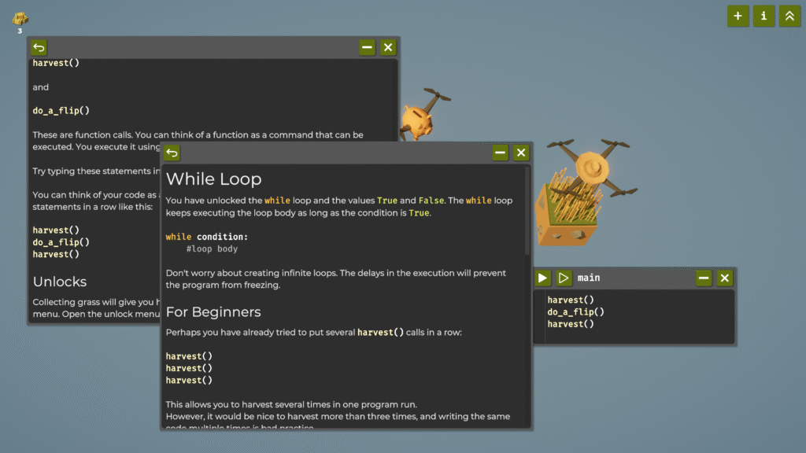
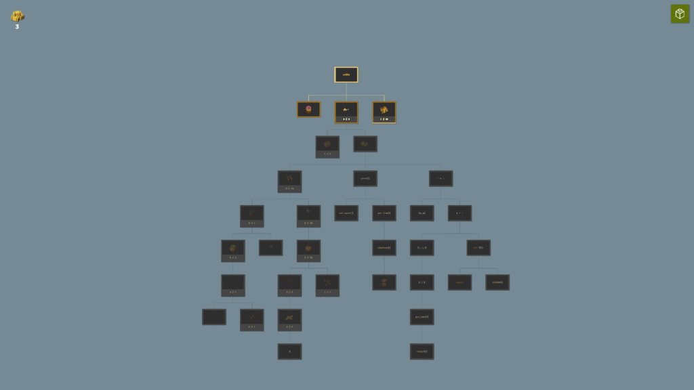
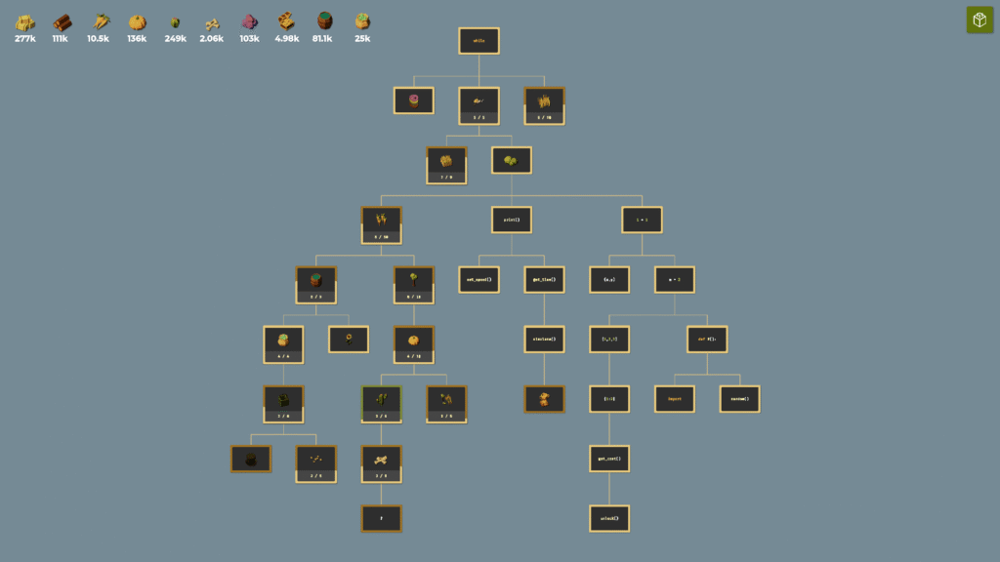

## English\_Practice

I started playing 「The Farmer Was Replaced」which was lanched version 1.0. I have a lot of things to do, but I enjoy playing it.

### 農家は Replace() されました\_Overall

This game's theme is programming. I was a farmer and oparated a deone to harvest. The operating is programming. Collecting crops are used unlock skills. Some crops use special situation.

This language is besed on python. It is not as same as python perfectoly. I am not sure which language is the best, but it is used on AI so that it is good to be familiar with programming. This is real view.

### 農家は Replace() されました\_View

Information view and coding view are same UI so it is a little hard to see. Howeber, I judged above gray bar. Information view shows how to write coding. Firstly, I learned "harvest()", "do\_a\_flip()" and "while". I did not use "do\_a\_flip()".

I can see the skill tree to choose arrow after harvisting. "i" shows information and "+" illustrates new coding view. The skill tree is like that.

It looks a lot, but I achieved end immediately. Moreover, I was familiar with programming.

If you are not familiar with it, you should confirm each information and action. It is difficult to image how to use variable and list with other function.

### 農家は Replace() されました\_Concept

Next, they are crops. They have feature. The first crop is just planted and harvested. However, other crops use another crops to plant. For example, never contacting same crops, sorting height, solving maze. I needed to make programming each crops.

In addition, a new factor is drone which I do not understand at all. When I use it, it is more effictive to harvest. Nevertheless, I did not understand it so I must know with moving. If you know how to create synchronous programming, you can understand right now.

I will not write programming this time, but I am going to wirte it next. I progressed like that now. In my opinion, when I do not know at all, I should ask chat-gpt especially maze. See you later.

## 日本語版

最近バージョン1.0が出た「[農家は Replace() されました](https://store.steampowered.com/app/2060160/_Replace/?l=japanese)」というゲームをやり始めました。まだまだやることも多いですが、楽しみながらプレイしています。

### 農家は Replace() されました\_概要

このゲームはプログラミングを題材としています。農家となりドローンを操り農作物を収取していきます。この操る部分がプログラミングになっています。集めた農作物はスキルのアンロックに使用できます。一部アイテムは特殊な使い方をしますね。

元となる言語はpythonになっています。pythonと完全一致というわけではないですが。言語は一概にどれがいいとは言えないですが、AIでも使用されているので慣れるのにはちょうどいいのかなと思います。実際の画面はこんな感じ。

### 農家は Replace() されました\_画面

情報画面とコード画面が同じようなUIなので少し見にくいですが、灰色のバーから判断するしかないですね。情報画面では基礎的なコードの書き方を教えてくれます。最初は収穫コード(harvest())、フリップコード(do\_a\_flip())、Whileコードですね。フリップは使わなくてもよいです。

実際に収穫してスキルツリーは右上の↑を選択することで見られます。i は情報で今まで得た情報画面、+ は新しくコード画面を出します。スキルツリーはこんな感じ。

結構あるように見えますが、意外とすぐに最後まで到達できると思います。もちろんある程度プログラミングに慣れているのであればですが。

慣れてない場合は情報をしっかり確認して1つ1つ動かしながらどのような動きをするのか見ていくと良いと思います。変数やリストなどは他の関数と一緒に使うのでなかなかイメージしづらいかもしれませんが。

### 農家は Replace() されました\_内容

次は農作物ですね。農作物にも特徴があります。最初の物は植えて収穫で良いですが、別の作物を利用して新しく植えるものも出てきます。また、他の特徴として同じ作物と接しない、長さ順にソートする、迷路を攻略するなどがあります。それぞれに対応したプログラムを作る必要がありますね。

それから私はまだ全て把握できてないですが新しい要素の複数ドローンがあります。これを使えればより効率的に収穫できるようになります。まだ、仕様が把握できてないので動かしながらやることにはなりますが。同期的なプログラムを作っている人であればすぐに理解できると思います。

今回はプログラムを書かないですが、次回ある程度進んだら分のプログラムを書いてみようと思います。今はこんな感じ。とは言えどうしてもわからない場合はchat-gptにでも聞けばよいとは思いますが。特に迷路は難しそうですからね。ではでは。

## AI採点

## 🧾 総合評価（Band 推定）

| 項目 | 評価 | コメント |
| --- | --- | --- |
| **Task Response** | 6.0 | 内容は理解でき、全体に一貫した説明があるが、文章構成がやや散漫。主題（ゲーム紹介）は明確だが、目的や主張が弱い。 |
| **Coherence & Cohesion** | 6.0 | 段落構成はあるが、つなぎ言葉が少なく、論理的な流れが部分的に曖昧。例：「Moreover」「However」などの使い方が不自然。 |
| **Lexical Resource** | 5.5 | 語彙の幅は限られており、誤用やスペルミスが多い（例：「deone」「besed」「perfectoly」「effictive」「wirte」など）。一部直訳的。 |
| **Grammatical Range & Accuracy** | 5.0 | 基本文法は理解しているが、動詞の時制・冠詞・単複数・語順ミスが頻発。特に主語と動詞の一致・前置詞の誤りが目立つ。 |

**➡ 総合バンドスコア：5.5**

* * *

## ✍️ 詳細フィードバック（セクション別）

### 1\. Task Response（課題達成度）

- ゲームの説明は明確だが、**目的（why this game is interesting / what you learned）** が弱い。  
    → 例：  
    ❌ _I enjoy playing it._  
    ✅ _I enjoy it because it helps me improve my logical thinking and programming skills._

- IELTS Writingでは、読者に「意図」や「意見」を示す必要があります。

* * *

### 2\. Coherence & Cohesion（構成と一貫性）

- 接続詞の使い方が単調または誤用されています。  
    ❌ _However, I judged above gray bar._  
    ✅ _However, I had to rely on the gray bar above to distinguish between screens._

- 段落間の論理的なつながりを意識してください。例：  
    ✅ _In addition, another unique feature is the use of multiple drones._

- 段落の開始に「Firstly」「Secondly」「Finally」などの整理語を加えると、論理性が上がります。

* * *

### 3\. Lexical Resource（語彙）

以下の語彙ミス／改善例：

| 誤り | 正しい表現 | コメント |
| --- | --- | --- |
| lanched | **launched** | スペルミス |
| oparated | **operated** | スペルミス |
| deone | **drone** | スペルミス |
| Collecting crops are used unlock | **Collected crops are used to unlock** | 不定詞が抜け |
| special situation | **special ways / functions** | 意味が不自然 |
| besed | **based** | スペルミス |
| perfectoly | **perfectly** | スペルミス |
| real view | **actual screen / gameplay screen** | 文脈に合わせる |
| image how to use | **imagine how to use** | 動詞誤用 |
| feature | **features / characteristics** | 単複数ミス |
| effictive | **effective** | スペルミス |
| wirte | **write** | スペルミス |

> 💡「AIでも使用されているので慣れるのにはちょうどいい」  
> → _Since Python is widely used in AI, it is a great language to get familiar with._

* * *

### 4\. Grammatical Range & Accuracy（文法と正確性）

代表的な文法エラーと修正版：

| 原文 | 修正版 | 解説 |
| --- | --- | --- |
| I was a farmer and oparated a deone to harvest. | I play as a farmer who operates a drone to harvest crops. | 時制・文意修正 |
| Collecting crops are used unlock skills. | Collected crops are used to unlock skills. | 動詞形の誤り |
| Some crops use special situation. | Some crops have special uses. | 意味が不自然 |
| It is not as same as python perfectoly. | It is not exactly the same as Python. | 比較表現誤り |
| I judged above gray bar. | I had to rely on the gray bar above. | 前置詞の誤用 |
| I achieved end immediately. | I reached the end quickly. | 不自然な語選択 |
| It is difficult to image how to use variable and list with other function. | It is difficult to imagine how to use variables and lists with other functions. | 名詞複数・語彙誤り |
| I am going to wirte it next. | I am going to write it next time. | スペル＋語補足 |

* * *

## 📈 改善のための提案

### 🔹語彙強化

- 「ゲーム紹介」に使える語：  
    _interface, gameplay, challenge, mechanics, feature, unlock, upgrade, objective_

- 「プログラミング関連」語：  
    _syntax, loop, conditional, variable, function, execution, logic_

### 🔹文法練習ポイント

1. **冠詞**：`a`, `an`, `the` を意識。  
    → _The operating part is programming._

3. **単複数**：`crops`, `functions`, `features`

5. **動詞形**：to不定詞・過去分詞の誤用修正。

7. **時制**：ゲーム紹介では現在形が基本。

* * *

## 🏆 改善例（冒頭リライト）

**Before:**

> I started playing 「The Farmer Was Replaced」which was lanched version 1.0. I have a lot of things to do, but I enjoy playing it.

**After (Band 8 相当):**

> I recently started playing a new game called _The Farmer Was Replaced_, which has just launched version 1.0. There are still many challenges left to complete, but I’m enjoying the experience so far.
