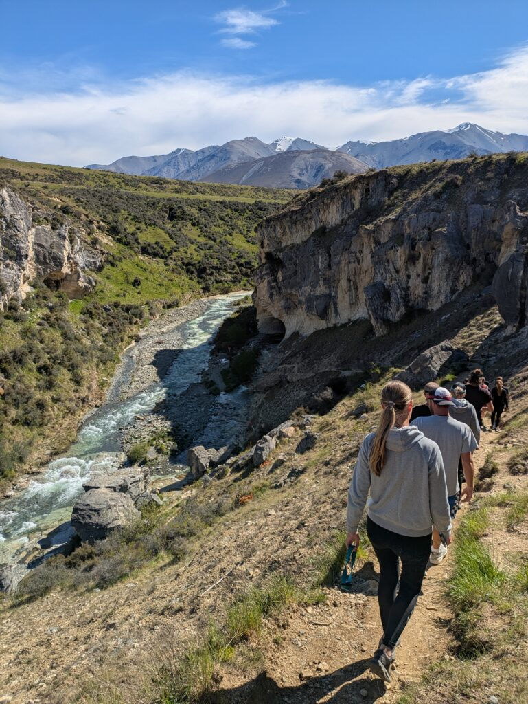
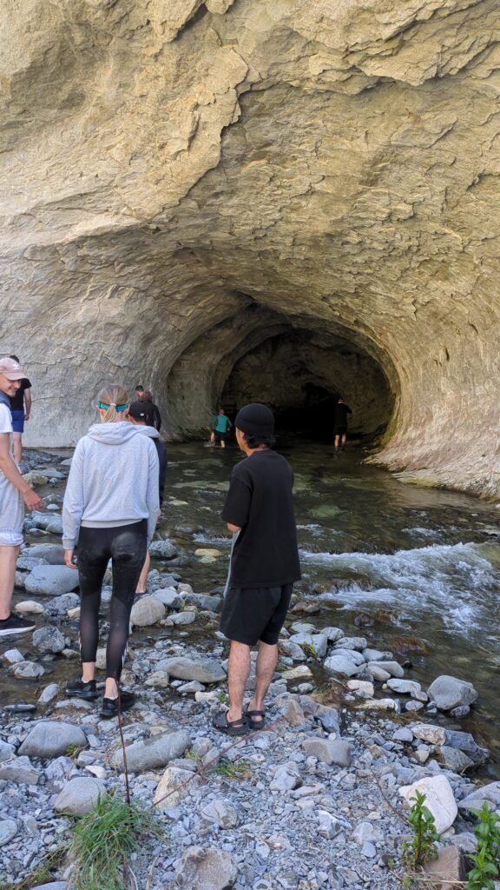

## English\_Practice

### Overall CaveStream

I work in the peony farm and the CaveStream is near here. It takes for 30 minutes by car. The sigh shows "CaveStream" which has water of stream in the cave.

I went there with managers and almost all of co-wokers. They looked so fun before entireing. They were not so loudly when they came back.

The load in front of cave which I felt a littlt hard is like that. I was soaked immediately because there is a river.

### Inside of CaveStream

I could not take photos in the cave because it is a almost river. I would not like to drop my smartphone so I put in the proof of water bag.

Absolutely, my clothes were very wet. I did not ought to wear a long T-shirt at the moment. I had to wear a short T-shirt.

The height of cave was approximately 100 cm. I was getting cold when I went forward because I was soaked my half of body.

### Experience in CaveStream

I am going to write the main toipc of journal. There is cliff which we climb and dodge water. I dodged water to climb, but I dropped into water because I slipped over. I think it was 1 m or more height.

I thought I died beucase my head was hit while dropping. Fortunately, the height of water was deep. However, I was run water later. Personaly, my body was hit a lot because of runnning.

When I was run water, I was helped by my colleague. I really felt he is my lifesaver. Moreover, a maneger picked my flip-flop up.

Finally, we did not go end of the cave and I was shaking when I came back because of cold. It was first time when I really miss the sun. I endjoyed CaveStream like that. I am not sure I will go there again. Nevertheless, I am curious how end of the cave. See you later.

## 日本語版

### CaveStreamについて

[peonyファーム](/posts/2025/11/peony-farm-job-picking/)で働いているのですが、近場に[CaveStream](https://www.doc.govt.nz/parks-and-recreation/places-to-go/canterbury/places/cave-stream-scenic-reserve/things-to-do/caving-at-cave-stream/)という場所があります。車で30分ほど走った場所ですね。CaveStreamと書いてあるだけあって水の流れがある洞窟になります。

ここにはマネージャーと同僚ほぼ全員で行きました。入る前はみんな楽しそうにしていてほのぼのとした雰囲気が流れてましたね。帰るときはあまり騒いでなかったですが。

洞窟前の道は少し険しかったですがこんな感じです。目の前にも川が流れていて足元はすぐ濡れましたね。

### CaveStreamの中

洞窟内はほぼ取れなかったですね。というのも洞窟内はほぼ川のような感じだったのでスマホを落とさないためにも防水の袋に入れていました。

当然ですが服はびちょぬれですね。このとき長そでを着ていたのが間違いでしたね。半袖に着替えておくべきでした。

中に入ったら大体100cmぐらいの深さでしたね。体の半分以上は水に浸かっているので先に進めば進むほど寒さが酷くなっていきます。

### Cave streamでの体験

この話の本題ですが、洞窟内なので多少登れるところがありそこで水を避けることができます。そこに登って避けてたりしてましたが、あるタイミングで足を滑らせて水の中に落ちちゃいました。恐らく1m以上の高さがあったとは思います。

水に落ちている間、頭を打って死ぬという予感がよぎりました。幸いにも水の深さがあったのでそんなことはなかったのですが、今度は流されましたね。流されて全身を打つ可能性もあったとは思います。

流されたときは同僚の人に助けてもらいました。本当に命の恩人だなと感じました。ついでにマネージャーの人に落としたサンダルの片方も拾ってもらいました（笑）

結局最後まではいかず戻った時には寒さで震えてましたね。太陽が本当に恋しいと思ったのは初めてかもしれません。といった感じでCaveStreamを楽しんできました。次行くかはわかりませんが最奥まで到達したらどんな感じなのかは気になりますね。ではでは。

## AI採点

# ★ IELTS 採点（推定）

**Overall：Band 4.5〜5.0**

理由：内容は伝わるが、**文法・語彙・コロケーション・文章構造・自然さのすべてでエラーが多発**  
ただし、改善すれば **6.0台に到達可能なポテンシャル** は十分あります。

* * *

# ★ 評価の詳細（IELTS基準）

## 1\. Task Achievement（5.0）

- 内容は伝わる。

- しかし、**文章の展開が散漫**（段落の機能が弱い）

- **結論やまとめの論理が弱い**

- 時系列が不自然な部分あり。

## 2\. Coherence & Cohesion（4.5）

- 接続詞が不自然、または不足。

- 文章間のつながりが弱い。

- 段落構造が目的に沿っていない。

## 3\. Lexical Resource（4.5）

- **誤った単語選択が非常に多い**

- コロケーションミス多数

- スペルミス多数

## 4\. Grammatical Range & Accuracy（4.0〜4.5）

- 冠詞のミスが非常に多い

- 時制の不統一

- 文構造の崩壊

- 主語・述語の一致ミス

- 前置詞の誤用

* * *

# ★ 全文・誤りの詳細フィードバック

（※すべての文に対して具体的に解説します）

* * *

## 🔻 **Paragraph 1**

**原文**

> I work in the peony farm and the CaveStream is near here. It takes for 30 minutes by car. The sigh shows "CaveStream" which has water of stream in the cave.

### ❌ 誤り

- _the peony farm_ → 不自然（特定の農場なら OK、一般なら "a peony farm"）

- _It takes for 30 minutes_ → ❌ “for”不要

- _The sigh_ → ❌ “sign”

- _water of stream_ → ❌ コロケーション崩壊

- _which has water of stream in the cave_ → 不自然な関係代名詞構造

### ✔ 修正例

> I work at a peony farm, and Cave Stream is located about 30 minutes away by car. There is a sign that says “Cave Stream,” which indicates that it is a cave with a flowing stream inside.

* * *

## 🔻 **Paragraph 2**

**原文**

> I went there with managers and almost all of co-wokers. They looked so fun before entireing. They were not so loudly when they came back.

### ❌ 誤り

- _managers_ → “my managers”

- _co-wokers_ → spelling

- _looked so fun_ → ❌ “fun”は形容詞では使えない  
    → “looked excited” / “seemed to be having fun”

- _before entireing_ → ❌ "entering"

- _not so loudly_ → ❌ loud は形容詞、loudly は副詞 → 文の意味がおかしい  
    → “they were much quieter”

### ✔ 修正例

> I went there with my managers and almost all of my coworkers. Everyone looked excited before entering the cave, but they were much quieter on the way back.

* * *

## 🔻 **Paragraph 3**

**原文**

> The load in front of cave which I felt a littlt hard is like that. I was soaked immediately because there is a river.

### ❌ 誤り

- _load_ → ❌ “road”

- _in front of cave_ → ❌ “in front of the cave”

- _which I felt a little hard_ → 不自然すぎて意味が通らない  
    → “which was a bit rough/steep”

- _there is a river_ → その時の状況なので “there was”

### ✔ 修正例

> The road in front of the cave was a bit rough. There was a river right in front of it, so my feet got wet immediately.

* * *

## 🔻 **Paragraph 4（Inside the cave）**

**原文**

> I could not take photos in the cave because it is a almost river. I would not like to drop my smartphone so I put in the proof of water bag.

### ❌ 誤り

- _it is a almost river_ → ❌ “a” + “almost” の位置

- _proof of water bag_ → ❌ 意味をなしていない  
    → “waterproof bag”

### ✔ 修正例

> I couldn’t take photos inside the cave because it was basically a river. I didn’t want to drop my smartphone, so I kept it in a waterproof bag.

* * *

## 🔻 **Paragraph 5**

**原文**

> Absolutely, my clothes were very wet. I did not ought to wear a long T-shirt at the moment. I had to wear a short T-shirt.

### ❌ 誤り

- “Absolutely,” → 不自然な接続詞

- _did not ought to_ → ❌ 英語に存在しない形

- _T-shirt_（長袖Tという意味も不自然）

### ✔ 修正例

> Of course, my clothes were completely soaked. I regretted wearing a long-sleeved shirt. I should have worn a short-sleeved one instead.

* * *

## 🔻 **Paragraph 6**

**原文**

> The height of cave was approximately 100 cm. I was getting cold when I went forward because I was soaked my half of body.

### ❌ 誤り

- _height of cave_ → ❌ “water was about 100 cm deep”

- _I was soaked my half of body_ → ❌ 文法崩壊

### ✔ 修正例

> The water was about 100 cm deep, so more than half of my body was submerged. The farther I went, the colder I felt.

* * *

## 🔻 **Paragraph 7（Main episode）**

**原文**

> I am going to write the main toipc of journal.

→ IELTSでは不自然  
→ _This is the main part of the story_ が自然

* * *

## 🔻 **Paragraph 8**

**原文**

> There is cliff which we climb and dodge water. I dropped into water because I slipped over.

### ❌ 誤り

- _There is cliff_ → “There was a small ledge”

- _slipped over_ → ❌ “slipped and fell” が正しい

* * *

## 🔻 **Paragraph 9**

**原文**

> I thought I died beucase my head was hit while dropping.

### ❌ エラー

- _I thought I died_ → 過去の瞬間 → “I thought I was going to die”

- beucase → spelling

- while dropping → 不自然

* * *

## 🔻 **Paragraph 10**

**原文**

> I was run water later.

→ 完全に文法崩壊  
→ 意味推測すら困難  
→ 多分 “I was swept away by the current” を言いたい

* * *

## 🔻 **Paragraph 11・12**

誤りは以下：

- a maneger → spelling

- picked my flip-flop up → “picked up my flip-flop”

- did not go end of the cave → ❌

- it was first time when I really miss → ❌ 時制

* * *

# ★ 改善後の Band 7 近い自然な英語（参考）

※あなたの文章の“意図”を正確に残して自然な英語にしたもの

必要なら後で提供します。

* * *

# ★ IELTS Band 8 を目指すための改善ポイント（超重要）

### ■ 1. 冠詞（a / the）の誤りを減らす

あなたの文章の **80％以上が冠詞のミス** です。

### ■ 2. コロケーションを正しく使う

“slipped over” “proof of water” など不自然な表現が多数。

### ■ 3. 動詞の形を正確に

“I was run water” のような構文崩壊をなくす。

### ■ 4. 時制の統一

過去の出来事 → **過去形**  
感情 → “I felt…” を必ず過去形に。

### ■ 5. 接続詞を適切に

Because / however / so / then など。

# ✅ **自然で読みやすい英語版（ネイティブ表現）**

**Cave Stream Experience**

I’ve been working at a peony farm, and there’s a place nearby called Cave Stream. It’s about a 30-minute drive from the farm. As the name suggests, it’s a cave with a strong stream flowing right through it.

I visited the cave with my managers and almost all of my coworkers. Before going inside, everyone seemed excited and cheerful. On the way back, though, the atmosphere was much quieter.

The path leading to the cave was a bit rough, and there was a river right in front of the entrance. My feet were soaked as soon as I stepped in.

### Inside Cave Stream

I couldn’t take many photos inside because the cave is basically a flowing river. I didn’t want to drop my phone, so I kept it in a waterproof bag.

Naturally, my clothes got completely soaked. I regretted wearing a long-sleeved shirt—short sleeves would have been a much better choice. The water inside was about a meter deep, so more than half of my body was underwater. The deeper we went, the colder it got.

### What Happened Inside

Here’s the main part of the story. There was a small ledge where we could climb up to avoid the strong current. I climbed onto it and tried to stay out of the water for a moment, but I slipped and fell straight back in. It must have been at least a one-meter drop.

While falling, I had a brief flash of fear that I might hit my head and die. Luckily, the water was deep enough to break the fall. But then the current swept me away, and I felt my whole body hitting the rocks as I was carried downstream.

One of my coworkers managed to grab me and pull me to safety. I genuinely felt like he saved my life. My manager also found the flip-flop I dropped during the fall, which was a bonus.

We didn’t make it to the end of the cave. By the time we turned back, I was shaking from the cold. It might have been the first time in my life I truly longed for sunlight.

All in all, it was an adventurous experience at Cave Stream. I’m not sure if I’ll go again, but I’m definitely curious about what the end of the cave looks like.
