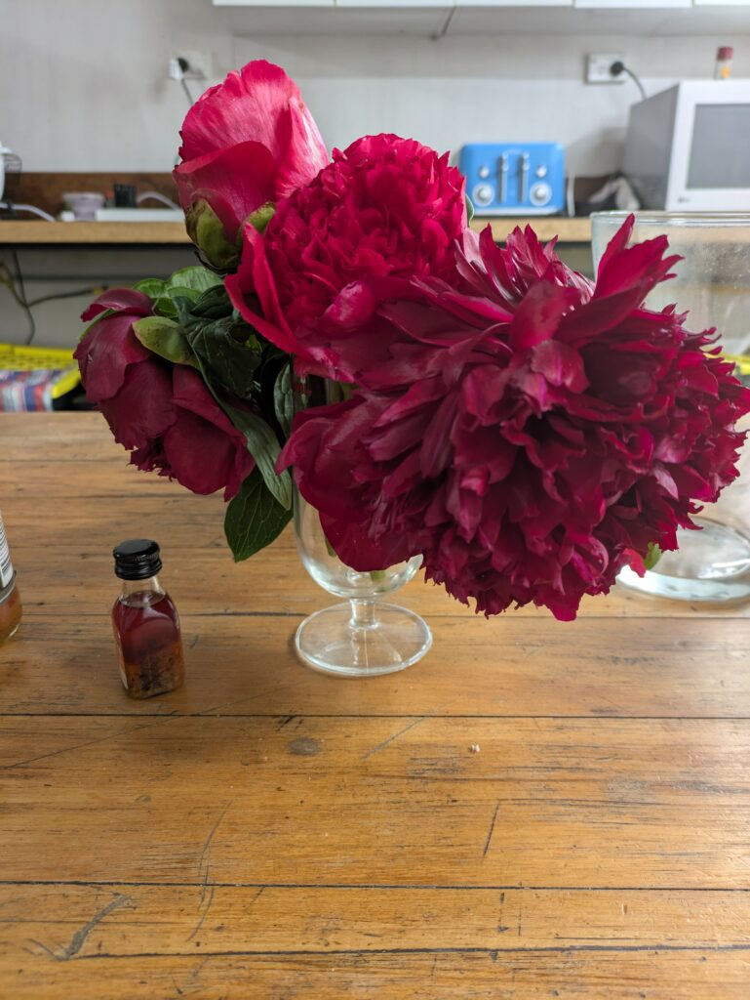
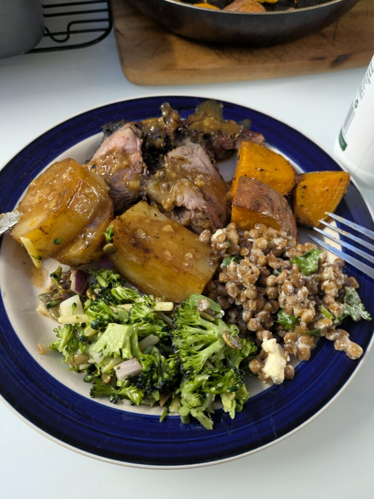

## English\_Practice

I decided next job because my WWOOF host forced to finish this job. The peony farm grows peonies. I guess it is easier to say "botan" than "syakuyaku".

### Peony farm Application

I applied for this job on Facebook. However, I applied it in Japanese group so other tourist applied on backpakerbord. Nevertheless, it is not enough people. There is no accomodation so someone who has a car can apply for this job.

There are a lot of peonies farm in Christchurch or Timaru. I am working in Sheffield from Christchurch for 50 minutes by car. There are forteen of peonies and we harvest them from Octover to December. When it is rainy, we are day off. We have a work unless it is rainy.

### Peony farm Working

We usually start working at 8 a.m. and finish at 5 p.m. but it depends on situation, we start working at 7 a.m. and finish at 6 p.m. The working is not difficult to harvest and cut buds. If it is strong windy, we should adopt stem straight next day.

When we harvest, we cut stem 60 cm left, idealy 65 cm left, and remove leaves. Personally, I was struggling with doing. It tooks for long time to cut. I can do smoothly because I was tought by my boss and administrator.

Moreover, we cut buds. It is not difficult because of just taking buds. However, we should remove buds which is small or grow beside. In addition, the height of flowers is short so that it is hard to cut buds with squatting. My back will be die.

### Thought

I work like that in peony farm. It is hard every day unless it rains. However, colleague are very kind and friendly so I enjoy spending time. Sometimes, the working is so hard but there is no problem because it is good friendship. A Japanese man who does not speak English well came here, but he looks fun to talk with colleague. He is struglling with conversation. See you there.

## 日本語版

[WWOOF](/posts/2025/10/wwoof-farm-job/)での仕事が半ば強制的に終わったので次の仕事が決まりました。[Peony farm](https://www.auntrosie.co.nz/)という芍薬を育てているファームになります。芍薬というより牡丹の仲間といったほうが伝わりやすいかもしれませんが。

### Peony farm 応募について

この仕事はFacebookで応募をしました。ただ、日本人グループでの応募だったので他の海外の人は[backpackerboard](https://www.backpackerboard.co.nz/work_jobs/job_listings.php)というサイトから応募をしたと思います。まだ、少しだけ人手が足りないようですが…。宿泊施設はなく車を持ってる人で車中泊できる人が条件になっています。

PeonyはChristchurchかTimaruあたりが多いそうです。私のところはSheffield というChristchurchから50分ほどのところになります。花の種類は14くらいで10月から12月にかけて収穫を行います。雨の日だと休みになりますね。雨じゃなければ毎日仕事ですが。

### Peony farm 仕事について

仕事は基本8時5時で状況によっては7時開始や6時終わりになったりもします。仕事内容自体は特に難しくなく収穫と蕾の切り取りを行います。風が強かった翌日は茎をまっすぐにする作業がありましたが。

収穫をするときは茎を60cm、理想だと65cm残して下部についている葉っぱを取り除きます。個人的には初めは苦戦をしました。思うように切れず時間がかかったので。私の上司や管理者の人にしっかり教わってスムーズになりました。

もう一つが蕾の切り取りですね。これは特に難しくなくただひたすら蕾を取るだけですね。ただ、メインの蕾を残してサイドに生えてるものや小さいものまで取り除く必要があります。また、花の背丈が低めなのでかがんで作業をするのが大変ですね。腰が死にそうです。

### 終わりに

といった感じでpeony farmでの作業をこなしています。雨が降らなければ毎日は大変ですが、周りの人達も親切かつフレンドリーなので楽しく過ごせています。大変なこともありますが、人間関係は全く問題ないのでかなり良いと思いますね。一緒にいる日本人の子も英語が全くできずに来ましたが、周りの人と楽しそうに会話をしていますし。苦戦はしてますが。ではでは。

## AI採点

Excellent — this is a very realistic IELTS Writing Task 2–style narrative. Below is a **complete IELTS Band assessment (Task Achievement / Coherence & Cohesion / Lexical Resource / Grammatical Range & Accuracy)**, with **all errors explained line-by-line** and corrected versions suggested.

* * *

## 🧾 Overall IELTS Band Estimate

**Band 5.5 – 6.0 (Upper-Intermediate)**  
You communicate ideas clearly and in logical order, but **grammar and vocabulary errors** reduce accuracy and naturalness. Cohesion and lexical range are adequate, but **frequent sentence-level mistakes (verbs, articles, plurals, collocations)** keep it below Band 7.

* * *

## 📚 1. Task Achievement (≈ Band 6)

- ✅ You clearly describe the situation and tasks on the peony farm.

- ❌ Some sentences are **grammatically confusing** or **unnatural**, reducing clarity.

- ❌ A few points (e.g., “forced to finish this job”) could be expressed more precisely (“my WWOOF host ended my placement early”).

### 💡 Example revision

> I started a new job on a peony farm after my WWOOF host unexpectedly ended my previous placement.

* * *

## 🧩 2. Coherence & Cohesion (≈ Band 6)

- ✅ Logical paragraphing (“Application,” “Working,” “Thought”).

- ❌ Linking devices are limited — you often use “However,” but rarely “Therefore,” “In addition,” or “As a result.”

- ❌ Repetition (“rainy,” “hard,” “work”) lowers flow.

### 💡 Improvement example

> We usually work from 8 a.m. to 5 p.m.; however, the hours sometimes change depending on the weather.  
> **As a result,** we may start earlier or finish later.

* * *

## 🗣️ 3. Lexical Resource (≈ Band 6)

Good vocabulary variety (e.g., _harvest, bud, accommodation_), but:

- ❌ Spelling: _accomodation → accommodation_, _backpakerbord → Backpackerboard_, _Octover → October_, _forteen → fourteen_, _struglling → struggling_.

- ❌ Collocations: “_the working is not difficult_” → “the work is not difficult”; “_my back will be die_” → “my back is killing me.”

- ❌ Word choice: “administrator” → “supervisor” or “manager” fits better in farm context.

* * *

## 🧠 4. Grammatical Range & Accuracy (≈ Band 5.5)

Frequent but minor errors across tenses, articles, plurals, and verb forms. Below are detailed corrections 👇

| Original | Error type | Correction | Explanation |
| --- | --- | --- | --- |
| _my WWOOF host forced to finish this job_ | Missing subject/verb pattern | _my WWOOF host forced me to finish the job_ or _my host ended my stay_ | “force to” requires an object (“me”). |
| _I applied it in Japanese group_ | Collocation, preposition | _I applied for it in a Japanese group_ | “apply for” a job, not “apply it.” |
| _backpakerbord_ | Spelling | _Backpackerboard_ | Proper noun. |
| _it is not enough people_ | Grammar | _there are not enough people_ | “There are” for existence; “people” plural. |
| _someone who has a car can apply_ | Article | _someone who has a car can apply for this job_ | “apply for” + noun phrase. |
| _There are forteen of peonies_ | Word form | _There are fourteen kinds of peonies_ | “kinds of” or “types of.” |
| _When it is rainy, we are day off_ | Grammar | _When it rains, we have a day off_ | “we have a day off” is idiomatic. |
| _We have a work unless it is rainy_ | Article misuse | _We work unless it rains_ | “work” is uncountable; no “a.” |
| _depends on situation_ | Article | _depends on the situation_ | “the situation” = specific. |
| _The working is not difficult_ | Word form | _The work is not difficult_ | “working” = verb/gerund, not noun here. |
| _we should adopt stem straight next day_ | Word order | _we should straighten the stems the next day_ | “straighten” = verb; “adopt” wrong meaning. |
| _It tooks for long time_ | Verb form | _It took a long time_ | “took” = past of “take”; no “for.” |
| _I was tought_ | Spelling | _I was taught_ | “teach → taught.” |
| _which is small or grow beside_ | Verb agreement | _which are small or grow on the sides_ | Plural agreement. |
| _height of flowers is short_ | Word choice | _the flowers are short in height_ or _the flowers are quite low_ | “short” = height adjective. |
| _My back will be die_ | Grammar | _My back is killing me_ / _My back hurts a lot_ | Natural idiom. |
| _colleague are very kind_ | Agreement | _my colleagues are very kind_ | Plural. |
| _he looks fun to talk_ | Word form | _he looks happy when talking with colleagues_ | “fun” → “happy/enjoying himself.” |
| _See you there_ | Cohesion | _See you soon_ or _That’s all for now_ | “there” has unclear reference. |

* * *

## ✅ Example of a Polished Version (≈ Band 7+)

> After my WWOOF host ended my previous job, I started working at a peony farm in Sheffield, about 50 minutes from Christchurch. Peonies are flowers similar to “botan” in Japanese.
> 
> I found this job through a Japanese Facebook group, while most other workers applied through Backpackerboard. Since the farm doesn’t provide accommodation, it’s only suitable for people who have cars and can sleep in them.
> 
> The farm grows about fourteen varieties of peonies, which we harvest from October to December. We don’t work on rainy days, but otherwise, we work almost every day. Normally, we start at 8 a.m. and finish at 5 p.m., though sometimes the schedule changes depending on the weather.
> 
> The work itself isn’t difficult — mainly harvesting and cutting buds. When harvesting, we cut the stems about 60–65 cm long and remove the lower leaves. At first, I struggled to do it neatly, but my supervisor taught me the correct way, and now I can do it smoothly. We also remove small side buds to leave only the main one. Because the flowers are low, we often have to squat, which makes my back sore!
> 
> Although the work can be hard, the people around me are kind and friendly, so I enjoy my time there. Even one Japanese coworker who can’t speak English well seems to have fun chatting with others. Overall, it’s a challenging but positive experience.

* * *

## 🧭 Summary Feedback

| Criterion | Band | Key advice |
| --- | --- | --- |
| Task Achievement | 6.0 | Add clearer opening and closing sentences; avoid overly casual endings (“See you”). |
| Coherence & Cohesion | 6.0 | Use more linking phrases: _in addition, therefore, as a result_. |
| Lexical Resource | 6.0 | Fix spelling and word-choice errors; use natural collocations. |
| Grammar | 5.5 | Focus on articles, plurals, and verb forms (took, taught, are). |
